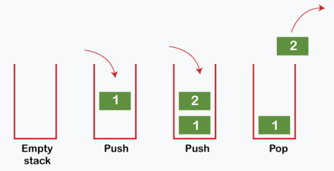

## 탐색 Search

: 많은 양의 데이터 중에서 원하는 데이터를 찾는 과정

💨 대표적인 탐색 알고리즘으로 DFS와 BFS를 꼽을 수 있음!


### 스택 Stack

- 박스 쌓기에 비유할 수 있다.
- 선입후출 구조 또는 후입선출 구조라고 한다.
- 기본 리스트에서 append()와 pop() 메서드를 사용하면 된다.
- append() 메서드는 리스트의 가장 뒤쪽에 데이터를 삽입하고, pop() 메서드는 리스트의 가장 뒤쪽에서 데이터를 꺼낸다.



```python
stack = []

# 삽입(5) - 삽입(2) - 삽입(3) - 삽입(7) - 삭제() - 삽입(1) - 삽입(4) - 삭제()
stack.append(5)
stack.append(2)
stack.append(3)
stack.append(7)
stack.pop()
stack.append(1)
stack.append(4)
stack.pop()

print(stack)
print(stack[::-1])

[5,2,3,1]
[1,3,2,5]
```


### 큐 Queue

- 대기 줄에 비유 가능
- 선입선출 구조

```python
from collection import deque

# Queue 구현을 위해 deque 라이브러리 사용
queue = deque()

# 삽입(5) - 삽입(2) - 삽입(3) - 삽입(7) - 삭제() - 삽입(1) - 삽입(4) - 삭제()
queue.append(5)
queue.append(2)
queue.append(3)
queue.append(7)
queue.popleft()
queue.append(1)
queue.append(4)
queue.popleft()

print(queue)
queue.reverse()
print(queue)

deque([3,7,1,4])
deque([4,1,7,3])
```


### 재귀함수

