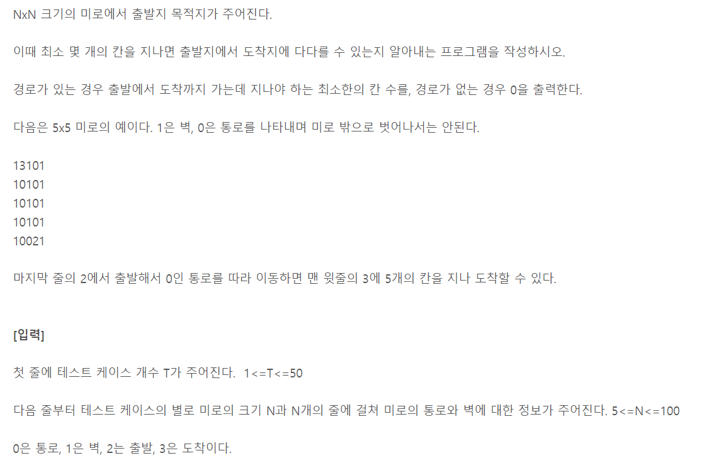
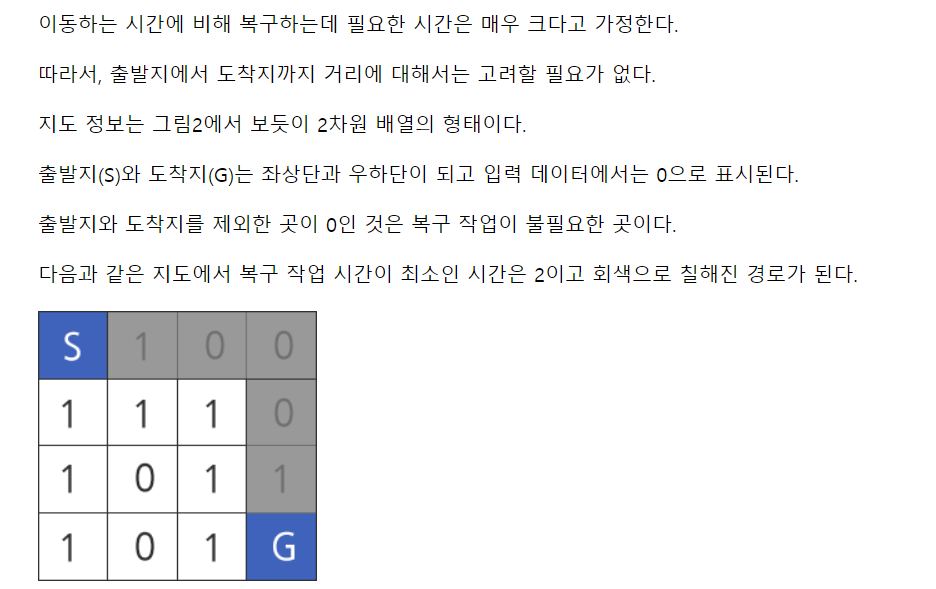

## BFS

- 그래프를 탐색하는 방법에는 크게 두 가지가 있음
  - 깊이 우선 탐색(Depth First Search, DFS)
  - 너비 우선 탐색(Breadth First Search, BFS)
- 너비 우선 탐색은 탐색 시작점의 인접한 정점들을 먼저 모두 차례로 방문한 후에, 방문했던 정점을 시작점으로 하여 다시 인접한 정점들을 차례로 방문하는 방식
- 인접한 정점들에 대해 탐색을 한 후, 차례로 다시 너비우선탐색을 진행해야 하므로, 선입선출 형태의 자료구조인 큐를 활용함


```python
def BFS(G, v):					# 그래프 G, 탐색 시작점 v
    visited = [0]*(n+1)			# n : 정점의 개수
    queue = []					# 큐 생성
    queue.append(v)				# 시작점 v를 큐에 삽입
    while queue:				# 큐가 비어있지 않은 경우
        t = queue.pop(0)		# 큐의 첫 번째 원소 반환
        if not visited[t]:		# 방문되지 않은 곳이라면	
            visited[t] = True	# 방문한 것으로 표시
            visit(t)			# 정점 v에서 할 일
        for i in G[t]:			# t와 연결된 모든 정점에 대해
            if not visited[i]:	# 방문되지 않은 곳이라면
                queue.append(i)	# 큐에 넣기
```

A를 먼저 방문, B/ C/ D를 차례로 방문하여 큐에 넣고 하나씩 삭제한다(선입선출)

이후 B의 뿌리부터 시작하여 E~I까지 전부 탐색, 큐에 넣고 출력하면 된다.

visited = [1,1,1,1,1,1,1,1,1]


```python
def BFS(G, v, n):				# 그래프 G, 탐색 시작점 v
    visited = [0] * (n+1)		# n : 정점의 개수
    queue = []					# 큐 생성
    queue.append(v)				# 시작점 v를 큐에 삽입
    visited[v] = 1
    while queue:				# 큐가 비어있지 않은 경우
        t = queue.pop(0)		# 큐의 첫번째 원소 반환
        visit(t)				# 정점 v에서 할 일 알아서 작성
        for i in G[t]:			# t와 연결된 모든 정점에 대해
            if not visited[i]:	# 만약 방문하지 않은 곳이라면
                queue.append(i)	# 큐에 넣기
                # n으로부터 1만큼 이동
                visited[i] = visited[n] + 1
```

visited = [1,2,2,2,3,3,3,3,3]


### ✨ 깜짝 문제 풀이 ✨

https://swexpertacademy.com/main/learn/course/lectureProblemViewer.do



```python
def bfs(i,j,n):
    visited = [[0]*n for _ in range(n)]		# 미로의 크기만큼 생성
    queue = []								# 큐 생성
    queue.append((i,j))						# 시작점 인큐
    visited[i][j] = 1						# 시작점 방문 표시
    while queue:							# 큐가 비어있지 않으면 반복
        i,j = queue.pop(0)					# t = 디큐
        if maze[i][j] == 3:					# visit(t)에서 할 일 처리
            return 1						# 도착한 경우
        for di,dj in [[0,1],[1,0],[0,-1],[-1,0]]:	# i,j에 인접한 칸에 대해
            ni,nj = i+di, j+dj				# 주변 칸 좌표, 미로를 벗어나지 않고, 인접(벽이 아니고 통로)
            if 0<=ni<n and 0<=nj<n and maze[ni][nj] != 1 and visited[ni][nj] == 0:
                queue.append((ni,nj))		# 인큐
                visited[ni][nj] = visited[i][j] + 1
   return 0									# 도착지를 찾지 못한 경우

def fstart(n):
    for i in range(n):
        for j in range(n):
            if maze[i][j] == 2:
                sti, stj = i,j
    return sti, stj

t = int(input())
for tc in range(1, t+1):
    n = int(input())
    maze = [list(map(int,input())) for _ in range(n)]
    sti, stj = fstart(n)
    
    ans = bfs(sti,stj,n)
    print(f'#{tc} {ans}')
```


https://swexpertacademy.com/main/talk/solvingClub/problemView.do?solveclubId=AX-Wr5a6Lq0DFARi&contestProbId=AX-mzT76I8YDFARi&probBoxId=AX_SyT1KbDsDFAVy+&type=USER&problemBoxTitle=220404%3A+%EB%AC%B8%EC%A0%9C%ED%92%80%EC%9D%B4_4%EC%B0%A8&problemBoxCnt=5



```python
def BFS(si, sj, ei, ej):
    q = []  # [1] q, v 생성
    visited = [[100000] * N for _ in range(N)]

    q.append((si, sj))  # [2] q 초기데이터(들) 삽입, v 표시
    visited[si][sj] = arr[si][sj]   # 방문 표시

    while q:
        ci, cj = q.pop(0)  # 하나씩 꺼내서

        # 네방향/8방향/숫자차이가 일정값이하...
        for di, dj in ((-1, 0), (1, 0), (0, -1), (0, 1)):
            ni, nj = ci + di, cj + dj
            if 0 <= ni < N and 0 <= nj < N and visited[ni][nj] > visited[ci][cj] + arr[ni][nj]:
                q.append((ni, nj))
                visited[ni][nj] = visited[ci][cj] + arr[ni][nj]

    return visited[ei][ej]

T = int(input())
for test_case in range(1, T + 1):
    N = int(input())
    arr = [list(map(int, input())) for _ in range(N)]
    ans = BFS(0, 0, N - 1, N - 1)   # 0,0 인덱스에서 마지막 인덱스까지 가는 길
    print(f'#{test_case} {ans}')
```

배열 중 가장 적은 숫자의 합들로만 가는 방법
