## ❗컴퓨팅 사고력


##### 👉 일상 생활에서는

- Soft Logic이 빠르기 때문에 유용
- 논리적으로 부정확한 표현을 사용하지만, 어떤 의미인지 모든 사람이 이미 알고 있다는 가정이 존재


##### 👉 프로그래밍에서는 Hard Logic을 사용

- 프로그래밍 언어의 표현들이 모두 논리학에서 나온 것
- 사용되는 수많은 알고리즘들을 이해하기 위해서는 Hard Logic이 필요


##### 👉 오해의 근원

- Soft Logic으로 알고리즘을 이해하려고 하는 것!
- 알고리즘 설명을 보고 또 봐도 이해가 안되는 것은 증명을 안 봤기 때문
- 증명을 봐도 이해가 안되는 것은 직관으로 이해하려고 하기 때문
- 가끔 직관적으로 이해되는 알고리즘이 있지만 조금만 어려워지만 직관으로 완전한 이해를 얻는 것은 사실상 불가능


##### ✅논리곱 AND

- p,q가 명제일 때, p,q 모두 참일 때만 참이 되는 명제
- p^q(p and q, p 그리고 q)

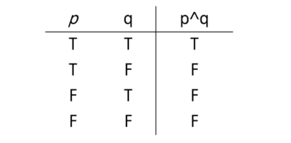

###### ✅ 논리합 OR

- p,q가 명제일 때, p,q 모두 거짓일 때만 거짓이 되는 명제
- p V q(p or q, p 또는 q)

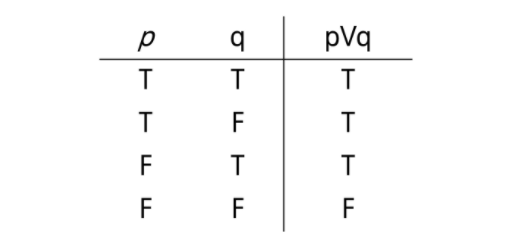

##### ✅ 배타적 논리합 XOR

- p,q가 명제일 때, p,q 중 하나만 참일 떄 참이 되는 명제

  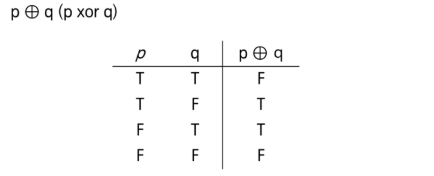


##### ✅ 조건명제

- p,q가 명제일 때, 명제 p가 조건(또는 원인), q가 결론(또는 결과)로 제시되는 명제.
- p -> q (p이며 q이다.)

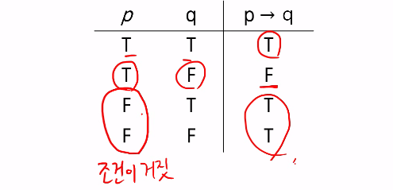


##### ✅ 쌍방조건명제

- p,q가 명제일 때, 명제 p와 q가 모두 조건이면서 결론인 명제
- p <-> q(p면 q고, q면 p다.)

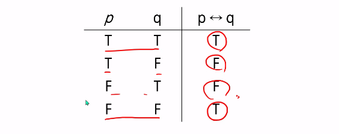


##### ✅ 조건명제의 역, 이, 대우

- 역 : q -> p
- 이 : ㄱp -> ㄱq
- 대우 : ㄱq -> ㄱp


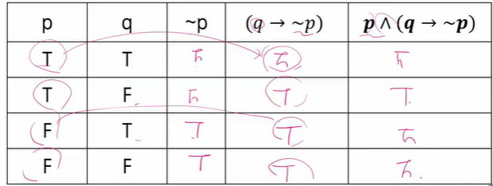


✅ 증명

- 증명은 정확한 명제식으로 표현할 수 있는 것이라야 함
- 보통은 정확한 명제식까지 쓰지는 않으나 근본적으로는 명제식으로 바꿀 수 있음
- 증명에 대한 수많은 오해가 p -> q를 p <-> q와 혼동하는 것에서 일어남


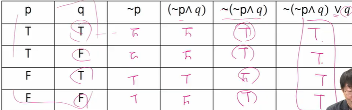

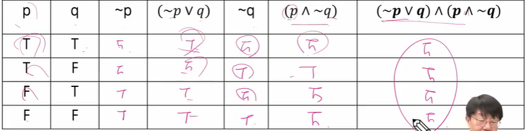

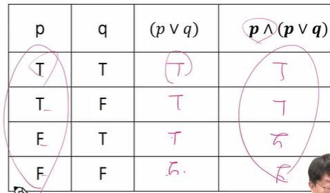

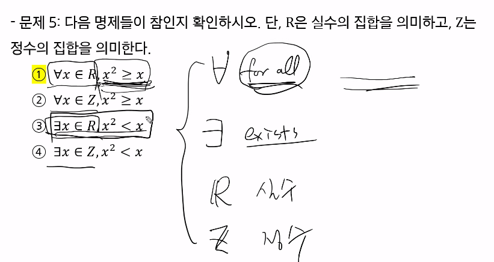


#### 💣 n이 짝수이면 3n+5는 홀수임을 증명하라

HINT ) n = 2k로 두고 3n+5가 2(어떤 정수) + 1 형태로 표현될 수 있는지!

3(2k) + 5

= 6k + 5

= 2(3k + 2) + 1

##### 

#### 💣 m이 짝수이고 n이 홀수이면 2m + 3n은 홀수임을 증명하라

m = 2k

n = 2h + 1

= 2*2k + 3(2h+1)

= 4k + 6h + 3

= 2(2k + 3h +1) + 1


#### 💣 n*n이 짝수이면 n은 짝수임을 증명하라

n이 홀수면 n*n은 홀수

n = 2k + 1

= (2k + 1)*(2k+1) = 4k2 + 4k + 1

= 2(2k2 + 2k) + 1

반대의 경우기에 참


### 🧡 수와 표현

- 컴퓨터는 0/1을 표현할 수 있는 비트들을 모아 수를 표현
- k개의 비트를 사용하면 0부터 2^k-1까지 표현 가능
- 사실, 꼭 저 범위인것은 아님. 약속하는 방식에 따라 다르지만, 어떤 경우 최대 2^k 가지의 값을 표현하는 것이 가능
- 10진수로 k자리를 쓰면 0부터 10^k-1까지 표현이 가능한 것과 완전히 동일한 과정

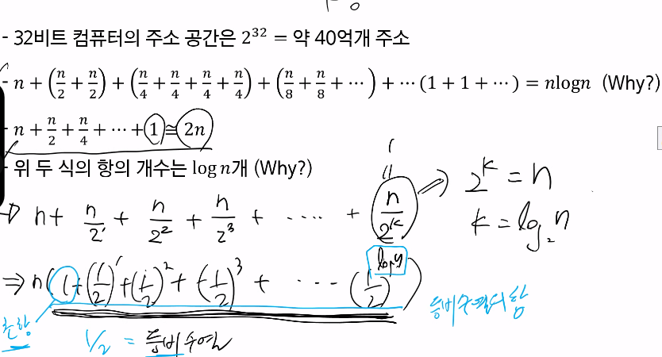

- 어떤 값 n을 표현하기 위해서는 몇 개의 비트가 필요할까?
- 2의 k승 -1 >= n이 성립해야 함. 즉 2의 k승 >= n + 1
- 같은 의미로, k >= log(n+1) > 약 log n 비트가 필요
- x = log n 과 2의 x승 = n은 같은 말


- 위의 식을 잘 보면, logn이란
  - 2의 몇 승이 n이 되느냐의 답
  - n을 표현하는데 몇 비트가 필요한가의 답
  - 1로 시작해서 계속 두 배를 할 때 몇 번 하면 n이 되느냐의 답
  - n을 2로 계속 나눌 때 몇 번 나누면 거의 1이 되느냐에 대한 답

- x = logn일 때 x와 n을 비교하면 x가 더 작고, n이 커질수록 엄청나게 달라진다
- 100자리로 표현할 수 있는 10진수 값은 읽을 수도 없을 정도로 큰 값이다
- 컴퓨터 분야에서 로그의 밑은 항상 2

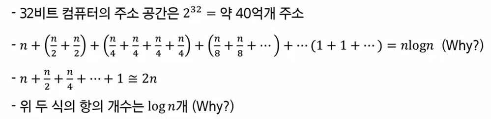


#### 💣 2진수 표현에서 long 비트로 표현할 수 있는 숫자 범위는?

2의 k제곱 = n

k = logn

#### 💣 스무고개 20번 했을 때 답이 나오는 가짓수는?

2의 20승

#### 💣 문제 3) n이 충분히 큰 값일때 다음 중 어느 값이 더 큰가?

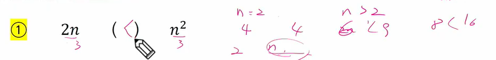

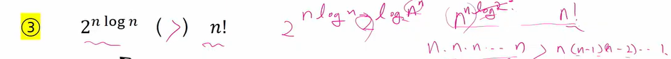

3의 경우)

전자는 n n n n 계속 곱해지지만 팩토리얼n은 1이 될때까지 끊임없이 줄어드는 숫자를 곱하므로 전자가 더 클 수 밖에 없다.

#### 💣 문제 5) 역함수 작성하기

f(x) = log(x-3) - 5

f(x) + 5 = log(x-3)

2의 f(x)+5  = x - 3

x = 2의 f(x)+5 + 3

f-1(x) = 2의 x+5 + 3

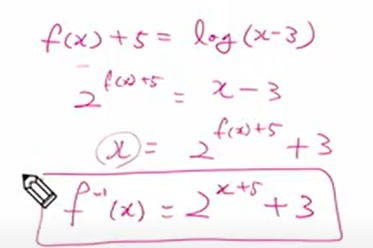


f(x) = x + 1

f(x) -1 = x

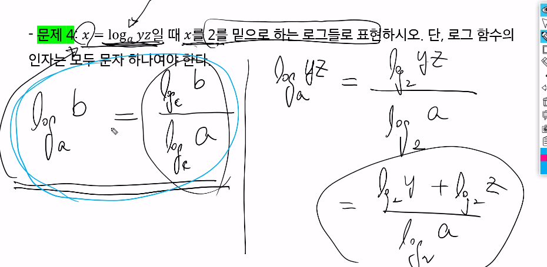

### 💛 3 집합과 조합론

- 두 집합 A와 B에 대해 A가 B의 부분집합임을 증명한다는 것은 A의 임의의 원소가 B에 포함됨을 보이는 것과 같다.
- 예를 들어 모든 4의 배수는 2의 배수라는 것을 증명하려면, 4k = 2(2k)임을 보이면 되는 것이다.
- 두 집합 A와 B가 같다는 것을 증명하기 위해서는 A가 B의 부분집합이고 B가 A의 부분집합임을 증명하면 된다.


- 다음 두 집합이 같다는 것을 상세히 증명해보자

```python
A = {x|x=2k+1,k는 자연수}
B = {x|x=4k+1 혹은 x=4k+3, k는 자연수}
```

- A가 B의 부분집합이다:
  - A에 포함되는 임의의 원소 x를 가정.
  - x=2k+1임
  - k가 짝수(=2t)인 경우와 홀수(=2t+1)인 경우로 나눔.
  - 짝수인 경우 x=2k+1=2(2t)+1 = 4t+1로서, x는 B에 포함됨
  - 홀수인 경우 x = 2k+1 = 2(2t+1) + 1 = 4t+3로서, x는 B에 포함됨
  - 모든 가능한 경우에 x는 B에 포함됨.
- B가 A의 부분집합이다:
  - B에 포함되는 임의의 원소 x를 가정.
  - x=4k+1인 경우, x=4k+1 = 2(2k)+1로서 x는 A에 포함됨. 
  - x=4k+3인 경우, x=4k+3 = 2(2k+1)로서 x는 A에 포함됨.
  - 모든 가능한 경우에 x는 B에 포함됨.
- 위 두 가지 증명에서 집합 A와 B는 같다.


- 조합론은 경우의 수를 따지는 문제들을 보통 말한다
- 조합은 개수는 C를 이용하여 표현하기도 하지만 (5 2) = 10 과 같은 괄호 표현을 더 많이 쓴다.

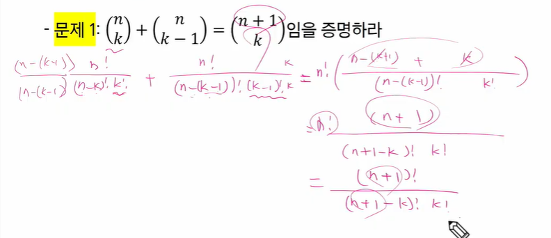

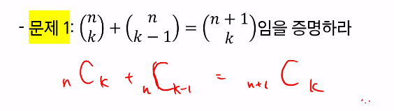


귀류법 : 현명제가 참인 것을 증명 > 명제의 부정을 참이라 가정. 모순을 증명해서 원래의 명제가 참임을 보임

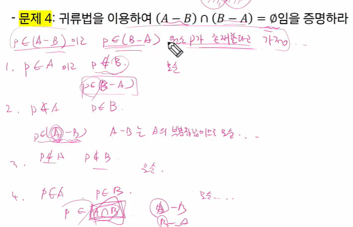

#### 💣 문제 8 ) 8x8 체스 판에 말 두개를 놓으려고 한다. 아무 곳에나 놓아도 되지만 한 칸에 두 개가 들어가지는 못한다. 가능한 방법은 모두 몇가지인가?

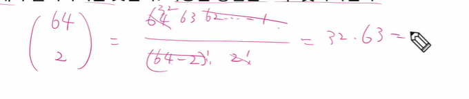

#### 💣 문제 12 ) 52개의 카드를 이용해서 만들 수 있는 5개 카드의 조합은 몇가지?

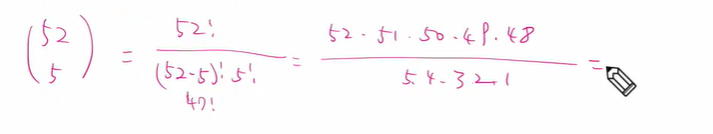


### 💚 기초 수식

- 알고리즘의 시간 복잡도를 표현할 수 있는 다양한 수식들이 존재한다.
- 풀이법을 익혀 두어야 알고리즘의 시간 복잡도를 계산할 수 있고, 알고리즘이 시간이 얼마나 걸릴지 예측할 수 있다.


다음 재귀식들을 O() notation 수준으로 풀어라

문제1 : T(n) = T(n-1) + 1, T(0) = 1

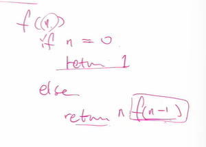

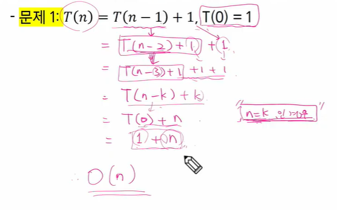

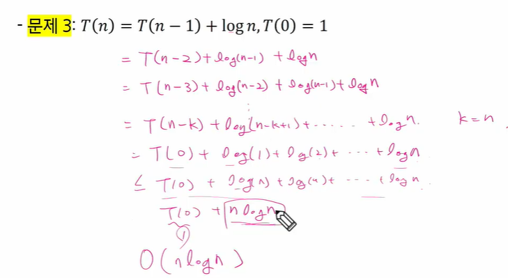

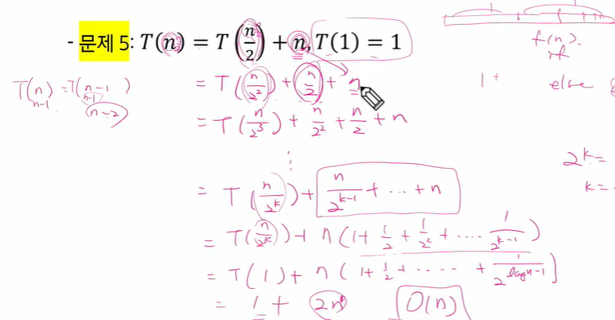

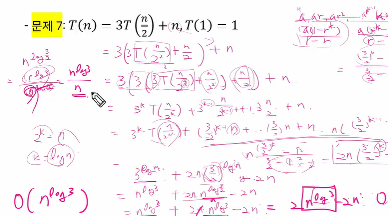

(문제 7과 같은 문제는 복잡하기 때문에 스킵해도 된다)


### 💙 재귀

- 재귀란 자기 자신을 호출하는 함수, 그럼 끝날 수가 있는가?
- 함수는 입력이 있으며, 자기 자신의 입력과 동일한 입력으로 자기 자신을 호출하면 당연히 끝나지 않음


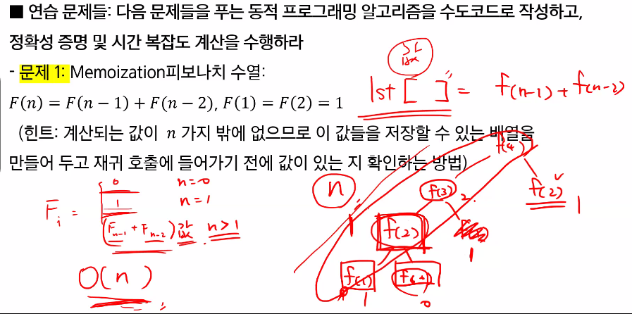

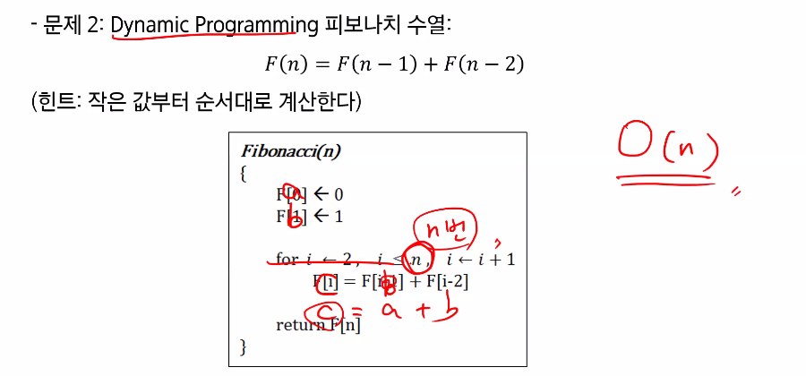
