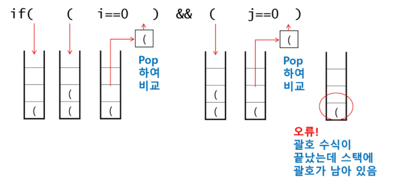
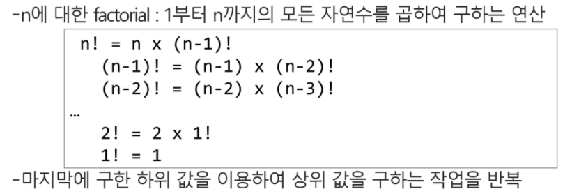

## 스택 Stack

> 스택(stack)의 특성

- 물건을 쌓아 올리듯 자료를 쌓아 올린 형태의 자료구조
- 스택에 저장된 자료는 선형 구조를 갖는다
  - 선형구조 : 자료 간의 관계가 1대 1의 관계를 갖는다.
  - 비선형구조 : 자료 간의 관계가 1대 N의 관계를 갖는다.(ex. 트리)
- 스택에 자료를 삽입하거나 스택에서 자료를 꺼낼 수 있다.
- 마지막에 삽입한 자료를 가장 먼저 꺼낸다. 후입선출(LIFO, Last_in_First_Out)이라고 부른다.
  - 예를 들어 스택에 1,2,3 순으로 자료를 삽입한 후 꺼내면 역순으로 3,2,1 이 꺼내진다.
- 스택을 프로그램에서 구현하기 위해서 필요한 자료구조와 연산
  - 자료구조 : 자료를 선형으로 저장할 저장소
    - 배열을 사용할 수 있다.
    - 저장소 자체를 스택이라 부르기도 한다.
    - 스택에서 마지막 삽입된 원소의 위치를 top이라 부른다.
  - 연산
    - 삽입 : 저장소에 자료를 저장한다. 보통 push라고 부른다.
    - 삭제 : 저장소에서 자료를 꺼낸다. 꺼낸 자료는 삽입한 자료의 역순으로 꺼낸다. 보통 pop이라고 부른다.
    - 스택이 공백인지 아닌지를 확인하는 연산. IsEmpty
    - 스택의 top에 있는 item(원소)을 반환하는 연산. peek


#### ✅ 스택의 push 알고리즘

```python
def push(item):
    s.append(item)
```

- append 메소드를 통해 리스트의 마지막에 데이터를 삽입

```python
def push(item, size):
    global top
    top += 1
    if top == size:
        print('overflow!')
    else:
        stack[top] = item
        
size = 10
stack = [0] * size
top = -1

push(10, size)
top += 1
stack[top] = 20
```


#### ✅ 스택의 pop 알고리즘

```python
def pop():
    if len(s) == 0:
        return
    else:
        return s.pop(-1)
```

```python
def pop():
    global top
    if top == -1:
        print('underflow!')
        return 0
    else:
        top -= 1
        return stack[top+1]
    
print(pop())

if top > -1:
    top -= 1
    print(stack[top])
```


### 스택 응용) 괄호검사

```python
def check(str):
    stack = []      # 스택 생성
    for s in str:   # 문자에 접근
        if s == '(' or s == '{':   # s가 여는 괄호일 경우
            stack.append(s)        # 스택에 추가
        elif s == ')' or s == '}':    # 닫는 괄호일 경우
            if stack:      # 스택이 비어있지 않으면
                t = stack.pop()    # 스택의 마지막 요소 제거, 반환
            else:          # 스택이 비어있으면 0 반환(짝이 맞지 않음)
                return 0
            if t == '(' and s == '}':    # 괄호의 종류가 다를 경우
                return 0                 # 0 반환
            if t == '{' and s == ')':
                return 0
    if stack:    # 스택이 비어있지 않으면
        return 0
    else:        # 스택이 비어있으면(짝이 맞음)
        return 1

T = int(input())
for tc in range(1, T+1):
    string = input()

    result = check(string)
    print(f'#{tc} {result}')
```




 

### 재귀호출

- 자기 자신을 호출하여 순환 수행되는 것
- 함수에서 실행해야 하는 작업의 특성에 따라 일반적인 호출방식보다 재귀호출방식을 사용하여 함수를 만들면 프로그램의 크기를 줄이고 간단하게 작성
  - 재귀 호출의 예) factorial


