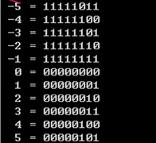
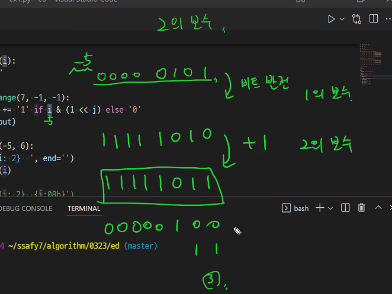
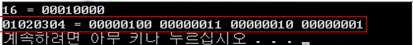

## Start


> 1<< n

- 2**n의 값을 갖는다.
- 원소가 n개일 경우의 모든 부분집합의 수를 의미한다.
- 왼쪽으로 한 칸씩 자리를 밀어버린다.
- Power set(모든 부분 집합)
  - 공집합과 자기 자신을 포함한 모든 부분집합
  - 각 원소가 포함되거나 포함되지 않는 2가지 경우의 수를 계산하면 모든 부분집합의 수가 계산된다.
- i & (1<<j)
  - 계산 결과는 i의 j번째 비트가 1인지 아닌지를 의미한다.
  - i는 비교대상이고, 1을 j번 밀어 i와 비교하는 것이다.


```python
def Bbit_print(i):
    output = ""
    for j in range(7, -1, -1):
        output += "1" if i&(1<<j) else "0"
    print (output)
    
for i in range(-5, 6):
    print("&3d = " % i, end="")
    Bbit_print(i)
    
    print(f'{i:2} {i:08b}')
    # 8자리의 비트를 표현하겠다는 의미. 하지만 아래 사진처럼 보수의 형태로 나오는 것이 아니라 -0000101 처럼 음수 그대로 출력된다는 단점이 있다.
```





음수를 2진법으로 나타낼때 일단 이진법으로 표현후, 비트 반전시켜준다. 이후 +1해준 값(2의 보수)하면 음수 2진법인데, 이걸 다시 양수로 나타낼려면 다시 비트 반전후, +1 해주면 된다. 여기서 음수에서 +1해준건 실질적으로 -1된 것이라고 생각하면 된다.


### ✨ 연습문제 

```python
arr = [
    '0000000111',
    '1000000110',
    '0000011110',
    '0110000110',
    '0001111001',
    '1110011111',
    '1001100111']

result = ''.join(arr)
res = ''
for i in range(0,len(result),7):
    res = result[i:i+7]
    # print(res) # 7개의 숫자들로 각각 끊겨서 출력
    num = 0
    for j in range(6,-1,-1): # 오른쪽 끝에서부터 1,2,4,.. 돌아줘야!
        if res[6-j] == '1':  # 만약 1이면 2의 n승해준 값
            num += 2**j
        else:                # 0이면 값이 없어서 그대로 둔다
            num += 0
    print(num, end=',')

#### 교수님 풀이 ####

a = ''.join(arr)

length = len(a) // 7

for i in range(length):
    res = 0     # 7비트의 값
    for j in range(i*7, i*7+7):
        res = res * 2 + int(a[j])
    print(res, end=' ')
```


----


```python
def Bbit_print(i):
    output = ""
    for j in range(7,-1,-1):
        output += "1" if i&(1<<j) else "0"
    print(output, end = '')
    
a = 0x10
x = 0x1020304
print("%d = " %a, end= '')
Bbit_print(a)
print()
print("0%X = " %x, end='')
for i in range(0,4):
    Bbit_print((x>>i*8) & 0xff)
```




```python
def ce(n) :
    p = []
    for i in range(0,4):
        p.append(n>> (24-i*8)) & 0xff)
    return p


x = 0x01020304
p = []
for i in range(0,4):
    p.append
```


-----

### 실수


----

### 재귀

```python
# 1) 리스트 b에 리스트 a 넣기
def f(i,n):
    if i==n:
        return
    else:
        b[i] = a[i]
        f(i+1,n)
        
n = 3
a = [10,20,30]
b = [0]*n
f(0,n)
print(b)
```

```python
def f1(arr,i):
    arr = [0]*10
def f3():
    a = [0]*5
def f2(dic,key):
    dic[key]= 10
    
a = [1,2,3]
f1(a,0)
f3()
print(a)

# [1,2,3]
```

```python
# 2) a의 v=5가 있으면 1리턴 없으면 -1 리턴
# 결정된 리턴값을 이전 단계에 전달
def f(i,n,v):
    if i == n:		# 배열을 벗어난 경우, 검색 실패
        return -1
    elif a[i] == v:
        return 1
    else:			# 배열을 벗어나지 않고 검색 실패한 경우
        return f(i+1, n, v)		# 리턴값을 다시 리턴
    
a = [7,2,5,4,1,3]
n = len(a)
v = 9
print(f(0,n,v))		# 배열 a에 v가 있으면 1, 없으면 -1 리턴
```

```python
# 3) a[i]에 0 또는 1을 채우는 함수

def f(i,n):
    if i==n:
        print(a)
    else:
        a[i] = 0
        f(i+1, n)
        a[i] = 1
        f(i+1, n)
    return

n = 3
a = [0]*n
f(0,n)
```

```python
# 4) 1,2,3 중복 사용해 3자리수 만들기

def f(i,n):
    if i == n:
        print(a)
    else:
        for j in range(1,4):
            a[i] = j
            f(i+1,n)
    return 

n = 3
a = [0]*n
f(0,n)
```

```python
# 5) 1,2,3,4,5를 중복 사용해 3자리수 만들기

def f(i,n,k):
    if i == n:
        print(a)
    else:
        for j in range(1,k+1):
            a[i] = j
            f(i+1,n,k)
    return

n = 3
k = 5
a = [0]*n
f(0,n,k)
```

```python
# 6) 1~k를 중복 사용, 3자리수 만들기
#    세자리수 v값을 만들수 있으면 중단하고 리턴 / 없으면 0 리턴

def f(i,n,k):
    if i == n:
        s = a[0]*100+a[1]*10+a[2]
        if s == v:
            return 1
        else:
            return 0
    else:
        for j in range(1,k+1):
            a[i] = j
            if f(i+1, n, k, v):
                return 1
        return 0

n = 3
k = 5
a = [0]*n
v = 123
f(0,n,k,v)
```

```python
# 7) a의 부분집합 중 합이 k(30)인 부분집합의 개수 구하기
def f(i,n,s,k):	# s = i-1원소까지 고려된 부분집합의 합
    global cnt
    if i==n:
        if s==k:
            cnt += 1
    else:
        f(i+1, n ,s+a[i], k)
        f(i+1, n, s, k)

        
a = [1,2,3,4,5,6,7,8,9,10]
n = len(a)
k = 30
cnt = 0
f(0,n,0,30)
print(cnt)
```

