## 🏝 트리 TREE 🏝

> 트리의 개념

- 비선형 구조
- 원소들 간에 1:N 관계를 가지는 자료구조
- 원소들 간에 계층관계를 가지는 계층형 자료구조
- 상위 원소에서 하위 원소로 내려가면서 확장되는 트리(나무)모양의 구조
- 한 개 이상의 노드로 이루어진 유한 집합이며 다음 조건을 만족한다.
  - 노드 중 최상위 노드를 루트(root)라 한다.
  - 나머지 노드들은 n(>=0)개의 분리 집합 T1.... TN으로 분리될 수 있다.
- 이들 T1, ... TN은 각각 하나의 트리가 되며(재귀적 정의) 루트의 부 트리(subtree)라 한다.

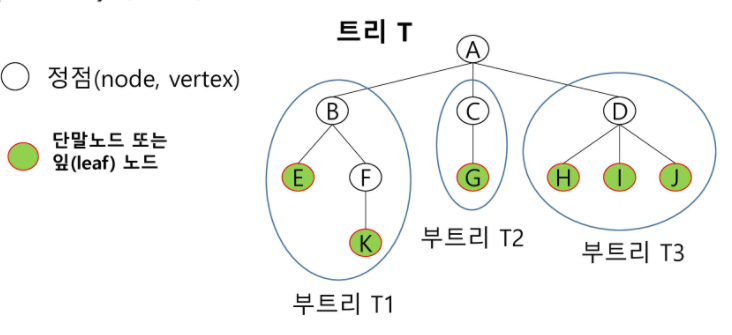

- 노드(Node) - 트리의 원소
  - 트리 T의 노드 - A, B, C, D, E, F, G, H, I , J, K
- 간선(Edge) - 노드를 연결하는 선. 부모 노드와 자식 노드를 연결
- 루트 노드(root node) - 트리의 시작 노드
  - 트리 T의 루트노드 - A
- 형제 노드(sibling node) - 같은 부모 노드의 자식 노드들
  - B, C, D는 형제 노드
- 조상 노드- 간선을 따라 루트 노드까지 이르는 경로에 있는 모든 노드들
  - K의 조상 노드 : F, B, A
- 서브 트리(subtree) - 부모 노드와 연결된 간선을 끊었을 때 생성되는 트리
- 자손 노드 - 서브 트리에 있는 하위 레벨의 노드들
  - B의 자손 노드 - E, F, K


- 차수(degree)
  - 노드의 차수 : 노드에 연결된 자식 노드의 수
    - B의 차수=2, C의 차수 = 1
  - 트리의 차수 : 트리에 있는 노드의 차수 중에서 가장 큰 값
    - 트리 T의 차수 = 3
  - 단말 노드(리프 노드) : 차수가 0인 노드. 자식 노드가 없는 노드


- 높이
  - 노드의 높이 : 루트에서 노드에 이르는 간선의 수. 노드의 레벨
    - B의 높이 = 1, F의 높이 = 2
  - 트리의 높이 : 트리에 있는 노드의 높이 주에서 가장 큰 값. 최대 레벨
    - 트리 T의 높이 = 3

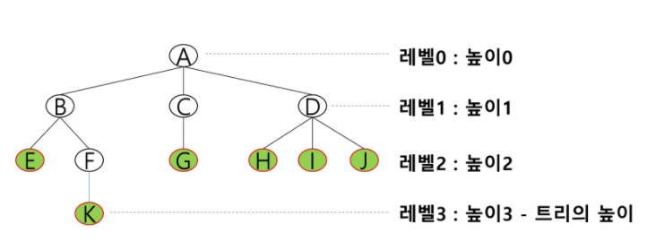


> 이진트리

- 모든 노드들이 2개의 서브트리를 갖는 특별한 형태의 트리
- 각 노드가 자식 노드를 최대한 2개까지만 가질 수 있는 트리
  - 왼쪽 자식 노드(left child node)
  - 오른쪽 자식 노드(right child node)
- 이진 트리의 예

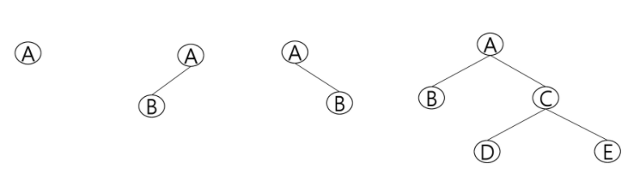

- 특성
  - 레벨 i에서의 노드의 최대 개수는 2i개
  - 높이가 h인 이진 트리가 가질 수 있는 노드의 최소 개수는 (h+1)개가 되며, 최대 개수는 (2h+1-1)개가 된다.


#### ❤ 포화 이진 트리(Full Binary Tree)

- 모든 레벨에 노드가 포화 상태로 차 있는 이진 트리
- 높이가 h일 때, 최대의 노드 개수인 (2h+1 -1)의 노드를 가진 이진 트리
  - 높이 3일때 2(3+1)-1 = 15개의 노드
- 루트를 1번으로 하여 2h+1 -1까지 정해진 위치에 대한 노드 번호를 가짐

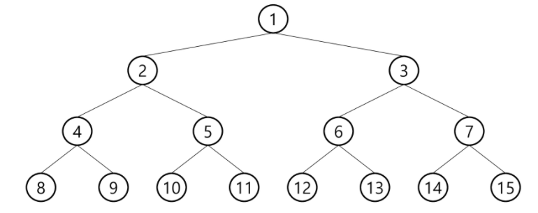


#### 🧡 완전 이진 트리(Complete Binary Tree)

- 높이가 h이고 노드 수가 n개일 때 (단, h+1 <= n < 2h+1 -1), 포화 이진 트리의 노드 번호 1번부터 n번까지 빈 자리가 없는 이진 트리
- 예) 노드가 10개인 완전 이진 트리

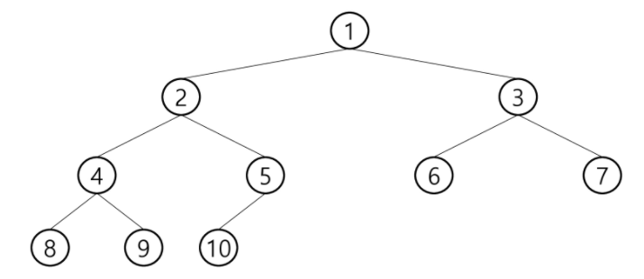


#### 💛 편향 이진 트리(Skewed Binary Tree)

- 높이 h에 대한 최소 개수의 노드를 가지면서 한쪽 방향의 자식 노드만을 가진 이진 트리
  - 왼쪽 편향 이진 트리
  - 오른쪽 편향 이진 트리

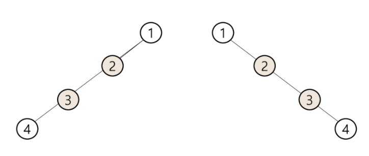


> 이진트리 - 순회 (Treversal)

- 순회(Treversal)란 트리의 각 노드를 중복되지 않게 전부 방문(visit)하는 것을 말하는데 트리는 비 선형 구조이기 때문에 선형구조에서와 같이 선후 연결 관계를 알 수 없다.
- 따라서 특별한 방법이 필요하다.
- 하나가 아니기 때문에 앞에서부터 쭉 찾아가는 방법은 안된다는 의미!!
- 3가지의 기본적인 순회방법
  - 전위순회(preorder traversal) : VLR
    - 부모노드 방문 후, 자식노드를 좌,우 순서로 방문한다.
  - 중위순회(inorder traversal) : LVR
    - 왼쪽 자식노드, 부모노드, 오른쪽 자식노드 순으로 방문한다.
  - 후위순회(postorder traversal) : LRV
    - 자식노드를 좌우 순서로 방문한 후, 부모노드로 방문한다.

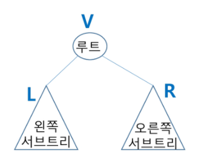


#### ❤ 전위 순회(preorder traversal)

- 수행 방법
  - 현재 노드 n을 방문하여 처리한다. > V
  - 현재 노드 n의 왼쪽 서브트리로 이동한다. > L
  - 현재 노드 n의 오른쪽 서브트리로 이동한다. > R
- 전위 순회 알고리즘

```python
def preorder_traverse():		# 전위순회
    if T:						# T is not None
        visit(T)				# print(T.item)
        preorder_traverse(T.left)
        preorder_traverse(T.right)
# return 이라고 명시하지 않아도 자동으로 return이 된다.
```

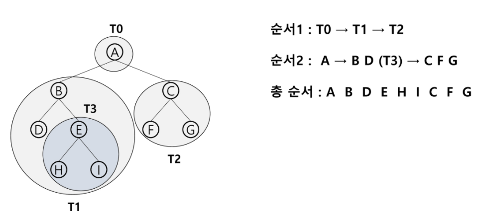


#### 💛 중위 순회(inorder traversal)

- 수행 방법
  - 현재 노드 n의 왼쪽 서브트리로 이동한다. > L
  - 현재 노드 n을 방문하여 처리한다. > V
  - 현재 노드 n의 오른쪽 서브트리로 이동한다. > R
- 중위 순회 알고리즘

```python
def inorder_traverse(T) :
    if T:
        inorder_traverse(T.left)
        visit(T)
        inorder_traverse(T.right) 
```

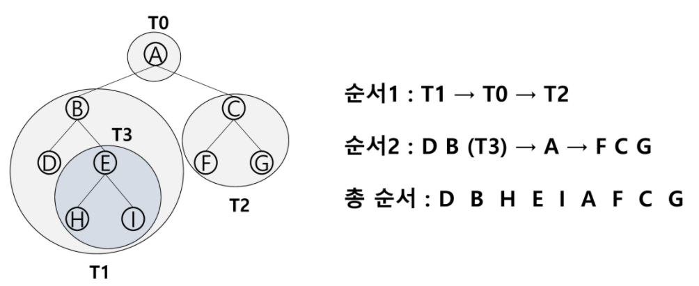


#### 💙 후위 순회(postorder traversal)

- 수행 방법
  - 현재 노드 n의 왼쪽 서브트리로 이동한다. > L
  - 현재 노드 n의 오른쪽 서브트리로 이동한다. > R
  - 현재 노드 n을 방문하여 처리한다. > V
- 후위 순회 알고리즘

```python
def postorder_traverse(T):
    if T:
        postorder_traverse(T.left)
        postorder_traverse(T.right)
        visit(T)
```

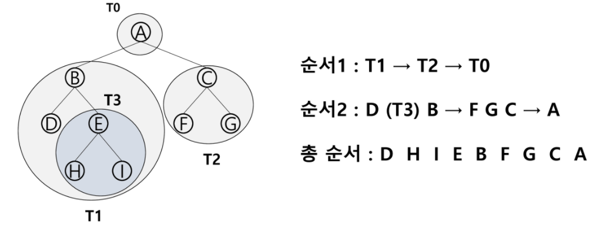


### ✨✨ 순회 한 눈에 알아보기 꿀팁!!!!! ✨✨

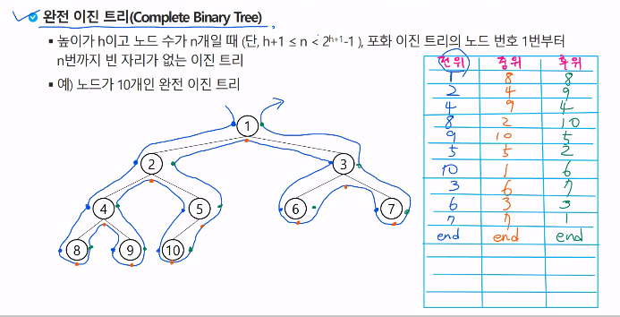

전위 순회는 왼쪽에 점, 중위 순회는 아래에 점, 후위 순회는 오른쪽에 점을 찍고 선으로 그려나가면 탐색 삽가능!

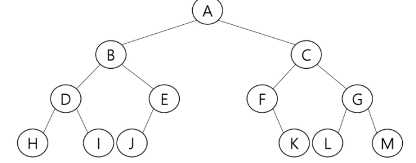


❤ 전위순회 : A B D H I E J C F K G L M end

💛 중위순회 : H D I B J E A F K C L G M end

💙 후위순회 : H I D J E B K F L M G C A end

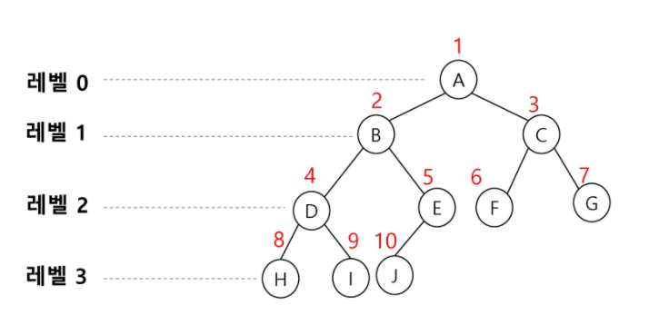

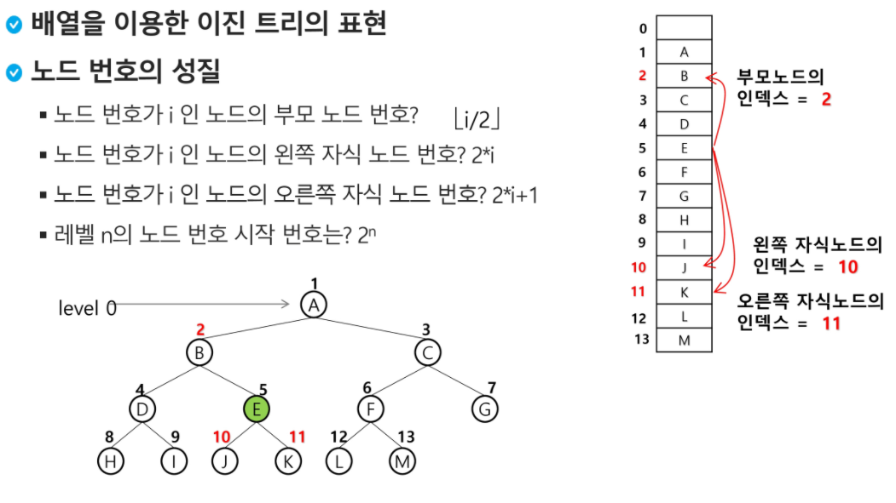


### 부모 번호를 인덱스로 자식 번호 저장하기

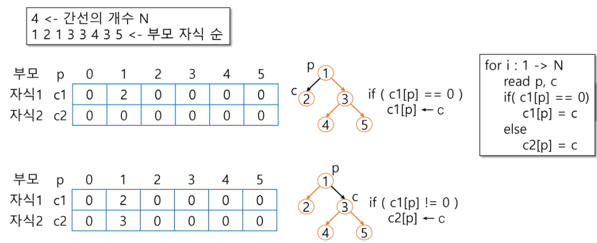

```python
def pre_order(v):
    if v:					# 0번 정점이 없으므로... 0번은 자식이 없는 경우를 표시
        print(v)			# visit(v)
        pre_order(ch1[v])	# 왼쪽 자식으로 이동
        pre_order(ch2[v])	# 오른쪽 자식으로 이동

def in_order(v):
    if v:
        in_order(ch1[v])
        print(v)
        in_order(ch2[v])
        
def post_order(v):
    if v:
        post_order(ch1[v])
        post_order(ch2[v])
        print(v)
    
E = int(input())			# edge 수(간선 수)
arr = list(map(int,input().split()))
V = E + 1					# 정점 수 == 1번부터 V번까지 정점이 있을 때 마지막 정점
# 간선은 정점에서 -1한 값이다!

# 부모번호를 인덱스로 자식번호에 저장
ch1 = [0]*(V+1)
ch2 = [0]*(V+1)
for i in range(E):
    p,c = arr[i*2], arr[i*2+1]
    if ch1[p] == 0:			# 아직 자식이 없는 경우
        ch1[p] = c
    else:					# 자식이 있는 경우
        ch2[p] = c
        
pre_order(1) > 1 2 3 4 5
in_order(1) > 2 1 4 3 5
post_order(3) > 4 5 3
```


### 자식 번호를 인덱스로 부모 번호를 저장하기

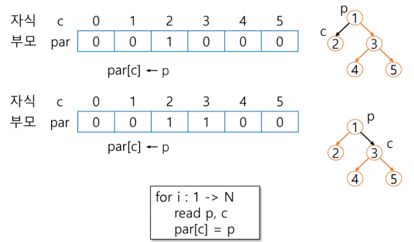

```python
def pre_order(v):
    if v:					# 0번 정점이 없으므로... 0번은 자식이 없는 경우를 표시
        print(v)			# visit(v)
        pre_order(ch1[v])	# 왼쪽 자식으로 이동
        pre_order(ch2[v])	# 오른쪽 자식으로 이동

def in_order(v):
    if v:
        in_order(ch1[v])
        print(v)
        in_order(ch2[v])
        
def post_order(v):
    if v:
        post_order(ch1[v])
        post_order(ch2[v])
        print(v)

# 4
# 2 1 2 4 4 3 4 5

par = [0]*(V+1)
for i in range(E):
    p,c = arr[i*2], arr[i*2+1]
    par[c] = p

print(*par)    		# 0 2 0 4 2 4
# root 찾기
root = 0
for i in range(1, V+1):
    if par[i]==0:
        root = i
        break
print(root)     	# 2
in_order(2)     	# 1 2 3 4 5
# 조상 찾기
c = 5				# 정점 c의 조상찾기
anc = []
while par[c] != 0:
    anc.append(par[c])
    c = par[c]
print(*anc)			# 4 2 > 5의 조상이 4 2 순이기 때문
# 마찬가지로 c를 1로 바꾸고 돌리면 1의 조상인 2가 출력된다.
```


> 수식 트리

- 수식을 표현하는 이진 트리
- 수식 이진 트리(Expression Binary Tree)라고 부르기도 함
- 연산자는 루트 노드이거나 가지 노드
- 피연산자는 모두 잎 노드


- 중위 순회 : A / B * C * D +E (식의 중위 표기법)
- 후위 순회 : A B / C * D * E + (식의 후위 표기법)
- 전위 순회 : + * * / A B C D E (식의 전위 표기법)

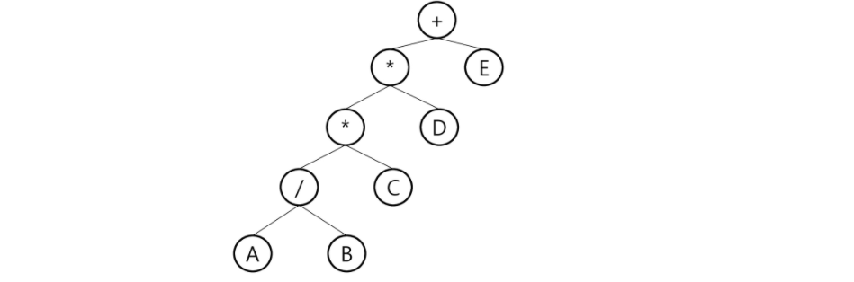


> 이진 탐색 트리

- 탐색작업을 표율적으로 하기 위한 자료 구조
- 모든 원소는 서로 다른 유일한 키를 갖는다.
- key(왼쪽 서브트리) < key(루트 노드) < key(오른쪽 서브트리)
- 왼쪽 서브트리와 오른쪽 서브트리도 이진 탐색 트리다.
- 중위 순회하면 오름차순으로 정렬된 값을 얻을 수 있다.
- ❤ 탐색 연산
  - 루트에서 시작한다.
  - 탐색할 키 값 x를 루트 노드의 키 값과 비교한다.
    - (키 값 x = 루트노드의 키 값)인 경우 : 원하는 원소를 찾았으므로 탐색 연산 성공
    - (키 값 x < 루트노드의 키 값)인 경우 : 루트노드의 왼쪽 서브트리에 대해서 탐색연산 수행
    - (키 값 x > 루트노드의 키 값)인 경우 : 루트노드의 오른쪽 서브트리에 대해서 탐색 연산 수행
  - 서브트리에 대해서 순환적으로 탐색 연산을 반복한다.

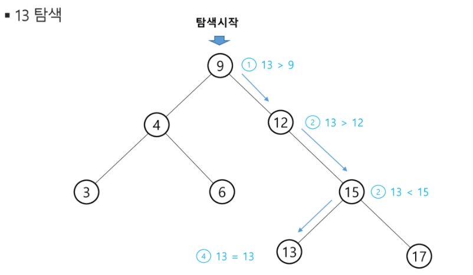

- 💛 삽입 연산
  - 먼저 탐색 연산을 수행
    - 삽입할 원소와 같은 원소가 트리에 있으면 삽입할 수 없으므로 같은 원소가 트리에 있는지 탐색하여 확인한다.
    - 탐색에서 탐색 실패가 결정되는 위치가 삽입 위치가 된다.
  - 탐색 실패한 위치에 원소를 삽입한다.

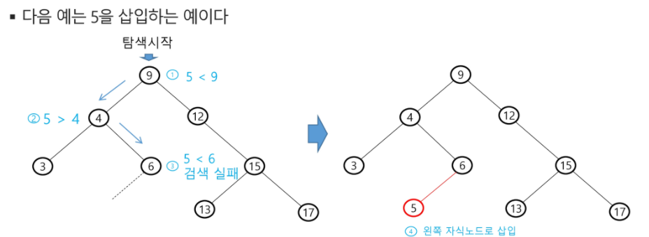

- 💚 삭제 연산


----


#### 완전이진트리에서의 순회

```python
def pre_order(v):
    global last
    if v <= last: 			# 마지막 정점번호 이내
        print(v)			# visit(v)
        pre_order(v*2)		# 왼쪽 자식정점 방문
        pre_order(v*2 + 1)	# 오른쪽 자식정점 방문
```


-----


### 🤍 참고) 힙 heap

- 완전 이진 트리에 있는 노드 중에서 키값이 가장 큰 노드나 키값이 가장 작은 노드를 찾기 위해서 만든 자료구조

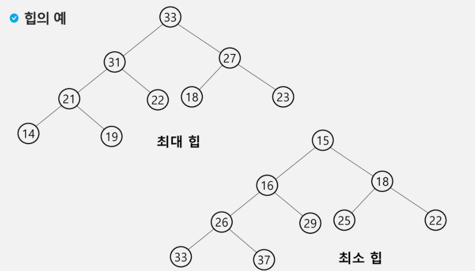

- 최대 힙(max heap)

  - 키값이 가장 큰 노드를 찾기 위한 완전 이진 트리
  - {부모노드의 키값 > 자식노드의 키값}
  - 루트 노드 : 키값이 가장 큰 노드

- 최소 힙(min heap)

  - 키값이 가장 작은 노드를 찾기 위한 완전 이진 트리
  - {부모노드의 키값 < 자식노드의 키값}
  - 루트 노드 : 키값이 가장 작은 노드

  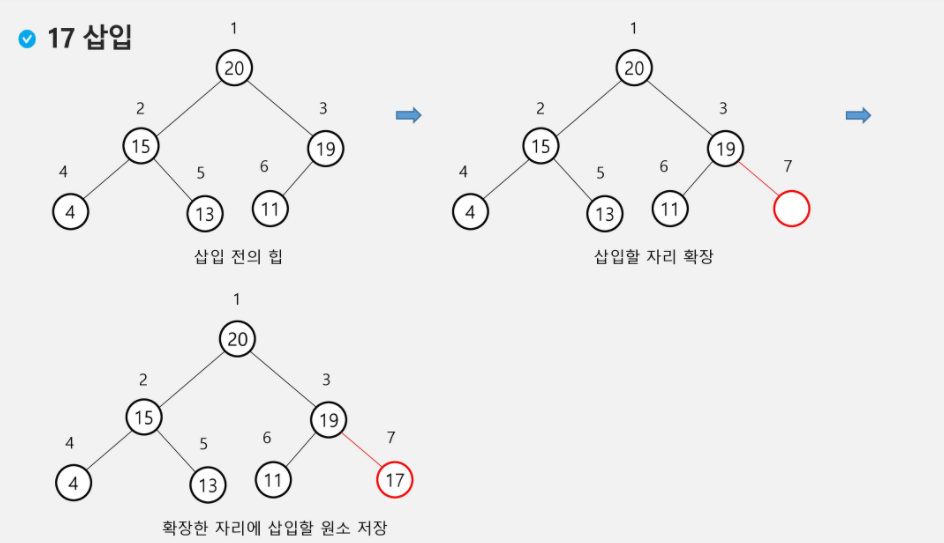

  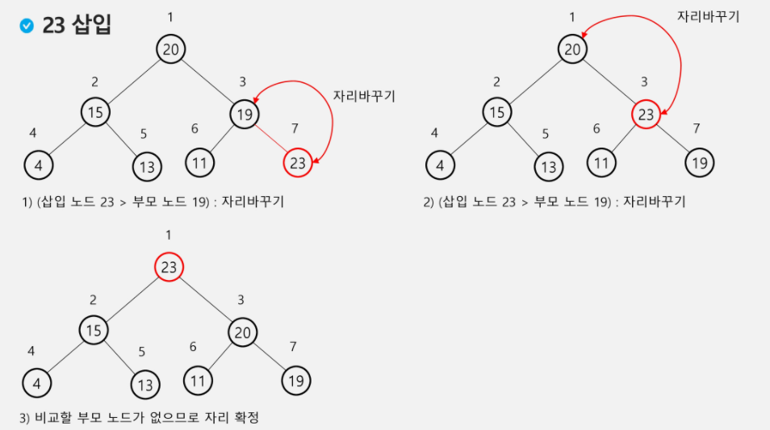

  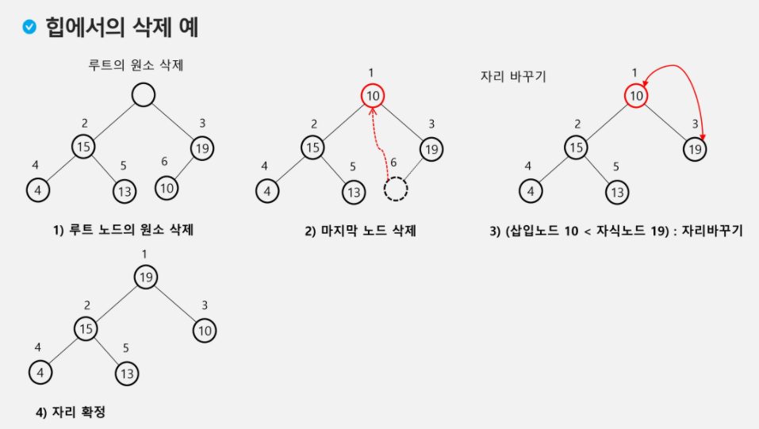

```python
# 최대 100개의 자연수가 키로 입력
# 최대힙

def enq(n):
    global last
    last += 1
    tree[last] = n			# 완전이진트리 유지
    c = last				# 새로 추가된 정점을 자식으로 
    p = c//2				# 완전이진트리에서의 부모 정점 번호
    while p >= 1 and tree[p]<  tree[c]: # 부모가 있고, 자식의 키값이 더 크면
        tree[p], tree[c] = tree[c], tree[p]
        # 서로 맞바꿔라!
        c = p
        p = c//2
        
def deq():
    global last
    tmp = tree[1]			# 루트의 key 값
    tree[1] = tree[last]	# 마지막 정점의 키를 루트에 복사
    last -= 1				# 마지막 정점 삭제
    # 부모>자식 규칙 유지
    p = 1
    c = p * 2				# 왼쪽자식노드 번호
    while c <= last:		# 왼쪽자식이 있으면
        if c+1 <= last and tree[c] < tree[c+1]:	# 오른쪽 자식노드도 있고 더 크면
            c += 1			# 오른쪽 자식 선택
       	if tree[p] < tree[c]: # 자식값이 더 크면 교환
            tree[p], treep[c] = tree[c], tree[p]
            p = c
            c = p * 2
        else:
            break
   	return tmp

# 포화이진트리의 정점번호 1~100
tree = [0]*(101)
last = 0					# 마지막 정점 번호
enq(3)
enq(2)
enq(4)
enq(7)
enq(5)
enq(1)
print(tree[1])				# 7
enq(9)
while last>0:
    print(deq(), tree[1])	# 9 7
    						# 7 5
        					# 5 4
            				# 4 3
                			# 3 2
                			# 2 1
                    		# 1 1
```

