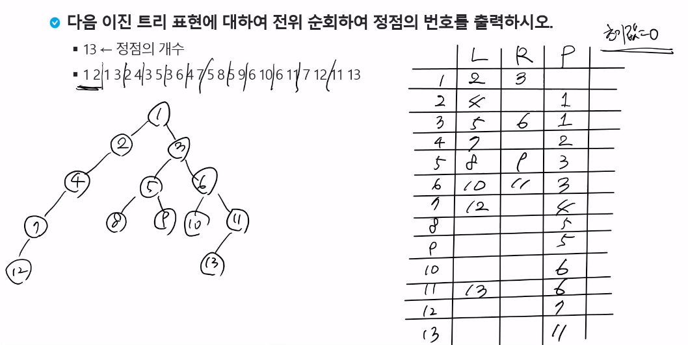

### 트리 저장

- 이진트리는 최대 자식이 2개이므로, 모든 정점에 대해 2개의 자식을 저장할 공간을 확보해서 사용
- 각 정점마다 자식 정점의 번호를 저장, 필요할 경우 부모 정점번호를 저장

### 트리 순회

- 이진 트리에서 순회

- 트리 저장 방법

  - 완전 이진 트리 = 1차 배열
  - 일반적인 이진 트리 = 

- 기본적으로 깊이우선탐색 방법을 사용

  - 방문표시/체크를 할 필요가 없다.
  - 대신, 공백 노드인지 체크한다.

- 반드시 왼쪽자식을 오른쪽 자식보다 먼저 방문해야 한다.

  

### 전/중/후 순회

- 트리순회는 깊이 우선 탐색 방법
- 모든 노드를 세 번 거쳐갑니다. == 방문하는 시점이 3군데
  - 노드에 처음 진입할 때
  - 왼쪽 자식에서 돌아올 때
  - 오른쪽 자식에서 돌아올 때