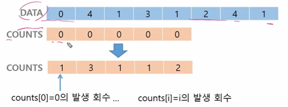
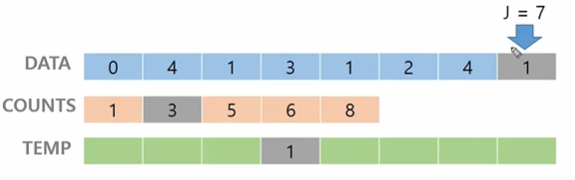
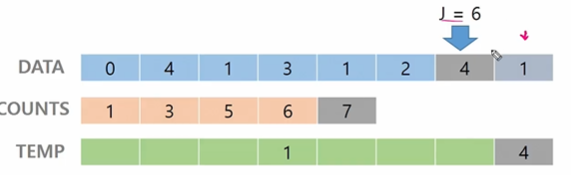
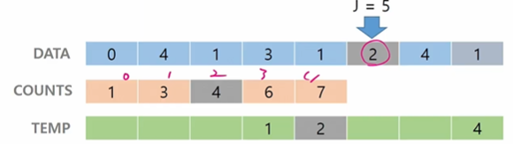
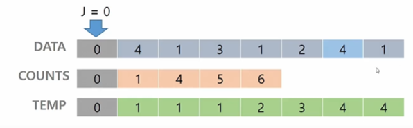
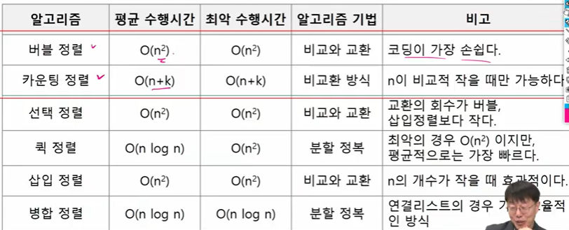

## 알고리즘

컴퓨터 분야에서 알고리즘을 표현하는 방법은 크게 두 가지


### 의사코드(슈도코드)와 순서도

```python
CalcSum(n)
	sum			# 0
    for i :
        sum 	# sum + i
    return sum;

1부터 입력받은 수 100까지의 수를 더해주는 알고리즘
```


🔴 알고리즘 1 : 1+ 2+ 3+ 4+ .... + 100 = 5050

​	100번의 연산(덧셈 100번)

🔵 100 * (1+100) / 2= 5050

​	3번의 연산(덧셈 1번, 곱셈 1번, 나눗셈 1번)


> 시간복잡도(TIme Complexity)

- 실제 걸리는 시간을 측정
- 실행되는 명령문의 개수를 계산


🔴 알고리즘 1

```python
def CalcSum(n):
    sum
    	for i in range(1, n + 1):
        sum
    return sum;
```

🔵 알고리즘 2

```python
def CalcSum(n):
    return n*(n+1)//2
```


> 시간 복잡도 > 빅-오(O) 표기법

- 시간 복잡도 함수 중에서 가장 큰 영향력을 주는 n에 대한 항만을 표시
- 계수(Coefficient)는 생략하여 표시


> 배열의 필요성

- 프로그램 내에서 여러 개의 변수가 필요할 때, 일일이 다른 변수명을 이용하여 자료에 접근하는 것은 매우 비효율적일 수 있다.
- 배열을 사용하면 하나의 선언을 통해서 둘 이상의 변수를 선언할 수 있다.
- 단순히 다수의 변수 선언을 의미하는 것이 아니라, 다수의 변수로는 하기 힘든 작업을 배열을 활용해 쉽게 할 수 있다.


> 1차원 배열

- 별도의 선언 방법이 없으면 변수에 처음 값을 할당할 때 생성

- 이름 : 프로그램에서 사용할 배열의 이름

  - ​	Arr = list()    Arr = []    Arr = [1,2,3]   Arr = [0]*10

- 1차원 배열의 접근

  - Arr[0] = 10; // '배열 Arr의 0번 원소에 10을 저장하라'

  - Arr[idx] = 20;  // '배열 Arr의 idx번 원소에 20을 저장하라'


---


### 정렬

- 2개 이상의 자료를 특정 기준에 의해 작은 값부터 큰 값(오름차순: ascending) 혹은 그 반대의 순서대로(내림차순: descending) 재배열하는 것
- 키 : 자료를 정렬하는 기준이 되는 특정값
  - ex) 서류를 번호대로 정렬하기 / 카드를 번호대로 정렬하기
- 대표적인 정렬 방식의 종류
  - 버블 정렬(Bubble Sort)
  - 카운팅 정렬(Counting Sort)
  - 선택 정렬(Selection Sort)
  - 퀵 정렬(Quick Sort)
  - 삽입 정렬(Insertion Sort)
  - 병합 정렬(Merge Sort)


> 버블 정렬(Bubble Sort)

- 인접한 두개의 원소를 비교하며 자리를 계속 교환하는 방식
- 정렬 과정
  - 첫 번째 원소부터 인접한 원소끼리 계속 자리를 교환하면서 맨 마지막 자리까지 이동한다.
  - 한 단계가 끝나면 가장 큰 원소가 마지막 자리로 정렬된다.
  - 교환하며 자리를 이동하는 모습이 물 위에 올라오는 거품 모양과 같다고 하여 버블 정렬이라고 한다.
- 시간 복잡도
  - O(n**2)
- 배열을 활용한 버블 정렬

```python
def Bubble_sort(a, N):   # 오름차순
    for i in range(N-1, 0, -1):    # 정렬 구간의 끝
        for j in range(i):		# 비교할 왼쪽 원소
            if a[j] > a[j+1]:
                a[j], a[j+1] = a[j+1], a[j]
                
T = int(input())
for tc in range(1, T+1):
    N = int(input())
    arr = list(map(int,input().split()))
    bubble_sort(arr,N)
    print(f'#{tc}, end=' ')
    
    #for x in arr:
          #print(x, end=' ')
    #print()
          
    print(*arr)
```


> 카운팅 정렬(Counting Sort)

- 항목들의 순서를 결정하기 위해 집합에 각 항목이 몇 개씩 있는지 세는 작업을 하여, 선형 시간에 정렬하는 효율적인 알고리즘
- 제한 사항
  - 정수나 정수로 표현할 수 있는 자료에 대해서만 적용 가능 : 각 항목의 발생 회수를 기록하기 위해, 정수 항목으로 인덱스 되는 카운트들의 배열을 사용하기 때문이다.
  - 카운트를 하기 위한 


- [0, 4, 1, 3, 1, 2, 4, 1] 을 카운팅 정렬하는 과정

- 1단계 : Data에서 각 항목들의 발생 회수를 세고, 정소 항목들로 직접 인덱스 되는 카운트 배열 counts에 저장한다.



```python
for i:
    counts[a[i]] += 1
    counts[4] += 1
```


- 2 단계 : 정렬된 집합에서 각 항목의 앞에 위치할 항목의 개수를 반영하기 위해 counts의 원소를 조정한다.


```python
counts[i] += counts[i-1]
```


- 3 단계 : counts[1]을 감소시키고 Temp에 1을 삽입한다.

  

- 4 단계 : counts[4]를 감소시키고 temp에 4를 삽입한다.



- 5 단계 : counts[2]를 감소시키고 temp에 2를 삽입한다.

  

- 등등등 하고 종료한다.




```python
def Counting_Sort(A, B, k)
# A [] -- 입력 배열(1 to K)		  data
# B [] -- 정렬된 배열  		     temp
# C [] -- 카운트 배열 			 count  

	C = [0] * (k+1)				# k 갯수만큼 0으로 채워져있는 리스트다
    
    for i in range(0, len(A)) :
        C[A[i]] += 1   			# A 안의 숫자들 발생 횟수 저장
    for i in range(1, len(C)) :
        C[i] += C[i-1] 			# A 안의 숫자들 발생 누적 숫자 저장
    for i in range(len(B)-1,-1,-1) :
        C[A[i]] -= 1
        B[C[A[i]]] = A[i]
    
```




버블 정렬은 코딩을 배우는 입장에서 꼭 이해하고 있어야 한다!


- 완전 검색 방법은 문제의 해법으로 생각할 수 있는 모든 경우의 수를 나열해보고 확인하는 기법이다.
- 모든 경우의 수를 테스트한 후, 최종 해법을 도출한다.
- 일반적으로 경우의 수가 상대적으로 작을 때 유용하다.
- 고려할 수 있는 모든 경우의 수 생성하기
  - 6개의 숫자로 만들 수 있는 모든 숫자 나열(중복 포함)
  - 예) 입력으로 [2,3,5,7,7,7]을 받았을 경우, 아래와 같이 순열을 생성할 수 있다.


> 순열

- 서로 다른 것들 중 몇 개를 뽑아서 한 줄로 나열하는 것
- 서로 다른 n개 중 r개를 택하는 순열은 `nPr`와 같이 표현한다.
- 그리고 `nPr`은 다음과 같은 식이 성립한다.
  - nPr = n * (n-1) * (n-2) * ... * (n-r+1)
- nPn = n!이라고 표기하며 Factorial이라 부른다.
  - n! = n * (n-1) * (n-2) * ... * 2 * 1

- 단순하게 순열을 생성하는 방법
  - 예) {1,2,3}을 포함하는 모든 순열을 생성하는 함수
    - 동일한 숫자가 포함되지 않았을 때, 각 자리 수 별로 loop을 이용해 아래와 같이 구현할 수 있다.

```python
for i1 in range(1,4):   # i1 = 1,2,3    
    for i2 in range(1,4):  # i2= 1,2,3
        if i2 != i1:   # 만약 i1 i2가 다르다면    ex) i1= 1, i2= 2
            for i3 in range(1,4):   # i3 = 1,2,3
                if i3 != i1 and i3!= i2:       # ex) i3= 3
                    print(i1, i2, i3)   # 1,2,3
```


> 탐욕(Greedy) 알고리즘

- 탐욕 알고리즘은 최적해를 구하는 데 사용되는 근시안적인 방법
- 여러 경우 중 하나를 결정해야 할 떄마다 그 순간에 최적이라고 생각되는 것을 선택해 나가는 방식으로 진행하여 최종적인 해답에 도달한다.
- 각 선택의 시점에서 이루어지는 결정은 지역적으로는 최적이지만, 그 선택들을 계속 수집하여 최종적인 해답을 만들었다고 하여, 그것이 최적이라는 보장은 없다.
- 일반적으로, 머릿속에 떠오르는 생각을 검증 없이 바로 구현하면 Greedy 접근 된다. 

1) 해 선택 : 현재 상태에서 부분 문제의 최적 해를 구한 뒤, 이를 부분해 집합(Solution Set)에 추가한다.


``` python
i = 0
tri = run = 0
while i < 10:
    if c[i] >= 3:
        c[i] -= 3
        tri += 1
        continue;
   	if c[i] >= 1 and c[i+1] and c[i+2] >= 1:
        c[i] -= 1
        c[i+1] -= 1
        c[i+2] -= 1
        run += 1
        continue
    i += 1
    
if run + tri == 2 : print("Baby Gin")
else: print("Lose")
```


