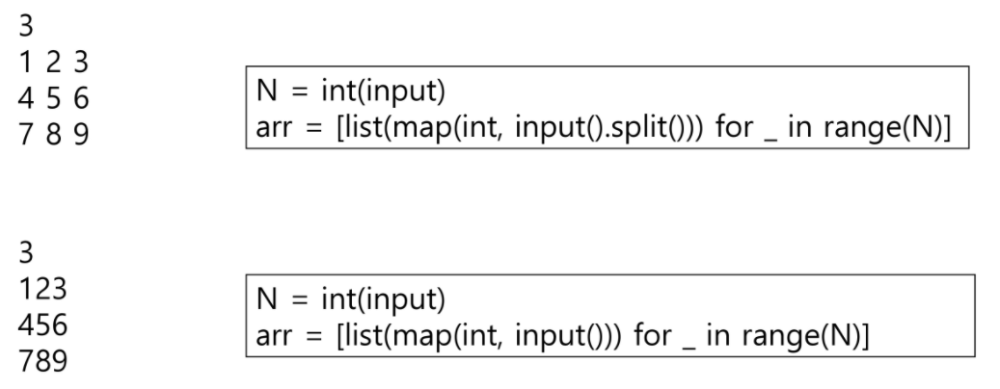
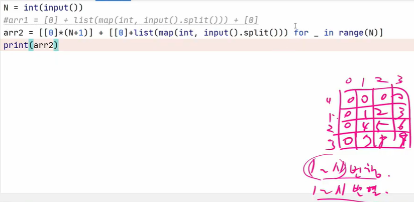
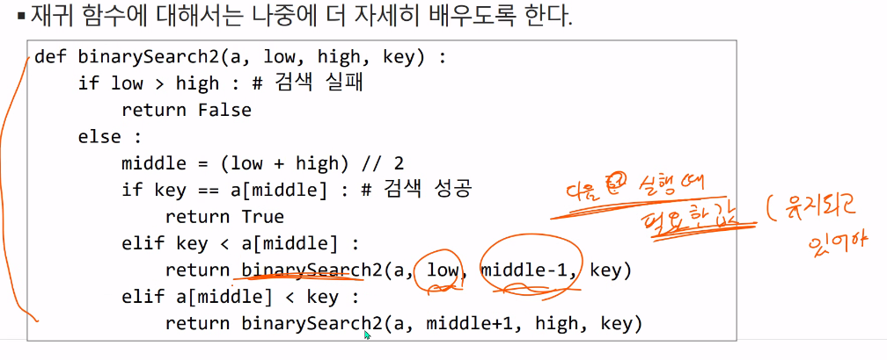

## LIST

> 2차원 배열의 선언

- 1차원 List를 묶어놓은 List
- 2차원 이상의 다차원 List는 차원에 따라 Index를 선언
- 2차원 List의 선언 : 세로길이(행의 개수), 가로길이(열의 개수)를 필요로 함
- Python에서는 데이터 초기화를 통해 변수선언과 초기화가 가능함

ex) arr = [[0,1,2,3],[4,5,6,7]]

.split() 안하면 123 456 789 이렇게 세자리 숫자가 되어버리고 만다.

> zip 함수

zip(iter1, iter2) : 같은 index끼리 묶어준다.

ex) list(zip([1,2,3],['a','b','c']))   = [(1,'a'),(2,'b'),(3,'c')]

- zip으로 묶어줄때 언패킹(*a)이 필요하다!!

