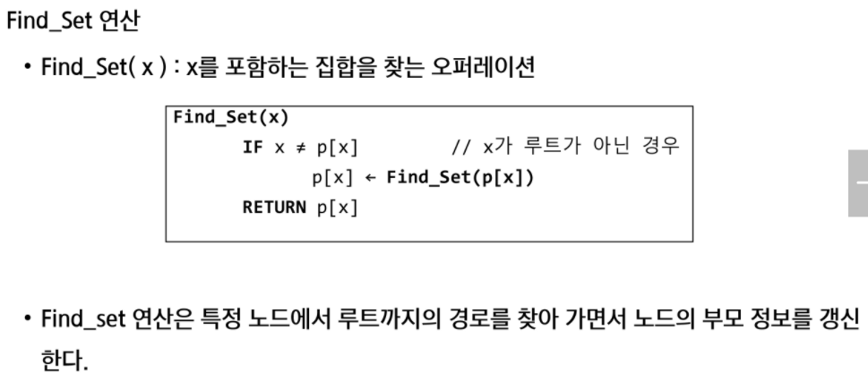

### 서로소 집합(Disjoint-sets)

- 서로소 또는 상호배타 집합들은 서로 중복 포함된 원소가 없는 집합들이다. 다시 말해 교집합이 없다.
- 집합에 속한 하나의 특정 멤버를 통해 각 집합들을 구분한다. 이를 대표자(representative)라고 한다.
- 상호배타 집합을 표현하는 방법
  - 연결 리스트
  - 트리
- 상호배타 집합 연산
  - Make-Set(x)
  - Find-Set(x)
  - Union(x,y)


###  상호배타집합

```python
Make_Set(x)
# 유일한 멤버 x를 포함하는 새로운 집합을 생성하는 연산
	p[x] <- x
    
Find_Set(x)
# x를 포함하는 집합을 찾는 연산
	if x == p[x] : return x
    else : return

Union_set(x,y)
# x와 y를 포함하는 두 집합을 통합하는 연산
	p[Find-Set(y)]  <- Find-Set(x)
```





----

## 최소 비용 신장 트리 MST

> 최소 신장 트리 MST

- 그래프에서 최소 비용 문제
  - 모든 정점을 연결하는 간선들의 가중치의 합이 최소가 되는 트리
  - 두 정점 사이의 최소 비용의 경로 찾기
- 신장 트리
  - n개의 정점으로 이루어진 무방향 그래프에서 n개의 정점과 n-1개의 간선으로 이루어진 트리
- 최소 신장 트리(Minimum Spanning Tree)
  - 무방향 가중치 그래프에서 신장 트리를 구성하는 간선들의 가중치의 합이 최소 신장 트리


#### ❤️Prim 알고리즘

- 하나의 `정점`에서 연결된 간선들 중에서 하나씩 선택하면서 MST를 만들어가는 방식
  - 임의 정점을 하나 선택해서 시작
  - 선택한 정점과 인접하는 정점들 중의 최소 비용의 간선이 존재하는 정점을 선택
  - 모든 정점이 선택될 때까지 1), 2) 과정을 반복
- 서로소인 2개의 집합(2 disjoint-sets) 정보를 유지
  - 트리 정점들(tree vertices) - MST를 만들기 위해 선택된 정점들
  - 비트리 정점들(nontree vertives) - 선택되지 않은 정점들

```python
MST_PRIM(G,r)   # 그래프 / 시작정점
	for u in G,v
    	u.key <- infinite  # u.key = u에 연결된 간선중 최소 가중치
        u.π <- NULL      # u.π = 트리에서 u의 부모
        
    r.key <- 0
    Q <- G.V				# 우선순위 Q에 모든 정점 넣는다
    while Q != 0			# 빈 Q가 아닐동안 반복 = MST에 속하지 않은 정점이 있으면
    	u <- Extract_Min(Q) # key 값이 가장 작은 정점 가져오기
        for v in G.adj[u]   # u의 인접 정점들
        	if v ∈ Q and w(u,v) < v.key  # Q에 있는 v의 key 값 갱신
            	v.π <- u
                v.key <- w(u,v)
```

```python
def prim1(r,v):
    MST = [0] * (v+1)  # MST 포함여부
    key = [10000] * (v+1)  # 가중치의 최대값 이상으로 초기화. key[v]는 v가 MST에 속한 정점과 연결될 때의 가중치
    key[r] = 0 # 시작정점의 key
    for _ in range(v): # v+1개의 정점 중에서 v개를 선택
        # MST에 포함되지 않은 정점 중 (MST[u] == 0), key가 최소인 u 찾기
        u = 0
        minV = 10000
        for i in range(v+1):
            if MST[i] == 0 and key[i] < minV:
                u = i
                minV = key[i]
        MST[u] = 1  # 정점 u를 MST에 추가
        
        for v in range(v+1):
            if MST[v] == 0 and adjM[u][v] > 0:
                # u를 통해 MST에 포함되는 비용과 기존 비용을 비교, 갱신
                key[v] = min(key[v],adjM[u][v])  
    return sum(key)   # MST 가중치의 합
```

```python
def prim2(r,v):
    MST = [0] * (v+1)   # MST 포함 여부
    MST[r] = 1
    s = 0  # 최소 가중치의 합
    for _ in range(v):
        u = 0
        minV = 10000
        for i in range(v+1):
            if MST[i] == 1:
                for j in range(v+1):
                    if o<adjM[i][j] < minV and MST[j] == 0:
                        u = j
                        minV = adjM[i][j]
        s += minV
        MST[u] = 1
   return s
```


```python
def prim(start):
    D[start] = 0   # 시작점의 거리는 항상 0이다. 자기자신이기 때문
    
    for _ in range(v):
        # MST이 포함되지 않은 정점 중에서 거리가 최소인 정점을 찾는 
        min_v = 0
        min_d = INF
        for i in range(1, v+1):    # 연결된 모든 정점 중에서
            if MST[i] == 0: 		# MST[i]가 아직 정점에 도달하지 않은 i에 한해서
                if D[i] < min_d:   # 해당 거리가 최솟점인지 확인하고
                    min_d = D[i]
                    min_v = i
        MST[min_v] = 1             # MST에 등록
    	for v in range(v+1):
            if adj[min_v][v] != 0 and MST[v] == 0:   # 내 자신으로 돌아오지 않는 특별한 정점이 있다면 그리고 그게 MST에 등록되지 않은 정보라면
            	if D[v] > adj[min_v][v]:
                    D[v] = adj[min_v][v]
                    P[v] = min_v
                    
    return sum(D[start:]), P

v,e = map(int,input().split())
INF = 987654321

adj = [[0]*(v+1) for _ in range(v+1)]  # 정점배열
for _ in range(e):
    s,e,d= map(int,input().split())    # 시작점, 끝점, 거리
    adj[s][e] = d					# 시작점과 끝점에 거리 값을 넣어준다
    adj[e][s] = d					# 양방향 거리
    # 여기서 임포트가 잘 됐는지 print 찍어서 한 번 확인해준다!!
    
# a = 10 이런식으로 브레이크포인트 하나 찍어주고 프린트 찍어 확인한다

MST = [0] * (v+1)		# MST 구성 여부
D = [INF] * (v+1)       # 최소거리. 최솟값을 넣을 곳이므로 일단 최댓값을 담아준다.
P = [0] * (v+1)			# 연결된 부분

result = prim(1)
print(result)
```


----


#### 💙 KRUSKAL 알고리즘

- `간선`을 하나씩 선택해서 MST를 찾는 알고리즘
  - 최초, 모든 간선을 가중치에 따라 오름차순으로 정렬
  - 가중치가 가장 낮은 간선부터 선택하면서 트리를 증가시킴
    - 사이클이 존재하면 다음으로 가중치가 낮은 간선 선택
  - n-1 개의 간선이 선택될 때까지 2)를 반복

- 일반적으로 Prim 알고리즘보다 더 빠르다.

```python
# 수도 코드
MST-KRUSKAL(G,w)
	A <- 0 				# 0 : 공집합
    for vertex v in G.V # G,V : 그래프의 정점 집합
    	make_set(v)		# G,E : 그래프의 간선 집합
        
    G,E에 포함된 간선들을 가중치 w에 의해 정렬
    
    for 가중치가 가장 낮은 간선 (u,v) ∈ G,E 선택(n-1개)
    	if Find_Set(u) ≠ Find_Set(v)
        	A <- A ∪ {(u,v)}
            Union(u,v);
    return A
```

```python
def find_set(x):
    # 1)재귀로 찾는 방법
    if x == P[x]:
        return x
    else:
        return find_set(P[x])
    
    # 2)loop 활용하는 방법
    #while x != P[x]:
    #    x = P[x]
    #return x

v,e = map(int,input().split())
edge = []
for _ in range(e):     # 모든 간선 정보
    s,e,d = map(int,input().split())   # 시작점, 끝점, 거리 정보
    edge.append((d,s,e)) 			# 정보를 다 담는데 거리순으로 오름차순할 것이라 정보값 d를 0번으로 작성해준다.
    
edge.sort()				# d를 기준으로 정렬이 된다.

P = [i for i in range(v+1)]    # 부모 원소 초기화
count = 0				# 간선이 몇 개가 선택되었는지 / 선택된 정점의 수
total = 0				# 가중치 합

for d,s,e in edge:
    x = find_set(s)
    y = find_set(e)
    if x != y:			# 사이클을 형성하지 않는다면
        count += 1
        total += d
        P[y] = x		# 부모 원소를 갱신
        
        if count == v:  # count가 정점의 개수와 같다면
            break
            
print(total)
```


----


### 최단경로

- 간선의 가중치가 있는 그래프에서 두 정점 사이의 경로들 중에 간선의 가중치의 합이 최소인 경로
- 하나의 시작 정점에서 끝 정점까지의 최단경로
  - 다익스트라(dijkstra) 알고리즘
    - 음의 가중치를 허용하지 않음
  - 벨만-포드(Bellman_Ford) 알고리즘
    - 음의 가중치 허용
- 모든 정점들에 대한 최단 경로
  - 플로이드-워샬(Floyd-Warchall) 알고리즘


> Dijkstra 알고리즘

- 시작 정점에서 거리가 최소인 정점을 선택해 나가면서 최단 경로를 구하는 방식
- 시작정점(s)에서 끝정점(t)까지의 최단 경로에 정점 x가 존재한다
- 이때, 최단경로는 s에서 x까지의 최단 경로와 x에서 t까지의 최단 경로로 구성된다.
- 탐욕 기법을 사용한 알고리즘으로 MST의 프림 알고리즘과 유사하다.


```python
Dijkstra(s,a,d)
	u = {s};
    
    for 모든 정점 v
    	d[v] <- a[s][v]
        
    while u != v
    	d[w]가 최소인 정점 w ∈ v-u를 선택
        u <- u ∪ {w}
        
        for w에 인접한 모든 정점 v
        	d[v] <- min(d[v], d[w] + a[w][v])
```

```python
def dijkstra():
    while Q:		# Q에서 하나씩 꺼내서 있는지 확인할 것임
        now, dist = Q.pop()
        if Q[now] < dist:     # 기존에 저장된 거리랑 새로운 거리를 비교 / 주어진 거리보다 이미 저장된 거리가 더 적으면 skip
            continue
        visited[now] = True
        # 현재 정점의 인접 정점을 선택하여 그 인접 정점을 확인
        for v in range(len(adj[now])):
            next_v, next_dist = adj_list[now][v]
            if not visited[next_v]:
                if dist + next_dist < D[next_v]:
                    D[next_v] = dist + next_dist
                    Q.append((next_v,D[next_v]))
            

v,e = map(int,input().split())
# 인접 리스트 만들기
adj = [[] for _ in range(v+1)]
for _ in range(e):
    s,e,d = map(int,input().split())
    adj[s].append((e,d))
    # [[(1,3),(2,5)],[(2,2),(3,6)],....] 이런 식으로 입력된다
    
INF = 987654321     	# 최소거리를 넣어야 하므로 큰 값을 지정    
D = [INF] * (v+1)
D[0] = 0
# 시작 정점에서 인접한 정점 거리를 저장
for v,d in adj[0]:
    D[v] = d
    
visited = [False] * (v+1)  # 정점을 지났는지 지나치지 않았는지 확인
visited[0] = True

Q = [[*adj][0]]
dijkstra()
```

