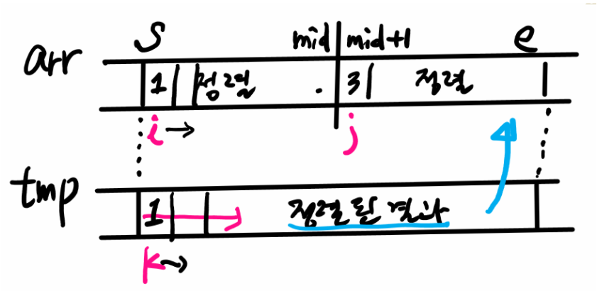

## 병합 정렬

- 병합정렬 최대한 균등하게(N/2) 분할하지만 퀵정렬은 선택한 피봇 값을 기준으로 분할하다.
  - 평균적으로 $O(n \log{n})$
- 병합 정렬은 후처리 작업이 필요하나, 퀵정렬은 분할하고 정복하면 정렬이 끝난다.

```python
# 테스트케이스 출력은 되지만, 런타임에러가 나는 코드! 
# 그 이유는 pop 때문이다

def merge_sort(lst):
    if len(lst) <= 1:
        return lst
    # 분할
    mid = len(lst) // 2
    l = merge_sort(lst[:mid])   # 왼쪽 부분
    r = merge_sort(lst[mid:])  # 오른쪽 부분분

    # 병합하기
    result = []
    while l and r:
        if l[0] < r[0]:
            result.append(l.pop(0))
        else:
            result.append(r.pop(0))
    result.extend(l)
    result.extend(r)
    return result

arr = [69, 10, 30, 2, 16, 8, 31, 22]
ret = merge_sort(arr)
print(ret)
```

-----------

```python
# 그래서 런타임에러 방지를 위해 사용하는 것이 데크(deque)

from collections import deque

def merge_sort(lst):
    global cnt
    if len(lst) <= 1:
        return lst
    # 분할
    mid = len(lst) // 2
    l = merge_sort(lst[:mid])   # 왼쪽 부분
    r = merge_sort(lst[mid:])  # 오른쪽 부분분
    if l[-1] > r[-1]:
        cnt += 1
    l = deque(l)
    r = deque(r)

    result = []
    while l and r:
        if l[0] < r[0]:
            result.append(l.popleft())
        else:
            result.append(r.popleft())
    result.extend(l)
    result.extend(r)
    return result

for tc in range(1, int(input()) + 1):
    N = int(input())
    arr = list(map(int, input().split()))
    cnt = 0
    ret = merge_sort(arr)
    print(f'#{tc} {ret[N//2]} {cnt}')
```

---------


### ✨ 데크(deque)란 무엇인가

`deque`란 스택처럼 사용할 수도 있고, 큐처럼 사용할 수도 있다. 시작점의 값을 넣고 빼거나, 끝 점의 값을 넣고 빼는 데 최적화된 연산 속도를 제공한다. 즉, 대부분의 경우에 데크(deque)는 리스트(list)보다 월등한 옵션이다.

👉 `deque`는 특히 push/pop 연산이 빈번한 아고리즘에서 리스트보다 월등한 속도를 자랑한다!!!!!!!!!

-----




```python

def merge_sort(s, e):
    if s == e: return
    # 분할
    mid = (s + e) // 2
    merge_sort(s , mid)
    merge_sort(mid + 1, e)

    i, j, k = s, mid + 1, s

    while i <= mid and j <= e:
        if arr[i] < arr[j]:
            tmp[k] = arr[i]; i, k = i + 1, k + 1
        else:
            tmp[k] = arr[j]; j, k = j + 1, k + 1
    while i <= mid:
        tmp[k] = arr[i]; i, k = i + 1, k + 1
    while j <= e:
        tmp[k] = arr[j]; j, k = j + 1, k + 1

    for i in range(s, e + 1):
        arr[i] = tmp[i]


arr = [7, 5, 4, 1, 3, 6, 2, 8]
N = len(arr)
tmp = [0] * N
merge_sort(0, N - 1)
print(arr)
```

-----------

- 병합 정렬 문제에 적용하기

  ```python
  
  def merge_sort(s, e):
      global cnt
      if s + 1 == e: return
      # 분할
      mid = (s + e) // 2
      merge_sort(s , mid)
      merge_sort(mid, e)
      if arr[mid - 1] > arr[e - 1]:
          cnt += 1
      #---------------------------
      i, j, k = s, mid, s
      while i < mid and j < e:
          if arr[i] < arr[j]:
              tmp[k] = arr[i]; i, k = i + 1, k + 1
          else:
              tmp[k] = arr[j]; j, k = j + 1, k + 1
      while i < mid:
          tmp[k] = arr[i]; i, k = i + 1, k + 1
      while j < e:
          tmp[k] = arr[j]; j, k = j + 1, k + 1
  
      for i in range(s, e):
          arr[i] = tmp[i]
  
  
  for tc in range(1, int(input()) + 1):
      N = int(input())
      arr = list(map(int, input().split()))
      cnt = 0
      tmp = [0] * N
      merge_sort(0, N)
      print(f'#{tc} {arr[N//2]} {cnt}')
  ```

  