## 분할정복

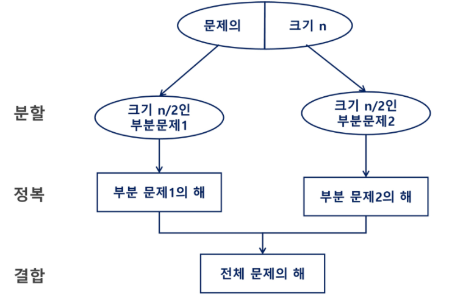


-----

```python
Recursive_Power(x,n)
	if n == 1 : return x
    if n is even
    	y < Recursive_Power(x,n/2)
        return y*y
    else
    	y < Recursive_Power(x, (n-1)/2)
        return y*y*x
```

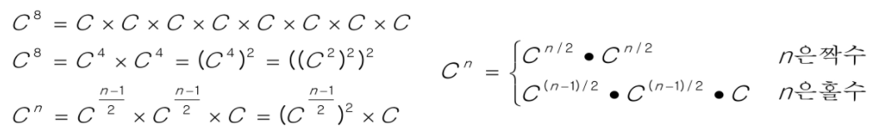

----

> 병합 정렬(Merge Sort)

- 여러 개의 정렬된 자료의 집합을 병합하여 한 개의 정렬된 집합으로 만드는 방식
- 분할 정복 알고리즘 활용
  - 자료를 최소 단위의 문제까지 나눈 후에 차례대로 정렬하여 최종 결과를 얻어냄
  - top-down 반식
- 시간 복잡도
  - O(n log n)

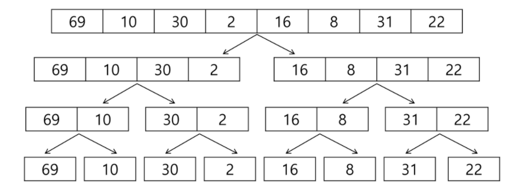

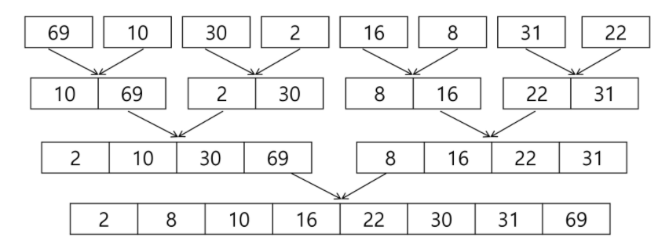

- 분할과 병합 과정을 통해 정렬한다.

```python
# 분할 과정
merge_sort(LIST m)
	if length(m) == 1: return m
    
    LIST left, right
    middle <- length(m) / 2
    for x in m before middle
    	add x to left
   	for x in m after or equal middle
    	add x to right
        
    left <- merge_sort(left)
    right <- merge_sort(right)
    
    return merge(left,right)
```

```python
# 병합 과정
merge(LIST left, LIST right)
	LIST result
    
    while length(left) > 0 or length(right) > 0
    	if length(left) > 0 and length(right) > 0
        	if first(left) <= first(right)
            	append popfirst(left) to result
            else
            	append popfirst(right) to result
        elif length(left) > 0
        	append popfirst(left) to result
        elif pength(right) > 0
        	append popfirst(right) to result
    return result
```

```python
# 위 두 수도코드 합쳐서 직접 만들어보기
def merge_sort(arr):
    if len(arr) == 1:
        return arr

    # 리스트의 왼쪽 오른쪽으로 나눠주기
    middle = len(arr)//2
    left_arr = arr[0:middle]
    right_arr = arr[middle:n]
    # 계속 쪼갈라주기
    left_arr = merge_sort(left_arr)
    right_arr = merge_sort(right_arr)

    return merge(left_arr,right_arr)

def merge(left_arr, right_arr):
    result = []     # 정렬된 숫자 받을 리스트
    # 왼쪽 리스트 혹은 오른쪽 리스트에 최소 하나 이상의 숫자가 담겨있다면
    # 둘 중 하나의 리스트가 빈 리스트가 돼도 계속 돌아감
    # 왼쪽 오른쪽 리스트 둘 다 pop되어 사라지면 반복 종료
    while len(left_arr) > 0 or len(right_arr) > 0:
        # 왼쪽 리스트와 오른쪽 리스트에 원소가 최소 하나 이상 담겨있다면
        if len(left_arr) > 0 and len(right_arr) > 0:
            # 만약 왼쪽 리스트 0번째 인덱스가 오른쪽 리스트 0번째보다 작거나 같다면
            if left_arr[0] <= right_arr[0]:
                # 왼쪽 리스트 0번째 인덱스를 result에 포함시키고 pop해준다
                result.append(left_arr.pop(0))
            # 오른쪽 리스트 0번째가 더 크다면 반대로
            else:
                result.append(right_arr.pop(0))
        # 왼쪽 리스트에 원소가 최소 하나 이상 담겨있다면 result에 넣고 pop
        elif len(left_arr) > 0:
            result.append(left_arr.pop(0))
        # 오른쪽 리스트에 원소가 최소 하나 이상 담겨있다면 result에 넣고 pop
        elif len(right_arr) > 0:
            result.append(right_arr.pop(0))
    return result
```


----


> 퀵 정렬

- 주어진 배열을 두 개로 분할하고, 각각을 정렬한다.
- 병합 정렬과 다른 점
  - 병합 정렬은 그냥 두 부분으로 나누는 반면에, 퀵 정렬은 분할할 때, 기준 아이템(pivot item) 중심으로, 이보다 작은 것은 왼편, 큰 것은 오른편에 위치시킨다.
  - 각 부분 정렬이 끝난 후, 병합정렬은 "병합"이란 후처리 작업이 필요하나, 퀵 정렬은 필요로 하지 않는다.

```python
quickSort(a[],l,r)
	if l <- r
    	s <- partition(a,l,r)
        quickSort(a[],l,s-1)
        quickSort(a[],s+1,r)
```

```python
# Hoare-Partition 알고리즘
partition(a[],l,r)
	p <- a[l]
    i <- l, j <- r
    while i <= j
    	while i < j and a[i] <= p : i++
        while i < j and a[j] >= p : j--
            if i < j : swap(a[i], a[j])
             
     swap(a[l],a[j])
    return j
# 앞이랑 뒤에서 각각 찾아가는 방식
```

```python
# 직접 코드 만들어보기
def quickSort(arr):
    if len(arr) <= 1:
        return arr
    pivot = arr[0]  # 가장 첫 번째 원소
    tail = arr[1:]  # pivot 제외한 나머지 원소 전부 다

    left_side = [x for x in tail if x <= pivot]  # pivot보다 작거나 같은 원소들
    right_side = [x for x in tail if x > pivot]  # pivot보다 큰 원소들

    return quickSort(left_side) + [pivot] + quickSort(right_side)
```

```python
# 위의 코드도 되지만 밑의 코드도 된다
# 테스트케이스가 완벽히 통과하는지 확인하기

def partition(left,right):
    if left >= right:
        return			# 정렬이 끝나면 종료
    
    pivot = left		# 왼쪽 끝으로 피봇 설정
    i = left + 1		# 앞에서부터 탐색 시작
    j = right - 1		# 뒤에서부터 탐색 시작
    
    while i <= j:
        # 각각 pivot보다 작거나 큰 수를 찾을 때까지 한 자리씩 인덱스 이동
        while i <= j and li[pivot] >= li[i]:
            i += 1
        while i <= j and li[pivot] <= li[j]:
            j -= 1
        # i와 j의 이동이 끝나면 숫자 교환
        if i <= j:
            li[i],li[j] = li[j],li[i]
    
    # 반복 끝나면 피봇과 j 교환
    li[pivot],li[j] = li[j],li[pivot]
    
    # 일련의 과정을 반복 / 왼쪽 오른쪽 배열을 피봇 기준으로 다시 반복
    partition(left, j)
    partition(j + 1, right)
```


##### ✔️ 아이디어

- p(피봇)값들보다 큰 값은 오른쪽, 작은 값들은 왼쪽 집합에 위치하도록 한다.


- 피봇을 두 집합의 가운데에 위치시킨다.

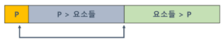


##### ✔️ 피봇 선택

- 왼쪽 끝/ 오른쪽 끝/ 임의의 세 개 값 중에 중간 값

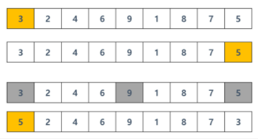

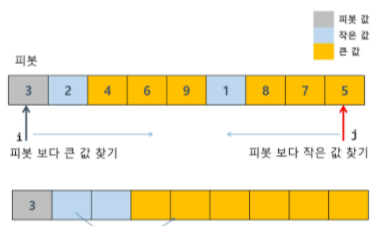

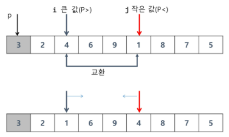

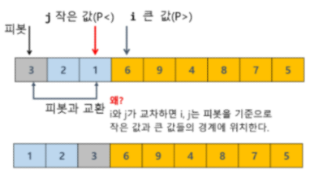

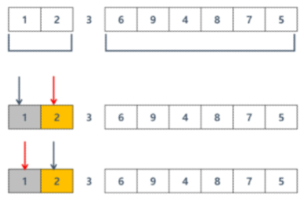

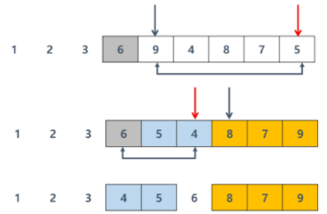


```python
# Lomuto partition 알고리즘
partition(a[],l,r)
	x <- a[r]
    i <- l-1
    for j in l -> r-1
    	if a[j] <= x
        	i++, swap(a[i],a[j])
            
    swap(a[i+1],a[r])
    return i+1
# 앞에서부터 찾아가는 방식
```


----

## 백트래킹

- 여러 가지 선택지들이 존재하는 상황에서 한 가지를 선택한다.
- 선택이 이루어지면 새로운 선택지들의 집합이 생성된다.
- 이런 선택을 반복하면서 최종 상태에 도달한다.

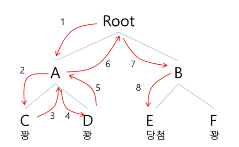

##### ✅ 당첨 리프 노드 찾기

- 루트에서 갈 수 있는 노드 선택
- 꽝 노드에 도달하면 최근의 선택으로 되돌아와 다시 시작
- 더 이상의 선택지가 없다면 이전의 선택지로 돌아가서 다른 선택을 한다
- 루트까지 돌아갔을 경우 더 이상의 선택지가 없다면 종료


##### ✔️ 백트래킹과 깊이 우선 탐색과의 차이

- 어떤 노드에서 출발하는 경로가 해결책으로 이어질 것 같지 않으면 더 이상 그 경로를 따라가지 않음으로써 시도의 횟수를 줄임
- 깊이 우선 탐색이 모든 경로를 추적하는데 비해 백트래킹은 불필요한 경로를 조기에 차단
- 깊이 우선 탐색을 가하기에는 경우의 수가 너무나 많음. 즉 N! 가지의 경우의 수를 가진 문제에 대해 깊이 우선 탐색을 가하면 당연히 처리 불가능한 문제
- 백트래킹 알고리즘을 적용하면 일반적으로 경우의 수가 줄어들지만 이 역시 최악의 경우에는 여전히 지수함수 시간을 요하므로 처리 불가능


```python
# 일반 백트래킹 알고리즘
checknode(node v)
	if promising(v)
    	if there is a solution at v
        	write the solution
        else
        	for each child u of v
            	checknode(v)
```

```python
# {1,2,3}의 powerset을 구하는 백트래킹 알고리즘
backtrack(a[],k,input)
	c[MAXCANDIDATES] # 후보군을 저장할 배열
    ncands 			 # 후보의 수
    
    if k == input: process_solution(a[],k)
    else
    	k++			# 갯수증가
        make_candidates(a[],k,input,c{},ncands)
        for i in 0 -> ncands -1
        	a[k] <- c[i]
            backtrack(a,k,input)
main()
	a[MAX]			# powerset을 저장할 배열
    backtrack(a[],0,3) # 3개의 원소를 가지는 powerset
        
make_candidates(a[],k,n,c[],ncands)
	c[0] <- True
    c[1] <- False
    ncands <- 2
    
process_solution(a[],k)
	for i in 1 -> k
    	if a[i] == True : print(i)
```

```python
# 문제를 한 번 풀어보자
# 각 가로행 세로열 인덱스 번복되지 않는 한에서 각 영역에 주어진 값 합산 가장 최소값 구하는 문제
def dfs(idx, total):
    global result # 구해줄 값을 광역 변수로 받아준다
    
    # 가지치기
    if total >= result:  # 만약 total값이 result 값보다 크다면 안됨
        return
    
    # 만약 모든 검사를 다 마쳤다면 결과값을 받아주는 과정
    if idx == n:
        if total <= result:    # 만약 더해준 값이 result보다 작으면
            result == total    # 그 값을 갱신해준다
        	return
        
    for i in range(n):
        if visited[i] == 0:    # 아직 방문하지 않은 열일 경우
            total += arr[n][i] # 값 더해주기
            visited[i] = 1     # 방문 표시 
            dfs(idx+1, total+1) # 다음 열 탐색
            total -= arr[n][i]  # 원상복구해주기
            visited[i] = 0
            
            # 이렇게도 표현이 가능하다
            visited[i] = 1
            dfs(idx+1, total+arr[idx][i])
            visited[i] = 0
```


----

## 트리

> 이진트리 - 순회

- 순회란 트리의 각 노드를 중복되지 않게 전부 방문(visit)하는 것을 말하는데 트리는 비 선형 구조이기 때문에 선형구조에서와 같이 선후 연결 관계를 알 수 없다.
- 따라서 특별한 방법이 필요하다.

- 순회 : 트리의 노드들을 체계적으로 방문하는 것
- 3가지의 기본적인 순회 방법
  - 전위 순회 : 자손 노드보다 현재 노드를 먼저 방문한다.
  - 중위 순회 : 왼쪽 자손 노드, 현재 노드, 오른쪽 자손 노드 순으로 방문한다.
  - 후위 순회 : 현재 노드보다 자손 노드를 먼저 방문한다.

```python
# 전위 순회
preorder_traverse(Tree T)
	if T is not null
    	visit(T)
        preorder_traverse(T.left)
        preorder_traverse(T.right)
```

```python
# 중위 순회
inorder_traverse(Tree T)
	if T is not null
    	inorder_traverse(T.left)
        visit(T)
    	inorder_traverse(T.right)        
```

```python
# 후위 순회
postorder_traverse(Tree T)
	if T is not null
    	postorder_traverse(T.left)
    	postorder_traverse(T.right)
        visit(T)
```

