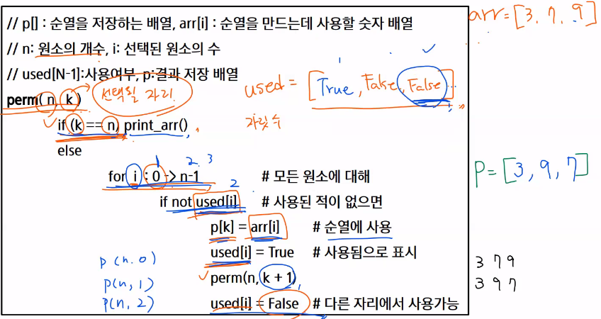

## 완전검색 & 그리디

👉 반복(Iteration)과 재귀(Recursion)

👉 완전검색기법

👉 조합적 문제

👉 탐욕 알고리즘


### 🔴 반복(Iteration)과 재귀(Recursion)

- 반복과 재귀는 유사한 작업을 수행할 수 있다.
- 반복은 수행하는 작업이 완료될 때까지 계속 반복
- 재귀는 주어진 문제의 해를 구하기 위해 동일하면서 더 작은 문제의 해를 이용하는 방법
  - 하나의 큰 문제를 해결할 수 있는(해결하기 쉬운) 더 작은 문제로 쪼개고 결과들을 결합한다.
  - 재귀 함수로 구현

> 반복 구조

- 초기화
  - 반복되는 명령문을 실행하기 전에 (한번만) 조건 검사에 사용할 변수의 초기값 설정
  - 조건검사(check control expression)
  - 반복할 명령문 실행(action)
  - 업데이트(loop update)
    - 무한 루프가 되지 않게 조건이 거짓이 되게 한다.


```python
def SelectionSort(a):
    n = len(a)
    for i in range(0,n-1):
        minI = i
        for j in range(i+1,n):
            if a[j] < a[minI]:
                minI = j
       	a[minI], a[i] = a[i],a[minI]           
```


> 재귀적 알고리즘

- 재귀적 정의는 두 부분으로 나뉜다.
- 하나 또는 그 이상의 기본 경우(basis case or rule)
  - 집합에 포함되어 있는 원소로 indiction을 생성하기 위한 시드(seed) 역할
- 하나 또는 그 이상의 유도된 경우(inductive case or rule)
  - 새로운 집합의 원소를 생성하기 위해 결합되어지는 방법


> 재귀 함수(recursive function)

- 함수 내부에서 직접 혹은 간접적으로 자기 자신을 호출하는 함수
- 일반적으로 재귀적 정의를 이용해서 재귀 함수를 구현한다
- 따라서, 기본 부분(basic part)와 유도 부분(inductive part)으로 구성된다.
- 재귀적 프로그램을 작성하는 것은 반복 구조에 비해 간결하고 이해하기 쉽다.
  - 그러나, 재귀에 대해 익숙하지 않은 개발자들은 재귀적 프로그램이 어렵다고 느낀다.
- 함수 호출은 프로그램 메모리 구조에서 스택을 사용한다. 따라서 재귀 호출은 반복적인 스택의 사용을 의미하며 메모리 및 속도에서 성능저하가 발생한다.


```python
# 선택 정렬 함수(SelectionSort)를 재귀적 알고리즘으로 작성해보시오
# 수도코드
def select_sort(lst, start):
    if start == len(lst)-1:
    	return
    else:
        min_idx = start
        # 최소값 찾기
        for i in range(start,length):
        	if lst[min_idx] > lst[i]:
            	min_idx = i
        lst[min_idx], lst[i] = lst[i], lst[min_idx]
        # 재귀를 하는데 그냥 하는게 아니라 start에 다음 자리를 넣어준다
        # 시작지점을 옮겨준다는 뜻!
        select_sort(lst,start+1)
```


## 🟡 완전 검색 기법

#### 완전 검색으로 Baby-gin 접근하기

> 완전검색

- 많은 종류의 문제들이 특정 조건을 만족하는 경우나 요소를 찾는 것이다.
- 또한, 이들은 전형적으로 순열(permutation), 조합(combination), 그리고 부분집합(subsets)과 같은 조합적 문제들(Combinatorial Problems)과 연관된다.
- 완전 검색은 조합적 문제에 대한 brute-force 방법이다.
- 고려할 수 있는 모든 경우의 수 생성하기
  - 6개의 숫자로 만들 수 있는 모든 숫자 나열(중복 포함)
  - 예) 입력으로 [2,3,5,7,7,7]을 받았을 경우, [2,3,5,7,7,7] [2,3,7,5,7,7] 같이 순열 생성한다.
- 해답 테스트하기
  - 앞의 3자리와 뒤의 3자리를 잘라, run과 triplet 여부를 테스트하고 최종적으로 baby-gin을 판단한다.


### 고지식한 방법(brute-force)

- 모든 경우의 수를 생성하고 테스트하기 때문에 수행 속도는 느리지만, 해답을 찾아내지 못할 확률이 작다.
  - 완전검색은 입력의 크기를 작게 해서 간편하고 빠르게 답을 구하는 프로그램을 작성한다.
- 이를 기반으로 그리디 기법이나 동적 계획법을 이용해서 효율적인 알고리즘을 찾을 수 있다.
- 답의 범위가 작다면 문제 풀기에 좋은 방법
  - (ex. 0<= n <= 10)처럼 주어진 경우에
- 검정등에서 주어진 문제를 풀 때, 우선 완전 검색으로 접근하여 해답을 도출한 후, 성능 개선을 위해 다른 알고리즘을 사용하고 해답을 확인하는 것이 바람직하다.


## 🟢 조합적 문제

> 순열(Permutation)

- 서로 다른 것들 중 몇 개를 뽑아서 한 줄로 나열하는 것
- 서로 다른 n개 중 r개를 택하는 순열은 아래와 같이 표현한다.


- 단순하게 순열을 생성하는 방법
  - 예) {1,2,3}을 포함하는 모든 순열을 생성하는 함수
  - 동일한 숫자가 포함되지 않았을 때, 각 자리 수 별로 loop을 이용해 아래와 같이 구현할 수 있다.
  - 복잡해서 잘 사용하지 않는 방법이다.


- 최소 변경을 통한 방법
  - 각각의 순열들은 이전의 상태에서 단지 두 개의 요소들 교환을 통해 생성
  - [1 2 3] [3 2 1] [2 3 1] [2 1 3] [3 1 2] [1 3 2]

------

- 재귀 호출을 통한 순열 방법

```python
// p [] : 데이터가 저장된 배열
// n: 원소의 개수, k: 선택된 원소의 수
perm(n,k)
	if k==n
    	print array // 원하는 작업 수행
    else
        for I : k > n-1
            p[k] <-> p[i]
            perm(n,k+1)
            p[k] <-> p[i]
```

```python
# 실제로 만들어보기!!
def perm(arr,n,k):
    if k == n:
        print(arr)
    else:
        for i in range(k,n):
            arr[k], arr[i] = arr[i],arr[k]
            perm(arr,n,k+1)
            arr[k], arr[i] = arr[i],arr[k]

arr = [2,4,6]
print(perm(arr,len(arr), 0))

# [2,4,6] [2,6,4]... 다 나온다!!
```


-----

- used 배열을 이용해 순열 만들기


-----



- 방금과 다르게 0부터 돌아준다
- perm(n,k+1)

```python
for i : 0 > n-1		# 모든 원소에 대해
    if not used[i]:
            p[k] = arr[i]	# 순열에 사용
            used[i] = True	# 사용됨으로 표시
            perm(n,k+1)	# 사용됐으므로 다음 인덱스 원소로 이동해서 봐준다
            used[i] = False # 다른 자리에서 사용 가능
```

-----


#### ✨깜짝 문제! 6자리 숫자에 대해서 완전 검색을 적용해서 Baby-gin을 검사해보시오

```python
def perm(arr,n,k):
    res = 'No babygin'
    if k == n:
        # 베이비 진을 확인
        check = 0

        # 1. 연속으로 3자리 같은 숫자인지 확인
        # print(arr)
        # 만약 0,1,2 번째 자리 원소들이 다 같은지
        if arr[0] == arr[1] and arr[1] == arr[2]:
            check += 1
        # 3,4,5 번째 자리 원소들이 다 같은지
        # elif 쓰면 안된다! 확인이 불가
        if arr[3] == arr[4] and arr[4] == arr[5]:
            check += 1

        # 2. 연속되는 숫자인지 확인
        if arr[0] + 1 == arr[1] and arr[1] + 1 == arr[2]:
            check += 1
        if arr[3] + 1 == arr[4] and arr[4] + 1 == arr[5]:
            check += 1

        # check 2라면 앞의 3자리, 뒤의 3자리 triplet 혹은 run을 만족
        if check == 2:
            return 'baby gin'
        else:
            return 'no baby gin'
    else:
        for i in range(k,n):
            arr[k], arr[i] = arr[i],arr[k]
            res = perm(arr,n,k+1)
            arr[k], arr[i] = arr[i],arr[k]

            if res == 'baby gin':
                return res
    return res

arr = [6,6,6,7,7,7]
result = perm(arr,len(arr), 0)
print(result)
```


-----


```python
def f(n,k,m):		# 순열 p[n]을 채우는 함수, k 고를 개수, m 주어진 숫자 개수
    if n==k:
        print(p)
    else:
        # used에서 사용하지 않은 숫자 검색
        for i in range(k):
            # 앞에서 사용하지 않은 숫자인 경우
            if used[i] == 0:
                used[i] = 1	# 사용함으로 표시
                p[n] = a[i]	# p[n] 결정
                f(n+1,k,m)
                used[i] = 0 # a[i]를 다른 위치에서 사용할 수 있도록 함       return

a = [1,2,3,4,5]
p = [0]*3
used = [0]*5
f(0,3,5)

# [1,2,3] [1,2,4] [1,2,5] [1,3,2] 등등 3자리 수로 이룰수 있는 모든 조합이 다 이루어진다.
```


> 부분집합

- 집합에 포함된 원소들을 선택하는 것이다.
- 다수의 중요 알고리즘들이 원소들의 그룹에서 최적의 부분 집합을 찾는 것이다.
  - 예) 배낭 짐싸기(knapsack)
- N개의 원소를 포함한 집합
  - 자기 자신과 공집합 포함한 모든 부분집합(power set)의 개수는 2^n개
  - 원소의 수가 증가하면 부분집합의 개수는 지수적으로 증가
- 단순하게 모든 부분 집합 생성하는 방법
  - 4개 원소를 포함한 집합에 대한 power set 구하기


- 바이너리 카운팅을 통한 사전적 순서(Lexicographic Order)
  - 부분집합을 생성하기 위한 가장 자연스러운 방법이다.
  - 바이너리 카운팅(Binary Counting)은 사전적 순서로 생성하기 위한 가장 간단한 방법이다.
  - 원소 수에 해당하는 N개의 비트열을 이용한다.
  - n번째 비트값이 1이면 n번째 원소가 포함되었음을 의미한다.
  - 1이라고 적힌 부분의 인덱스를 뽑아 쓰는 것이 이 방법이다! 비트와 친해졌읍니다


순서대로가 아니라 arr에 든 원소 반대로 접근한다고 생각하면 된다! 이진수 숫자로 표현한 1의 인덱스에 맞춰 대입하기


```python
# 바이너리 카운팅을 통한 부분집합 생성코드 예

arr = [3,6,7,2]
n = len(arr)

# 1 1 1 1 1 1 이렇게 해서 위와 같은 과정으로 원소를 뽑아낸다
for i in range(0,(1<<n)):	# 1<<n : 부분집합의 개수 / 여기서는 2^4 = 16
    for j in range(0,n): 	# 원소의 수만큼 비트를 비교함. 몇 번째 비트가 1인지 확인
        if i & (1<<j):		# i의 j번째 비트가 1이면 j번째 원소 출력
            print('%d'%arr[j], end='')
    print()
    
# ex) i가 13인 경우 1 1 0 1 로 봐서 1의 인덱스에 해당하는 원소 뽑기.
# if 1101 & 1<<j = 3,7,2
```


> 조합

- 서로 다른 n개의 원소 중 r개를 순서 없이 골라낸 것을 조합(combination)이라고 부른다.
- 조합의 수식


- 재귀 호출을 이용한 조합 생성 알고리즘

```python
an[] : n개의 원소를 가지고 있는 배열
tr[] : r개의 크기의 배열, 조합이 임시 저장될 배열
    
comb(n,r)
	if (r==0) print_arr()
    else if (n<r) return
	else
    	tr[r-1] = an[n-1]
        comb(n-1,r-1)
        comb(n-1,r)
```

```python
# n개에서 r개를 고르는 조합. s 고를 수 있는 구간의 시작 인덱스
def nCr(n,r,s):
    if r == 0:
        print(comb)
    else:
        for i in range(s, n-r+k+1): # n-r+k 선택할 수 있는 구간의 끝
            comb[3-r] = a[i]
            nCr(n, r-1, i+1)
            
n = 5
r = 3
comb = [0]*3
a = [i for i in range(1,n+1)]
nCr(n,r,0)

# [1,2,3] [1,2,4] [1,2,5] [1,3,4] .......
```

```python
# arr내의 모든 부분집합의 합이 0이 되는 경우만 출력

arr = [-1,3,-9,6,7,-6,1,5,4,-2]
n = len(arr)
cnt = 0

for i in range(0,(1<<n)):   # 부분집합의 개수만큼
    my_sum = []
    for j in range(0,n):    # 원소의 수만큼 비트를 비교함
        if i & (1<<j):      # i의 j번째 비트가 1이면 j번째 원소 출력
            my_sum.append(arr[j])
            # print('%d'%arr[j], end='')

    if sum(my_sum) == 0:
        cnt += 1
        print(f'{cnt} :',*my_sum)
```


### 🔵 탐욕 알고리즘

- 탐욕 알고리즘은 최적해를 구하는 데 사용되는 근시안적인 방법
- 일반적으로, 머리속에 떠오르는 생각을 검증 없이 바로 구현하면 Greedy 접근이 된다.
- 여러 경우 중 하나를 선택할 때마다 그 순간에 최적이라고 생각되는 것을 선택해 나가는 방식으로 진행하여 최종적인 해답에 도달한다.
- 각 선택 시점에서 이루어지는 결정은 지역적으로는 최적이지만, 그 선택들을 계속 수집하여 최종적인 해답을 만들었다고 하여, 그것이 최적이라는 보장은 없다.
- 일단, 한번 선택된 것은 번복하지 않는다. 이런 특성 때문에 대부분의 탐욕 알고리즘들은 단순하며, 또한 제한적인 문제들에 적용된다.
- 최적화 문제(optimization)란 가능한 해들 중에서 가장 좋은(최대 또는 최소) 해를 찾는 문제이다.

1. 해 선택 : 현재 상태에서 부분 문제의 최적 해를 구한 뒤, 이를 