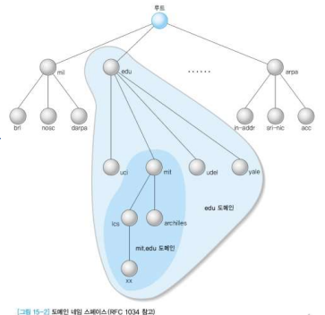
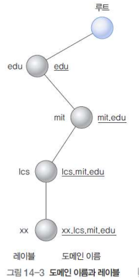
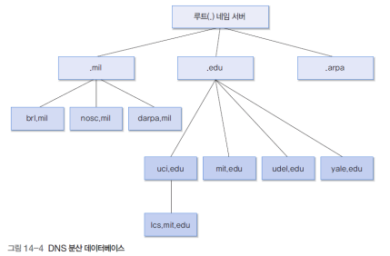
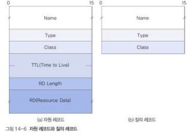
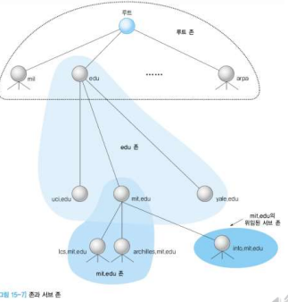
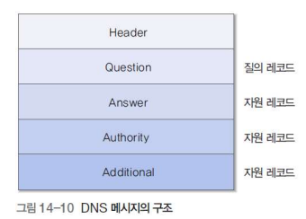
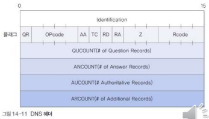
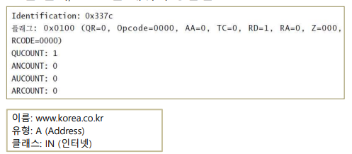
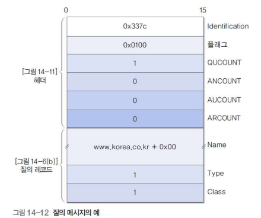
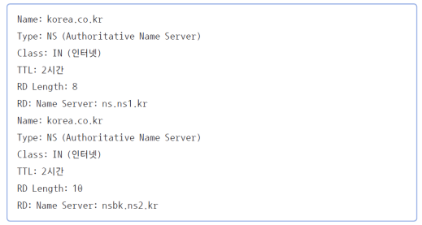

### 14-1 DNS

#### IP 주소

- ✅ **인터넷상에 있는 컴퓨터의 고유한 주소**

- 32 비트 크기
- 사용자 편의를 위해 8비트 크기의 10진수 4개로 표현
  - www.xxx.yyy.zzz
  - ex) 211.223.201.30

- 주소 클래스
  - 클래스 구분
    - 클래스 A : 2^24개의 호스트 수용
    - 클래스 B : 2^16개의 호스트 수용
    - 클래스 C : 2^8개의 호스트 수용
    - 클래스 D : 멀티캐스팅 지원

#### DNS

- Domain Name System

  - `service`가 아니라 `system`이다!!!!
  - ✅사람이 읽을 수 있는 도메인 이름(예: www.amazon.com)을 머신이 읽을 수 있는 IP 주소(예: 192.0.2.44)로 변환

- 도메인 이름

  - 문자형으로 표기되는 호스트 이름(일반 사용자가 선호)

- IP 주소

  - IP 프로토콜에서 호스트 구분을 위하여 반드시 필요

- 도메인 이름을 IP 주소로 변환하는 서비스가 반드시 필요

- DNS 도입 전

  - 인터넷 초기에 수작업으로 관리

  - /etc/hosts 파일

    - 파일의 내용은 (도메인 이름, IP 주소)의 쌍으로 구성

      

  - 주기적으로 ftp 서비스를 이용하여 수정된 파일 다운로드

- 컴퓨터 보급에 따른 기존 방법의 한계
  - 한 시스템에서 모든 호스트의 이름과 주소를 관리하는 것이 불가능
  - 도메인 이름 중복 문제
- 해결 방안
  - 위임과 계층적 도메인 이름
    - ROOT에서 하부로 위임(com, edu, kr 등)
    - TLD(Top Level Domain)에서 하위로 계속 위임(co.kr, ac.kr 등)
    - 위임 받은 기관에서 자신의 도메인에 속한 호스트 이름, IP 주소 관리(korea.co.kr에서 info1 관리)
  - 분산 데이터베이스
    - 각 기관에서 관리하고 있는 분산 데이터베이스를 연계하여 서비스 제공

- 해석기(Resolver)
  - IP 주소를 얻고자 하는 응용 프로그램이 호출
  - 응용 프로그램은 해석기에게 도메인 이름을 매개변수로 제공
  - 해석기는 DNS 프로토콜을 이용하여 DNS 서버에 변환을 요청
- nslookup(dig) 명령어
  - DNS 서버 : server.korea.co.kr
  - information.korea.co.kr의 IP 주소

- DNS 구성 요소
  - **도메인 네임 스페이스(domain name space)**
    - 트리 구조의 네임 스페이스를 비롯해 데이터에 대한 `이름 관련 규칙`을 정의
    - 트리에 연결된 호스트는 자원 레코드(Resource Records)로 표현
    - DNS 서비스는 자원 레코드는 특정 유형 정보를 얻는 과정
  - **네임 서버(name server)**
    - 도메인 트리 구조와 트리에 보관된 자원 레코드를 관리하는 프로그램
    - 여러 네임 서버가 구역을 분할해 전체 도메인을 관리함
    - 분할한 구역을 담당하는 주(primary) 네임서버와 백업 용도의 부(secondary) 네임서버가 있음
    - 캐시에 다른 서버로부터 얻어온 정보 임시 보관
  - **해석기(resolver)**
    - 클라이언트의 요청을 받아 네임 서버로부터 정보를 얻어냄
    - 하나의 이상의 네임 서버와 접촉 가능
    - 캐시에 얻어온 정보 임시 보관

---

### 14-2 도메인 네임 스페이스

- DNS가 저장, 관리하는 `계층적 데이터베이스`
- 최상위에 루트가 존재하고, 그 아래로 모든 호스트가 트리 구조로 이어짐
- 레이블
  - 이름(최대 63 바이트)
- 도메인 이름
  - 점(.)으로 구분한 레이블의 연속
- 루트
  - 크기가 0인 Null 레이블을 가짐
- 공식 표기(fully qualified domain name)할 때 마지막에 점(.)을 붙여야 함
  - www.korea.co.kr.
  - .이 없는 경우 호스트의 default domain이 기본적으로 붙게 됨
    - www.korea.co.kr로 표기하는 경우 www.korea.co.kr.korea.co.kr로 해석

- 도메인

  

  - 계층적 구조
  - 같은 레벨에서는 레이블이 유일해야 함
  - 도메인 이름
    - 최하위 레이블을 왼쪽에 위치하고 상위로 이동하면서 레이블을 표기
    - ex) xx.lcs.mit.edu
  - TLD(최상위 도메인)
    - Top Level Domain
    - 루트 바로 밑에 위치한 레이블
    - ex) mil, edu, arpa
  - 도메인
    - edu 도메인, mit.edu 도메인

- 최상위 도메인
  - RFC 1591의 TLD
    - .com : 상업적인 용도
    - .edu : 교육기관 용도
    - .net : 네트워크 서비스 제공자와 관련된 시스템
    - .org : 다양한 종류의 기관
    - .int : 국제적인 목적으로 정의
    - .gov : 미국 연방 정부와 관련된 기관
    - .mil : 미국 국방성 관련 기관
  - 추가 : arts, firm, info, nom, store 등등
  - 국가 코드의 활용 : .tv, .cc

- 도메인 이름
  - 하위 레이블부터 시작
  - 레이블 이름을 점(.)으로 연결

- 데이터베이스 서비스

  - 인터넷 도메인 네임 스페이스를 `계층구조`로 분할

  - 하나의 개념적인 저장장소를 갖지만, 실제로는 각 하부 도메인을 관리하는 호스트에 이름, 주소 관리 권한 위임

    

  - 권한을 위임 받은 도메인 관리 서버는 자신의 도메인에 포함된 모든 레이블(호스트 또는 하부 도메인)에 관한 정보를 적절하게 유지해야 함

  - 다른 도메인에 속한 호스트의 정보는 해당 도메인을 관리하는 네임 서버로부터 얻어냄

  - 존(zone)

    - 임의의 네임 서버가 관리하는 영역

    - 도메인과 유사하지만 다름

      

#### 자원 레코드

- 자원 레코드
  - 이름과 주소 정보 등을 저장하기 위한 레코드
  - 트리에 연결된 각 호스트의 정보는 자원 레코드와 관계됨
  - DNS 네임 서버가 해석기에 반환하는 데이터가 자원 레코드 정보
- 질의 레코드
  - DNS 클라이언트가 DNS 서버에 정보를 요청하는 용도

- 각 필드의 의미
  - Name : 찾고자 하는 가변 길이의 도메인 이름
  - Type : 자원의 종류
  - Class : 프로토콜 패밀리(인터넷 : IN)
  - TTL : 캐쉬 정보의 유효 기간
  - RD Length : RD의 크기
  - RD(Resource Data) : 자원 데이터

- Type
  - A(Address) : 호스트의 IP 주소(도메인 이름과 IP 주소 변환)
  - NS(Name Server) : 도메인을 관장하는 인증된 네임 서버
  - CNAME(Canonical Name) : 호스트의 별명
  - SOA(Start of Authority) : 존의 시작을 표시
  - WKS(Well-Known Services) : 호스트가 제공하는 네트워크 서비스
  - PTR(Pointer) : IP 주소를 도메인 이름으로 변환
  - HINFO(Host Information) : 호스트 정보
  - MX(Mail eXchange) : 메일 교환(특정 메일 주소로 전송된 메일을 다른 주소로 재전송)
  - 기타 : SIG(Security Signature), NXT(Next Domain), AAAA(IPv6 주소), TXT(text) 등

----

### 14-3 네임 서버와 해석기

#### 변환 과정

- 응용 프로그램이 해석기라고 부르는 DNS 클라이언트에게 정보 제공 요청
- 해석기(resolver)
  - 해석기가 DNS 메시지 형식의 질의를 생성
  - 이 질의를 네임 서버에게 전달
  - 네임 서버는 회신용 DNS 메시지에 결과를 담아 해석기에 회신
- 네임 서버의 부담을 줄이기 위하여 캐시 정보 활용
  - 인증(authoritative) 데이터
    - 해당 데이터를 직접 관리할 책임이 있는 네임 서버로부터 받은 정보
  - 캐시 데이터
    - 이전 요청에 의하여 호스트가 보관하던 정보
  - TTL(Time To Live)동안 유효하며, 이 시간을 넘어가면 캐시 정보 삭제

- 존(zone)
  - 존은 자원 레코드에 포함된 인증 데이터의 집합체로 정의됨
  - 관리하는 정보
    - 존에 속하는 모든 호스트의 전체 자원 레코드 집합체
    - 존에 포함된 최상위 호스트
    - 위임 서브 존
      - 자신의 존에 속하지만 인증이 위임된 경우
    - 위임된 서버 존에 관한 글루(glue) 데이터
      - 서브 존의 네임 서버에 접근할 수 있도록 해줌
  - test.info.mit.edu의 호스트 정보를 얻고자 하는 경우
    - info.mit.edu를 관리하는 네임 서버의 IP 주소를 알면 간단히 처리
    - info.mit.edu의 네임 서버가 서브 존 도메인 내부에 위치하여 IP 주소를 얻기 곤란한 경우 글루 데이터가 필요

#### 요청의 처리

- 호스트 A가 호스트 B의 정보를 원할 때, 호스트 A,B가 
  - 같은 도메인에 위치하면 이 도메인의 네임 서버가 인증 데이터를 회신
  - 다른 도메인에 위치하면 인근 네임 서버에게 요청 호스트(A)를 중개해 줌
- 인근 네임 서버를 찾는 작업은 인증 정보를 찾을 때까지 반복됨
- 질의 요청이 처리되는 과정
  - 인증 데이터가 반드시 필요한지 명시, 혹은 캐시
  - 해석기는 질의 요청을 재귀적으로 처리해야 하는지 명시, 혹은 비재귀적(반복적)

- 재귀적 요청
  - 해석기가 최초로 접속을 시도한 네임 서버가 질의 요청을 추적, 관리
  - 재귀적 요청을 받은 네임 서버가 결과적으로 해석기 역할을 수행
- 비재귀적(반복적)
  - 요청을 받은 네임 서버가 다른 네임 서버의 포인터 정보를 회신
  - 이를 받은 해석기는 다른 네임서버에게 다시 질의

----

### 14-4 DNS 프로토콜

#### DNS 메시지

- 메시지 구성
  - Header
    - 12바이트
    - 헤더 값에 따라 메시지 각 필드의 사용 결정
  - Question
    - 질의 메시지, 응답 메시지에서 모두 사용
    - 질의 레코드
  - Answer, Authority, Additional
    - 자원 레코드 사용

- DNS 헤더
  - Identification
    - 요청과 응답의 연관 관계 확인 용도
  - QR(Query Response)
    - 질의 메시지(0)
    - 응답 메시지(1)
  - OPCODE
    - 질의나 응답의 종류
    - 표준(0), 반대(1), 서버 상태 요청(2)
  - AA(Authoritative Answer)
    - 인증 권한이 있는 네임 서버 여부(응답 전용)
  - TC(Truncated)
    - UDP 최대 크기 초과 여부
    - 1로 설정되면 초과된 것이므로 TCP로 재요청 필요
  - RD(Recursive Desired)
    - 재귀적 응답 요청(질의 전용)
  - RA(Recursion Available)
    - 재귀 응답 가능 여부(응답 전용)
  - RCODE
    - 0이면 정상, 그 외 응답 오류
  - QCOUNT, ANCOUNT, AUCOUNT, ARCOUNT
    - 각 자원 레코드 갯수

#### UDP 패킷 크기로 인한 제약

- 해석기와 네임 서버는 기본적으로 UDP 53번 포트로 DNS 메시지 전송
- UDP 프로토콜의 최대 전송 크기
  - 512 바이트
- TCP 53번 포트를 사용하는 경우
  - 미리 512 바이트보다 크다는 것을 인지하는 경우에는 처음부터 TCP 사용
  - 사전에 인지하지 못하는 경우는 TC=1로 지정되므로, TCP 연결을 사용하여 재질의
- IPv4의 경우 UDP 사용이 일반적이나, 주소 크기가 늘어나고 기본적으로 복수 개의 주소를 가질 수 있는 IPv6, 보안이 강화된 DNSSEC의 경우 UDP 크기 제한을 넘어갈 수 있음

#### DNS 프로토콜의 동작 과정

- 질의 메시지

  - www.korea.co.kr. 호스트의 IP 주소를 원하는 경우

    - Header의 Identification : 메시지 식별자, UDP의 비순서적 전송 방식을 보완하려고 사용

    - 플래그 값은 0x0100이므로 QR=0은 질의 메시지, OPcode=0은 표준 질의, RD=1은 재귀적 응답임

      

- 응답 메시지

  - DNS 헤더

    

  - QUESTION : 질의와 동일

  - ANSWER : 2개

    

  - Authority 자원 레코드 내용

    

