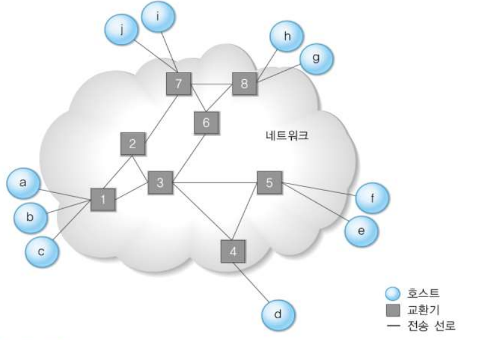
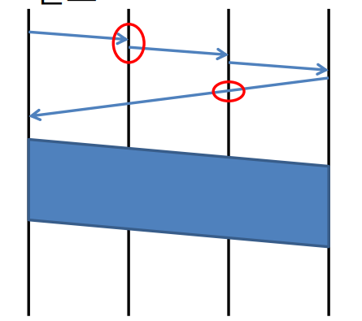
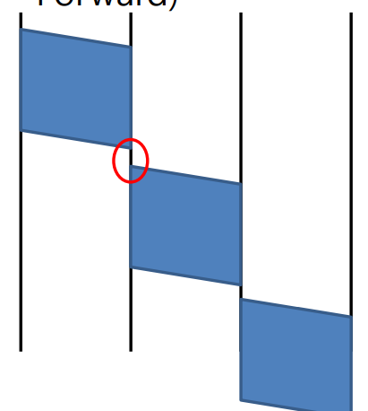
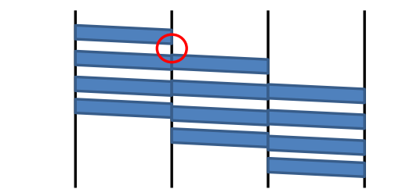
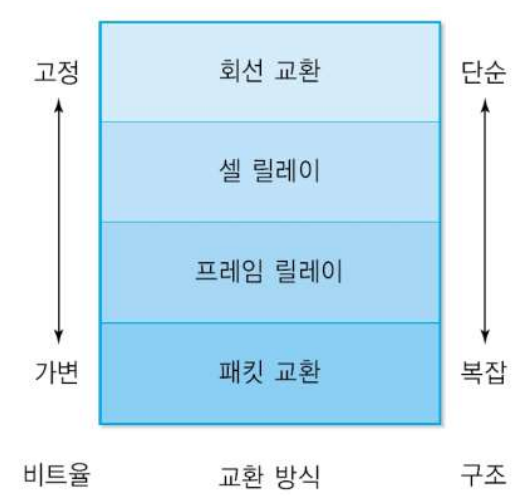
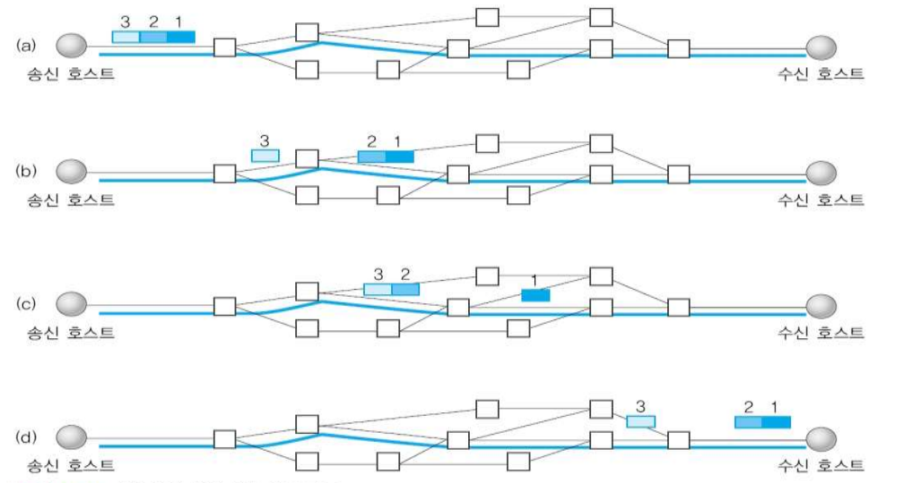
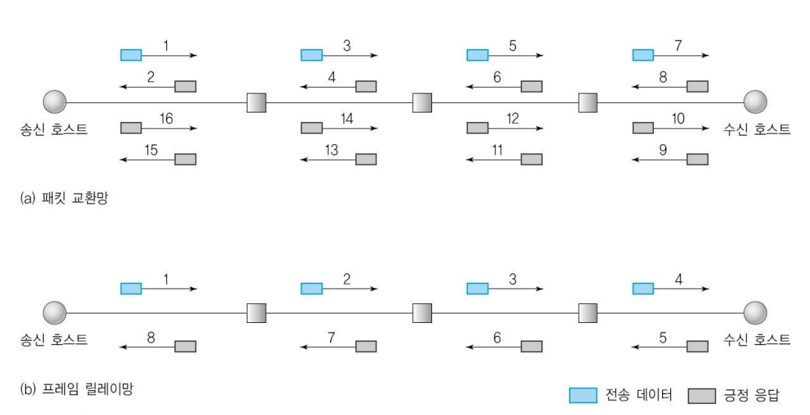

#### 교환 시스템의 종류

- 교환방식을 이용한 네트워크 구성

- `1. 회선 교환(Circuit Switching)`
  - 연결 설정 및 해제 과정 필요
  - 왼쪽 원은 어느 노드로 가야할지 경로를 고민하는 시간이 필요했지만 아래 원은 지나왔던 경로를 그대로 돌아가기만 하면 되기 때문에 일직선으로 그어져 있다

- `2. 메시지 교환(Message Switching)`
  - 저장 및 전달(Store and Forward)
  - 연결 설정 과정 필요 없음
  - 모든 메시지를 한 번에 보내 저장하고 다시 어디로 보낼지 고민하고 다시 그 메시지를 전달하는 방식

- `3. 패킷 교환(Packet Switching)`

  - 패킷이라는 일정한 크기로 교환

  - 종류

    - 1) 가상회선(Virtual Circuit)
  - 
      - 연결 설정 및 해제 과정 필요
    - 회선교환 방식을 흉내낸 듯한 모습
      - 연결 설정과 해제 당시 시간 간격이 있지만 데이터가 전해질땐 비교적 시간 간격이 적은 모습이다.
  
    - 2) 데이터그램(Datagram)
    - 
      - 패킷 단위로 교환
    - 메시지 교환을 흉내낸 듯한 모습
      - 연결 설정 과정이 필요 없음
    - 패킷이 들어올 때마다 매번 고민해야 하고, 어디로 보낼지 고민하는 동안 새로운 패킷이 올 수 있다.
      - 패킷이 이전의 패킷과 다른 길을 택해서 갈 수도 있음
  
  - 장점

    - 전송 대역의 효율적인 사용
    - 전송대역의 공유
    - 호스트의 무제한 수용
      - 고정대역이 아니므로 이론적으로 무한 수용 가능
      - 통계적 방법
    - 패킷에 우선순위 부여 가능
  
  - 단점

    - 전송지연이 큼
    - 내부 버퍼 보관, 기타 큐 관리, 연산 과정
    - 패킷 별로 전송지연이 가변적으로 발생
      - 지터(jitter) : 가변 전송지연의 분포
      - 전송지연에 민감한 응용 - 실시간 멀티미디어 전송

#### 교환(Switching)

- 교환방식 개요

  - `회선 교환(Circuit Switching)`

    - 하드웨어적인 교환
    - 고정 대역 할당
    - 안정적인 전송률

  - `패킷 교환(Packet Switching)`

    - 패킷 단위로 나누어 전송하는 경우 패킷을 기준으로 교환

    - 가변 크기의 전송률

    - 종류

      - 가상회선(Virtual Circuit)

        

      - 데이터그램(Datagram)

        

#### 프레임 릴레이(Frame Relay)

- 등장배경
  - 이전의 통신 환경에 비해 물리적 전송 오류의 가능성이 줄어듦
  - 전송계층 프로토콜의 과도한 오류 제어 기능은 낭비적 요소로 작용
  - 오류 제어 기능을 축소하여 전송 속도를 향상(끝단에서 오류 제어를 함)

#### ATM(Asynchronous Transfer Mode)

- 광역망과 근거리망 양쪽 다 적합함
- 멀티미디어 통신의 다양한 서비스품질(QoS)를 제공할 수 있음

- 셀 교환
  - 고정된 크기의 패킷 사용
  - 회선 교환과 패킷 교환의 중간 성격