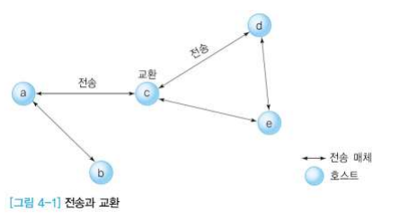
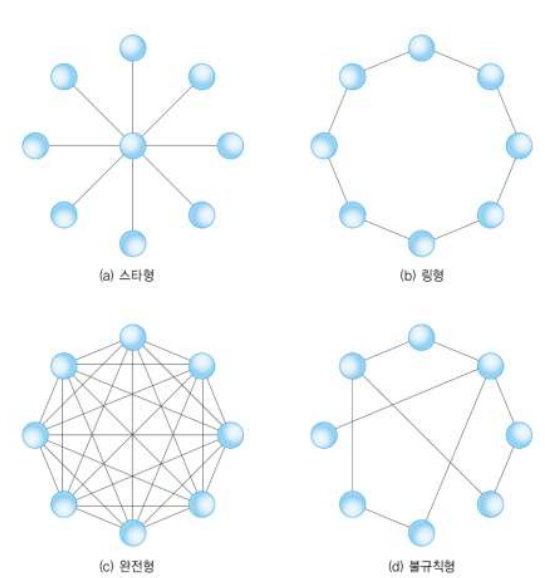
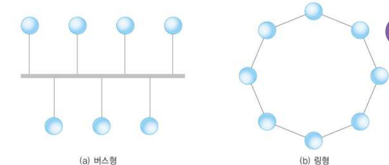
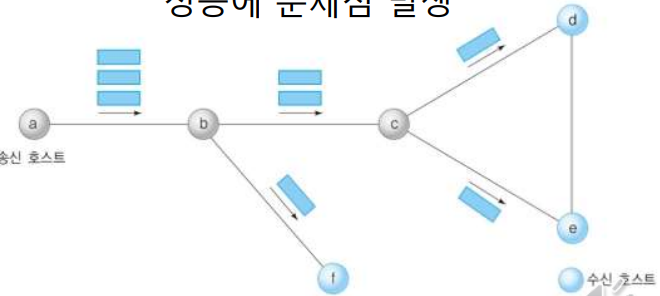
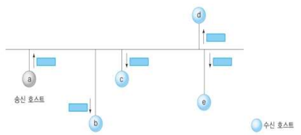
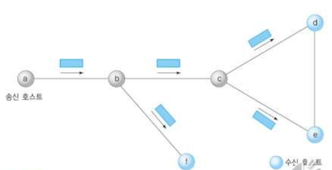

### 데이터 전송 방식

#### 네트워크 효과

- 자원 공유
  - 컴퓨터 하드웨어 외에 물리적, 논리적 정보 공유
- 병렬 처리에 의한 성능 향상
  - 네트워크 속도 제한에 의한 한계
  - 네트워크 성능 개선으로 병렬 처리 가능
- 중복 저장으로 인한 신뢰성 향상
  - 일관성 문제
  - 데이터 갱신 비용

#### 전송과 교환

- 전달 (Transfer)
  -  교환 (Switching) + 전송 (Transmission)
  - a에서 d로 갈 때
    - a - c 전송
    - c에서 교환
    - c - d 전송
- 교환
  - 둘 이상의 경로 중에 어느 방향으로 전달할지 선택
- 전송
  - 물리적으로 1:1 연결된 시스템 사이의 데이터 전송

#### 전송 방식의 종류

- 지리적 분포

  - LAN
  - MAN
  - WAN

  

**📌 점대점(Point-to-point) 방식**

- 호스트들이 물리적으로 1:1 형식으로 연결

- 교환호스트가 송수신 호스트 중간에 위치
  - 직접 연결하거나 중계기능을 통해 전달
  - 연결개수가 많아지면 성능면에서 우수하나 매체 길이가 증가하여 비용 증가
  - 연결 개수가 적어지면 네트워크 혼잡도 증가
    
  - `스타(Star)형`
    - 중앙에 있는 하나의 중개 호스트(허브 : hub) 주위로 여러 호스트를 1:1로 연결
    - 중앙 호스트의 성능과 신뢰성이 중요
      - error나 loss가 적다라는 뜻
    - 트리(tree)형
  - `링형`
    - 호스트의 연결이 순환 구조를 이룸
    - 모든 호스트가 전송과 교환 기능을 수행
    - 시계방향 또는 반시계방향 선택 가능
    - 현실적으로 한 방향으로만 전송
    - 토큰
      - 데이터를 전송할 수 있는 권리
      - 데이터 전송을 원하는 호스트는 미리 토큰을 확보해야 함
      - 데이터 전송이 완료되면 호스트는 토큰을 반납해야 함
      - 데이터를 전송하는 호스트가 없으면 오직 하나의 토큰이 링을 순환함
    - 데이터 전송 원리
      - 먼저, 토큰을 링에서 회수하여 확보한 후,
      - 데이터를 링에 전송함
      - 데이터는 링을 한 바퀴 순환한 후, 다시 송신 호스트에게 돌아옴
      - 이 과정에서 링에 연결된 모든 호스트가 데이터를 수신함
      - 단, 자신을 목적지로 하는 호스트만 데이터를 보관하고, 다른 호스트는 버림
      - 마지막으로, 송신 호스트는 데이터를 회수한 후에 토큰을 링에 돌려줌
  - `완전형`
    - 네트워크에 존재하는 모든 호스트를 1:1로 연결
    - 교환 기능이 불필요
    - 극단적으로 비효율적인 방식
      - 비용이 많이 든다!
  - `불규칙형`
    - 트레픽이 많은 지역은 연결의 수가 많지만,
    - 트레픽이 적은 지역은 연결의 수가 적음

**📌 브로드캐스팅(Broadcasting)**

- 호스트들이 공유 전송 매체에 연결

- 네트워크에 연결된 모든 호스트에게 데이터를 전달하는 방식

- 주로 LAN 환경에서 사용

- 버스형과 링형이 존재

  

    - `버스형`
      - 공유 버스에 모든 호스트를 연결
      - 둘 이상의 호스트가 데이터를 전송하면 충돌 발생
      - 충돌 문제의 해결 방법
        - 사전 예방 : 전송 시간대를 다르게 하는 방법과 토큰 제어 방식이 가능
        - 사후 해결 : 충돌을 감지하는 기능이 필요 ( ex. 이더넷)
    - `링형`
      - 호스트를 순환 구조로 연결
      - 송신 호스트가 전송한 데이터는 링을 한 바퀴 순환한 후 송신 호스트에 되돌아옴
      - 중간의 호스트 중에서 수신 호스트로 지정된 호스트만 데이터를 내부에 저장
        - 데이터를 전송하기 위해서는 토큰 확보가 필수

    

#### 멀티포인트 통신

- 하나의 송신 호스트를 기준으로
  - 유니포인트 : 하나의 수신 호스트와 연결
  - 멀티포인트 : 다수의 수신 호스트와 연결
- 송신 호스트가 한 번의 전송으로
  - 유니캐스팅 : 하나의 수신 호스트에 데이터를 전송
  - 멀티캐스팅 : 다수의 수신 호스트에 데이터를 전송
- 멀티포인트 유니캐스팅
  - 유니캐스팅 방식을 이용하여 일대다 통신을 지원
  - 호스트 a가 호스트 d,e,f에게 데이터를 전송하려면 3번의 송신 절차가 필요
  - 수신 호스트의 수가 증가하면 성능에 문제점 발생

- 브로드캐스팅

  

  - 네트워크에 연결된 모든 호스트에게 데이터 전송
  - 자신을 목적지로 하는 호스트만 데이터를 내부에 저장하고, 다른 호스트는 데이터를 무시함

- 멀티캐스팅

  

  - 1:다 전송 기능을 지원
  - 송신 호스트는 한 번의 데이터 전송으로 여러 호스트에게 데이터를 전송할 수 있음
  - ex) 송신 호스트 a, 수신 호스트 d,e,f

