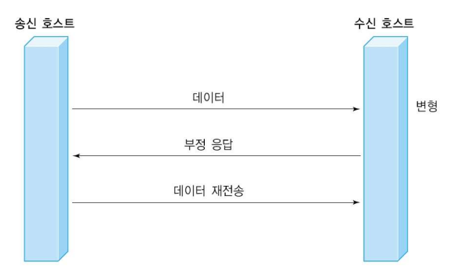
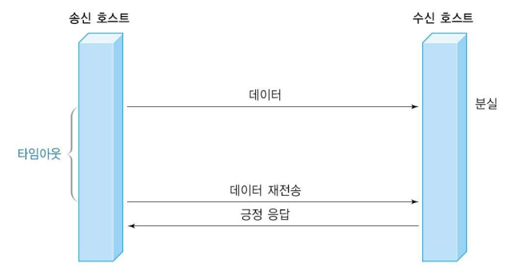
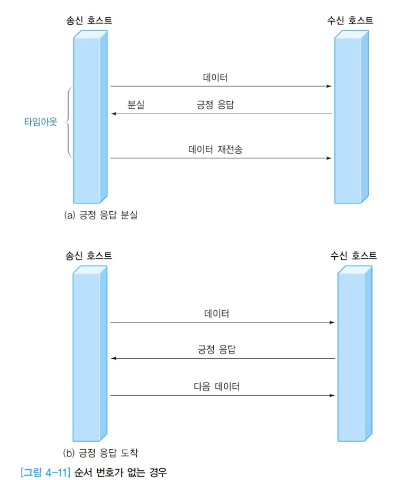

### 2. 오류 제어

#### 오류 복구를 위한 기본 기능

- 수신 호스트의 **응답** 프레임
  - 긍정 응답(ACK : Ackowledge)
  - 부정 응답(NAK : Negative Acknowledge)

- 송신 호스트의 **타이머** 기능
  - 프레임 분실 오류 시 수신 호스트의 인지 불가능
  - 일정 시간 내 긍정 응답이 없으면, 송신단에서 타임아웃(timeout) 기능을 동작시켜 재전송
  
  
  
- **순서번호 (sequence number)**
  
  - 긍정 응답이 분실되는 경우 재전송으로 인한 중복 수신 가능
  
  - 이를 구별하기 위해 순서번호 기록
  
    

#### 흐름제어

- 전송 데이터의 **속도 조절**
- 송신 호스트는 수신 호스트가 감당할 수 있을 정도의 전송속도를 유지하면서 전송해야
- 흐름제어가 없는 경우 데이터의 손실, 재전송으로 이어짐
- 기본 원리
  - 다음에 수신할 프레임의 전송 시점을 송신 호스트에게 통지하는 방식
- 대표적인 방식
  - 슬라이딩 윈도우(sliding window)

----

### 3. 프레임

#### 데이터 링크 계층 기능

프레임 구성/ 물리적인 주소 지정/ 흐름 제어/ 오류 제어/ 접근 제어(순서결정)

- 프레임 (frame) 단위로 나누어 처리
  - 전송 데이터
  - 오류 확인을 위한 체크썸(checksum)
  - 송수신호스트 주소
  - 기타 프로토콜에서 사용되는 제어코드 같은 정보 포함
- 프레임 구분
  - 내부 정보를 표현하는 방식에 따라
    - 문자 프레임
    - 비트 프레임

#### ASCII(American Standard Code for Information Interchange)

- 7 비트 표현 방식
  - 2^7 즉 128개의 문자 조합(코드 값 0 ~ 127)
- 8 번째 비트는 오류 검출용 패리티
- 1968년 미국 ANSI X3.4로 표준화
- 구성
  - Graphic/Printable Character
  - Non-graphic/Non-printable Character or Control Character
    - 통신 제어 또는 전송 제어
    - 서식 제어
    - 특수 제어(프린터, 전송속도 매칭 등)
    - 정보 분리(파일 분리, 레코드 분리 등)

#### 문자 프레임

- 프레임의 내용이 문자로만 구성됨
- 프레임의 시작과 끝에 특수 문자 사용
  - 시작 : DLE / STX
  - 끝 : DLE / ETX
- 전송 데이터에 특수 문자가 포함되면 혼선이 발생
  - 문자 스터핑(stuffing)
    - 데이터에 DLE가 있으면 강제로 DLE 하나 더 추가
    - 수신측에서는 두 개의 DLE가 나오면 뒤에 있는 DLE 제거

#### 비트 프레임

- 임의의 비트 패턴 전송 가능
- 프레임의 시작과 끝을 나타내는 플래그(flag) 사용
- 전송 데이터에 플래그와 같은 패턴이 등장할 수 있음
  - 비트 스터핑
    - 1이 연속해서 5개 발생하면 강제로 0 추가

----

### 4. 다항 코드

#### 오류 극복 방법

- 오류 검출 코드를 넣어 수신호스트가 오류 검출 후 재전송으로 복구
  - CRC(Cyclic Redundancy Check)
- 오류 복구 코드를 넣어 수신 호스트가 오류 검출과 복구를 동시에 수행
  - 해밍코드(Hamming code)
  - 순방향 오류복구(FEC: Forward Error Control)

#### 해밍 코드(Hamming code)

- 이진 블록 오류 정정 부호의 일종
- 1950년 Bell 연구소의 Richard Hamming에 의해 고안
- 최대 2비트의 오류를 감지하거나, 1비트 오류 수정 가능

#### 오류 검출

- BEC(Backward Error Control) 또는
- ARQ(Automic Repeat reQuest)
  - 일반적으로 사용
- 패리티(parity)
  - 짝수 패리티
  - 홀수 패리티
- 블록 검사(Block sum check)