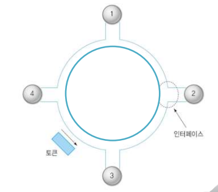
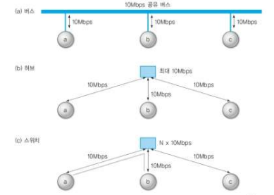
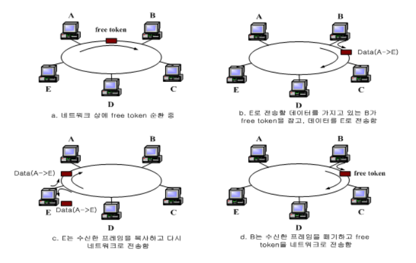
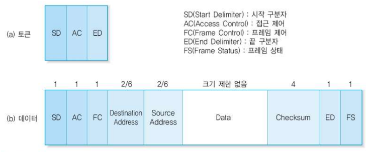
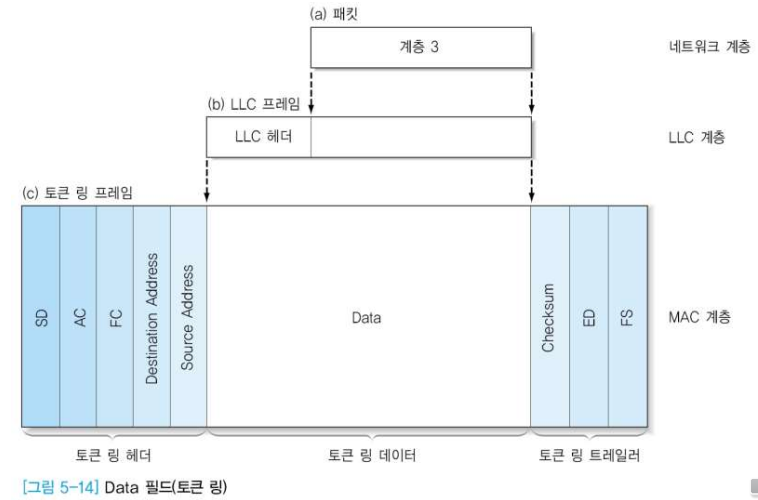

### MAC 계층

#### LLC 계층과 MAC 계층

- OSI 7 계층의 2단계 계층의 부계층

  

- LAN 환경에서 데이터링크 계층을 LLC 계층과 MAC 계층으로 나누어 처리
- **LLC(Logical Link Control)**
  
  - 데이터링크 계층의 기본 기능
  - WAN의 데이터링크 계층과 거의 유사
  - LAN 특성에 따라 부분적인 차이가 있을 수 있음
- **MAC(Medium Access Control)**
  
  - 물리적 선로의 특징과 매체 간의 연결방식에 따른 제어
  - 이더넷, 토큰 링, 토큰 버스

### 5.1 IEEE 802 시리즈

- IEEEE에서 LAN 표준안 연구결과를 802 시리즈로 발표
  - 802.1
    - 관련 표준안 전체 소개
    - 인터페이스 프리미티브 정의
  - 802.2
    - LLC 프로토콜 정의
  - 802.3 ~
    - 물리계층과 MAC 계층

#### MAC 소개

- 다중 접근 채널(Multiple Access Channel) 방식을 이용하여 공유매체에 프레임을 전송하는 방식에서는 충돌 발생 가능성 존재
  - 해결 방안
    - 충돌 허용 후 후속 조치
      - 이더넷
        - CSMA / CD (Carrier Sense Multiple Access / Collision Detection)
        - 충돌 감지 후 재전송
        - 매체 길이가 길어질수록 프레임 전송 지연 증가, 충돌 발생 가능성 증가
    - 충돌을 원천적으로 차단
      - 타임 슬롯(time slot) 배정
      - 토큰을 가지고 있는 경우에만 송신

- 토큰 버스

  

  - 물리적으로는 버스 구조이나 논리적으로는 링 구조
  - 토큰(token)이라고 부르는 제어 프레임 사용
- 토큰 링

  

  - 순환 구조의 전송매체
  - 대기 모드와 전송 모드로 동작

### 5.2 이더넷(IEEE 802.3)

- 1-persistent CSMA/CD 방식의 LAN 환경을 규정
  - 1-persistent CSMA
    - 프레임을 전송하기 전에 채널(공유 버스) 사용 여부를 확인 - Carrier Sense
    - 채널이 사용 중이면 유휴 상태가 될 때까지 대기
    - 이후, 채널이 유휴 상태가 되면 확률 1의 조건으로 프레임을 전송
    - 둘 이상의 호스트에서 동시에 유휴 상태로 판단하면 충돌 발생 - Multiple Access
    - 충돌이 발생하면 임의의 시간 동안 대기한 후 처음부터 다시 시작
  - CD(Collision Detection)
    - 둘 이상의 호스트에서 채널이 유휴 상태라고 판단할 수 있음
    - 이런 경우 프레임 전송 과정에서 충돌이 발생
    - 따라서 충돌 감지 기능이 필수적으로 요구됨
    - 충돌이 감지되면 진행중인 프레임의 전송을 중지

#### 다른 CSMA 방식

- Non-persistent CSMA
  - 프레임을 전송하기 전에 채널 사용 여부를 확인
  - 채널이 사용 중이면 더 이상 유휴 상태를 확인하지 않음
  - 대신 임의의 시간 동간 대기 후 다시 채널 감지를 시작
  - 1-persistent 방식보다 충돌 확률을 줄일 수 있음
- P-persistent CSMA
  - 슬롯 채널 방식에서 주로 사용
  - 프레임을 전송하기 전에 채널 사용 여부를 확인
  - 채널이 사용 중이면 다음 슬롯까지 대기 후 다시 채널 감지를 시작
  - 채널이 유휴 상태면 p의 확률로 프레임을 전송

#### 프레임

- MAC 프레임 = MAC 헤더(header) + LLC 프레임 + MAC 트레일러(trailer)
  - LLC 프레임 : LLC 계층이 MAC 계층에게 전송하도록 요청한 데이터
- 이더넷 프레임 구조
  - MAC 헤더 : 
    - Preamble
      - 수신 호스트가 송신 호스트의 클록 동기를 맞추는 용도
    - Start Delimiter
      - 프레임의 시작 위치 구분
    - Destination Address
      - 수신 호스트의 MAC 주소
    - Source Address
      - 송신 호스트의 MAC 주소
    - Length
      - Data 필드에 포함된 가변 길이의 전송 데이터 크기
  - LLC 프레임
    - DATA
  - LLC 트레일러
    - Pad
    - Checksum
      - 데이터 변형 오류를 감지

#### 연결방식

- 고전적인 연결 방식
  - 트랜시버(Transceiver)
  - 리피터(Repeater)
- 허브와 스위치

  

  - 허브(hub, dummy hub)
    - 각 호스트는 외형상 스타형 구조로 허브에 연결
    - 내부적인 동작 원리는 공유 버스 방식을 사용
  - 스위칭 허브(switching hub)
    - 스위치 기능
      - 모든 호스트에게 프레임을 전송하지 않음
      - 목적지로 지정된 호스트에게만 프레임 전송
      - 따라서 동시에 여러 호스트가 데이터를 전송할 수 있음
    - 장점
      - 스위치 허브의 용량이 허용되면 각각의 호스트는 할당된 LAN 용량을 모두 사용함
      - 일반 허브를 스위치 허브로 교체하는 과정이 간단함

### 5.3 토큰 버스

- IEEE 802.3의 단점
  - 네트워크 트래픽이 심할 때 특정 호스트가 오랫동안 프레임을 전송할 수 없는 상황
  - 프레임 우선 순위 개념이 없음
- 호스트가 순서를 정해 프레임을 전송하는 기능 필요

#### 토큰 버스의 프레임 구조

- MAC 헤더
  - Preamble
    - 수신 호스트가 송신 호스트의 클록 동기를 맞추는 용도
  - Start Delimiter
    - 프레임의 시작 위치 구분
  - `Frame Control`
    - 데이터 프레임과 제어 프레임을 구분
  - Destination Address
    - 수신 호스트의 MAC 주소
  - Source Address
    - 송신 호스트의 MAC 주소
- LLC 프레임
  - DATA
- LLC 트레일러
  - Checksum
    - 데이터 변형 오류를 감지
  - End Delimiter
    - 프레임의 끝 위치 구분

### 5.4 토큰 링

- 점대점으로 연결한 호스트가 순환 구조로 LAN을 구성
- 모니터 호스트
  - 링에 연결된 호스트 중에서 특별 임무를 부여 받은 관리 호스트
    - 토큰 생성 기능
      - 토큰을 보유한 호스트의 고장 등의 원인에 의한 토큰 분실
      - 모니터 호스트가 이를 감지하여 토큰을 재생성
    - 데이터의 무한 순환 방지
      - 송신 호스트가 전송 데이터를 회수하지 않는 오류
      - 전송 데이터를 회수한 후 토큰을 만들어 줌

#### 토큰 링의 프레임 구조

- 토큰 프레임
  - SD, AC, ED의 세 필드로 구성
- 데이터 프레임

- 필드의 의미
  - Start Delimiter/End Delimiter
    - 프레임의 시작과 끝을 구분하는 역할
  - Access Control
    - T 비트 : 토큰 프레임(T=0)과 일반 프레임(T=1)을 구분
    - M 비트 : 모니터 호스트가 사용
      - 모니터 호스트를 지날 때 M=1로 지정
      - M=1인 상태로 모니터 호스트를 지나가면 송신 호스트의 회수 기능 오류로 간주
      - 
  - Frame Control
    - 제어용 MAC 프레임 : TT = 00
    - LLC 프레임 : TT = 01
  - Frame Status
    - 프레임의 수신 호스트가 송신 호스트에게 응답하는 기능을 제공
    - A 비트 : 수신 호스트가 접근(Access)했다는 표시로 1 지정
    - C 비트 : 수신 호스트가 자신의 내부 버퍼에 보관 했다는 표시로 1 지정
    - A, C 모두 한 쌍으로 이루어져 신뢰성을 담보

#### 토큰 링의 프레임 캡슐화

