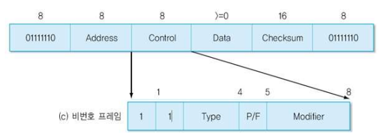

### HDLC 프로토콜(High-level Data Link Control)

#### 역사

- SDLC(Synchronous Data Link Control)
  - IBM SNA의 데이터 링크 프로토콜
  - ISO에서 SDLC를 발전시켜 HDLC(High-level Data Link Control)로 발표
  - LAPB(Link Access Protocol-Balanced)로 향상

#### 특징

- 일대일, 일대다로 연결된 환경에서 데이터 송수신 기능 제공
- 호스트의 종류
  - 주국(Primary Station) : 명령을 전송하는 호스트
  - 종국(Secondary Station) : 명령에 대한 응답을 회신하는 호스트
  - 혼합국(Combined Stations): 주국과 종국 기능을 모두 지닌 호스트
- 기본 동작 원리
  - 주국이 종국에게 명령(Command)을 전송하고
  - 종국은 주국에게 응답(Response)을 회신함

#### 프레임 구조

- 주요 필드
  - 비트 프레임
    - 프레임의 시작과 끝
    - 플래그(01111110) 사용
  - Address
    - 일대다 환경을 지원(Secondary station 주소)
    - 일대일 환경에서는 명령와 응답 구분
      - 예
        - DTE : A(03hex)
        - DCE : B(01hex)
  - Data
    - 가변 크기의 전송 데이터
  - Checksum
    - CRC-CCITT 생성 다항식 사용
  - Control
    - 프레임 종류
      - a) Information(I)
      - b) Supervisory(S)
      - c) Unnumbered(U)
    - 필드
      - 송신용 순서번호
      - 회신용 순서번호
      - Type
        - SABM(Set Asynchronous Balanced Mode)
        - UA(Unnumbered Acknowledgement)
        - DM(Disconnected Mode)
        - FRMR(Frame Reject)
      - P/F(Poll/Final)

#### 정보 프레임

- Seq
  - 송신용 순서번호
- Next
  - Piggybacking을 이용한 응답기능(다음에 수신할 순서번호)
- P/F(Poll/Final)
  - P = 1 : 주국에서 종국에 데이터 전송을 허용
    - 수신단에서는 반드시 주어진 시간 내에 응답을 보내야 함
    - 송신단에서 타임 아웃 발생시 P = 1로 응답 요구
  - F = 1 : 종국에서 주국으로 데이터 전송

#### 감독 프레임

- 프레임에 대한 응답 기능
  - Type
    - 0(RR : Receive Ready)
      - 긍정 응답
    - 1(REJ: Reject)
      - 부정 응답
    - 2(RNR : Receive Not Ready)
      - 흐름 제어
      - 나중에 RR, REJ, 기타 프레임 전송하면 계속 진행
    - 3(SREJ : Selective Reject)
      - 선택적 재전송

#### 비번호 프레임

- 순서 번호가 없는 프레임을 의미
- 프레임 종류(Type + Modifier 총 5비트로 구분)
  - SABM(Set ABM) : 비동기 균형 모드의 연결 설정을 요구
  - SNRM(Set NRM) : 정규 응답 모드의 연결 설정을 요구
  - SARM(Set ARM) : 비동기 응답 모드의 연결 설정을 요구
  - DISC : 연결 해제를 요구
  - RSET : 리셋 기능을 수행(N(R), N(S) 초기화)
  - FRMR : 프레임 수신을 거부
  - UA : 비번호 프레임에 대한 응답 기능을 수행

- 연결 설정 모드의 종류 : NRM, ABM, ARM
- 정규 응답(NRM : Normal Response Mode)
  - 불균형 모드를 의미하므로, 호스트 하나는 주국이고 다른 하나는 종국
  - 종국에서 데이터를 전송하려면 주국의 허락이 필요
- 비동기 균형(ABM : Asynchronous Balanced Mode)
  - 두 호스트 모두 혼합국으로 동작
  - 양쪽에서 명령과 응답을 전송할 수 있음
- 비동기 응답(ARM : Asynchronous Response Mode)
  - 불균형 모드
  - 주국의 허락 없이 종국에서 데이터를 전송할 수 있음

#### 프로토콜 동작

- 응답

- REJ 사용
  - Go-back N 방식으로 다시 전송하는 중

- Poll / Final 비트 사용

- FRMR 사용

#### LAP(Link Access Protocol)

- 비동기 응답 모드인 ARM으로 동작
- 연결 설정
  - 주국에서 SARM 명령 전송
  - 종국에서 SARM 응답 전송

#### LAPB(Link Access Protocol-Balanced)

- 양쪽 호스트가 혼합국으로 동작
  - 임의의 호스트에서 SABM 전송하여 연결 설정

