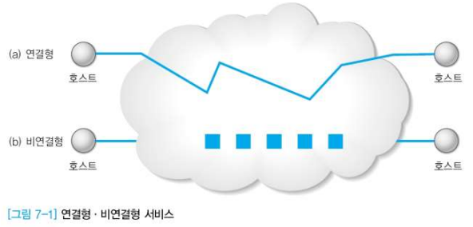
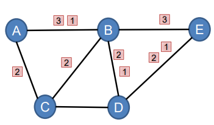
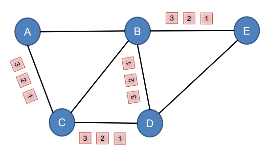
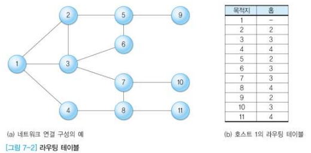
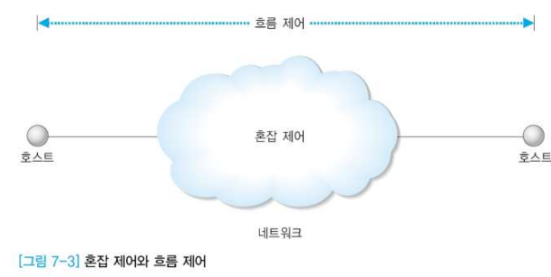
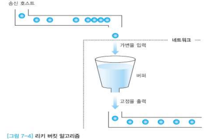
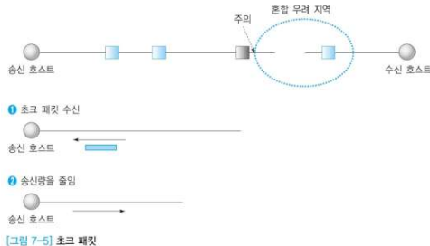

### 네트워크 계층의 주요 기능

- 기본 기능
  - 라우팅(Routing)
    - 주소 바탕으로 경로 선택 => 송수신 호스트 사이의 패킷 전달 경로를 선택
  - 라우팅 과정 중에 수반되는 기능
    - 혼잡제어, 패킷 분할/ 병합
- 라우팅
  - 라우팅 테이블
    - 네트워크 구성 형태에 관한 정보를 관리

- 혼잡 제어(Congestion Control)
  - 혼잡(congestion)
    - 네트워크에 패킷 수가 과도하게 증가되는 현상
  - 혼잡의 발생을 예방하거나 제거하는 기능
- 패킷의 분할과 병합
  - 상위 계층에서 내려온 데이터는 하위 계층인 MAC 계층의 프레임 구조에 정의된 형식으로 캡슐화
  - 송신 호스트에서는 전송 전에 적절한 크기로 데이터를 `분할(Segmentation)`
  - 수신 호스트는 분할되어 수신한 데이터를 다시 `병합(Reassemble)`

#### 서비스의 종류

- 연결형, 비연결형 서비스

  

  - **연결형** : 데이터 전송 전에 데이터의 전송 경로를 미리 결정
  - **비연결형** : 데이터의 전송 경로를 사전에 결정하지 않고 패킷 단위로 결정

#### - 비연결형 서비스

- 데이터의 전송 경로를 사전에 결정하지 않고, 패킷 단위로 결정한다.
- 패킷의 전달 순서
  - 패킷이 서로 다른 경로로 전송되므로 도착 순서가 일정하지 않음
  - 상위 계층에서 순서를 재조정해야 함
- 패킷 분실 가능성
  - 패킷의 100% 도착을 보장하지 않음
  - 상위 계층에서 패킷 분실 오류를 복구해야 함
- 인터넷 환경의 예
  - **IP** : `네트워크 계층`의 기능을 지원하는 비연결형 프로토콜
  - **UDP** : `전송 계층`의 기능을 지원하는 비연결형 프로토콜

#### - 연결형 서비스

- 데이터 전송 전에 데이터의 전송 경로를 미리 결정한다.
- 상대적으로 신뢰성이 높음
  - 만약 1 다음에 3이 오면, 재전송을 다시 요구할 수 있음
- **TCP** : `전송 계층`의 기능을 지원하는 연결형 프로토콜

#### 라우팅(Routing)

- 패킷의 전송 경로를 지정
- 전송 경로 결정 시 고려 사항
  - **공평 원칙** : 다른 패킷의 우선 처리를 위해 다른 패킷이 손해를 보면 안됨
  - **효율 원칙** : 전체 네트워크의 효율성에 대해 고려해야 함
    - 패킷의 평균지연시간, 중간에 거쳐가는 라우터 수 등
  - 정적/ 동적 라우팅
    - **정적(Static) 라우팅**
      - 패킷 전송이 이루어지기 전에 `경로 정보를 라우터가 미리 저장`하여 중개
      - 최적의 라우팅 정보를 개별 라우터에 저장하여 관리
      - 단점
        - 경로 정보의 갱신이 어려우므로, 네트워크 변화 / 네트워크 혼잡도 대처 부족
    - **동적(Dynamic) 라우팅**
      - 라우터의 경로 정보를 `네트워크 상황에 따라` 적절하게 변경
      - 경로정보 변경 주기에 따른 보완 가능
      - 단점
        - 복잡한 작업 추가로 필요
        - 경로 정보의 수집과 관리로 인한 성능 저하

- HELLO/ECHO 패킷
  - HELLO
    - 주변 라우터에 HELLO 패킷을 보내어 주변 경로 정보를 파악하는 용도
  - ECHO
    - 라우터 사이의 전송 지연 시간을 측정하는 용도
- 임의의 라우터가 획득한 정보를 각 라우터에 통보함으로써 정보 공유
  - 개별 라우터에 도착하는 시간 차이로 인한 정보 불일치 발생 가능성
  - 변화되는 상황에서 일관성 유지가 관건

#### 라우팅 테이블

- 라우터가 패킷의 적절한 경로를 찾기 위한 가장 기본적인 도구
- 필수 정보 : 목적지 호스트, 다음 홉
  - **목적지 호스트** : 패킷의 최종 목적지가 되는 호스트 주소
  - **다음 홉** : 목적지 호스트까지 패킷을 전달하기 위한 인접 경로

#### 라우팅 정보의 처리

- **소스(Source) 라우팅**
  - 송신 호스트가 패킷의 전달 경로를 결정하는 방식
  - 전송 경로는 전송 패킷 내부에 기록됨
- **분산(Distributed) 라우팅**
  - 라우팅 정보를 분산하여 관리하는 방식
  - 호스트의 개수가 많아질수록 효과적
- **중앙(Centralized) 라우팅**
  - `특정 호스트(RCC: Routing Control Center)`가 모든 라우팅 정보를 관리
  - 송신 호스트는 패킷 전송 전에 RCC에게 경로 정보를 얻어서 소스 라우팅으로 전송
  - 호스트의 개수가 많아질수록 비효율적
- **계층(Hierarchical) 라우팅**
  - 분산 라우팅과 중앙 라우팅의 조합
  - 네트워크 규모가 커질수록 매우 효과적임

#### 혼잡 제어

- 흐름 제어와 혼잡 제어
  - **흐름 제어** : 송수신 호스트 사이의 전송 속도 문제
  - **혼잡 제어** : 네트워크에서의 전송 능력 문제

- 혼잡의 원인
  - 타임 아웃 기능에 의한 패킷의 재전송으로 혼잡도 증가
    - 초기 혼잡 과정에서 타임 아웃 시간이 작으면 혼잡도가 급격히 증가
    - 패킷 도착 순서가 다른 상황에서 패킷을 분실 처리하면 타임아웃 증가 -> go-back-N과 Selective Repeat
    - 의도적으로 피기배킹을 사용하면 응답 시간이 느려져 타임아웃 증가
    - 패킷 생존 시간을 작게 하면 패킷이 강제로 제거되어 타임아웃 증가
- 라우팅 알고리즘
  - 혼잡이 발생하지 않는 경로를 배정하도록 설계
  - 혼잡이 발생하는 경로를 선택하면 혼잡이 주변으로 확대됨

- 트레픽 성형
  - 혼잡의 발생은 트레픽이 특정 시간에 집중되는 버스트(burst) 현상이 원인
  - 패킷 발생 정도를 네트워크에서 예측 가능한 정도로 조절하는 기능이 필요
  - 리키 버킷 알고리즘
    - 
    - QUEUE라는 버퍼를 이용하여 임시 저장소를 만들어 일정한 간격으로 전송한다. 만약 큐에 데이터가 넘치면 어쩔 수 없이 버리게 된다.

- 혼잡 제거

  - 특정 지역의 혼잡이 다른 지역으로 확대되지 않도록 하는 것이 중요

  - 1) **자원 예약 방식**

    - 호스트와 서브넷이 미리 네트워크 자원의 사용 정보를 협상하여 사전 예약
    - 단점 : 자원 낭비 가능성

  - 2) **초크(Choke) 패킷**

    

    - ECN 패킷
      - 트래픽의 양을 모니터하여 출력 선로의 사용 정도가 한계치를 초과하면 주의 표시를 하는 방식
    - 출력 경로를 사용하는 빈도를 모니터
    - 한계치가 넘어가면 송신 호스트에게 주의 표시
    - 초크 패킷을 받은 호스트는 송신 패킷 양을 줄임(초크 패킷이 더 이상 오지 않을 때까지)