#### IP 프로토콜의 주요 특징

- 비연결형 서비스
- 패킷 분할/병합 기능
- 데이터 체크썸은 없고, 헤더 체크썸만 제공
- Best-effort

#### IP 헤더

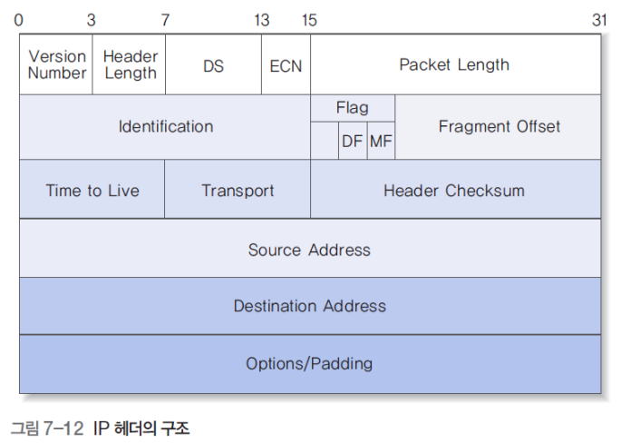

- Service Type 필드 (-> DS/ECN 필드로 변경)
  - 사용자에게 제공하는 서비스 품질에 관련된 내용

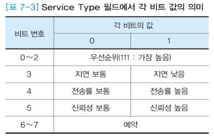

- DS(Differentiated Services) (6비트)
  - 사전에 서비스 제공자와 서비스 이용자 사이에 서비스 등급에 대해 합의
  - 동일한 DS 값을 갖는 트래픽들은 동일한 서비스 등급으로 처리됨
- ECN(Explicit Congestion Notification) (2비트)
  - ECT 0과 ECT 1은 동일한 의미
  - ECN 기능을 위하여 TCP 프로토콜의 헤더에 ECE 필드와 CWR 필드가 추가

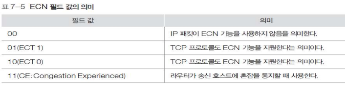

- 패킷 분할 관련 필드
  - 상위 계층에서 내려온 데이터가 하나의 패킷으로 전달하기에 너무 큰 경우 분할하여 전송
  - Idenfitication(식별자 혹은 구분자)
    - 분할되지 않은 패킷 : 값을 순차적으로 증가
    - 분할된 패킷 : 동일한 번호 부여
  - DF(Don't Fragment) : 패킷 분할 금지
  - MF(More Fragment)
    - 분할된 패킷의 처음과 중간 : 1
    - 분할된 패킷의 마지막 : 0
  - Fragment OFfset (13bits)
    - 분할되기 전 데이터에서의 상대적인 위치 정보
    - 8 바이트의 배수로 지정

- 주소 관련 필드
  - Source Address : 송신 호스트의 IP 주소
  - Destination Address : 수신 호스트의 IP 주소
  - IP 주소 체계
    - Network : NIC에서 할당
    - Host : 개별 망에서 관리
    - 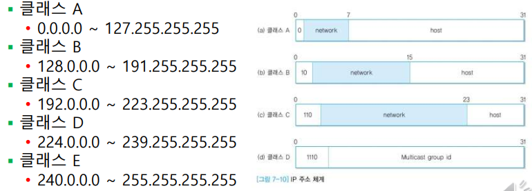

- 기타 필드
  - Version Number
    
    - 일반적으로 4버전 사용
    
  - Header Length
  
    - 32비트
    - IPv4의 경우 보통 5
  
  - Packet Length : 헤더를 포함한 패킷 전체 길이
  
  - Transport(전송 프로토콜) : IP 프로토콜에 데이터 전송을 요구한 전송 계층의 프로토콜
  
    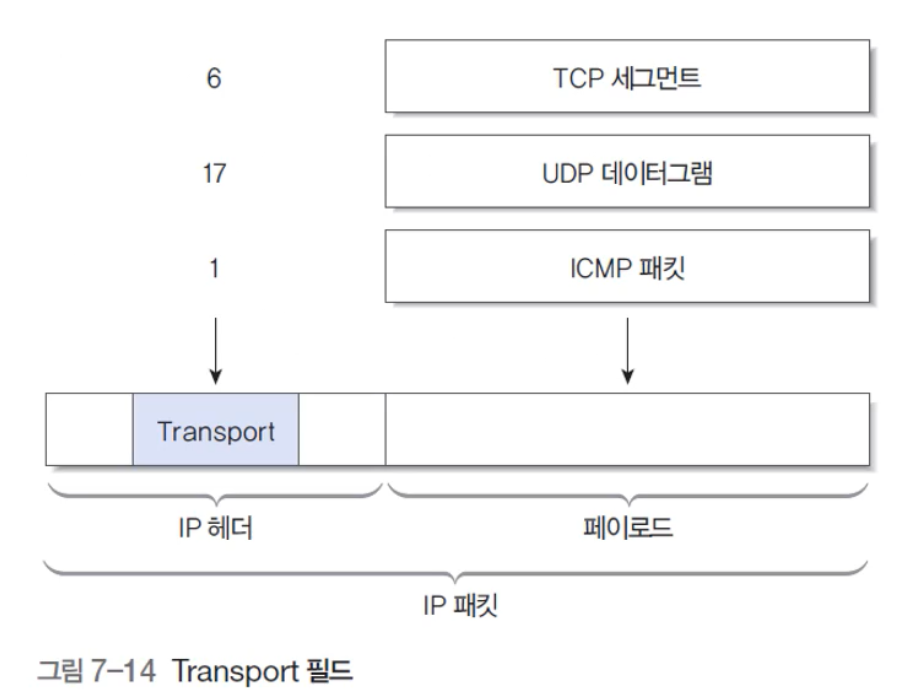
  
  - Time To Live(TTL)
  
    - 패킷의 생존 시간
    - 라우터 거칠 때마다 1씩 감소 / 0되면 네트워크에서 강제 제거됨
  
  - Header Checksum
  
    - 우선 필드 값을 0으로 하고 계산 후 채움
    - 헤더 오류 검출
  
  - Options
  
    - 망 관리나 보안 목적으로 부여 가능
  
  - Padding
  
    - 32비트 맞춰주는 역할

#### 패킷의 분할

- 분할의 필요성

  - 각 네트워크에서 다루는 프레임의 크기가 다름

  - 여러 종류의 네트워크를 거쳐 패킷 전달

    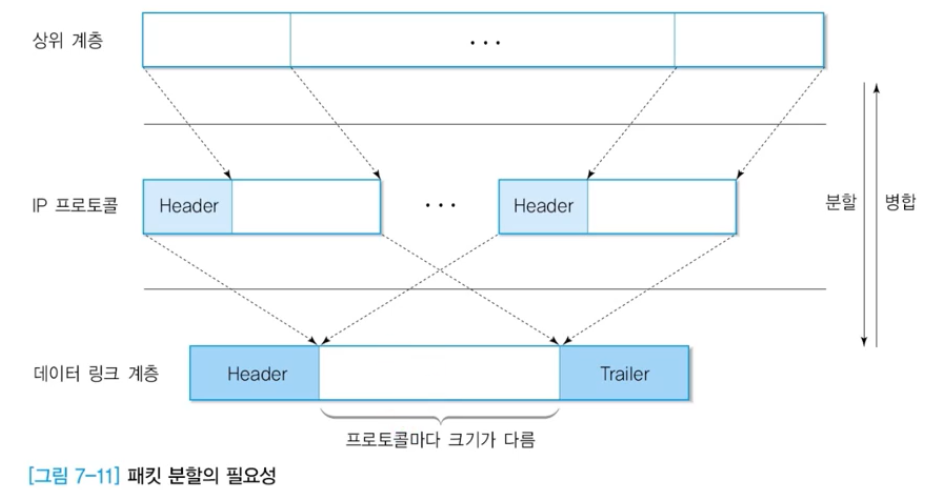

- 분할 예
  - 전송 데이터 : 380
  - 하부 망 최대 크기 : 128
  - 여기서 헤더는 5 X 4 = 20
  - 8바이트 단위로만 분할 가능 (이유는 ? )
    - 따라서 104바이트씩 분할(104 + 104 + 104 + 68)
    - 오프셋은 13씩 증가 (104 / 8)
    - 패킷 길이
      - 104 + 20 = 124
      - 68 + 20 = 88
  - 뒤에 따라오는 패킷이 있는 경우 MF = 1

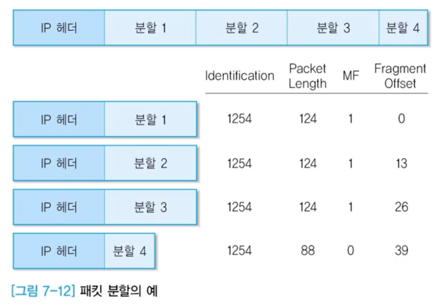

#### BOOTP와 DHCP

- BOOTP(Bootstrap Protocol)
  - DHCP 전에 개발된 호스트 구성 프로토콜
- DHCP(Dynamic Host Configuration Protocol)
  - BOOTP를 바탕으로 개선됨
  - 호스트 구성 서비스
  - BOOTP의 특정 제한을 해결함
- BOOTP와 DHCP 유사점
  - 서버와 클라이언트 간 메이시 교환 형식 구조
  - UDP 포트(67,68) 사용
  - 구성 서비스의 필수적인 부분으로 IP 주소 배포
- BOOTP와 DHCP 차이점

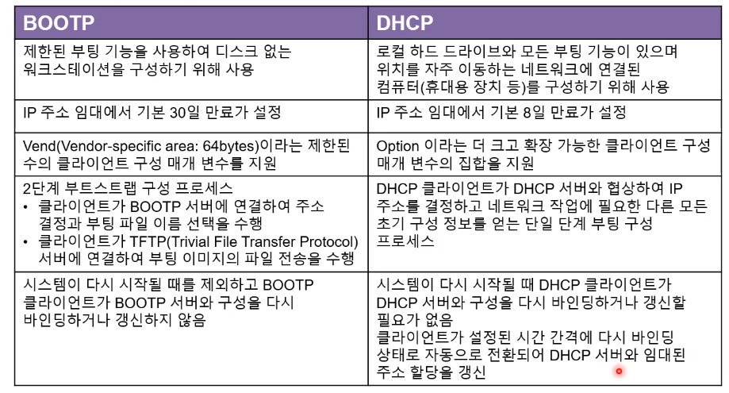

#### DHCP 프로토콜

- IP 주소를 여러 컴퓨터가 공유함
- 기능
  - 설정된 매개변수들에 대한 저장소 역할
  - 동적으로 네트워크 주소 할당
- DHCP 메시지
  - DHCPDISCOVER : 클라이언트가 DHCP 서버를 찾기 위해
  - DHCPOFFET : 클라이언트의 DHCPDISCOVER 메시지에 대한 응답
  - DHCPREQUEST : 주소를 권고한 DHCP 서버에 메시지 전송하여 권고한 주소를 사용한다고 알림
  - DHCPACK : 사용 가능하면 메시지 전송
  - DHCPNAK : 클라이언트가 DHCPDISCOVER 과정 다시 하도록 함
- DHCP 프로토콜의 동작 과정

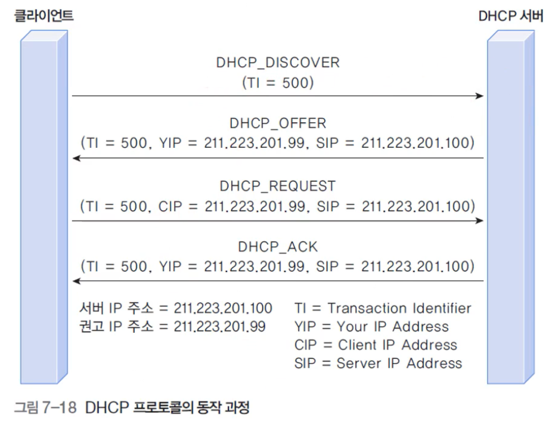

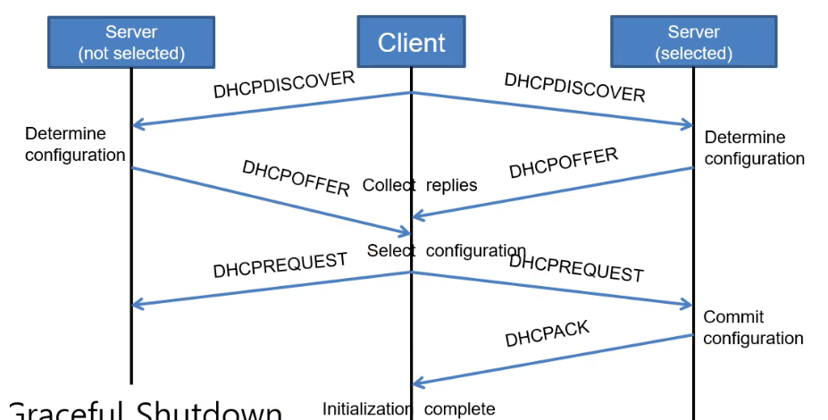

- UDP / IP 프로토콜의 캡슐화

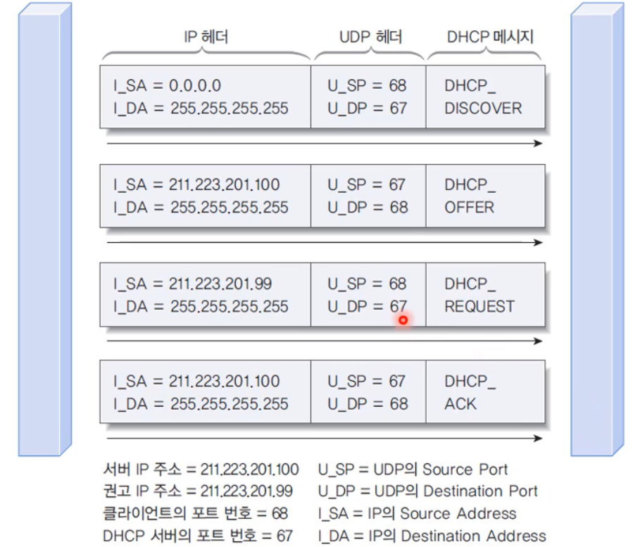