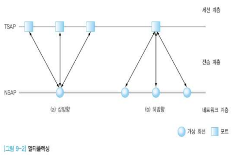
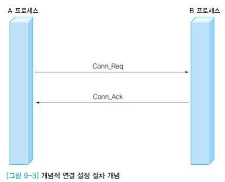
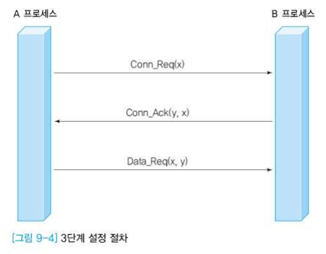

### TCP의 이해(1)

#### 전송 계층 프로토콜 개요

- 데이터 링크 계층과 유사
  - 오류 제어, 흐름 제어, 데이터 순서화 등 제공
- 데이터 링크 계층과의 차이점
  - 데이터 링크 계층은 물리적으로 1:1 연결된 호스트 사이의 전송
  - 전송 계층은 논리적으로 1:1 연결된 호스트 사이의 전송

#### 전송 계층의 주요 기능

- 흐름 제어
  - 기본 목적을 비롯해 유사한 점이 많지만 계층 2와는 다른 버퍼 관리 방법 필요
  - 수신자가 송신자의 전송 속도보다 느리게 수신 -> 버퍼 용량 초과로 데이터 분실 -> 타임아웃 기능을 통한 재전송 유발
  - 수신자가 슬라이딩 윈도우 프로토콜의 윈도우 하단 값을 조정
    - 송신자가 보낼 수 있는 패킷의 한계 설정

- 오류 제어
  - 데이터 변형, 데이터 분실 오류 시 재전송 기능으로 복구
  - 수신자의 요구(NAK) 또는 송신자의 판단(타임 아웃)
  - 선로 오류보다 각 계층의 소프트웨어 동작 과정 중에 분실하는 경우가 대부분
    - 네트워크 계층의 기능적 한계
    - 잘못된 위치/경로 정보

- 분할과 병합
  - 상위 계층에서 요구한 데이터 크기가 전송 계층에서 처리할 수 있는 크기보다 큰 경우
  - 분할(Segmentation)
  - 병합(Reassembly)

- 서비스 프리미티브
  - 네트워크 계층의 경우 대부분 비연결형 서비스 프리미티브가 정의
  - 전송 계층의 경우 비연결형과 신뢰성이 향상된 연결형 서비스 모두 제공

#### 전송 계층 설계 시 고려사항

- 주소표현
  - 예 : 네트워크 계층의 호스트 IP 주소 + 전송 계층의 포트 번호 조합
    - 포트 번호 : 하나의 컴퓨터에 다수의 포트 존재(통신 프로세스 구별)
  - TSAP(Transport Service Access Point)
  - 구조적 표현
    - 여러 개의 계층적 필드로 구분(각 필드는 상하 계층 관계를 나타냄)
      - 대한민국:서울:한국대학교:정보통신공학과:네트워크연구실:홍길동
  - 비구조적 표현
    - 값만 해석해서는 논리적인 위치 파악 불가
    - 값 자체에 위치가 아닌, 다른 중요한 정보를 담고 있는 경우
      - 초등학교의 반 번호, 일련 번호
  - IP 주소
    - 네트워크와 호스트의 계층적인 특성
    - 도메인 주소는 구조적 특징
      - www.korea.co.kr
    - 위치 정보와 관련해서는 비구조적 특징
      - 주소를 바탕으로 위치를 파악할 수 없음

- 멀티플렉싱(Multiplexing)

  - 개별적으로 설정된 TPDU(Transport Protocol Data Unity)의 주소가 동일한 경우 하나의 가상회선에 실어 보내는 것이 유리
  - 
  - 종류
  - 상향
    - 다수의 전송 계층 연결을 하부의 네트워크 계층에서 하나의 연결로 지원
      - 네트워크 계층의 가상 회선 연결의 개수를 줄일 수 있음
    - 하향
      - 하나의 전송 연결에 대하여 네트워크 계층에서 다수의 가상 회선을 지원
      - 멀티미디어 전송에 유리 : 음성, 영상, 자막 등을 별도의 가상 회선으로 처리

- 연결 설정

  - 개념적으로 양자 합의가 필요

    

    - 한쪽의 연결 설정 요구 : Conn_Req
    - 상대방의 연결 수락 응답 : Conn_Ack

  - 2단계 연결설정

    - 최소한의 단계
    - 수신단에서 거부 가능

  - 실제로 프리미티브 전달 과정에서의 분실, 변형, 복사 가능성이 있으므로 이러한 문제들을 고려해야 함

  - 3단계 설정(3-Way Handshake)

    - 
    - 세 번째의 Data_Req는 Conn_Ack에 대한 응답 기능도 수행
    - 보낼 데이터가 없는 경우 Conn_Ack(y,x)에 대한 응답을 따로 보내야 함