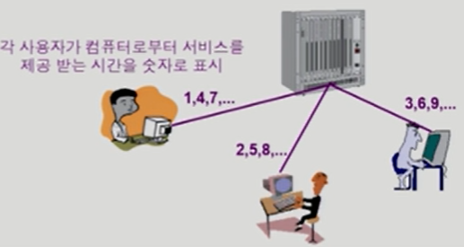

### 운영체제

#### 운영체제(Operating System, OS)

- 컴퓨터 하드웨어 바로 위에 설치되어 사용자 및 다른 모든 소프트웨어와 하드웨어를 연결하는 소프트웨어 계층
- 협의의 운영체제(커널)
  - 운영체제의 핵심 부분으로 메모리에 상주하는 부분
- 광의의 운영체제
  - 커널 뿐 아니라 각종 주변 시스템 유틸리티를 포함한 개념

#### 운영 체제의 분류

- **동시 작업 가능 여부**

  - 단일 작업(single tasking)
    - 한 번에 하나의 작업만 처리
    - ex) MS-DOS 프롬프트 상에서는 한 명령의 수행을 끝내기 전에 다른 명령을 수행시킬 수 없음
  - 다중 작업(multi tasking)
    - 동시에 두 개 이상의 작업 처리
    - ex) UNIX, MS Windows 등에서는 한 명령의 수행이 끝나기 전에 다른 명령이나 프로그램을 수행할 수 있음

- **사용자의 수**

  - 단일 사용자(single user)
    - ex) MS-DOS, MS Windows
  - 다중 사용자(multi user)
    - ex) UNIX, NT server

- **처리 방식**

  - 일괄 처리(batch processing)

    - 작업 요청의 일정량 모아서 한꺼번에 처리
    - 작업이 완전 종료될 때까지 기다려야 함
    - ex) 초기 Punch Card 처리 시스템

  - 시분할(time sharing)

    - 여러 작업을 수행할 때 컴퓨터 처리 능력을 일정한 시간 단위로 분할하여 사용

    - 일괄 처리 시스템에 비해 짧은 응답 시간을 가짐

    - interactive한 방식

      

    - 실시간(Realtime OS)

      - 정해진 시간 안에 어떠한 일이 반드시 종료됨이 보장되어야하는 실시간시스템을 위한 OS
      - ex) 원자로/공장 제어, 미사일 제어, 반도체 장비, 로보트 제어

    - 실시간 시스템의 개념 확장

      - Hard realtime system(경성 실시간 시스템) : 데드라인을 넘기면 심각한 문제 발생 가능성 O
        - ex) 미사일 제어
      - Soft realtime system(연성 실시간 시스템)
        - ex) 동영상 시청

#### 관련 용어

- Multitasking
- Multiproramming
- Time sharing
- Multiprocess
- 구분
  - 위의 용어들은 컴퓨터에서 여러 작업을 동시에 수행하는 것을 뜻함
  - Multiprogramming은 여러 프로그램이 메모리에 올라가 있음을 강조
  - Time sharing은 CPU의 시간을 분할하여 나누어 쓴다는 의미를 강조
  - Multiprocessor
    - 하나의 컴퓨터에 CPU(processor)가 여러 개 붙어있음을 의미

#### 운영체제의 예

- 유닉스(UNIX)
  - 코드의 대부분을 C 언어로 작성
  - 높은 이식성
  - 최소한의 커널 구조
  - 복잡한 시스템에 맞게 확장 용이
  - 소스 코드 공개
  - 프로그램 개발에 용이
  - 다양한 버전
    - System V, FreeBSD, SunOS, Solaris
    - Linux

- DOS(Disk Operating System)
  - MS사에서 1981년 IBM-PC를 위해 개발
  - 단일 사용자용 운영체제, 메모리 관리 능력의 한계(주 기억 장치 : 640KB)
- MS Windows
  - MS사의 다중 작업용 GUI 기반 운영 체제
  - Plug and Play, 네트워크 환경 강화
  - DOS용 응용 프로그램과 호환성 제공
  - 불안정성
  - 풍부한 지원 소프트웨어
- Handheld device를 위한 OS
  - PalmOS, Pocket PC(WinCE), Tiny OS, 안드로이드 등