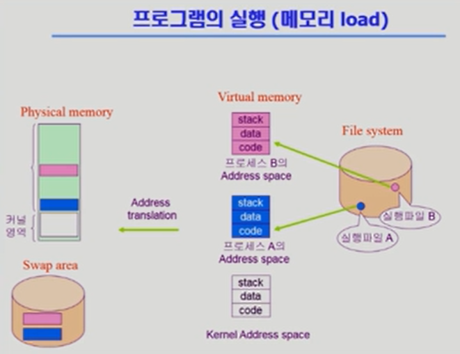
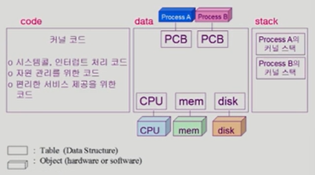
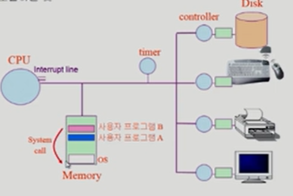
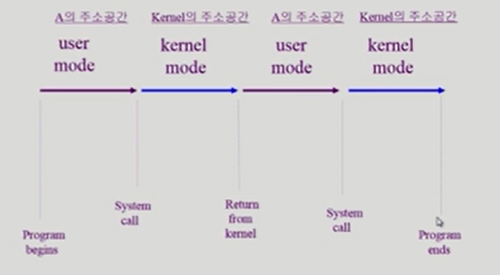

- 프로그램이 실행될 때, 그 프로그램만의 독자적인 Address space가 만들어짐 -> Virtual memory
- 각각의 프로그램들은 자기만의 주소공간이 0번지부터 존재함
- 당장 필요한 부분은 메모리에 올라감
- 그렇지 않은 부분은 디스크의 Swap area에 내려가 있음
- 논리적 주소 -> 물리적 주소(주소변환 필요)
- Address space 구성요소
  - code : 실행파일의 코드가 올라오는 부분. CPU에서 수행할 기계어가 위치함
  - data : 전역변수나 프로그램이 시작해서 남아있는 데이터가 위치함
  - stack : 모든 프로그램들이 어떤 언어로 작성되었건 함수 구조로 되어 있는데 함수가 호출 혹은 리턴될 때 관련 정보를 쌓아뒀다가 이용함
- 커널 : 하나의 프로그램 -> 함수 구조

#### 커널 주소 공간의 내용

- 모든 하드웨어를 관리하기 위한 자료구조 가짐
- 모든 프로세스를 관리하기 위한 자료구조 가짐(PCB)
- 각 프로그램이 서비스를 요청할 수 있기 때문에 커널 스택은 각 프로세스마다 별도로 두고 있음
  - 운영체제가 프로그램 A 때문에 호출되었다면 프로세스 A의 커널 스택을 사용함

#### 사용자 프로그램이 사용하는 함수

- 함수(function)
  - **사용자 정의 함수**
    - 자신의 프로그램에서 정의한 함수
  - **라이브러리 함수**
    - 자신의 프로그램에서 정의하지 않고 갖다 쓴 함수
    - 자신의 프로그램의 실행 파일에 포함되어 있다
  - ❗이 두 함수 다 프로세스 A의 Address space
  - **커널 함수**
    - 운영체제 프로그램의 함수
    - 커널 함수의 호출 = 시스템 콜
  - ❗Kernel Address space

#### 시스템콜(System Call)

- 사용자 프로그램이 운영체제의 서비스를 받기 위해 커널 함수를 호출하는 것

#### 프로그램의 실행

- 사용자 정의 함수나 라이브러리 함수가 쓰일 때는 내 주소 공간에 있는 코드가 user mode에 실행됨
- 시스템 콜을 하게 되면, CPU 제어권이 운영체제 제어권으로 넘어가서 운영체제의 주소공간에 있는 코드가 kernel mode 에서 실행됨
- 프로그램 하나가 실행될 때 user mode와 kernel mode가 반복되다가 종료
- mode bit 참고

