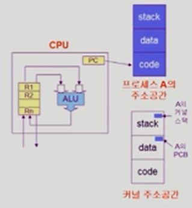
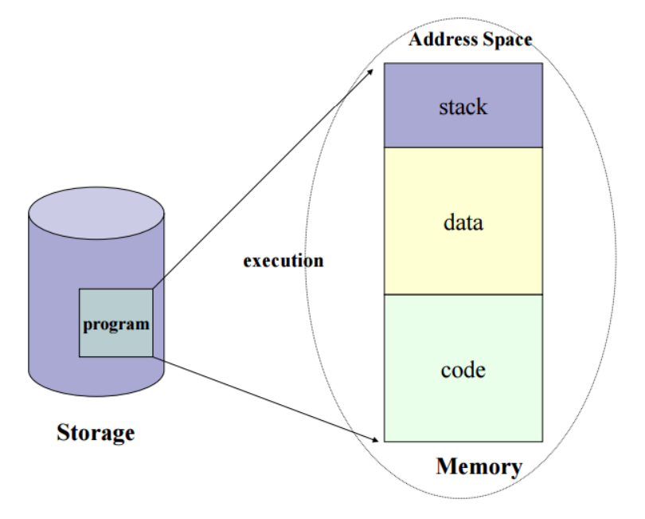
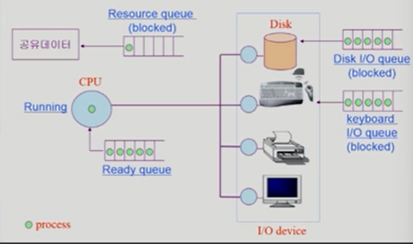
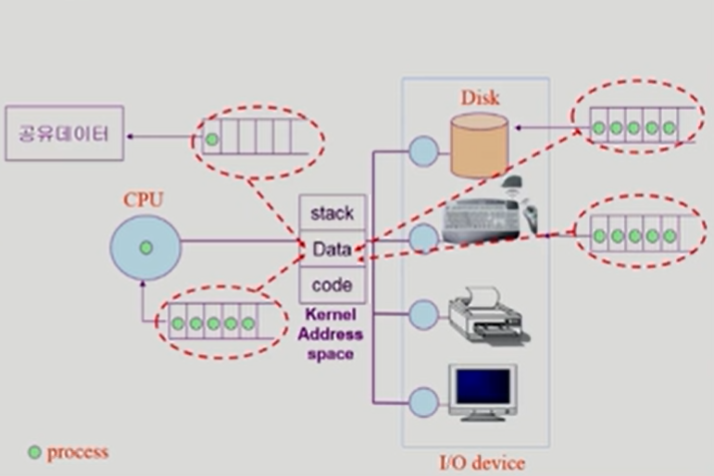
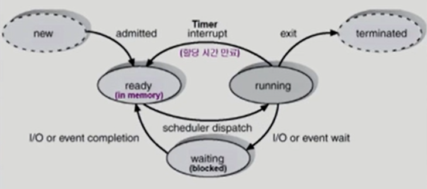
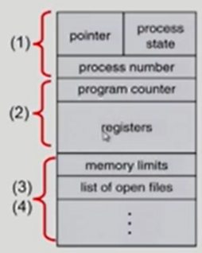
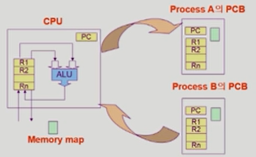
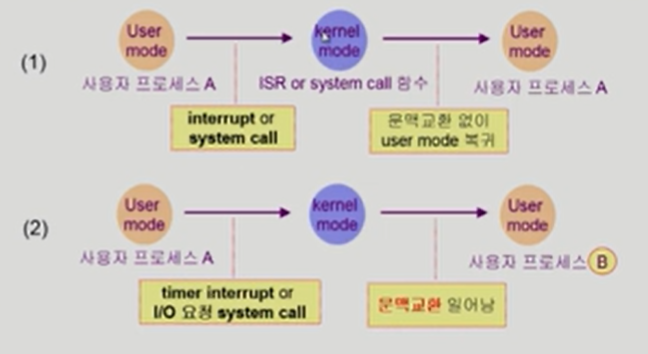

### 프로세스

- ✅ 컴퓨터에서 연속적으로 실행되고 있는 컴퓨터 프로그램
- "Process is **a program in execution**"

- 프로세스의 문맥(context)

  - CPU 수행 상태를 나타내는 하드웨어 문맥

    - Program Counter
    - 각종 register

  - 프로세스의 주소 공간

    

    - **code**
      - 코드가 저장되어 있는 부분.
      - 프로그램의 코드는 바뀌어선 안되므로 읽기만 가능한 부분
    - **data**
      - 전역 변수 같은 데이터를 관리
      - 변수는 바뀔 수 있으므로 읽고 쓰기 가능
    - **stack**
      - 함수나 함수 안의 지역 변수를 저장
      - 변수는 바뀔 수 있으므로 읽고 쓰기 가능

  - 프로세스 관련 커널 자료 구조

    - PCB(Process Control Block)
    - Kernel stack

- 프로세스는 `하나의 생명체`로 볼 수 있다!
  
  - 사용자가 사용하면 출생에서 사망까지, 그 시간의 흐름을 볼 수 있다

#### 프로세스의 상태(Process State)

- 프로세스는 상태(state)가 변경되며 수행된다
  - **Running**
    - CPU를 잡고 instruction을 수행중인 상태
    - CPU에서 수행이 되고 있는 상태
  - **Ready**
    - CPU를 기다리는 상태(메모리 등 다른 조건을 모두 만족하고)
    - Running할 준비가 되어있는 상태
    - "지금 다른 애가 돌고 있으니까 나는 기다리고 있어야 하는 구나!"
  - **Blocked(wait,sleep)**
    - CPU를 주어도 당장 instruction을 수행할 수 없는 상태
    - Process 자신이 요청한 event(ex. I/O)가 즉시 만족되지 않아 이를 기다리는 상태
    - ex) 디스크에서 file을 읽어와야 하는 경우
  - **New** : 프로세스가 생성 중인 상태
    - "The process is being created"
    - 프로세스가 만들어지는 과정의 상태
  - **Terminated** : 수행(execution)이 끝난 상태
    - "The process has finished execution"

#### Process Control Block(PCB)

- 운영체제가 각 프로세스를 관리하기 위해 프로세스당 유지하는 정보
- 다음의 구성 요소를 가진다(구조체로 유지)
  - 1. OS가 관리상 사용하는 정보
       - Process state, Process ID
       - scheduling information, priority
    2. CPU 수행 관련 하드웨어 값
       - Program counter, registers
    3. 메모리 관련
       - Code, data, stack의 위치 정보
    4. 파일 관련
       - Open file descriptors ...

#### 문맥 교환(Context Switch)

- CPU를 한 프로세스에서 다른 프로세스로 넘겨주는 과정
- CPU가 다른 프로세스에게 넘어갈 때 운영체제는 다음을 수행
  - CPU를 내어주는 프로세스의 상태를 그 프로세스의 PCB에 저장
  - CPU를 새롭게 얻는 프로세스의 상태를 PCB에서 읽어옴

- System call이나 Interrupt 발생시 반드시 context switch가 일어나는 것은 아님

  

  - (1)의 경우에도 CPU 수행 정보 등 context의 일부를 PCB에 save해야 하지만 문맥교환을 하는 (2)의 경우 그 부담이 훨씬 큼(eg. cache memory flush)

