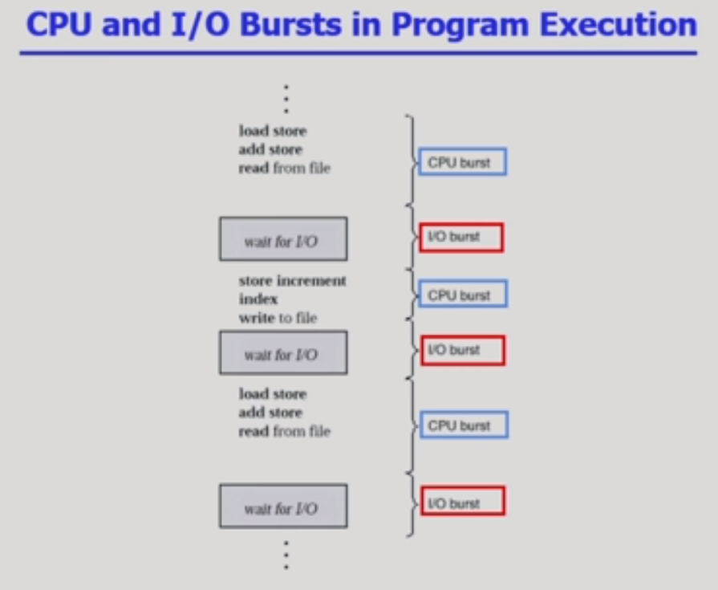
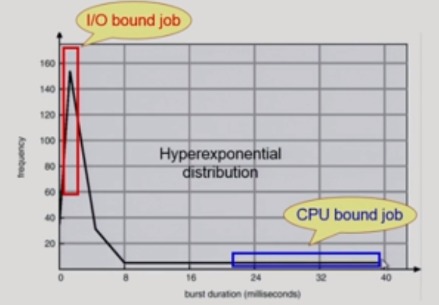
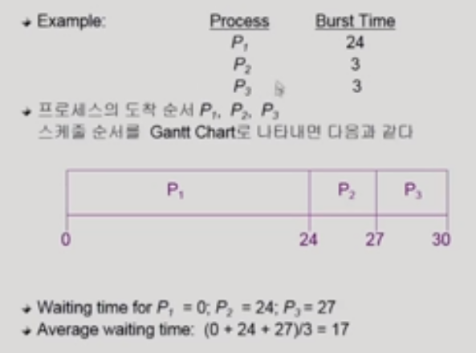
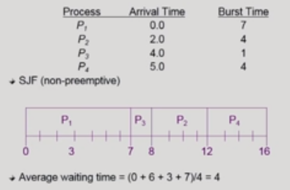
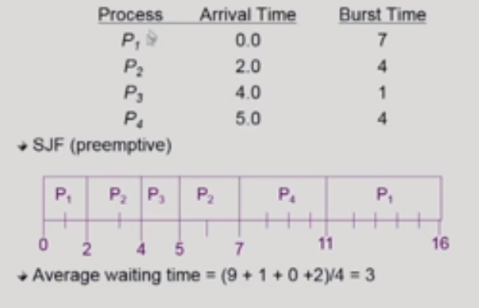
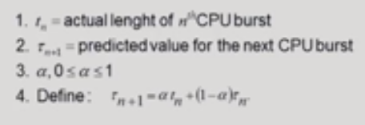
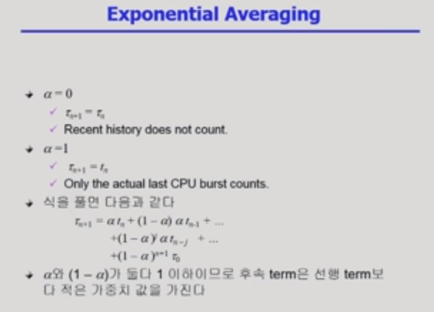
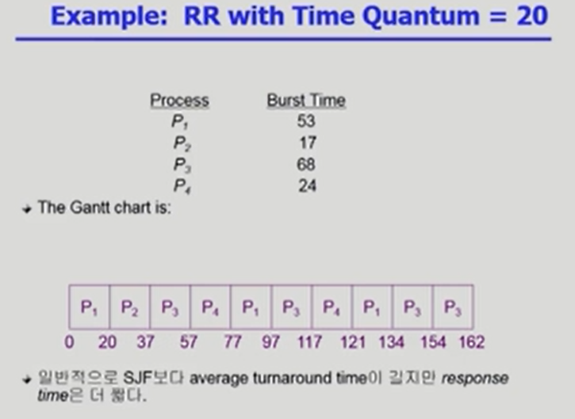

                                                                                                                                                                                                                    

#### CPU-burst Time의 분포

- 여러 종류의 job(process)이 섞여 있기 때문에 CPU 스케줄링이 필요하다
  - interactive job에게 적절한 response 제공 요망
  - CPU와 I/O 장치 등 시스템 자원을 골고루 효율적으로 사용

- 위 그림의 경우 I/O에게 cpu를 먼저 주는 것이 좋다!
  - 먼저 주면 얼른 해결하고 작업하러 갈 것이기 때문!

#### 프로세스의 특성 분류

- I/O-bound process
  - CPU를 잡고 계산하는 시간보다 I/O에 많은 시간이 필요한 job
  - many short CPU bursts
- CPU-bound process
  - 계산 위주의 job
  - few very long CPU bursts

#### CPU scheduler & Dispatcher

- CPU scheduler
  - Ready 상태의 프로세스 중에서 이번에 CPU를 줄 프로세스를 고른다
- Dispatcher
  - CPU의 제어권을 CPU scheduler에 의해 선택된 프로세스에게 넘긴다
  - 이 과정을 context switch(문맥 교환)라고 한다
- CPU 스케줄링이 필요한 경우는 프로세스에게 다음과 같은 상태 변화가 있는 경우이다
  - ❗Running -> Blocked (ex.I/O 요청하는 시스템 콜)
  - Running -> Ready (ex. 할당시간만료로 timer interrupt)
  - Blocked -> Ready (ex. I/O 완료 후 인터럽트)
  - ❗Terminate
- ❗ : nonpreemptive(강제로 빼앗지 않고 자진 반납)

#### Scheduling Criteria 성능 척도

- **CPU utilization (이용률)**
  - keep the CPU as busy as possible
- **Throughput (처리량)**
  - of processes that complete their execution per time unit
- **Turnaround time(소요시간, 반환시간)**
  - amount of time to execute a particular process
- **Waiting time(대기시간)**
  - amount of time a process has been waiting in the ready queue
- **Response time(응답 시간)**
  - amount of time it takes from when a request was submitted until the first response is produced, not output

### CPU 스케줄링 알고리즘

#### FCFS(First-Come First-Served)

- ✅ 먼저 요청한 프로세스를 먼저 처리하는 방식
- 장점
  - 자원의 효율성을 높임(처리중인 프로세스에게 할당된 시간을 타 프로세스가 뺏지 않으므로 문맥 교환이 일어나지 않음 => 오버헤드 발생 x)
  - 일괄 처리 시스템에 적합함
- 단점
  - 프로세서를 장시간 독점하는 경우 다른 프로세스들이 오래 기다려야 함(=> 평균 응답시간이 길어짐)
  - 대화형 시스템에 부적함
    - 대화형 시스템 : 사용자와 시스템 간의 실시간 대화를 기반으로 하는 시스템(like. 카카오톡)
    - 우선순위가 높은 프로세스를 빨리 처리하지 못할 수도 있음

#### SJF(Shortest-Job-First)

- 각 프로세스의 다음번 CPU burst time을 가지고 스케줄링에 활용
- CPU burst time이 가장 짧은 프로세스를 제일 먼저 스케줄
- Two schemes
  - Nonpreemptive
    - 일단 CPU를 잡으면 이번 CPU burst가 완료될 때까지 CPU를 선점(preemption)하지 않음
  - Preemptive
    - 현재 수행 중인 프로세스의 남은 burst time보다 더 짧은 CPU burst time을 가지는 새로운 프로세스가 도착하면 CPU를 빼앗김
    - 이 방법을 Shortest-Remaining-Time-First(SRTF)이라고도 부른다
- SJF is optimal
  - 주어진 프로세서들에 대해 minimum average waiting time 보장
- 너무 효율성만 생각하다 보니 Starvation(기아 현상)이 발생할 수 있음

- Non-Preemptive SJF

- Preemptive SJF

#### 다음 CPU Burst Time의 예측

- 다음 CPU burst time을 어떻게 알 수 있는가?

- 추정(estimate)만이 가능하다

- 과거의 CPU burst time을 이용해서 추정(exponential averaging)

  

#### Priority Scheduling

- A priority number(integer) is associated with each process
- highest priority를 가진 프로세스에게 CPU를 할당
- SJF는 일종의 priority scheduling이다
- priority = predicted next CPU burst time
- Problem
  - Starvation : low priority processes may never execute
- Solution
  - Aging : as time progresses increase the priority of the process

#### Round Robin(RR)

- 각 프로세스는 동일한 크기의 할당 시간(time quantum)을 가짐(일반적으로 10 - 100 milliseconds)
- 할당 시간이 지나면 프로세스는 선점(preempted)당하고 ready queue의 제일 뒤에 가서 다시 줄을 선다
- n개의 프로세스가 ready queue에 있고 할당 시간이 q time unit인 경우 각 프로세스는 최대 q time unit 단위로 CPU 시간의 1/n을 얻는다. => 어떤 프로세스도 (n-1)q time unit 이상 기다리지 않는다.

- Performance
  - q large => FCFS
  - q small => context switch 오버헤드가 커진다

