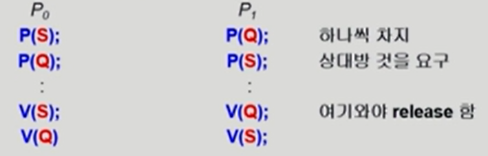
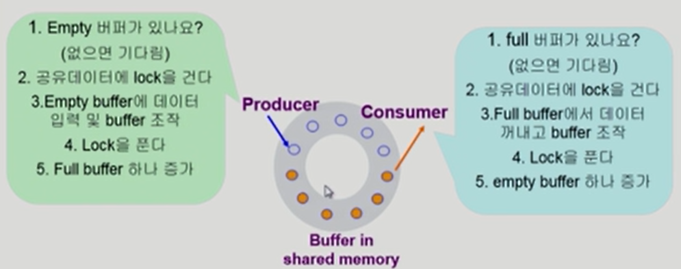
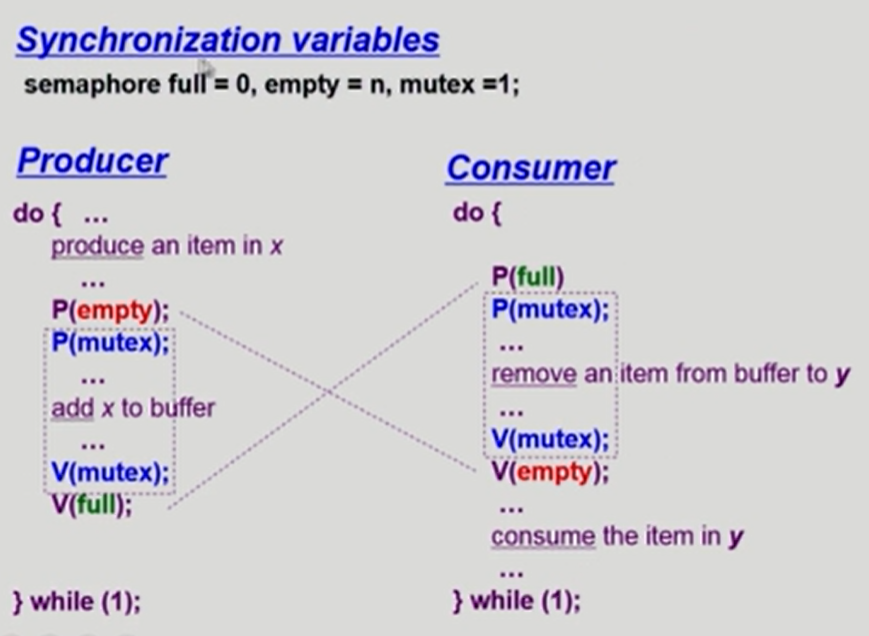
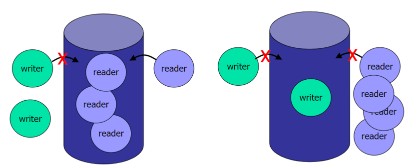
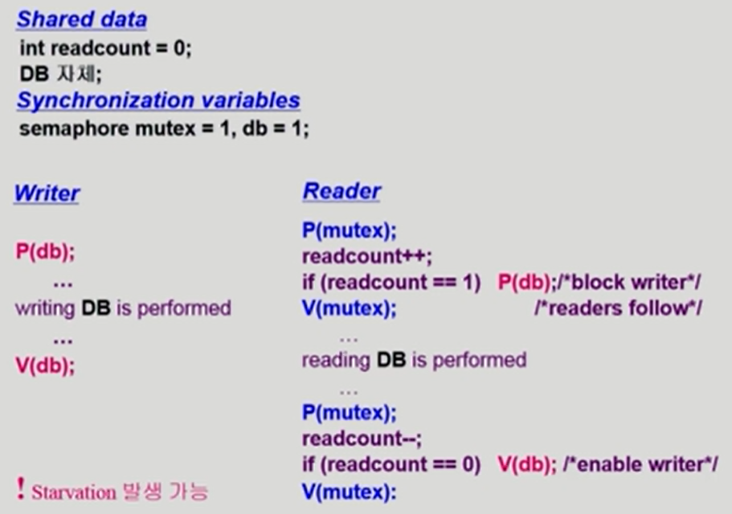
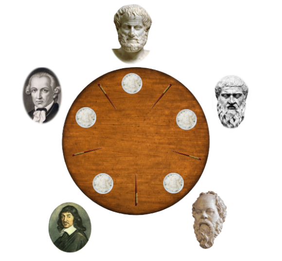
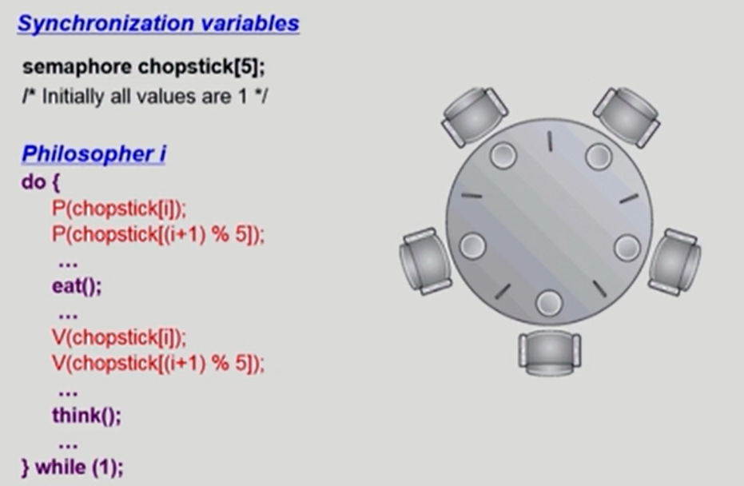
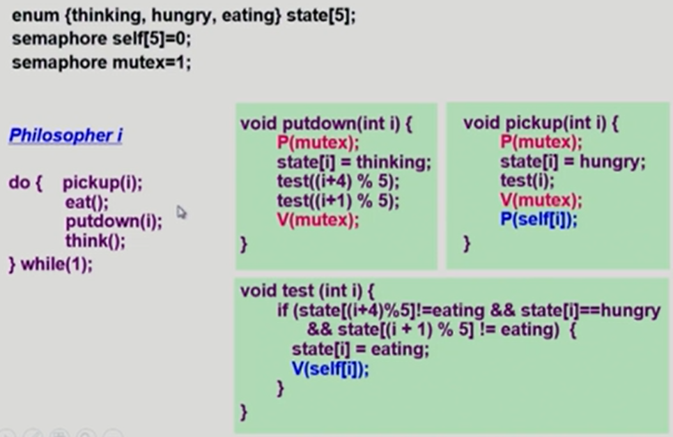

#### Deadlock and Starvation

- **Deadlock**
  - 둘 이상의 프로세스가 서로 상대방에 의해 충족될 수 있는 event를 무한히 기다리는 현상
- S와 Q가 1로 초기화된 semaphore라고 했을 때

- **Starvation**
  - Indefinite blocking : 프로세스가 suspend된 이유에 해당하는 세마포어 큐에서 빠져나갈 수 없는 현상

❗ Starvation은 각각이 굶어죽는 거라면 Deadlock은 서로 얽혀서 진행이 안되는 현상을 뜻한다!

#### Classical Problems of Synchronization

1. Bounded-Buffer Problem(Producer-Consumer problem)

2. Readers and Writers Problem

3. Dining-Philosophers Problem

#### 1. Bounded-Buffer Problem(Producer-Consumer problem)

- 생산자 프로세스는 데이터를 만들어서 넣어주고, 소비자 프로세스는 그 만들어진 데이터를 꺼내가는 역할을 한다.

- Shared data
  - buffer 자체 및 buffer 조작 변수(empty/full buffer의 시작 위치)
- Synchronization variables
  - mutual exclusion => Need binary semaphore(shared data의 mutual exclusion을 위해)
  - resource count => Need integer semaphore(남은 full/empty buffer의 수 표시)

- 같은 위치에 데이터를 중복해서 만들 수 없으니 공유 데이터에 먼저 lock을 걸어 자리를 선점한다고 생각하면 된다!

- 생산자 입장에서 빈 버퍼가 있어야 데이터를 만들 수 있다 => 빈 자리는 하나의 자원이다!
  - 빈 버퍼가 없으면 빈 버퍼가 생길 때까지 기다려야 한다 = 소비자가 데이터를 꺼내갈 때까지

- 소비자 입장에선 데이터가 자원이다 => 내용이 들어있는 버퍼가 하나의 자원이다!

#### Two types of Semaphores

- Counting semaphore
  - 도메인이 0 이상인 임의의 정수값
  - 주로 resource counting에 사용
- Bianry semaphore(=mutex)
  - 0 또는 1 값만 가질 수 있는 semaphore
  - 주로 mutual exclusion(lock/unlock)에 사용

#### 2. 독자-저자 문제 (Readers and Writers Problem)

✅ 다수의 독자와 다수의 저자가 하나의 공통 데이터베이스를 사용할 때 발생할 수 있는 문제 => 프로세스 동기화로 해결 가능!

- 한 process가 DB에 write 중일 때 다른 process가 접근하면 안됨
- read는 동시에 여럿이 해도 됨
- solution
  - Writer가 DB에 접근 허가를 아직 얻지 못한 상태에서는 모든 대기중인 Reader들을 다 DB에 접근하게 해준다
  - Writer는 대기 중인 Reader가 하나도 없을 때 DB 접근이 허용된다
  - 일단 Writer가 DB에 접근 중이면 Reader들은 접근이 금지된다
  - Writer가 DB에서 빠져나가야만 Reader의 접근이 허용된다
- Shared data
  - DB 자체
  - readcount => 현재 DB에 접근 중인 Reader의 수
- Synchronization variables
  - mutex => 공유 변수 readcount를 접근하는 코드(critical section)의 mutual exclusion 보장을 위해 사용A
  - db => Reader와 writer가 공유 DB 자체를 올바르게 접근하게 하는 역할. small DB 

- Reader는 DB를 읽기 위해 lock을 걸고 다 읽은 후에 다시 unlock을 하는 과정을 볼 수 있다.

- readcount가 0일 때는 DB를 아무도 안 읽는다는 뜻이지만, Reader가 readcount++를 하고 읽으면 숫자가 바뀌어서 누군가가 읽는다는 의미가 된다. 다 읽고 빠져나갈땐 다시 readcount--를 해줘서 리셋해준다.
- Writer의 입장에서 P 연산과 V 연산을 통해 lock을 걸고 푸는 과정을 가지고 DB를 작업한다.

- ❗ Starvation 발생 가능 => Reader가 끊임없이 도착한다면 Writer는 영원히 DB를 작업하지 못하고 기다려야 한다.
  - ❓ 어떻게 하면 문제를 해결할까 ? ***신호등*** 개념을 생각해보자!
  - 주기적으로 순번을 정해 Reader가 도착한다고 다 읽게 해주는 것이 아닌, 특정 시간까지 도착한 Reader만 DB에 접근하게 한다 => 특정 시간 이후 Writer가 다시 DB에 접근 가능

#### 3. 식사하는 철학자 문제 (Dining-Philosophers Problem)

- 철학자가 하는 일은 ?
  - 생각하는 것
  - 밥 먹는 것
  - => 그래서 교차적으로 왼쪽과 오른쪽 젓가락을 한 페어로 사용하여 밥을 먹고 다시 내려놓는 것!

- Problem => 모든 철학자가 동시에 배고파져서 왼쪽 젓가락을 잡으려고 하면 그 누구도 오른쪽 젓가락을 잡지 못하게 된다 ( 공유가 안된다 ) = Deadlock이 생긴 것이다!

- 해결 방안
  - 4명의 철학자만이 테이블에 동시에 앉을 수 있도록 한다
  - 젓가락을 두 개 모두 집을 수 있을 때에만 젓가락을 집을 수 있게 한다
  - 비대칭 => 짝수(홀수) 철학자는 왼쪽(오른쪽) 젓가락부터 집도록 한다

- self[5] = 0으로 시작하는데, 0이어야 젓가락을 잡을 수 있는 권한이 주어지는 것으로 상정

- test 작업을 통해 젓가락 두 짝이 둘 다 available한 상황임이 판단되면 pickup의 P 연산을 통해 밥을 먹게 된다.

- 만약 젓가락 두 짝이 available한 상황이 아니게 판단되면 pickup의 P 연산에서 잠들게 된다.

- test 통과 못한 이유 ? 왼쪽이든 오른쪽의 철학자가 젓가락을 사용하고 있어서 내가 당장 사용할 젓가락 페어가 완성되지 못하기 때문!

