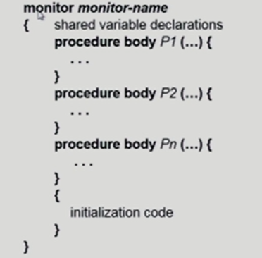
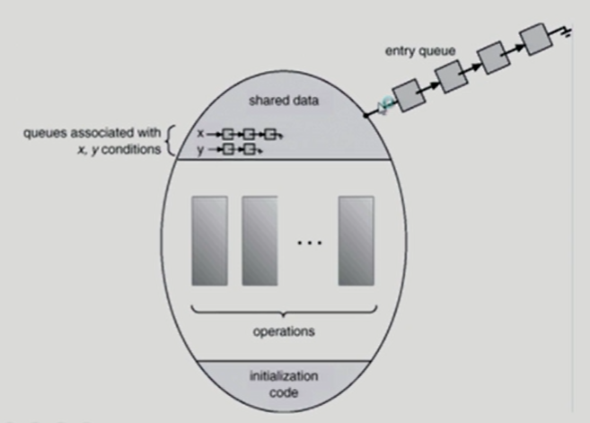
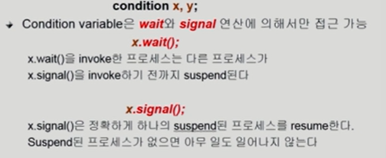
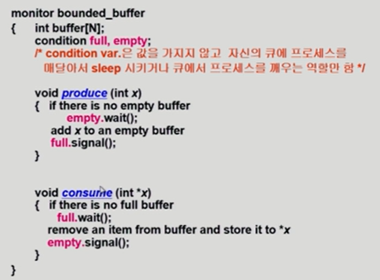
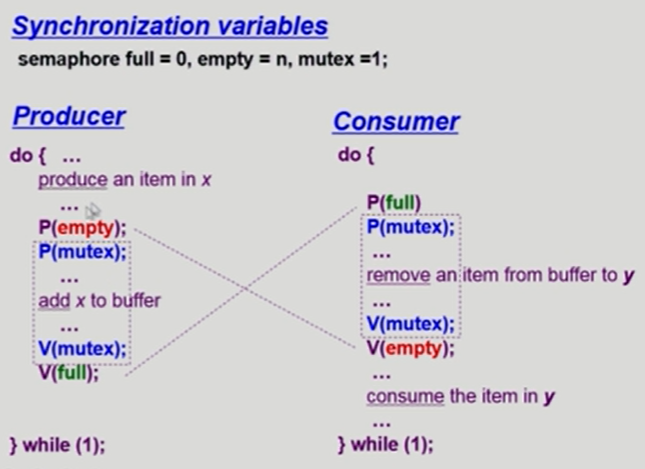
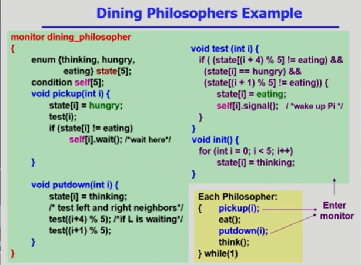

#### Monitor

- Semaphore의 문제점
  - 코딩하기 힘들다
  - 정확성(Correctness)의 입증이 어렵다
  - 자발적 협력(voluntary cooperation)이 필요하다
  - 한 번의 실수가 모든 시스템에 치명적 영향
- 예

- 동시 수행중인 프로세스 사이에서 abstract data type의 안전한 공유를 보장하기 위한 high-level synchronization construct

- 모니터 내에서는 한 번에 하나의 프로세스만이 활동 가능
- 프로그래머가 동기화 제약 조건을 명시적으로 코딩할 필요 없음
- 프로세스가 모니터 안에서 기다릴 수 있도록 하기 위해 condition variable 사용

#### Bounded-Buffer Problem

