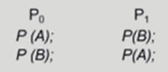

### 교착상태(deadlock)

✅ ***두 개 이상의 작업이 서로 상대방의 작업이 끝나기 만을 기다리고 있기 때문에 결과적으로 아무것도 완료되지 못하는 상태***

#### The Deadlock Problem

- **Deadlock**
  - 일련의 프로세스들이 서로가 가진 자원을 기다리며 block된 상태
- Resource(자원)
  - 하드웨어, 소프트웨어 등을 포함하는 개념
  - ex) I/O device, CPU cycle, memory space, semaphore 등
  - 프로세스가 자원을 사용하는 절차
    - Request, Allocate, Use, Release
- Deadlock Example 1
  - 시스템에 2개의 tape drive가 있다
  - 프로세스 P1와 P2 각각이 하나의 tape drive를 보유한 채 다른 하나를 기다리고 있다
- Deadlock Example 2
  - Binary semaphores A and B

#### 데드락 발생 4가지 조건

1. 상호 배제(Mutual exclusion)

   - 매 순간 하나의 프로세스만이 자원을 사용할 수 있음

2. 비선점(No preemption)

   - 프로세스는 자원을 스스로 내어놓을 뿐 강제로 빼앗기지 않음

   - 자원을 빼앗을수만 있으면 데드락은 생기지 않는다!! 강자가 약자의 자원을 빼앗는 개념

3. 보유 대기(Hold and wait)
   - 자원을 가진 프로세스가 다른 자원을 기다릴 때 보유 자원을 놓지 않고 계속 가지고 있음
4. 순환 대기(Circular wait)
   - 자원을 기다리는 프로세스간에 사이클이 형성되어야 함
   - 프로세스 P0 P1 ... PN이 있을 때
     - P0은 P1이 가진 자원을 기다림
     - P1은 P2가 가진 자원을 기다림
     - .....

#### Resource-Allocation Graph(자원 할당 그래프)

- 그래프에 ***cycle이 없으면 deadlock이 아니다***!
- 그래프에 cycle이 있으면
  - if only one instance per resource type, then deadlock
  - if several instances per resource type, possibility of deadlock

- 왼쪽 그래프는 cycle이 2개나 형성되었기 때문에 deadlock이 형성되었다.
- 오른쪽 그래프는 cycle이 형성되었긴 하지만 R1, R2에 있는 자원들이 모두 cycle의 요소로 사용되는 것이 아니기 때문에 deadlock이라고 확신할 수 없다.

#### Deadlock의 처리 방법

**1. Deadlock Prevention**

- 자원 할당 시 Deadlock의 4가지 필요 조건 중 어느 하나가 만족되지 않도록 하는 것
- ✔️ **Mutual Exclusion**
  - 공유해서는 안되는 자원의 경우 반드시 성립해야 함
- ✔️ **Hold and Wait**
  - "내가 기다려야 하는 상황이 생기면 내가 가진 자원을 내어놓아야 한다."
  - 프로세스가 자원을 요청할 때 다른 어떤 자원도 가지고 있지 않아야 한다
  - 방법 1. 프로세스 시작 시 모든 필요한 자원을 할당받게 하는 방법
  - 방법 2. 자원이 필요할 경우 보유 자원을 모두 놓고 다시 요청
- ✔️ **No Preemption**
  - "빼앗지 않아서 데드락이 생겼다면 빼앗아버린다!"
  - process가 어떤 자원을 기다려야 하는 경우 이미 보유한 자원이 선점됨
  - 모든 필요한 자원을 얻을 수 있을 때 그 프로세스는 다시 시작된다
  - State를 쉽게 save하고 restore할 수 있는 자원에서 주로 사용(CPU, memory)
- ✔️ **Circular Wait**
  - 모든 자원 유형에 `할당 순서`를 정하여 정해진 순서대로만 자원 할당
  - 예를 들어 순서가 3인 자원Ri를 보유 중인 프로세스가 순서 1인 자원 Rj를 할당받기 위해서는 우선 Ri를 release해야 한다
- => Utilization 저하, throughput 감소, starvation 문제
- 데드락을 예방하는 가장 강력한 방법이지만 비효율적인 측면이 있다

**2. Deadlock Avoidance**

- 자원 요청에 대한 부가적인 정보를 이용해서 자원 할당이 deadlock으로부터 안전(safe)한지를 동적으로 조사해서 안전한 경우에만 할당

- 가장 단순하고 일반적인 모델은 프로세스들이 필요로 하는 각 자원별 최대 사용량을 미리 선언하도록 하는 방법임

- 데드락을 `예방`하는 방법

- 시스템이 sage state에 있으면 => no deadlock

- 시스템이 unsafe state에 있으면 => posibility of deadlock

- 시스템이 ***unsafe state에 들어가지 않는 것***을 보장

- 2가지 경우의 avoidance 알고리즘

  - Single instance per resource types

    - Resource Allocation Graph algorithm 사용

      

      - case 1) 프로세스 1이 1번 자원을 가지고 있고 2번 자원을 평생에 한 번 요청 가능. 프로세스 2는 1번 자원을 요청한 상태고 2번 자원 역시 평생에 한 번 요청 가능
      - case 3) cycle이 만들어지진 않았는데 점선을 포함하면 cycle 만들어짐 <= 완전하진 않음 

  - Multiple instances per resource types

    - 은행원 알고리즘 (Banker's Algorithm) 사용

      

    - 가정

      - 모든 프로세스는 자원의 *최대 사용량을 미리 명시*
      - 프로세스가 요청 자원을 모두 할당받은 경우 유한 시간 안에 이들 자원을 다시 반납한다

    - 방법

      - 기본 개념: *자원 요청시 **safe 상태를 유지**할 경우에만 할당*
      - ***총 요청 자원의 수가 가용 자원의 수보다 적은 프로세스를 선택***
        - 그런 프로세스가 없으면 unsafe
        - 그런 프로세스가 있으면 safe
      - safe하다면 그 프로세스에게 자원을 할당
      - 할당 받은 프로세스가 종료되면 모든 자원을 반납
      - 모든 프로세스가 종료될 때까지 이러한 과정 반복

    - 예

      - 프로세스가 총 다섯개(P~~0~~, P~~1~~, P~~2~~, P~~3~~, P~~4~~) 있고 자원의 종류가 3가지 (A, B, C) 있다.
      - 각각의 자원의 인스턴스의 개수는 10, 5, 7개이다
      - 이러한 상황에서 각각의 프로세스에 A, B, C를 이미 할당(`Allocation`)한 상태라면, 현재 사용 가능한 자원은(`Available`) A 3개, B 3개, C 3개가 있다.
      - 그리고 각각의 프로세스가 최대로 사용할 자원의 개수를 `Max`라고 하고, 추가적으로 요청 가능한 자원은 `Need`(`Max` - `Allocation`)로 구할 수 있다.