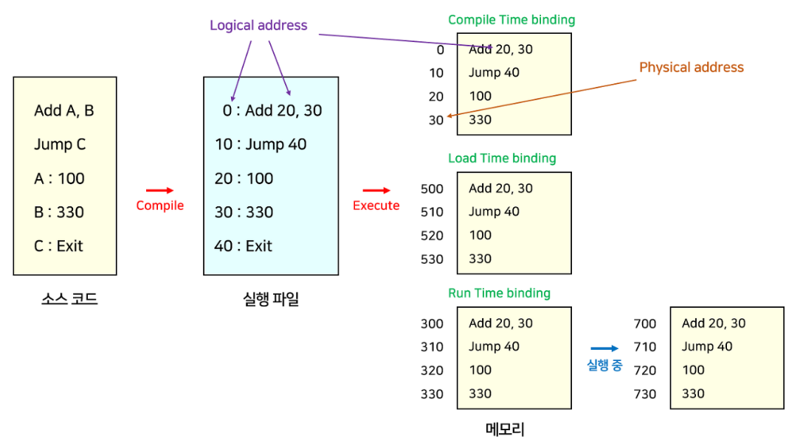
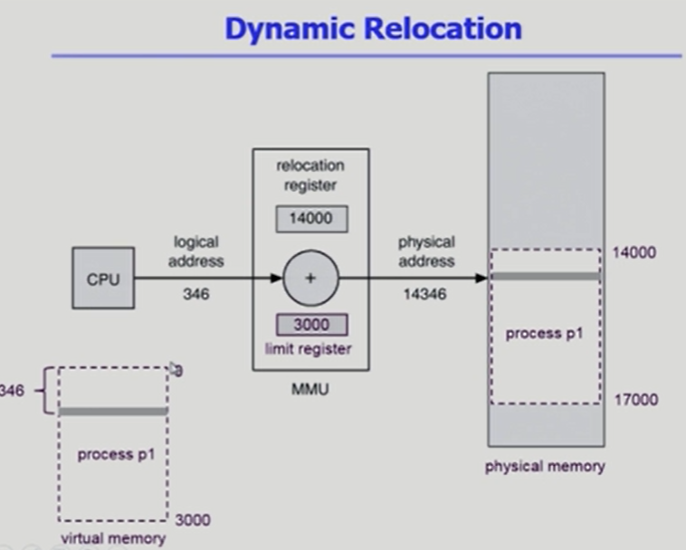
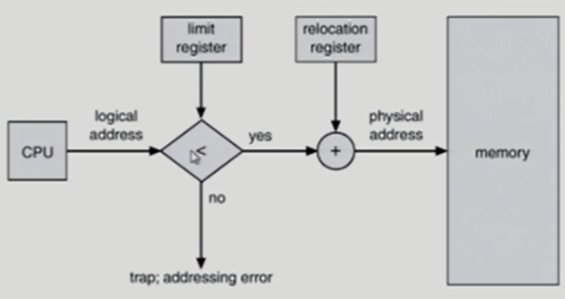
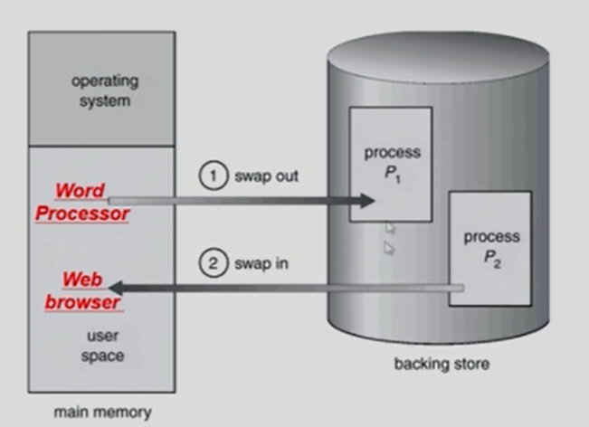
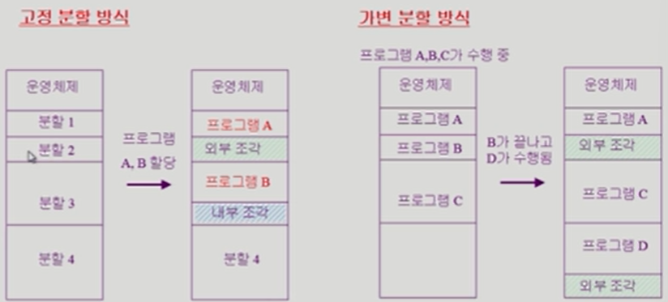
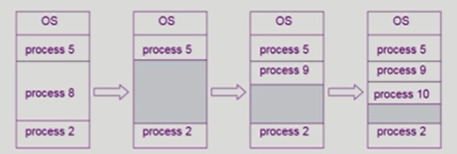

### 메모리 관리

#### Logical VS Physical Address

- **논리적인 주소/ 가상 주소 Logical address (=virtual address)**

  - 프로세스마다 ***독립적***으로 가지는 주소 공간
  - 각 프로세스마다 0번지부터 시작
  - CPU가 보는 주소는 logical address임
    - ❓왜?? 물리적 주소를 안보고 논리적인 주소를 보지???
    - 물리적 주소가 바인딩때 바뀔 수 있다. 하지만 소스코드는 (이것도 논리주소는 맞음) 실행시켜도 바뀌지 않는다. 주소 새로 바꾸고 싶으면 컴파일 다시 해야 한다.

- **물리적 주소 (Physical address)**

  - 메모리에 실제 올라가는 위치

- **주소 바인딩** : 주소를 결정하는 것

  - 주소 변환은 운영체제가 해주는 것이 아니라 하드웨어가 해준다!
  - ✅ ***논리적 주소만으로는 실제 메모리의 주소를 알 수 없기 때문에 논리 주소를 물리적 메모리로 연결시켜주는 작업***
  - 심볼릭 주소(Symbolic address) : 프로그래머가 코딩할 때 숫자로 된 주소에 데이터 저장하지 않고 변수명에 저장 => 변수명

  

#### 주소 바인딩(Address Binding)

- 주소 바인딩은 ***물리적 주소가 언제 결정되느냐***에 따라서 세 가지 바인딩으로 구분된다.
- **컴파일 타임 바인딩 (Compile time binding)**
  - 물리적 메모리 주소(physical address)가 컴파일 시 알려짐
  - 시작 위치 변경시 재컴파일
  - 컴파일러는 `절대 코드(absolute code)` 생성
    - 고정된 주소가 생성되기 때문에 위치가 변경된다면 재컴파일해주어야 하는 것
  - 옛날에 한 번에 하나의 프로그램만 돌릴 때 사용

- **로드 타임 바인딩 (Load time binding)**
  - Loader의 책임하에 물리적 메모리 주소 부여
  - 컴파일러가 재배치 가능 코드(relocatable code)를 생성한 경우 가능
  - 메모리에 올릴 때 Loader가 남은 공간을 찾아서 올림
- **실행 시간 바인딩 (Execution Time Binding = Run time binding)**
  - 수행이 시작된 이후에도 프로세스의 메모리 상 위치를 옮길 수 있음
  - CPU가 주소를 참조할 때마다(접근할 때마다) binding을 점검(address mapping table 필요)
    - 메모리 위치가 수시로 바뀌니까 그때그때마다 위치를 체크해줘야 한다.
  - 하드웨어적인 지원이 필요
    - (e.g, base and limit registers, ***MMU***)

#### 메모리 관리 장치 Meomry-Management Unit(MMU)

✅ CPU가 메모리에 접근하는 것을 관리하는 컴퓨터 하드웨어 부품

- 논리 주소(logical address)를 물리 주소(physical address)로 매핑해주는 Hardware device
- MMU scheme
  - 사용자 프로세스가 CPU에서 수행되며 생성해내는 모든 주소값에 대해 base register(=relocation register)의 값을 더한다
- user program
  - logical address만을 다룬다
  - 실제 physical address를 볼 수 없으며 알 필요가 없다

#### Hardware Support for Address Translation

운영 체제 및 사용자 프로세스 간의 메모리 보호를 위해 사용하는 레지스터

- Relocation register (=base register) : 접근할 수 있는 물리적 메모리 주소의 최소값
- Limit register : 논리적 주소의 범위

#### 몇 가지 기초 용어

##### Dynamic Loading

- 프로세스 전체를 메모리에 미리 다 올리는 것이 아니라 그때 그때 해당 루틴이 불려질 때 메모리에 load하는 것
- 장점 : memory utilization의 향상
  - 코드는 존재하는 모든 게 다 유용하게 돌아가는 것이 아니다 => 주로 사용되는 메코드를 돌려 효율성 높임
- 가끔씩 사용되는 많은 양의 코드의 경우 유용
  - ex) 오류 처리 루틴
- 운영체제의 특별한 지원 없이 프로그램 자체에서 구현 가능(OS는 라이브러리를 통해 지원 가능)
- Loading : 메모리에 올리는 것

##### Overlays

- 메모리에 프로세스의 부분 중 실제 필요한 정보만을 올림
- Dynamic Loading과 의미가 같지만 역사적으로 문맥이 조금 다르다
- 프로세스의 크기가 메모리보다 클 때 유용
- 운영체제의 지원 없이 사용자에 의해 구현
- 작은 공간의 메모리를 사용하던 초창기 시스템에서 수작업으로 프로그래머가 구현
  - "Manual Overlay"
  - 프로그래밍이 매우 복잡

##### Swapping

- 프로세스를 일시적으로 메모리에서 backing store로 쫓아내는 것
- Backing store(= swap area)
  - 디스크 : 많은 사용자의 프로세스 이미지를 담을 만큼 충분히 빠르고 큰 저장 공간
- Swap in/ Swap out
  - 일반적으로 중기 스케줄러(swapper)에 의해 swap out 시킬 프로세스 선정
  - priority-based CPU scheduling algorithm
    - priority가 낮은 프로세스를 swapped out 시킴
    - priority가 높은 프로세스를 메모리에 올려 놓음
  - Compile time 혹은 load time binding에서는 원래 메모리 위치로 swap in 해야 함
  - Execution time binding에서는 추후 빈 메모리 영역 아무 곳에나 올릴 수 있음
  - swap time은 대부분 transfer time (swap되는 양에 비례하는 시간)임

##### Dynamic Linking

- Linking을 실행 시간(=execution time)까지 미루는 기법
- Static linking(=> Static library)
  - 라이브러리가 프로그램의 실행 파일 코드에 포함됨
  - 실행 파일의 크기가 커짐
  - 동일한 라이브러리를 각각의 프로세스가 메모리에 올리므로 메모리 낭비(eg. printf 함수의 라이브러리 코드)
- Dynamic linking(=> Shared library) 
  - .so(shared object) / .dll라는 별도의 양식으로 존재
  - 라이브러리가 실행시 연결(link)됨
    - static linking과 다르게 라이브러리가 프로그램의 실행 파일 코드에 포함되어 있지 않음
  - 라이브러리 호출 부분에 라이브러리 루틴의 위치를 찾기 위한 stub이라는 작은 코드를 둠
  - 라이브러리가 이미 메모리에 있으면 그 루틴의 주소로 가고 없으면 디스크에서 읽어옴
  - 운영체제의 도움이 필요

 

#### Allocation of Physical Memory

- 메모리는 일반적으로 두 영역으로 나뉘어 사용

  

  - OS 상주 영역
    - interrupt vector와 함께 낮은 주소 영역 사용
  - 사용자 프로세스 영역
    - 높은 주소 영역 사용

- 사용자 프로세스 영역의 할당 방법

  - **연속 할당 (Contiguous allocation)**
    - 각각의 프로세스가 메모리의 연속적인 공간에 적재되도록 하는 것
    - Fixed partition allocation
    - Variable partition allocation
  - **불연속 할당 (Noncontiguoug allocation)**
    - 하나의 프로세스가 메모리의 여러 영역에 분산되어 올라갈 수 있음
    - Paging
    - Segmentation
    - Paged Segmentation

#### 연속 할당 (Contiguous allocation)

- **고정 분할 (Fixed partition) 방식**
  - 물리적 메모리를 몇 개의 영구적 분할(partition)로 미리 나눔
  - 분할의 크기가 모두 동일한 방식과 서로 다른 방식이 존재
  - 분할당 하나의 프로그램 적재
  - 융통성이 없음
    - 동시에 메모리에 load되는 프로그램의 수가 고정됨
    - 최대 수행 가능 프로그램 크기 제한
  - Internal fragmentation 발생 (external fragmentation도 발생)
- **가변 분할 (Variable partition) 방식**
  - 프로그램의 크기를 고려해서 할당
  - 분할의 크기, 개수가 동적으로 변함
  - 기술적 관리 기법 필요
  - External fragmentation 발생

- **Hole**
  - 가용 메모리 공간
  - 다양한 크기의 hole들이 메모리 여러 곳에 흩어져 있음
  - 프로세스가 도착하면 수용가능한 hole을 할당
  - 운영체제는 다음의 정보를 유지
    - a) 할당 공간 	b) 가용 공간(hole)

- **Dynamic Storage-Allocation Problem**
  - 가변 분할 방식에서 size n인 요청을 만족하는 가장 적절한 hole을 찾는 문제
  - **First-fit**
    - Size가 n 이상인 것 중 최초로 찾아지는 hole에 할당
    - 빨리 찾는 거라서 적절하다
  - **Best-fit**
    - Size가 n 이상인 가장 작은 hole을 찾아서 할당
    - Hole들의 리스트가 크기 순으로 정렬되지 않는 경우 모든 hole의 리스트를 탐색해야 함
    - 많은 수의 아주 작은 hole들이 생성됨
    - 공간적으로 제일 맞춤형으로 찾아서 적절하다
  - **Worst-fit**
    - 가장 큰 hole에 할당
    - 역시 모든 리스트를 탐색해야 함
    - 상대적으로 아주 큰 hole들이 생성됨
    - 당장 가장 큰 hole을 소진해버려서 이후를 도모하지 못해 비효율적이다
  - First-fit과 best-fit이 worst-fit보다 속도와 공간 이용률 측면에서 효과적인 것으로 알려짐(실험적인 결과)

- compaction
  - external fragmentation 문제를 해결하는 한 가지 방법
  - 사용 중인 메모리 영역을 한 군데로 몰고 hole들을 다른 한 곳으로 몰아 큰 block을 만드는 것
  - 매우 비용이 많이 드는 방법임
  - 최소한의 메모리 이동으로 compaction하는 방법(매우 복잡한 문제)
  - Compaction은 프로세스의 주소가 실행 시간에 동적으로 재배치 가능한 경우에만 실행할 수 있다