## 1 : N 관계

> Foreign Key

- 외래 키(외부 키)
- 관계형 데이터베이스에서 한 테이블의 필드 중 다른 테이블의 행을 식별할 수 있는 키
- 참조하는 테이블에서 속성(필드)에 해당하고, 이는 참조되는 테이블의 기본 키(Primary Key)를 가리킴
- 참조하는 테이블의 외래 키는 참조되는 테이블 행 1개에 대응됨
  - 이 때문에 참조하는 테이블에서 참조되는 테이블의 존재하지 않는 행을 참조할 수 없음
- 참조하는 테이블의 행 여러 개가 참조되는 테이블의 동일한 행을 참조할 수 있음
- ✔️ 1 대 N이란, 1개의 글에 N개의 댓글이 작성되는 것을 예시로 볼 수 있다!!!!!

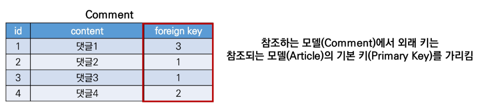


> Foreign Key 특징

- 키를 사용하여 부모 테이블의 `유일한 값`을 참조(참조 무결성)
- 외래 키의 값이 반드시 부모 테이블의 기본 키일 필요는 없지만 유일한 값이어야 함

👉`참조 무결성` 이란

- 데이터베이스 관계 모델에서 관련된 2개의 테이블 간의 일관성
- 외래 키가 선언된 테이블의 외래 키 속성(열)의 값은 그 테이블의 부모가 되는 테이블의 기본 키 값으로 존재해야 함


> ForeignKey field

- A many-to-ne relationship
- 2개의 위치 인자가 반드시 필요
  - 참조하는 model class
  - on_delete 옵션
- migrate 작업 시 필드 이름에 _id를 추가하여 데이터베이스 열 이름을 만듦


----


```python
# articles 내부 models.py

class Comment(models.Model):
    article = models.ForiegnKey(Article, on_delete=models.CASCADE)
    content = models.CharField(max_length=100)
    created_at = models.DateTimeField(auto_now_add=True)
    updated_at = models.DateTimeField(auto_now=True)  
    
    def __str__(self):
        return self.content
```

✔️ `on_delete`

- 외래 키가 참조하는 객체가 사라졌을 때 외래 키를 가진 객체를 어떻게 처리할 지를 정의
- 말인 즉슨 해당 게시글을 삭제했을 때, 그 글에 달린 댓글도 같이 삭제할지 어떻게 할지에 대해 이야기한다.
- Database Integrity(데이터 무결성)을 위해서 매우 중요한 설정
- on_delete 옵션에 사용 가능한 값들
  - `CASCADE` : 부모 객체(참조된 객체)가 삭제됐을 때 이를 참조하는 객체도 삭제
  - `PROTECT`
  - `SET_NULL`
  - `SET_DEFAULT`
  - SET()
  - DO_NOTHING
  - RESTRICT


> Migration

1. migrations 생성

```python
$ python manage.py makemigrations
```

2. migration 파일 확인


3. migrate

```python
$python manage.py migrate
```

4. articles_comment 테이블의 외래 키 컬럼 확인(필드 이름에 `_id`가 추가됨 )


> 댓글 생성 연습하기

```python
$ python manage.py shell_plus
```

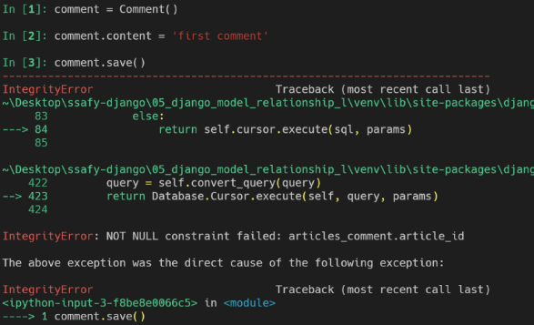

👉 이렇게 코드를 작성하면 에러가 발생한다.

articles_comment 테이블의 ForeignKeyField, article_id 값이 누락되었기 떄문!

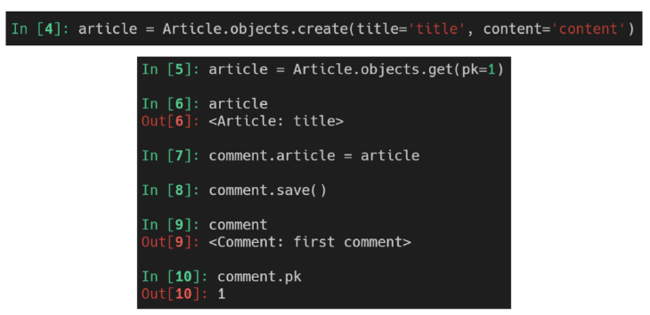

- 게시글 생성 후 댓글 생성 재시도

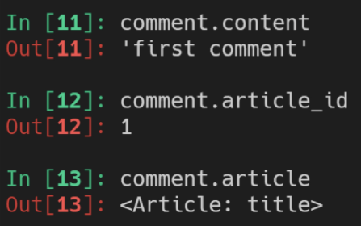

- 댓글 속성 값 확인
  - 실제로 작성된 외래 키 컬럼명은 article_id이기 때문에 article_pk로는 값에 접근할 수 없음

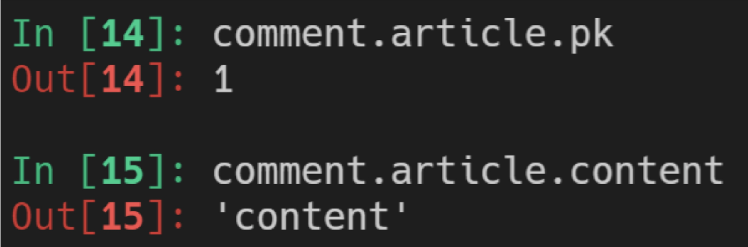

- comment 인스턴스를 통한 article 값 접근

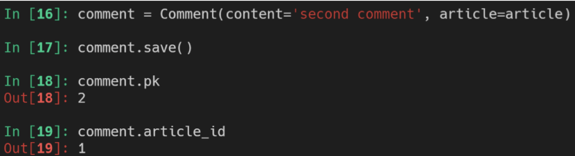

- 두 번째 댓글 작성 해보기

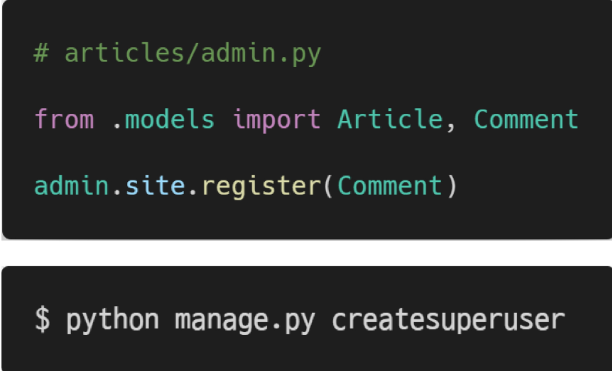

- admin site에서 작성된 댓글 확인하기


> 1:N 관계 related manager

- 역참조('comment_set')
  - Article(1) -> Comment(N)
  - article.comment 형태로는 사용할 수 없고, article.`comment_set` manager가 생성됨
  - 게시글에 몇 개의 댓글이 작성 되었는지 Django ORM이 보장할 수 없기 때문
    - article은 comment가 있을수도 있고, 없을 수도 있음
    - `실제로 Article 클래스에는 Comment와의 어떠한 관계도 작성되어 있지 않음`
- 참조('article')
  - Comment(N) -> Article(1)
  - 댓글의 경우 어떠한 댓글이든 반드시 자신이 참조하고 있는 게시글이 있으므로 , comment.article과 같이 접근할 수 있음
  - 실제 ForeignKeyField 또한 Comment 클래스에서 작성됨


> 1:N related manager 연습하기

1. dir() 함수를 통해 article 인스턴스가 사용할 수 있는 모든 속성, 메서드를 직접 확인하기

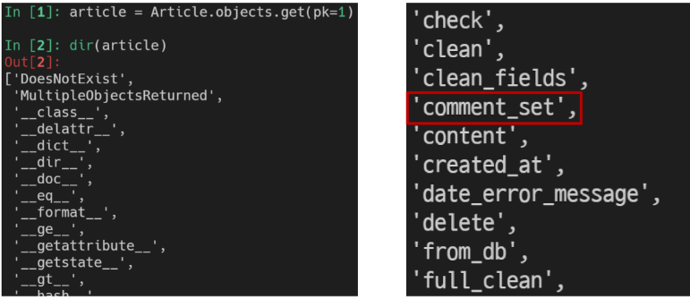

2. article의 입장에서 모든 댓글 조회하기(역참조, 1->N)

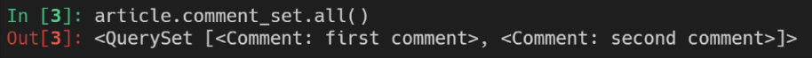

3. 조회한 모든 댓글 출력하기

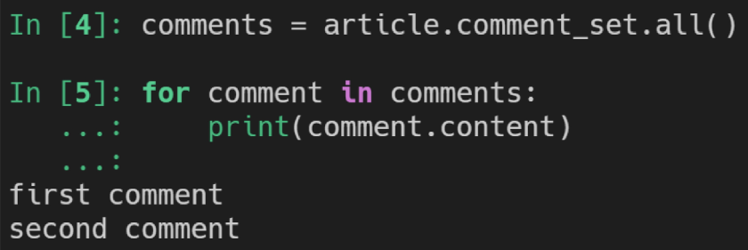

4. comment의 입장에서 참조하는 게시글 조회하기(참조, N->1)

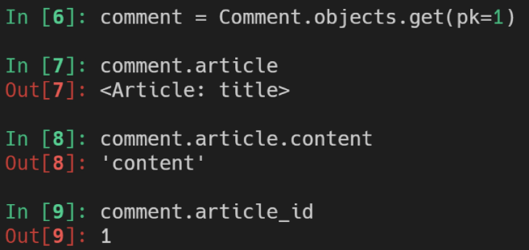


> ForeignKey arguments - 'related_name'

- 역참조 시 사용할 이름('model_set' manager)을 변경할 수 있는 옵션

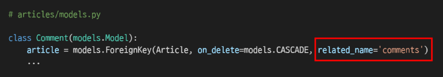

- 위와 같이 변경하면 article.comment_set은 더 이상 사용할 수 없고, `article.comments`로 대체됨
- 역참조 시 사용할 이름 수정 후, migration 과정 필요


-----


### Comment CREATE

```python
# articles/forms.py

from .models import Article, Comment

class CommentForm(forms.ModelForm):
    class Meta:
        model = Comment
        # fields = '__all__'
        # fields로 모든걸 보여주면 ForeignKeyField를 작성자가 직접 입력해야 하는 상황이 발생
        exclude = ('articles',)
```

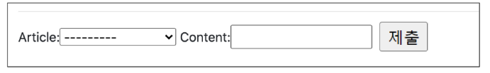

👉 이런 상황을 방지하기 위해 exclude를 작성해준다.

```python
# articles/views.py
# 기존 게시글 detail 페이지에서 comment만 추가한 것

from .forms import ArticleForm, CommentForm

def detail(request,pk):
    article = get_object_or_404(Article, pk=pk)
    comment_form = CommentForm()
    context = {
        'article' : article,
        'comment_form' : comment_form,
    }
    return render(request,'articles/detail.html',context)
```

```html
<!-- articles/detail.html -->

....
<a href=""BACK</a>
<hr>
<form action="" method="POST">
   	
   	{{ comment_form }}
    <input type="submit>"
</form>

```


> 댓글 작성 로직

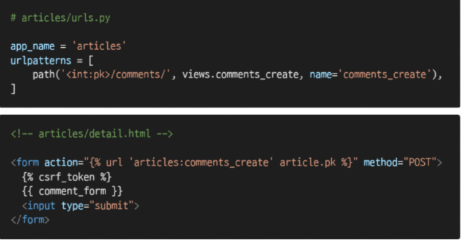


> THe 'save()' method

- save(commit=False)
  - 아직 `데이터베이스에 저장되지 않은 인스턴스를 반환`
  - 저장하기 전에 `객체에 대한 사용자 지정 처리를 수행할 때`유용하게 사용


> 댓글 출력

특정 article에 있는 모든 댓글을 가져온 후 context에 추가

```python
# articles/views.py

from .models import Article, Comment

def detail(request,pk):
    article = get_object_or_404(Article,pk=pk)
    comment_form = CommentForm()
    comments = article.comment_set.all()
    context = {
        'article' : article,
        'comment_form' : comment_form,
        'comments' : comments,
    }
    return render(request,'articles/detail.html',context)
```

```html
<!-- articles/detail.html -->

...
<a href="">BACK</a>
<hr>
<h4>댓글 목록</h4>
<ul>
    
    	<li>{{ comment.content }}</li>
    
</ul>
```


----

### Comment DELETE

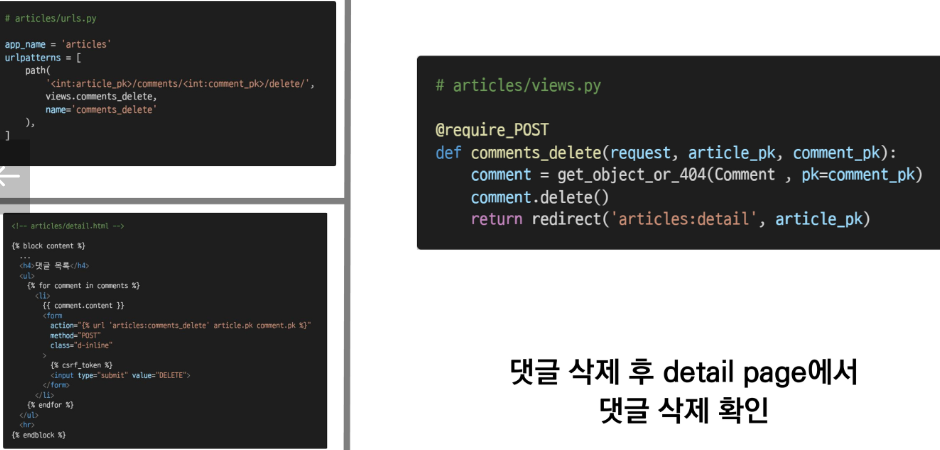

`if request.user.is_authenticated:`를 사용하여 인증된 사용자의 경우만 댓글 작성 및 삭제하도록 하기


-----


### COmment 추가사항

> 댓글 개수 출력하기

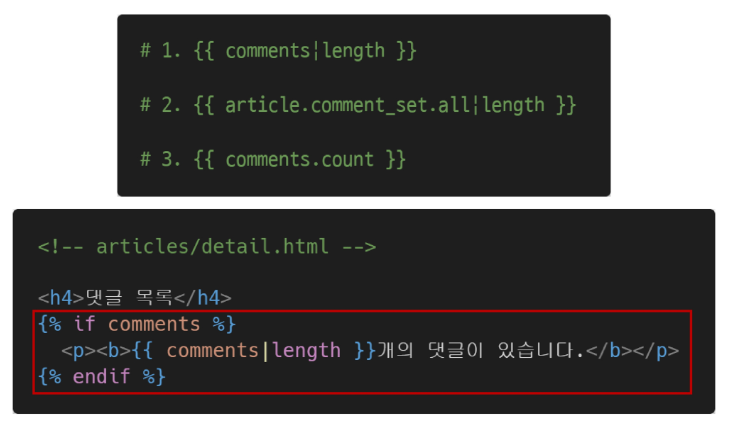


> 댓글이 없는 경우 대체 컨텐츠 출력(DTL의 for-empty 태그 활용)


-----


### Substituting a custom User model

> User 모델 대체하기

- 일부 프로젝트에서는 Django의 내장 User 모델이 제공하는 인증 요구사항이 적절하지 않을 수 있음
  - ex) username 대신 email을 식별 토큰으로 사용하는 것이 더 적합한 사이트
- Django는 User를 참조하는데 사용하는 `AUTH_USER_MODEL` 값을 제공하여, default user model을 재정의(override)할 수 있도록 함
- Django는 새 프로젝트를 시작하는 경우 기본 사용자 모델이 충분하더라도, 커스텀 유저 모델을 설정하는 것을 강력하게 권장
  - 단, 프로젝트의 모든 migrations 혹은 첫 migrate를 실행하기 전에 이 작업을 마쳐야 함


> AUTH_USER_MODEL

- User를 나타나는데 사용하는 모델
- 프로젝트가 진행되는 동안 변경할 수 없음
- 프로젝트 시작 시 설정하기 위한 것이며, 참조하는 모델은 첫번째 마이그레이션에서 사용할 수 있어야 함
- 기본 값 : 'auth.User'(auth 앱의 User 모델)


> Custom User 모델 정의하는 단계

1. 관리자 권한과 함께 완전한 기능을 갖춘 User 모델을 구현하는 기본 클래스인 AbstactUser를 상속받아 새로운 User 모델 작성

```python
from django import models
from django.contrib.auth.models import AbstactUser

class User(AbstractUser):
    pass
```

2. 기존에 Django가 사용하는 User 모델이었던 auth 앱의 User 모델을 accounts 앱의 User 모델을 사용하도록 변경

```python
# settings.py
AUTH_USER_MODEL = 'accounts.User'
```

3. admin site에 Custom User 모델 등록

```python
# accounts/admin.py

from django.contrib.auth.admin import UserAdmin
from .models import User

admin.site.register(User,UserAdmin)
```

4. 프로젝트 중간에 진행했기 때문에 데이터베이스를 초기화한 후 마이그레이션 진행
   1. db.sqlite3 파일 삭제
   2. migrations 파일 모두 삭제(파일명에 숫자가 붙은 파일만 삭제)


### 1:N


장고에서 app이 실행되는 순서

1. INSTALLED_APP에서 순차적으로 APP import
2. 각 앱의 models를 import
3. 