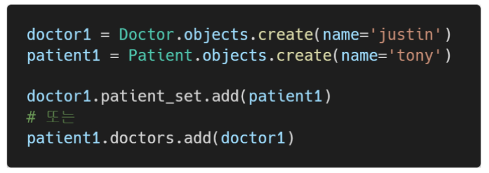

### INTRO) 병원 진료 기록 시스템

> 1:N의 한계

- 1번 환자(Tony)가 1번 의사의 진료를 마치고, 2번 의사에게도 방문하려고 한다면, 새로운 예약을 생성해야 한다.
- 기존의 예약을 유지한 상태로 새로운 예약을 생성
- 새로 생성한 3번 환자(Tony)는 1번 환자(Tony)와 다름

- 한 번에 두 의사에세 진료를 받고자 함
- 하나의 외래 키에 2개의 의사 데이터를 넣을 수 없음

- 새로운 예약을 생성하는 것이 불가능
  - 새로운 객체를 생성해야 함
- 여러 의사에게 진료 받은 기록을 환자 한 명에게 저장할 수 없음
  - 외래 키에 '1,2' 형식의 데이터를 사용할 수 없음

> 중개 모델

----

> ManyToManyField

- 다대다(M:N, many-to-many) 관계 설정 시 사용하는 모델 필드
- 하나의 필수 위치인자(M:N 관계로 설정할 모델 클래스)가 필요

👉 의사 1명과 환자 2명 생성

👉 예약된 의사/ 환자 목록 확인

👉  예약 생성(역참조)

----

> related_name

- target model(관계 필드를 가지지 않은 모델)이 source model(관계 필드를 가진 모델)을 참조할 때 사용할 manager의 이름을 설정
- 즉, 역참조 시에 사용하는 manager의 이름을 설정
- ForeignKey의 related_name과 동일

---

##### 1:N 관계는 완전한 종속 관계지만, M:N 관계는 의사에게 진찰받는 환자, 환자를 진찰하는 의사의 두가지 형태로 모두 표현이 가능한 것

----

### ManyTomanyField's 개념 및 특징

- 다대다(M:N, many-to-many) 관계 설정 시 사용하는 모델 필드
- 하나의 필수 위치인자(M:N 관계로 설정할 모델 클래스)가 필요
- 모델 필드의 RelatedManager를 사용하여 관련 개체를 추가, 제거 또는 만들 수 있음
  - add(), remove(), create(), clear() ...

##### ✅related_name

- target model(관계 필드를 가지지 않은 모델)이 source model(관계 필드를 가진 모델)을 참조할 때(역참조 시) 사용할 manager의 이름을 설정
- ForeignKey의 related_name과 동일

##### ✅through

- 중개 테이블을 직접 작성하는 경우, through 옵션을 사용하여 중개 테이블을 나타내는 Django 모델을 지정할 수 있음
- 일반적으로 중개 테이블에 추가 데이터를 사용하는 다대다 관계와 연결하려는 경우에 주로 사용됨

##### ✅ symmetrical

- ManyToManyField가 동일한 모델(on self)을 가리키는 정의에서만 사용
- symmetrical = True(기본값)일 경우 Django는 person_set 매니저를 추가하지 않음
- source 모델의 인스턴스가 target 모델의 인스턴스를 참조하면, target 모델 인스턴스도 source 모델 인스턴스를 자동으로 참조하도록 함
  - 즉, 내가 당신의 친구라면 당신도 내 친구가 되는 것
  - 대칭을 원하지 않는 경우 False로 설정
  - Follow 기능 구현에서 확인할 수 있음

> Related Manager

- 1:N 또는 M:N 관련 컨텍스트에서 사용되는 매니저
- 같은 이름의 메서드여도 각 관계(1:N, M:N)에 따라 다르게 사용 및 동락
  - 1:N에서는 target 모델 인스턴스만 사용 가능
  - M:N 관계에서는 관련된 두 객체에서 모두 사용 가능
- 메서드 종류
  - add(), remove(), create(), clear(), ser() 등

✔️ add()

- "지정된 객체를 관련 객체 집합에 추가"
- 이미 존재하는 관계에 사용하면 관계가 복제되지 않음
- 모델 인스턴스, 필드 값(PK)을 인자로 허용

✔️ remove()

- "관련 객체 집합에서 지정된 모델 객체를 제거"
- 내부적으로 QuerySet.delete()를 사용하여 관계가 삭제됨
- 모델 인스턴스, 필드 값(PK)을 인자로 허용

