## Database

> 데이터베이스(DB)

- 데이터베이스는 `체계화된 데이터`의 모임
- 여러 사람이 공유하고 사용할 목적으로 통합 관리되는 정보의 집합
- 논리적으로 연관된 (하나 이상의) 자료의 모음으로 그 내용을 고도로 구조화 함으로써 검색과 갱신의 효율화를 꾀한 것
- 즉, `몇 개의 자료 파일을 조직적으로 통합`하여 `자료 항목의 중복을 없애`고 `자료를 구조화하여 기억`시켜 놓은 `자료의 집합체`


> 관계형 데이터베이스(RDB)

- Relational Database
- 키(Key)와 값(Value)들의 간단한 관계(relation)를 표(table) 형태로 정리한 데이터베이스


> 관계형 데이터베이스 용어 정리

✔️ `스키마` : 데이터베이스에서 자료의 구조, 표현방법, 관계 등 전반적인 명세를 기술한 것.

✔️ `테이블` : 열(컬럼/필드)과 행(레코드/값)의 모델을 사용해 조직된 데이터 요소들의 집합

✔️ `열` : 각 열에는 고유한 데이터 형식이 지정됨. 열/ 컬럼/ 필드 등의 이름으로 불림(ex. name, address, age)

✔️ `행` : 실제 데이터가 저장되는 형태. 행/ 로우/ 레코드 등의 이름으로 불림. (ex. 홍길동, 제주, 20)

✔️ `기본키` : 각 행(레코드)의 고유 값. 반드시 설정해야 하며, 데이터베이스 관리 및 관계 설정 시 주요하게 활용됨 


> SQLite

: 서버 형태가 아닌 파일 형식으로 응용 프로그램에 넣어서 사용하는 `비교적 가벼운 데이터베이스`


----


## SQL

> SQL

- 관계형 데이터베이스 관리시스템의 `데이터 관리`를 위해 설계된 `특수 목적으로 프로그래밍 언어`
- 데이터베이스 스키마 생성 및 수정
- 자료의 검색 및 관리
- 데이터베이스 객체 접근 조정 관리


> SQL 분류

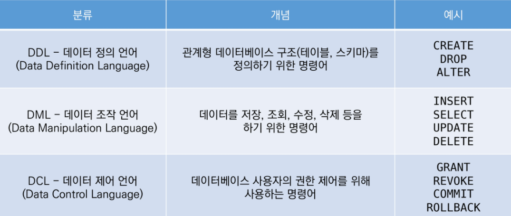

- INSERT : 새로운 데이터 삽입(추가)
- SELECT : 저장되어있는 데이터 조회
- UPDATE : 저장되어있는 데이터 갱신
- DELETE : 저장되어있는 데이터 삭제


> 테이블 생성 및 삭제

```python
$ sqlite3 tutorial.sqlite3
sqlite> .database
```

`.`은 sqlite 프로그램 기능을 실행하는 것


> csv 파일을 table로 만들기

```python
sqlite> .mode csv
sqlite> .import hellodb.csv examples
sqlite> .tables
exampltes
```


> SELECT

```python
SELECT * FROM examples;
1,"길동","홍",600,"충청도",010-0000-0000
```

SELECT 문은 특정 테이블의 레코드(행) 정보를 반환!


> 테이블 생성 및 삭제 statement

`CREATE TABLE` : 데이터베이스에서 테이블 생성

`DROP TABLE` : 데이터베이스에서 테이블 제거

```python
CREATE TABLE classmates (
id INTEGER PRIMARY KEY,
name TEXT
);

sqlite> .tables
classmates examples

----

DROP TABLE classmates;
```


> 특정 테이블의 schema 조회

```python
sqlite> .schema classmates
CREATE TABLE classmates (
id INTEGER PRIMARY KEY,
name TEXT
);
```


----


### READ

> SELECT statement

- 테이블에서 데이터를 조회
- SELECT 문은 SQLite에서 가장 복잡한 문이며 다양한 절(clause)와 함께 사용
  - ORDER BY, DISTINCT, WHERE, LIMIT, GROUP BY ...

👉 `LIMIT` : 쿼리에서 반환되는 행 수를 제한. 특정 행부터 시작해서 조회하기 위해 `OFFSET` 키워드와 함께 사용하기도 함

👉 `WHERE` : 쿼리에서 반환된 행에 대한 특정 검색 조건을 지정

👉 `SELECT DISTINCT` : 조회 결과에서 중복 행을 제거. DISTINCT 절은 SELECT 키워드 바로 뒤에 작성해야 함


> LIMIT

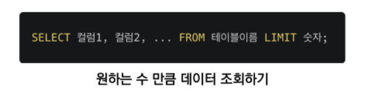

> OFFSET

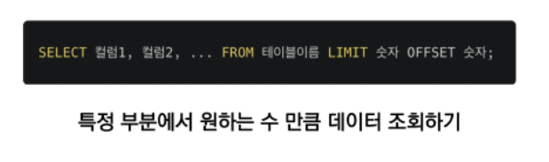

> WHERE

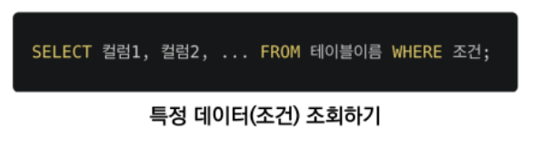

> DISTINCT

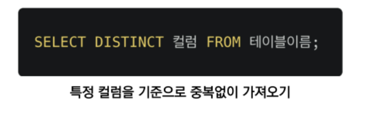


----


### DELETE

= 테이블에서 행을 제거

> DELETE


👉 어떤 기준으로 데이터를 삭제하면 좋을까? `중복 불가능한(UNIQUE) 값인 rowid`를 기준으로!!

SQLite는 기본적으로 rowid 를 `재사용`한다!!


> AUTOINCREMENT

= SQLite가 사용되지 않은 값이나 이전에 삭제된 행의 값을 재사용하는 것을 방지

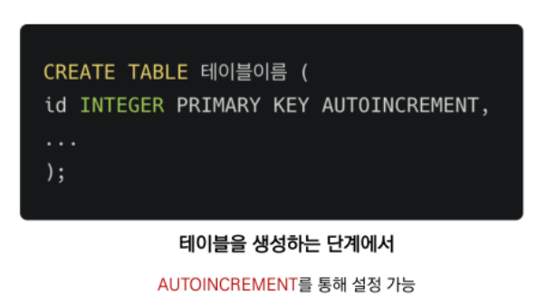


----


### UPDATE

- 기존 행의 데이터를 수정
- SET clause에서 테이블의 각 열에 대해 새로운 값을 설정


> UPDATE

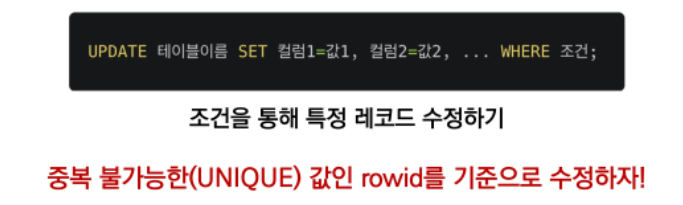


----


#### CRUD 정리하기

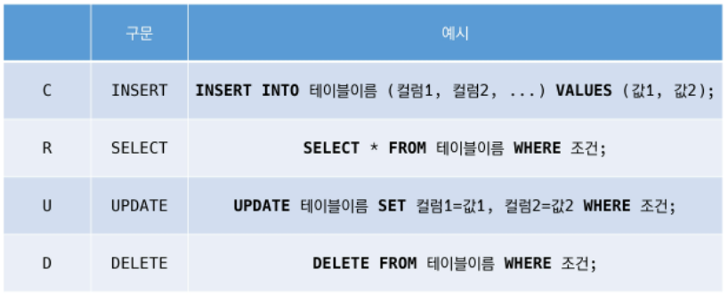


---


### SQLite Aggregate Functions

> Aggregate function

- "집계 함수"
- 값 집합에 대한 계산을 수행하고 단일 값을 반환
  - 여러 행으로부터 하나의 결괏값을 반환하는 함수
- SELECT 구문에서만 사용됨
- 예시
  - 테이블 전체 행 수를 구하는 COUNT(*)
  - age 컬럼 전체 평균 값을 구하는 AVG(age)
- 종류
  - COUNT : 그룹의 항목 수를 가져옴
  - AVG : 모든 값의 평균을 계산
  - MAX : 그룹에 있는 모든 값의 최대값을 가져옴
  - MIN : 그룹에 있는 모든 값의 최소값을 가져옴
  - SUM : 모든 값의 합을 계산


> LIKE

- 패턴 일치를 기반으로 데이터를 조회하는 방법
- SQLite는 패턴 구성을 위한 2개의 wildcard를 제공
  - %(percent sign) : 0개 이상의 문자
  - _(underscore) : 임의의 단일 문자

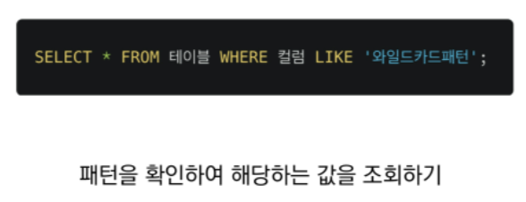

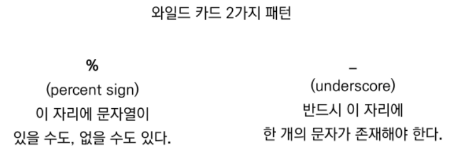


> ORDER BY

- 조회 결과 집합을 정렬
- SELECT 문에 추가하여 사용
- 정렬 순서를 위한 2개의 keyword 제공
  - asc
  - DESC

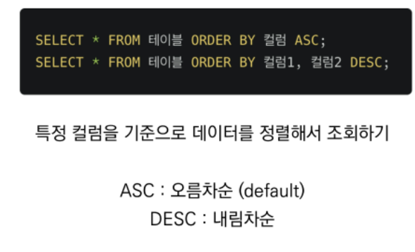


> GROUP BY

- 행 집합에서 요약 행 집합을 만듦
- SELECT 문의 optional 절
- 선택된 행 그룹을 하나 이상의 열 값을 요약 행으로 만듦
- 문장에 WHERE 절이 포함된 경우 반드시 WHERE 절 뒤에 작성해야 함

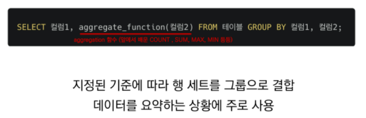
