## Django Form

> 장고의 기본 흐름

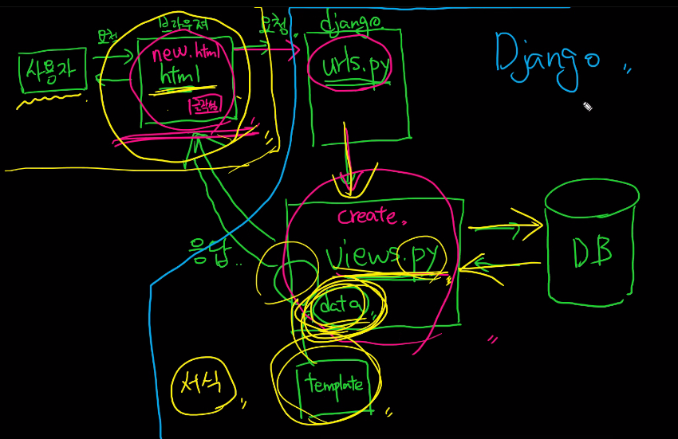

> Django's forms

- Form은 Django의 유효성 검사 도구 중 하나로 외부의 악의적 공격 및 데이터 손상에 대한 중요한 방어 수단
- Django는 Form과 관련한 유효성 검사를 단순화 하고 자동화할 수 있는 기능을 제공하여 개발자로 하여금 직접 작성하는 코드보다 더 안전하고 빠르게 수행하는 코드를 작성할 수 있게 함
- Django는 form에 관련된 작업의 아래 세 부분을 처리해줌
  - 렌더링을 위한 데이터 준비
  - 데이터에 대한 HTML forms 생성
  - 클라이언트로부터 받은 데이터 수신 및 처리

> The Django 'Form Class'

- Django Form 관리 시스템의 핵심
- Form 내 field, field 배치, 디스플레이 widget, label, 초기값, 유효하지 않는 field에 관련된 에러 메시지를 결정
- Django는 사용자의 데이터를 받을 때 해야 할 과중한 작업(데이터 유효성 검증, 필요시 입력된 데이터 검증 결과 재출력, 유효한 데이터에 대해 요구되는 동작 수행 등)과 반복 코드를 줄여줌

> Form 선언하기

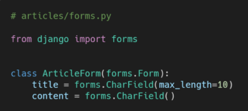

- Model을 선언하는 것과 유사하며 같은 필드타입을 사용(또한, 일부 매개변수도 유사함)
- forms 라이브러리에서 파생된 Form 클래스를 상속받음

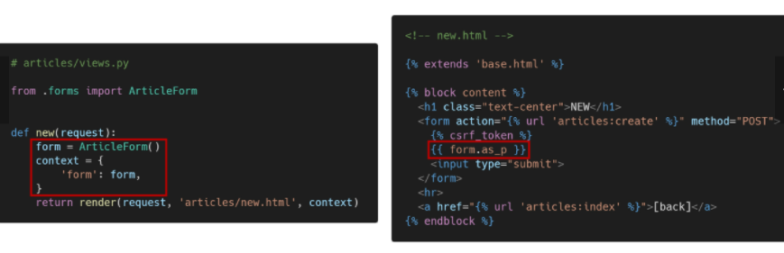

- forms.py에서 작성한 class를 views.py에서 한 번 불러주고 그걸 html 문서에서 읽혀주면 된다.

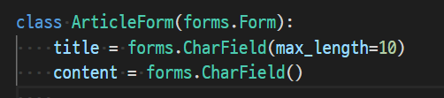

👉 Model과 비슷한 유형으로 가고 있다! 다만 차이점은 CharField를 사용하고 있다는 것. TextField를 사용하고 있지 않다.

👉form은 사용자의 내용을 받는 역할을 한다

👉 만약에 부트스트랩으로 꾸며주고 싶다면, forms.TextInput(attrs={'size':10, 'title':'Yourname}) 처럼 attrs에다가 class를 넣고 class = text-primary 이런 식으로 넣어주면 된다.

----

> From rendering options

- as_p() : 각 필드가 단락(
 태그)으로 감싸져서 렌더링됨
- as_ul() : 각 필드가 목록 항목(<li> 태그)으로 감싸져서 렌더링됨 / <ul> 태그는 직접 작성해야 함
- as_table() : 각 필드가 테이블(<tr> 태그) 행으로 감싸져서 렌더링 됨 / <table> 태그는 직접 작성해야 함

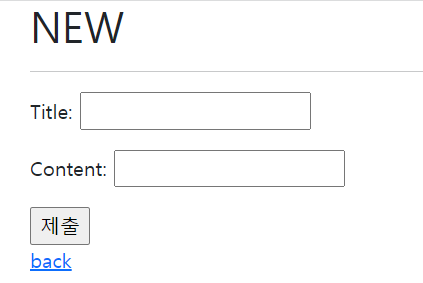

👉 form 태그를 사용하면 굳이 다 작성 안해도 이렇게 출력이 되는데, .p 로 감싸면 p 태그처럼 각 줄 처리가 된다!

-----

> Django의 HTML input 요소 표현 방법 2가지

##### ❤️ Form fields

= input에 대한 유효성 검사 로직을 처리하며 템플릿에서 직접 사용됨

##### 💙 Widgets

= 웹 페이지의 HTML input 요소 렌더링

= GET / POST 딕셔너리에서 데이터 추출

= widgets은 반드시 Form fields에 할당됨

​	⭐주의사항 : Form fields와 혼동되어서는 안됨. Form fields는 input 유효성 검사를 처리. widgets은 웹 페이지에서 input element의 단순 raw한 렌더링 처리

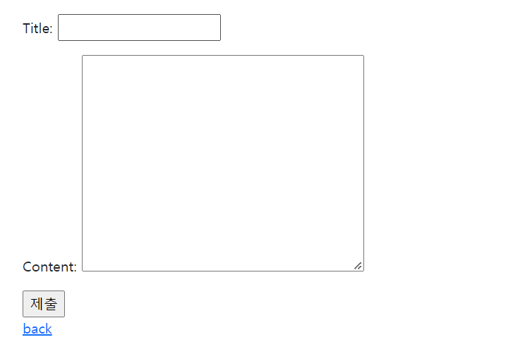

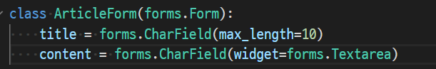

작성할 때 위젯이나 Field 를 사용하면 된다! 중요한 것은 위젯은 단독으로 사용안되고 Field에 상속되기 때문에 Field를 작성하고 해줘야한다. Field에서 제공해줄 수 없는 것들은 위젯을 사용하면 된다.

https://docs.djangoproject.com/en/4.0/ref/forms/widgets/

위젯 뭐뭐가 있는지 위 사이트 참조하기

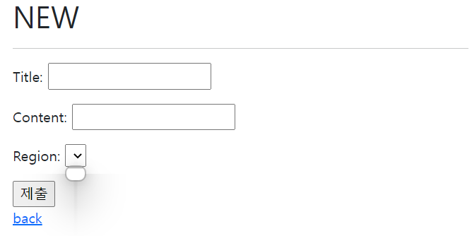

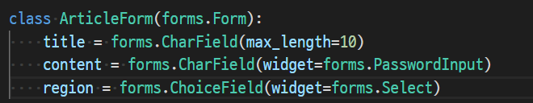

choiceField를 사용하면 선택 가능한 창이 뜬다. 아직 선택지를 작성하지 않은 상태.

일반적으로 new.html 파일에 option을 직접 하나하나 작성해줬을 테지만, forms.py에서 입력이 가능하다.

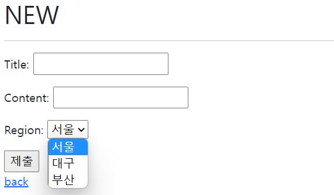

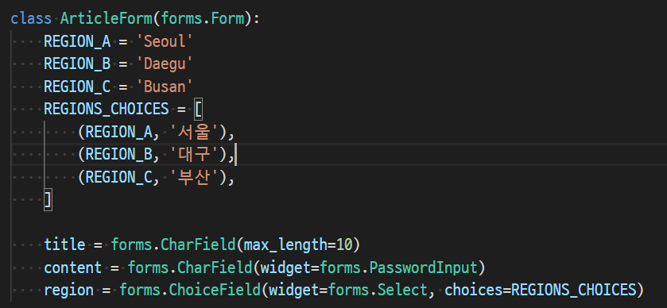

튜플의 오른쪽에 있는 부분은 사용자에게 출력되는 값이고 왼쪽은 value 값이다. select가 기본값이기 때문에 ChoiceField 내부의 widget=forms.Select 부분은 없어도 되는 값이다.

https://docs.djangoproject.com/en/dev/internals/contributing/writing-code/coding-style/

choiceField 등 구조를 확인할 수 있는 사이트 참조하기!!

----

### ModelForm

- Django Form을 사용하다보면 Model에 정의한 필드를 유저로부터 입력받기 위해 Form에서 Model 필드를 재정의하는 행위가 중복될 수 있음

- 그래서 Django는 Model을 통해 Form Class를 만들 수 있는 ModelForm이라는 Helper를 제공
- ModelForm이 쉽게 해주는 것
  1. 모델로 만들어진 테이블 필드 속성에 맞는 HTML element를 만들어준다.
  2. 이를 통해 받은 데이터를 view 함수에서 유효성 검사를 할 수 있도록 함

1. 기존의 Form을 ModelForm으로 변경해보기

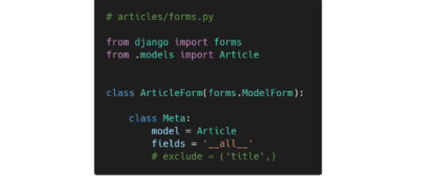

2. forms 라이브러리에서 파생된 ModelForm 클래스를 상속받음 / 정의한 클래스 안에 Meta 클래스를 선언하고, 어떤 모델을 기반으로 Form을 작성할 것인지에 대한 정보를 Meta 클래스에 지정(클래스 변수 fields와 exclude는 동시에 사용할 수 없음)

> Meta class

- Model의 정보를 작성하는 곳
- ModelForm을 사용할 경우 사용할 모델이 있어야 하는데 Meta Class가 이를 구성함
  - 해당 Model에 정의한 field 정보를 Form에 적용하기 위함
- 정보의 정보. 부가설명. like a picture. 해당 폼 클래스를 다시 설명해주는 설정값이라고 생각하면 된다. class 안에 다시 메타 class를 정의해주고 model 정보와 field 정보를 작성해야 에러가 발생하지 않는다.

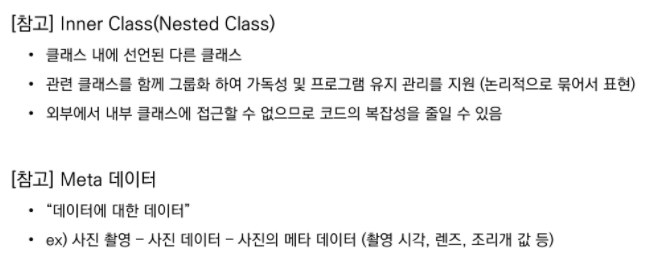

> is_valid() method

- 유효성 검사를 실행하고, 데이터가 유효한지 여부를 boolean으로 반환
- 데이터 유효성 검사를 보장하기 위한 많은 테스트에 Django는 is_valid()를 제공

- 함수 이름이 is로 시작하면 return 값이 boolean이다로 해석하면 된다. True 아니면 False가 나올 것이다.

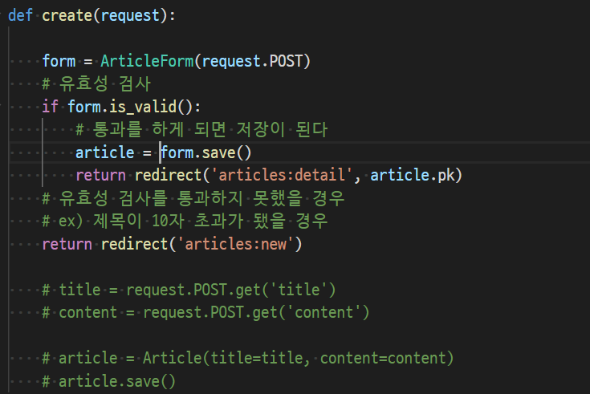

1) ModelForm을 이용해서 전달되는 request.POST 정보를 가지는 인스턴스를 생성
2) 인스턴스의 유효성 검사

> The save() method

- Form에 바인딩 된 데이터에서 데이터베이스 객체를 만들고 저장
- ModelForm의 하위(sub) 클래스는 기존 모델 인스턴스를 키워드 인자 instance로 받아들일 수 있음
  - 이것이 제공되면 save()는 해당 인스턴스를 수정(update)
  - 제공되지 않은 경우 save()는 지정된 모델의 새 인스턴스를 만듦(create)
- Form의 유효성이 확인되지 않은 경우(hasn't been validated) save()를 호출하면 form.errors를 확인하여 에러 확인 가능

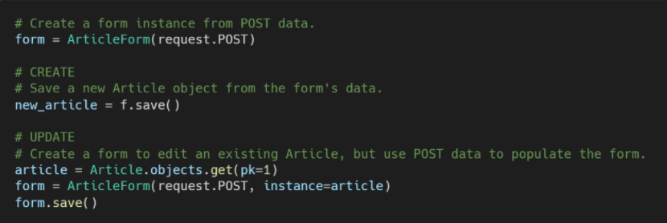

> new와 create 합치기

1. new view 함수, url path 삭제

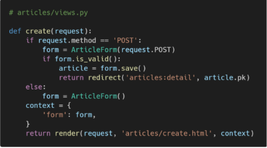

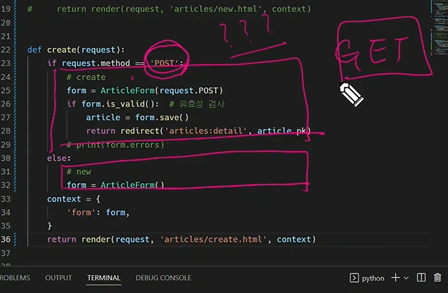

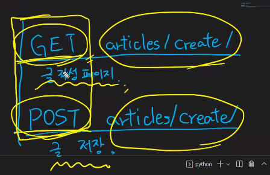

✔️ 왜 POST 부터 봤나? 사실 GET부터 작성해도 틀린 구조는 아니다. 하지만!

- if request.method == 'POST'  : 만약 POST일때

- else:  GET일때? 사실은 POST가 아닌 다른 모든 메서드일때 라고 해석해야 한다! else 안에 작성된 구문은 별 역할을 하는 것이 없다. DB를 조작하는 경우가 없다.

지금 현재 POST일 때의 구문에서만이 DB를 조작하는 코드를 작성한 상태

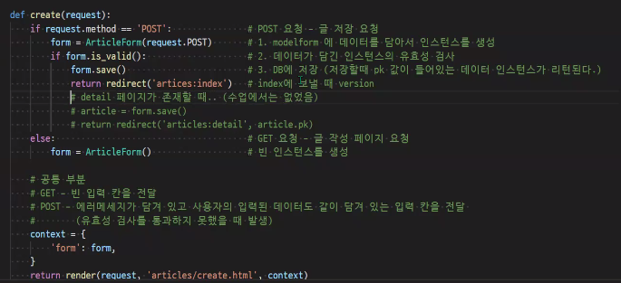

2. new.html -> create.html 이름변경 / 이제는 action 값이 없어도 동작

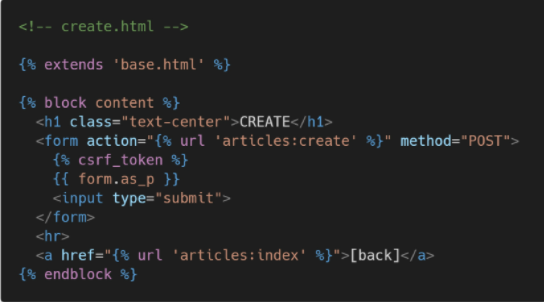

3. create 페이지 링크 작성. input 태그에 공백 데이터를 넣어보고 글 작성 -> 에러 메시지 출력 확인

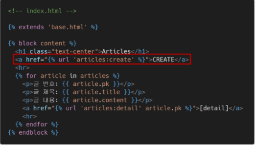

##### ✔️ 팁 아닌 팁, 알고 넘어가자!

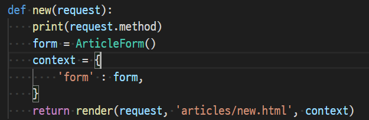

print 찍으면 밑 터미널에서 GET 인지 POST 인지 알려준다!!!!

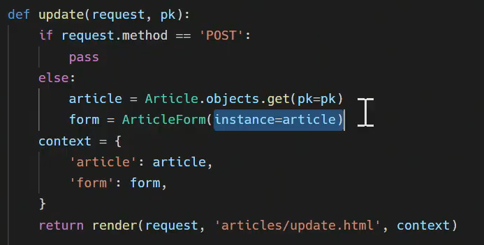

edit 페이지를 없애고 update에 합칠 경우, instance=article을 작성해줘야지만이 value 값 작성하든 기존 데이터를 불러올 수 있다.

> modelform과 form

✅ modelform 

- 모델 정보를 가지고 있음.
- Django가 해당 model에서 양식에 필요한 대부분의 정보를 이미 정의
- 어떤 레코드를 만들어야할지 알고 있으므로 바로 .save() 호출 가능

✅ form 

- 모델 정보를 가지고 있지 않다. 사용자로부터 입력은 받아야 하는데 저장할 필요가 없는 경우에 사용. 대표적인 예시로 로그인
- 어떤 Model에 저장해야 하는지 알 수 없으므로 유효성 검사 이후 cleaned_data 딕셔너리를 생성
- cleaned_data 딕셔너리에 데이터를 가져온 후 .save() 호출해야 함
- Model에 연관되지 않은 데이터를 받을 때 사용
- cleaned_data = form '만' 사용할 때 작성. 

메인은 모델폼이고 때때로 폼을 사용한다.

> Widgets 작성하기

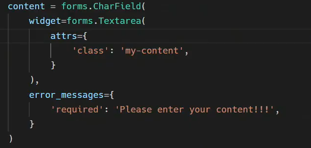

인덴테이션 꼭 맞춰주기!!!

class = "form-control" > 위젯 꾸미는 클래스명 - 위젯에 직접 부트스트랩 클래스 적용한다!

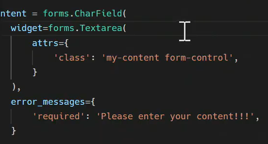

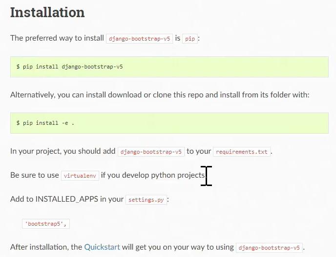