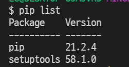
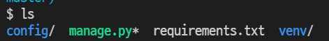
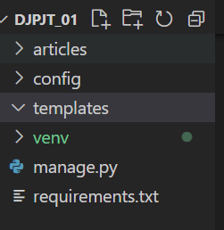
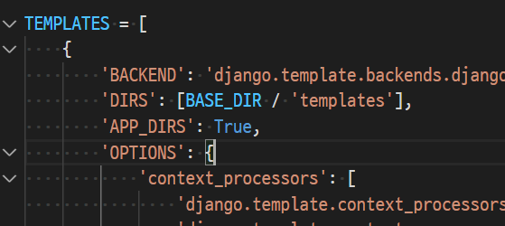

## Django

> Django 실행시키는 방법

1. 가상환경 생성 및 실행

   ```python
   python -m venv venv
   source venv/Scripts/activate
   위와 같이 가상환경 만들고 나서 pip list로 제대로 만들어졌는지 확인하기
   ```

   

2. 장고 3.2 LTS 버전 설치

```python
pip install django==3.2.12
pip freeze > requirements.txt
```

3. project 생성

```python
django-admin startproject config .
```



4. app 생성 및 등록

```python
python manage.py startapp articles
```

​	config > settings.py 내부 INSTSALLED_APPS 안에 articles 추가

5. 프로젝트 폴더 바로 아래에 'templates'라는 폴더 생성



6. settings.py에 TEMPLATES에 있는 DIRS 리스트에 'templates' 경로 등록

​	(BASE_DIR/'templates')



7. base.html을 생성하고 꾸민다.
8.  실행할때 python manage.py runserver