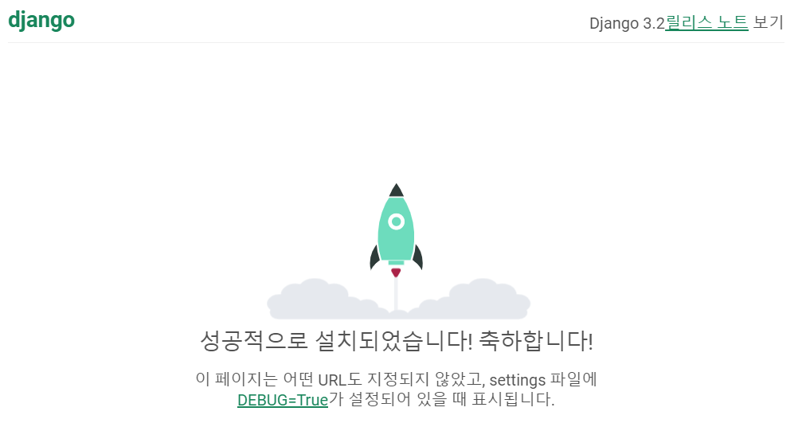

## DJANGO가 무엇인가

### 🎨 우리가 하고자 하는 것 : 웹 서비스 => 요청과 응답


요청은 크롬, 인터넷 익스플로러 같은 클라이언트가 하고, HTML과 CSS는 server가 응답으로 보여주는 결과물이다.

우리는 지금 server라는 친구를 Django로 배우고 있는 것이다! Java에 Spring이라는 것이 있는데 이것이 Django랑 비슷한 역할을 하는 것이다.

참고로 Django는 언어가 아니라 웹 기반 프레임워크라고 하고, Spring 또한 언어가 아니라 프레임워크이다. 


> 왜 장고를 쓰는가?

카페 창업을 떠올려보면 된다. 프랜차이즈 or 개인카페 중 창업하기 더 쉬운건 매뉴얼도 있고 지원도 있는 프랜차이즈를 선택하는 것이 낫다. 마찬가지로 장고를 사용하는 것이 더 수월하기 때문.

파이썬 자체로도 서버를 만들수는 있다. 다만 장고가 더 생산성 있어서 파이썬으로 안하고 장고로 만드는 것.


-----

### 지금부터 장고를 만들어보자

▶ 미리보기

1) 가상환경 - 생성, 활성화/ 비활성화
2) 장고 설치/ requirements.txt 만들기
3) 프로젝트 생성/ 앱 등록
4) 서버실행
5) url 세팅 > 어디로 요청을 보낼까? 

----


#### ❤ 가상환경 - 생성, 활성화/ 비활성화

가상환경이란? = 독립된 개발환경

```python
python -m venv venv
```

👉 venv라는 가상환경의 이름을 venv로 지어준 것이다.

```python
source venv/Scripts/activate 
```

👉 이거는 / 로 안으로 들어가는 것이다. 가상공간이라는 스위치를 켜는것(만들어주는 것). 여기까지 했다면 pip list로 제대로 만들어졌는지 확인하기

👉 만약 venv 없애려면 deactivate를 그냥 스위치 꺼주듯이 눌러주면 된다. 이때 pip list를 통해 확인하면 뭐가 주르륵 엄청 생기는데 이 말은 결국 가상환경이라는 스위치를  끈 것. 


#### 🧡장고 설치/ requirements.txt 만들기

```python
pip install django==3.2.12
pip freeze > requirements.txt
```

👉 장고 버전을 무조건 확인하고 설치해주기.

👉 pip freeze > requirements.txt 하는 이유 : 같이 프로젝트 하는 사람들끼리 버전 달라지면 문제가 생긴다. 그래서 지금 내가 깐 모든 것들의 버전을 얼려달라고 하는 것!

👉 pip install -r requirements.txt 를 작성하면 그 안에 작성된 모든 버전들의 라이브러리들을 한번에 설치해준다!!!!


#### 💛프로젝트 생성/ 앱 등록

```python
django-admin startproject <프로젝트명> .
```

👉 여기서 만약 뒤에 .을 적지 않으면 파일이 이중으로 설치된다. 꼭 현재 위치에서 파일을 만들어주도록 하기

```python
python manage.py startapp <앱 명>
```

👉 앱 등록해주기.

👉 출생신고 무조건 해주어야한다!!!!  settings.py 내부 INSTSALLED_APPS 안에 앱 이름 추가해주기.


#### 💚 서버실행

여기까지 했다면 python manage.py runserver로 장고가 제대로 실행하는지 한 번 확인해주기

```python
python manage.py runserver
```




만약 LANGUAGES를 ko-kr로 설정해준다면 아래와 같이 한글로 작성이 된다.


#### 💙 URL 세팅 > 어디로 요청을 보낼까?


프로젝트랑 앱에 각각 따로 urls.py를 만들어주는 이유? 앱이 많아지면 따로따로 관리하기 위해서! url을 한 곳에서 관리하면 복잡해질수 있고, 결과물이 다르게 나올수도 있다. 앱 별로 따로 관리하는 것이 일반적이다.


👉 프로젝트 urls.py는 대장 url!

​	프로젝트 urls.py에서 <앱 이름>/(들어가기) 해주고 include로 앱 이름을 포함해준다. 여기서 path 안에 적는 것은 (첫 번째 인자 : 요청 주소 , 두 번째 인자 : 해당 주소로 요청이 들어왔을 때 실행할 함수) 명으로 작성해준다.

👉 앱 urls.py는 서브 url!

​	앱 urls.py에서 같은 위치에 있는 views.py에 있는 모든 값들을 다뤄줄 수 있다. 그러기 위해선 

```python
from . import views
```

를 작성해주어야 한다.


👉 app_name 작성은 이름 공간 구현을 하겠다는 뜻!

👉 views.py에서는 보여줄 것들을 작성 가능!!


​	요청이 들어오면 문서 한 장을 주자! 여기서 문서는 HTML를 의미한다.

​	함수는 결론적으로 무언가를 return해주어야 한다.

```python
def index(request):
    return render(request, 'index.html')
```

일반적으로 함수는 자기 자신을 먼저 받고, render는 렌더링 과정을 거쳐 보여주는 것이다. 이 함수를 통해 index 함수는 index.html을 보여주게 된다.


