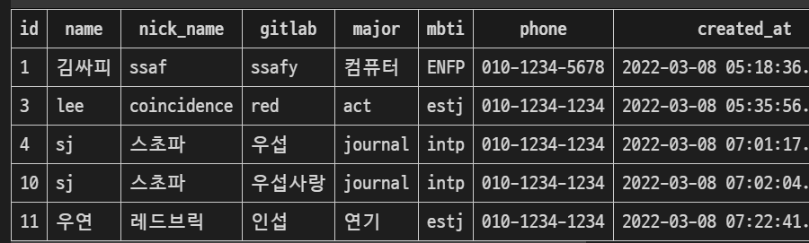
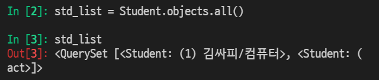

M model T templates V views

> what is Model?

> ORM

> Migrations

> Database API

> CRUD

> Admin Site


-----


### ❤ Model

- 단일한 데이터에 대한 정보를 가짐 / class로 장고에서 모델을 정의한다!
  - 사용자가 저장하는 데이터들의 필수적인 필드들과 동작들을 포함
- 저장된 데이터베이스의 구조(layout)
- django는 model을 통해 데이터에 접속하고 관리
- 일반적으로 각각의 model은 하나의 데이터베이스 테이블에 매핑됨


> Database

- 데이터베이스(DB) : 체계화된 데이터의 모임
- 쿼리(Query) : 데이터를 조회하기 위한 명령어 / 조건에 맞는 데이터를 추출하거나 조작하는 명령어
  - "Query를 날린다" = DB를 조작한다.
- DB 기본구조
  - 스키마(Schema) : 데이터베이스의 구조와 제약 조건(자료의 구조, 표현 방법(Data type), 관계)에 관련한 전반적인 명세를 기술한 것.
  - 테이블(Table) : 
    - 열(column) - 필드(field) or 속성
    - 행(row) - 레코드(record) or 튜플
      - PK(기본키) : 각 행(레코드)의 고유값으로 Primary Key로 불린다. 반드시 설정하여야 하며ㅡ 데이터베이스 관리 및 관계 설정시 주요하게 활용된다.


🔆 모델 정리 : 웹 애플리케이션의 데이터를 구조화하고 조작하기 위한 도구. DB 자체라기 보단 DB를 조작하는 것이라고 보면 된다. DB는 따로 만들어지는 것.


----


### 🧡 ORM

- Object-Relational-Mapping
- 객체 지향 프로그래밍 언어를 사용하여 호환되지 않는 유형의 시스템 간에 (Django - SQL) 데이터를 변환하는 프로그래밍 기술
- OOP 프로그래밍에서 RDBMS을 연동할 때, 데이터베이스와 객체 지향 프로그래밍 언어 간의 호환되지 않는 데이터를 변환하는 프로그래밍 기법
- Django는 내장 Django ORM을 사용함
- 마치 통역가 같은 느낌!


- 장점
  - SQL을 잘 알지 못해도 DB 조작이 가능
  - SQL의 절차적 접근이 아닌 객체 지향적 접근으로 인한 높은 생산성
- 단점
  - ORM 만으로 완전한 서비스를 구현하기 어려운 경우가 있음
- 현대 웹 프레임워크의 요점은 웹 개발의 속도를 높이는 것(생산성)

- 왜 ORM을 사용할까? 우리는 DB를 객체(object)로 조작하기 위해 ORM을 사용한다.


```python
# models.py
class Article(models.Model):
	title = models.Charfield(max_length=10)
    # 길이제한이 10자인 타이틀.
    content = models.TextField()
```

- 클래스를 하나 선언해주는 것이 다다! models를 상속받으면 끝 저대로 외워주기
- DB 컬럼과 어떠한 타입으로 정의할 것인지에 대해 django.db라는 모듈의 models를 상속
  - 각 모델은 django.db.models.Model 클래스의 서브 클래스로 표현
- title과 content은 모델의 필드를 나타냄
  - 각 필드는 클래스 속성으로 지정되어 있으며, 각 속성은 각 데이터베이스의 열에 매핑


> 사용 모델 필드

- CharField(max_length=None, **options)
  - 길이의 제한이 있는 문자열을 넣을 때 사용
  - CharField의 max_length는 필수 인자
  - 필드의 최대 길이(문자), 데이터베이스 레벨과 Django의 유효성 검사(값을 검증하는 것)에서 활용
  - max_length 무조건 작성해야 함!! 작성 안하면 에러가 뜬다

- TextField(**options)
  - 글자의 수가 많을 때 사용
  - max_length 옵션 작성시 자동 양식 필드인 textarea 위젯에 반영은 되지만 모델과 데이터베이스 수준에는 적용되지 않음
    - max_length 사용은 CharField에서 사용해야 함


CharField와 TextField가 무조건 정해진 상황에서 쓰는것만은 아니다! 닉네임을 TextField로 받아줘도 상관 x. 이렇게 models.를 붙여주는 것이 약속!


----


### 💛 Migrations

- "django가 model에 생긴 변화를 반영하는 방법"
- Migration(이하 마이그레이션) 실행 및 DB 스키마를 다루기 위한 몇가지 명령어
  - makemigrations 		 // table로 만들어가는 명령
    - model을 변경한 것에 기반한 새로운 마이그레이션(like 설계도)을 만들 때 사용
  - migrate				         // table로 만들어가는 명령어
    - 마이그레이션을 DB에 반영하기 위해 사용
    - 설계도를 실제 DB에 반영하는 과정
    - 모델에서의 변경 사항들과 DB의 스키마가 동기화를 이룸
    - 테이블 이름 : <앱 이름_클래스명> 이렇게 출력된다.
  - sqlmigrate                   // 확인용도
    - 마이그레이션에 대한 SQL 구문을 보기 위해 사용
    - 마이그레이션이 SQL 문으로 어떻게 해석이 되어서 
  - showmigrations         // 확인용도
    - 프로젝트 전체의 마이그레이션 상태를 확인하기 위해 사용
    - 마이그레이션 파일들이 migrate 됐는지 안됐는지 여부를 확인할 수 있음

필드 정보가 수정되었다면 makemigrations 해주면 된다. add commit push랑 유사한 개념!!!!


```python
$ python manage.py makemigrations
# 'migrations/0001_initial.py' 생성 확인
$ python manage.py migrations
# 0001_initial.py 설계도를 실제 DB에 반영
$ python manage.py sqlmigrate app_name 0001
# 해당 migrations 설계도가 SQL 문으로 어떻게 해석되어서 동작할지 미리 확인
$ python manage.py showmigrations
# migrations 설계도들이 migrate 됐는지 안됐는지 여부를 확인할 수 있음
```


default 값을 설정하라는 문구가 뜰 때 1 혹은 2 중에 선택 가능


🟥 auto_now_add : 데이터가 저장될 때의 시간을 자동으로 저장. 시험에 자주 나오기 기억하기!!!!!

🟩 auto_now : 현재 시간을 자동으로 저장. 최종 수정 일자.


#### ⭐⭐⭐⭐⭐반드시 기억해야할 migration 3단계 ⭐⭐⭐⭐⭐

```python
models.py  # model 변경사항 발생 시
$ python manage.py makemigrations # migrations 파일 생성
$ python manage.py migrate  # db 반영(모델과 DB의 동기화)
```

add 안하고 commit 하면 아무것도 안올라가듯이, 이 세 단계를 꼭꼭 지켜주어여 한다!


----


### 💚 Database API

> DB API

- "DB를 조작하기 위한 도구"
- django가 기본적으로 ORM을 제공함에 따라 DB를 편하게 조작할 수 있도록 도움
- Model을 만들면 django는 객체들을 만들고 읽고 수정하고 지울 수 있는 database-abstract API를 자동으로 만듦
- database-abstract API 혹은 database-access API 라고도 함


> DB API 구문 - Making Queries


클래스명.objects.동작메서드 이렇게 작성을 한다. 중간 objects는 고정값!!!!!


🔶 Manager

​	Django 모델에 데이터베이스 query 작업이 제공되는 인터페이스

​	기본적으로 모든 Django 모델 클래스에 objects 라는 Manager를 추가

🔶 QuerySet

​	데이터베이스로부터 전달받은 객체 목록

​	quertset 안의 객체는 0개, 1개 혹은 여러 개일 수 있음

​	데이터베이스로부터 조회, 필터, 정렬 등을 수행할 수 있음


> Django shell

- 일반 Python shell을 통해서는 장고 프로젝트 환경에 접근할 수 없음
- 그래서 장고 프로젝트 설정이 load된 Python shell을 활용해 DB API 구문 테스트 진행
- 기본 Django shell보다 더 많은 기능을 제공하는 shell_plus를 사용해서 진행
  - Django-extensions 라이브러리의 기능 중 하나

```python
$ pip install ipython
$ pip install django-extensions
```


앱 등록 후 shell_plus를 실행해준다.


### 💙 CRUD

> CRUD

대부분의 컴퓨터 소프트웨어가 가지는 기본적인 데이터 처리 기능인 Create(생성), Read(읽기), Update(갱신), Delete(삭제)를 묶어서 일컫는 말


> 데이터를 넣을 수 있는 방법은 총 3가지가 존재

🔶인스턴스를 생성/ 활용


student라는 인스턴스에 하나하나 일일이 불러서 입력하고 save()를 통해 저장해준다.


🔶인스턴스를 활용


std라는 인스턴스의 한 줄에 바로 다 값을 입력하고 마찬가지로 save()를 통해 저장해준다.


🔶 objects의 create 사용


인스턴스를 생성하지 않고 바로 입력해준다! 이 경우 save()를 하지 않아도 자동 저장이 된다.




위와 같이 입력하면 표가 생성된다. 이때 중요한 것은 할 때마다 계속 새로고침으로 수정이 됐는지 확인해줘야 한다는 것.


> CREATE 관련 메서드

🔶 save() method
- saving objects
- 객체를 데이터베이스에 저장함
- 데이터 생성 시 save()를 호출하기 전에는 객체의 ID 값이 무엇인지 알 수 없다.
	id 값은 django가 아니라 db에서 계산되기 때문
- 단순히 모델을 인스턴스화 하는 것은 db에 영향을 미치지 않기 때문에 반드시 저장!!


🔶 str method
- 표준 파이썬 클래스의 메소드인 str()을 정의하여 각각의 object가 사람이 읽을 수 있는 문자열을 반환(return)하도록 할 수 있음
- 작성 후 반드시 shell_plus를 재시작해야 반영됨


🔶 READ

- QuerySet API method를 사용해 다양한 조회를 하는 것이 중요

- QuerySet API method는 크게 2가지로 분류

  - Methods that return new querysets
  - Methods that do not return querysets

- all()

  - 현재 QuerySet의 복사본을 반환

  

  

- get()

  - 주어진 lookup 매개변수와 일치하는 객체를 반환
  - 객체를 찾을 수 없으면 DoesNotExist 예외를 발생시키고, 둘 이상의 객체를 찾으면 MultipleObjectsReturned 예외를 발생시킴
  - 위와 같은 특징을 가지고 있기 때문에 primary key와 같이 고유성(unique)을 보장하는 조회에서 사용해야 함
  - get_object_or_404 : 요청이 잘못되었기 때문에 다른 데이터 요청 기회를 준다. == 404 error 페이지를 return해주는 것이다.

  

- filter()
  - 주어진 lookup 매개변수와 일치하는 객체를 포함하는 새 QuerySet을 반환
    get은 1개의 data를 return한다면 filter는 조건을 만족하는 모든 data를 다 보여준다.
  - 

- update()
  : 기존의 값을 수정하는 방법.

1) DB에서 수정할 data를 가져온다.
2) 가져온 데이터의 값을 변경한다.
3) save한다.


- delete()
  : 삭제하는건 정말 간단하다! 삭제할 데이터 들고 와서 삭제만 해주면된다.


----


### 💜 Admin site

- 사용자가 아닌 서버의 관리자가 활용하기 위한 페이지
- Model class를 admin.py에 등록하고 관리
- django.contrib.auth 모듈에서 제공됨
- record 생성 여부 확인에 매우 유용하며, 직접 record를 삽입할 수 있다


> Admin 생성

```python
$ python manage.py createsuperuser
```

- 관리자 계정 생성 후 서버를 실행한 다음 'admin/'으로 가서 관리자 페이지 로그인
  - 계정만 만든 경우 Django 관리자 화면에서 아무 것도 보이지 않음
- 내가 만든 Model을 보기 위해서는 admin.py에 작성하여 Django 서버에 등록
- [주의] auth에 관련된 기본 테이블이 생성되지 않으면 관리자 계정을 생성


> Admin 등록


- admin.py는 관리자 사이트에 Article 객체가 관리자 인터페이스를 가지고 있다는 것을 알려주는 것
- models.py에 정의한 __ str __의 형태로 객체가 표현됨


> ModelAdmin options


- list_display : models.py 정의한 각각의 속성(컬럼)들의 값(레코드)을 admin 페이지에 출력하도록 함


실행시켜서 주소란에 /admin을 입력하고 아이디, 패스워드를 입력하면 정보값 확인 가능하다.

위와 같이 options에 입력한 것들이 시각적으로 바로바로 보임!!!

https://docs.djangoproject.com/en/3.2/ref/contrib/admin/#modeladmin-options

참조하기