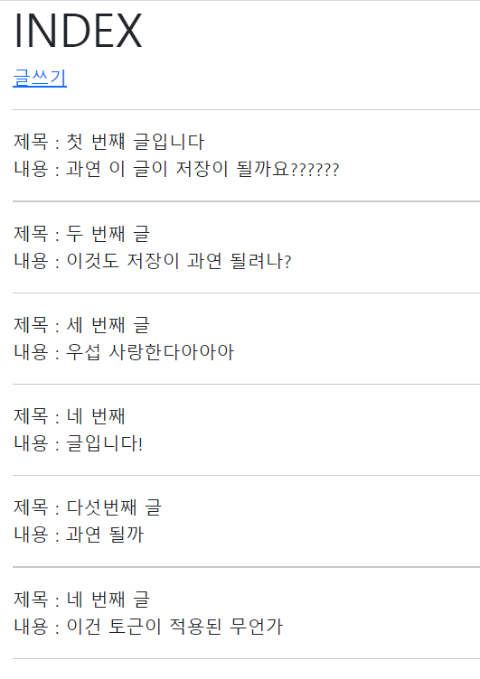
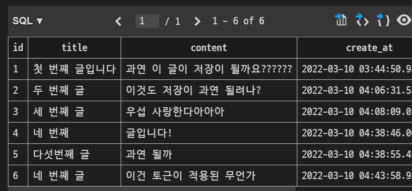

이전 장고 작성법을 활용해 미리 초석을 만들어준다!!


```python
# 앱 안의 urls.py
from django.urls import path
from . import views

app_name = 'articles'

urlpatterns = [
    path('', views.index, name='index'),
    path('create/', views.create, name='create'),
    path('new/', views.new, name='new'),
]
```

- app_name 을 작성해주는 이유??
  - 나중에 앱을 여러개 만들게 되면 그때마다 index라던지 값들을 넣게 되며 이름이 중복될 것인데, 그마다 개성을 부여하기 위함이다!!!!

----


```python
# 앱 내 views.py
from django.shortcuts import render, redirect
from .models import Article

# Create your views here.

def index(request):
    # Article의 모든 값들을 가져오는 것!!
    articles = Article.objects.all()
    context = {
        'articles' : articles,
    }
    return render(request, 'articles/index.html', context)
	# templates 폴더 안에 articles라는 폴더 내부에 html 파일들을 만듦!

def create(request):
    # 사용자가 입력한 게시글을 DB에 저장함
    return render(request, 'articles/create.html')

def new(request):
    # 여기에 데이터를 저장을 시키자!!
    # 게시글을 입력 받기 위한 html 파일을 보여주는 역할을 할 뿐
    # 저장된 정보는 request에 들어있다.
    # request.GET 
    # print(request.GET.get('title'))
    # print(request.POST.get('title'))
    # print(request.GET.get('content'))
    # 데이터를 DB에 저장시키자!
    # 1. 빈 인스턴스 만들어서 이후 입력 후 저장
    article = Article()
    article.title = request.POST.get('title')
    article.content = request.POST.get('content')
    article.save()

    # 2. 인스턴스 생성할 때 채우고 저장 
    # article=Article(title=request.GET.get('title'), content=request.GET.get('content'))
    # article.save()

    # # 3. create() 메서드 이용
    # # return 값이 존재 (저장되는 데이터의 Article 인스턴스)
    # article + article.objects.create(title=request.GET.get('title'), content=request.GET.get('content'))

    #return render(request, 'articles/new.html')
    
    return redirect('articles:index')  # 재 요청 보내기
```

DB에 데이터를 저장하는 방법 3가지는 이전에 배웠다. 그 중 코드가 가로로 짧은 1번째 방법을 택해서 작성을 하였는데, 이번엔 GET이 아니라 POST를 사용하여 데이터를 받아왔다.


❤ GET = 클라이언트에서 서버로 어떠한 리소스로 부터 정보를 요청하기 위해 사용되는 메서드

ex ) 게시판의 게시물을 조회할 때 사용

but GET 요청은 파라미터에 다 노출되어 버리기 때문에 중요한 정보를 다루면 안된다!!!!!


💙 POST = 클라이언트에서 서버로 리소스를 생성하거나 업데이트하기 위해 데이터를 보낼 때 사용 되는 메서드

ex) 게시판의 게시글을 작성하는 작업


```html
-------index.html-------




<h1>INDEX</h1>
<a href="">글쓰기</a>
<hr>

  제목 : {{article.title}}
  <br>
  내용 : {{article.content}}
  <hr>



```


```html
-------create.html-------




<h1>create</h1>
<hr>
# form 태그를 이용해 server로 해당 게시글을 보내주는 것이다
<form action="" method="POST">
  

  <label for="title">제목</label>
  <input type="text" id="title" name="title">
  <hr> 
  <label for="content">내용</label>
    # textarea : 그냥 글 치는 칸 크게 만드는 것
  <textarea name="content" id="content" cols="30" rows="10"></textarea>
  <hr>
  <button>글 작성하기</button>

</form>

```

method를 POST로 작성하면 csrf_token 은 무조건 무조건 무조건 작성해주어야한다!!!!!!!!!

만약 name을 작성안한다면???? 저장이 안된다






주소줄을 이용한 요청 = get

redirect = get 요청

- 함수는 한 가지 일만을 해야한다. 게시글을 작성했다? 그럼 끝내야한다! 그것이 render

- redirect는 저장한 글을 불러서 보여주는 일을 하는 것!


```python
def index(requtst):
    pass
# 모든 데이터 가져오기

def new : 생성
    
    
def edit(request, article_pk):
    DB이 이미 존재하는 하나의 데이터를 대상으로 하는 행위
    
```


