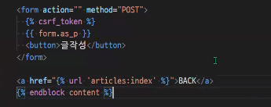

### 👍교수님 CRUD 흐름 같이 따라가기

1. `python -m venv venv` 가상환경 만들기
2. `f1` 버튼 누르면 창 검색이 뜨는데 interpreter 쳐서 `select interpreter `누르면 자동으로 source venv/Scripts/activate 가 된다.
3. `pip list` 확인해서 가상환경 정상적 실행되는지 확인
4. `pip install django==3.2.12` 로 장고 설치
5. `pip freeze > requirements.txt` 로 버전 정보 얼려주기
6. `django-admin startproject config .` 로 프로젝트 파일 만들기
7. `python managy.py startapp articles`로 앱 만들기
8. settings.py에 가서 `출생신고` 해주기
9. urls.py에 가서 url 분리해주기
   1. import `include` 해주고
   2. path('articles/',include ~ )
10. 앱 들어가서 `urls.py` 만들고 창 만들어주기

11. `base.html` 만들어주기!
12. 프로젝트 내 settings.py에 'DIRS'에 `BASE_DIR / 'templates'` 작성해주기
13. models.py에서 class로 `model` 만들어주기

14. `python manage.py makemigrations` > `python manage.py migrate`로 마이그레이트 해주기

15. urls.py의 urlpatterns에 `index 경로` 만들어주기

    

16. views.py에서 `def index`로 만들어주기

- Article.objects.all()로 article의 모든 데이터를 불러와서 articles에 저장시키기 > `articles = Article.objects.all()`
- context에 `'articles' : articles,`로 저장해주기

17. 앱 파일 내에 templates 폴더 만들고 그 안에 articles 폴더 다시 만들고 그 안에 `index.html` 을 만들어준다.
18. index.html에 extends로 base.html 받아주고 for문으로 articles에서 하나하나 불러와준다. > ``

19. 여기까지 동작이 잘 되는지 `python manage.py runserver`로 확인해주기
20. 이제 index.html 화면에 글쓰기 링크 하나 만들어줄 것이다! `<a href=""`로 유입할건데, articles의 `create`로 유입시킬 것이다. 아직 create는 만들지 않은 상태라서 NoReverseMatch 에러가 뜰 것이다.

21. urls.py에 `create url 경로` 만들어주기

22. views.py에 `def create()` 만들어줄 것이다. 여기서 어제 배운 것들을 작성할 에정. 일단은 POST인 것들만 받아줄 수 있도록 기본 초석을 세운다.

23. `forms.py` 파일을 만든다. 필요한 model을 import해온다.

24. class를 만들어준다. Model이름 + Form으로 작명해주고, forms에 `Modelform`을 상속받는다. 이렇게 해야 Meta class 작성 가능! 참고로 여기서 __ all __ 은 정말정말 사용자가 작성하는 값들만 받아주는 거기 때문에 models.py에서 작성한 updated_at과 created_at은 받아와지지 않는다.

25. views.py에 와서 forms.py에서 작성한 것들을 import 해온다.

26. forms.py 에서 else 구문으로 작성한 부분을 먼저 채워준다. else로 받아지는 GET 포함 부분은 form을 받아주고, 들여쓰기로 전체적인 부분을 받아줄 form 양식을 채워준다.(context부분 주목)

27. render로 보여줄 `form.html`을 만들어준다. action 부분은 비워주고 method는 POST로 고정! form이 오면 csrf는 기본적으로 같이 나와줘야 한다.

28. 여기까지 해줬다면 INDEX와 CREATE 창이 잘 뜰것이다.

29. 돌아가기 버튼 만들어주기. form.html에 index 페이지로 돌아가는 버튼을 하나 만들어준다.

30. 이제 글 저장 부분을 작성해볼 것이다. 이것이야말로 방금 def create에서 만든 if 부문에 들어가는 POST이다!!

31. 여기까지 했다면 이제 글 부분이 저장될 것이다! detail 페이지를 안만들어서 index 페이지로 바로 돌아가는 것이다.

32. 이제 detail 페이지로 가보자. 제목을 누르면 detail 페이지로 넘어가게끔 index.html에 조작을 가한다. pk 값 필수!!

33. urls.py에 detail 경로를 만들어줄 것이다. 그냥 받아주는 것이 아니라 pk로 받아준다. 여기서 int로 받아줘도 되지만 굳이 int로 안해도 잘 받아진다. `< int:article_pk >` 로 받아주는 것이 더 좋긴 함!

34. views.py에 `def detail()` 을 만들어준다. 

35. 이제 detail.html을 만들어준다! 

36. runserver로 다시 한 번 확인해주기

37. views.py에서 detail 페이지로 넘어갈 수 있게끔 수정해준다.

38. 업데이트로 넘어가보자! 말인 즉슨 수정 가능한 부분으로 넘어갈 것이다. detail.html 파일에서 `EDIT 버튼`을 다음과 같이 만들어준다. pk 무조건 받아줘야 함!!

39. urls.py에서 업데이트 경로를 작성해준다.

40. views.py로 와서 `def update()`를 만들어준다. 여기서 update로 create와 같은 형태로 간다!

41. 다시 한 번 runserver로 확인해보기

42. 다만 create와 다른 점은, instance를 받아주는 것.

43. 값이 채워진 edit 폼을 확인한다.

44. article.id로 하거나 article_pk로 하거나 둘 다 가능하다!!! 이제 POST로 해당하는 애들 유효성 검사해주고 저장 후 return해주면 된다. def create와 다른 점은 instance를 받아주고 기존에 저장됐던 애들을 다시 화면창에 띄워주면 된다.

45. 뽀너스! 각 create와 update내의 context에 title을 각각 추가해주고, 각 html의 상단 페이지 글자에 h1 태그로 update, create 적어주는것 대신 title로 받아주면 각각의 글자로 받아준다. 결과는 똑같지만 과정이 다른 것!

46. 마찬가지로 context에 버튼명을 각각 저장해주고 html 문서에서 button 부분을 {{}}로 받아주면 결과물은 같지만 과정이 다르게 받아진다!

47. 뒤로 돌아가는 버튼이 create은 index로, update는 다시 detail 페이지로 돌아가야 한다. 각 돌아가는 버튼에 대한 if 문을 작성해서 다르게 돌아갈 수 있도록 해준다. context에 article도 받아주어야한다!

48. 혹은 context에 저렇게 코드가 길어지는 것을 방지할 수도 있따. form.html에 하는 거 다음과 같이..

따옴표 필수! 대신 이 구문 대신 그냥 context에 원래처럼 하나하나 다 넣는 것도 된다. 이렇게 하면 HTML 파일의 if 문이 많이 길어짐 ㅠㅠ 

49. 이제 delete를 만들어봅쉬다. delete는 무조건 POST로 처리해야한다. 안그러면 주소창에서 delete 치면 그대로 정말 삭제가 되어버리기 때문! 그래서 form으로 전달하는 방법밖에 없다. action에 값이 없으면 현재 접속한 url로 요청이 이루어진다. 그래서 값이 없으며 삭제를 할 수 없고 detail 동작을 계속하기 때문에 action 값을 delete 동작을 할 수 있게끔 채워주어야 한다.

50. urls.py에 `delete url`을 작성해준다.

51. views.py에 `def delete()`를 작성해준다. 먼저 DB에서 삭제할 대상을 찾아와야 하고, `.delete()` 메서드로 DB에서 그 대상을 삭제한다.

52. 그리고 redirect로 그 페이지를 보여준다. 만약 여기서 redirect를 안하고 render를 하면 빈 인덱스 페이지로 보여준다. render는 보여주기만 하는거고 redirect는 index 함수로 가서, index 함수에서 render된 .. 즉, 결과를 직접 보여주느냐 아니냐, 혹은 바로 연결해주느냐 친구에게 연결해주느냐 이렇게 이해하면 된다.

53. 여기까지 하면 주소창에서도 삭제가 된다. if 문으로 POST 일때만 삭제가 되도록 작성해준다.

여기까지 따라했다면 다 했다 수고했다!

-----

### ⭐이제부터 widget을 한 번 살펴보도록 하자

장고는 문서를 뗄레야 뗄 수 없다! 문서를 많이 읽어봐달라

----

### 부트스트랩 사용하기

pip freeze 하기

-----

우리가 articles/form.html이라고 작성하는 이유는 templates 내의 articles 내의 form.html을 불러오기 때문에 / 는 경로를 의미한다!

반면 articles:index는 위의 사진과 같이 app_name으로 지정된 articles 안의 url 경로 index로 불러오는 것을 의미한다. 

즉, render와 redirect의 차이점을 살펴보면 된다!!!!! `render` 는 템플릿을 불러오고, `redirect` 는 URL로 이동한다. URL 로 이동한다는 건 그 URL 에 맞는 views 가 다시 실행될테고 여기서 render 를 할지 다시 redirect 할지 결정할 것이다.