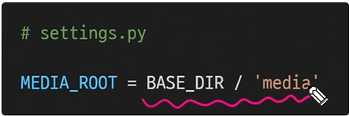

## 교수님과 CRUD 더 만들어보자!!!

get_object_or_404 : 찾고자하는 객체가 없을 경우 DoesNotExit 예외 대신 Http 404를 불러온다. from django.shortcuts import get_object_404로 임포트해오는 것!!

- 만약 주소창에 그냥 /articles/100 이렇게 작성하면 DoesNotExit 화면이 뜬다. 말인즉슨 100번째 리소스가 실제로 없기 때문에 이런 에러가 뜨는 것이다. 그렇기 때문에 기본 에러 500으로 퉁치는 것이 아니라 404 Not Found로 에러를 띄워주는 것이 인지상정. ㅋ. 

= 작성하는 방법이 좀 다르다! get_object_or_404 괄호 안에 앱 이름 작성, pk를 받을 때 두 번째 순서가 pk 받아주기

= 위와 같이 get_object_or_404 를 사용해준다면 이제 에러가 Page not found 에러가 뜬다!

- get_object_or_404가 필요한 페이지는 detail, update, delete 페이지이다. 뭔가를 받아와야 하기 때문이다!!!!! pk 값이 필요한 친구들.

오늘은 3가지 require 데코레이터에 대해서 알아볼 것이다. from django.views.decorator.http import require_http_methods로 임포트해주기

- require_http_methods() : GET과 POST 메서드 두 개만 받아줄수 있는 데코레이터이다.
  - @require_http_methods(['GET','POST']) 작성해주면 된다.
  - 각 함수 바로 윗줄에 붙여주면 된다. update와 create에 작성해주면 된다.
  - 이것들 다 굳이 안해도 되는 데코레이터들이긴 한데, 그래도 장고 페이지를 좀 더 단단하게 만들어주는 역할을 한다.
- require_POST() : 얘는 우리가 delete에서 사용할 수 있을 것이다! POST만 받는 친구다.
  - 아래와 같이 delete 부분에서 작성을 할 때, 기존에는 if문으로 POST인 애들을 걸러줬다면 이 데코레이터를 작성하면 그런 부분이 없어져서 코드가 좀 더 간결해진다.

- require_safe() : 이 친구는 GET만 받는 친구다. index, detail은 GET 요청만 받는다.

지금부터는 Media file에 대해서 알아볼 것이다! 사용자가 웹에서 업로드하는 파일인데 정적 파일이당

- ImageField()
  - 이미지 업로드에 사용하는 모델 필드
  - FileField를 상속받는 서브 클래스이기 때문에 FileField의 모든 속성 및 메서드를 사용 가능하며, 더해서 사용자에 의해 업로드 된 객체가 유효한 이미지인지 검사함
  - 사용하려면 반드시 Pillow 라이브러리가 필요
  - 이미지 경로가 저장되므로 실질적으로는 문자 필드임
- FileField()
  - 파일 업로드에 사용하는 모델 필드
  - 2개의 선택 인자를 가지고 있음
    - upload_to
    - 

- 일단 처음에 models.py에서 image 를 만들어준다.

1. media_root

- 사용자가 업로드한 파일을 보관할 디렉토리의 절대 경로

2. media_url

- media_root에서 제공되는 미디어를 처리하는 url
- 업로드된 파일의 주소(url)를 만들어주는 역할
- media_url은 static_url과 반드시 다른 경로로 설정되어야 함
- 참고로 static_url은 settings.py에 기본적으로 설정되어 있음

urls.py에 저 마지막 두 줄을 import 해온다.

urlpatterns에 작성. 리스트를 연결하는 것이다.

여기서 makemigrations를 하면 에러가 뜬다. imagefield는 pillow라는 라이브러리가 필요하기 때문에 에러가 발생하는 것! 그래서 pip install Pillow로 설치해준다. 그럼 이미지필드가 설치가 된다. 여기서 requirements.txt를 다시 한 번 freeze로 업데이트를 해주고 makemigrations를 해준다. migrate도 해줘야함. sql opendatabase로 이미지 필드가 제대로 들어갔는지 확인해주기

html 파일에 enctype이라는 것을 작성해준다. 이건 파일/이미지 업로드 시에 반드시 사용해야 함!!!! 

form 양식에 request.FILES로 추가해준다. 이때 인스턴스 앞에 작성해주어야 한다.

수정하는 것은 텍스트처럼 일부 수정이 불가능하다. 그래서 새로운 사진으로 덮어 씌우는 방식을 사용한다.

resizing 

django imagekit 설치하기(구글에 제일 처음 나오는 사이트의 코드) `pip install django-imajekit` 작성하면 된다.