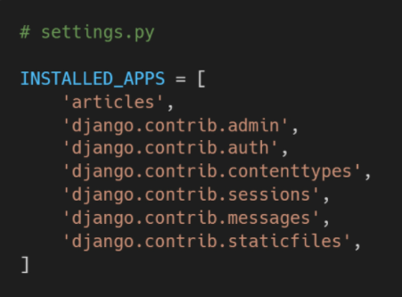
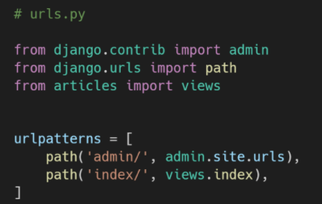
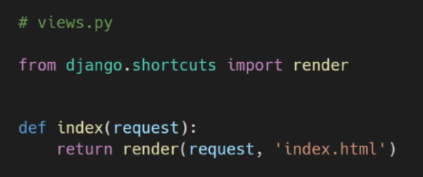
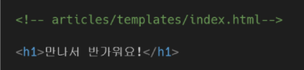
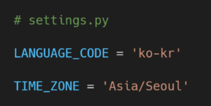
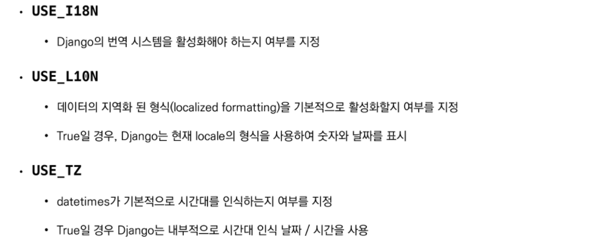
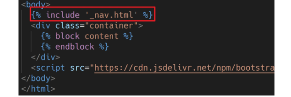
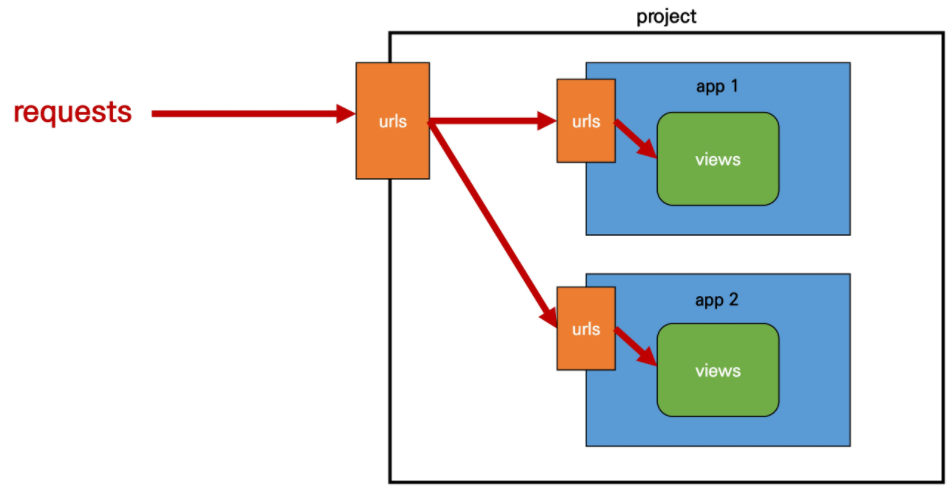
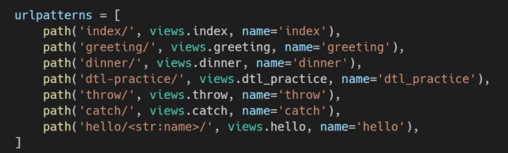

## 장고 Django

> Static web page(정적 웹 페이지)

- 서버에 미리 저장된 파일이 사용자에게 그대로 전달되는 웹 페이지
- 서버가 정적 웹 페이지에 대한 요청을 받은 경우 서버는 추가적인 처리 과정 없이 클라이언트에게 응답을 보냄
- 모든 상황에서 모든 사용자에게 동일한 정보를 표시
- 일반적으로 HTML, CSS, JavaScript로 작성됨
- flat page라고도 함


> Dynamic web page(동적 웹 페이지)

- 웹 페이지에 대한 요청을 받은 경우 서버는 추가적인 처리 과정 이후 클라이언트에게 응답을 보냄
- 동적 웹 페이지는 방문자와 상호작용하기 때문에 페이지 내용은 그때그때 다름
- 서버 사이드 프로그래밍 언어(Python, Java, C++ 등)가 사용되며, 파일을 처리하고 데이터베이스와의 상호작용이 이루어짐


> Framework

- 프로그래밍에서 특정 운영 체제를 위한 응용 프로그램 표준 구조를 구현하는 클래스와 라이브러리 모임
- 재사용할 수 있는 수많은 코드를 프레임워크로 통합함으로써 개발자가 새로운 애플리케이션을 위한 표준 코드를 다시 작성하지 않아도 같이 사용할 수 있도록 도움
- Application framework라고도 함


> Web framework

- 웹 페이지를 개발하는 과정에서 겪는 어려움을 줄이는 것이 주 목적으로 데이터베이스 연동, 템플릿 형태의 표준, 세션 관리, 코드 재사용 등의 기능을 포함
- 동적인 웹 페이지나, 웹 애플리케이션, 웹 서비스 개발 보조용으로 만들어지는 Application framework의 일종


> Framework Architecture

- MVC Design Pattern(model-view-controller)
- 소프트웨어 공학에서 사용되는 디자인 패턴 중 하나
- 사용자 인터페이스로부터 프로그램 로직을 분리하여 애플리케이션의 시각적 요소나 이면에서 실행되는 부분을 서로 영향 없이 쉽게 고칠 수 있는 애플리케이션을 만들 수 있음
- Django는 MTV Pattern이라고 함


> MTV Pattern

- Model
  - 응용프로그램의 데이터 구조를 정의하고 데이터베이스의 기록을 관리(추가, 수정, 삭제)
- Template
  - 파일의 구조나 레이아웃을 정의
  - 실제 내용을 보여주는데 사용(presentation)
- View
  - HTTP 요청을 수신하고 HTTP 응답을 반환
  - Model을 통해 요청을 충족시키는데 필요한 데이터에 접근
  - template에게 응답의 서식 설정을 맡김


> Django Intro

#### ❤️ 시작하기

- Django 설치 전 가상환경 생성 및 활성화

```python
$ pip install django==3.2.12
```

- 프로젝트 생성

```python
$ django-admin startproject <프로젝트 명> .
```

- Django 서버 시작하기

```python
$ python manage.py runserver
```


#### 🧡 프로젝트 구조

- __ init __.py : Python에게 이 디렉토리를 하나의 Python 패키지로 다루도록 지시
- asgi.py : Django 애플리케이션이 비동기식 웹 서버와 연결 및 소통하는 것을 도움
- settings.py : 애플리케이션의 모든 설정을 포함
- urls.py : 사이트의 url과 적절한 views의 연결을 지정
- wsgi.py : Django 애플리케이션이 웹서버와 연결 및 소통하는 것을 도움
- manage.py : Django 프로젝트와 다양한 방법으로 상호작용하는 커맨드라인 유틸리티


#### 💛 Application 생성

- 일반적으로 Application 명은 복수형으로 하는 것을 권장

```python
$ python managy.py startapp <앱명>
```


#### 💚 Application 구조

- admin.py : 관리자용 페이지를 설정하는 곳
- apps.py : 앱의 정보가 작성된 곳
- models.py : 앱에서 사용하는 Model을 정의하는 곳
- tests.py : 프로젝트의 테스트 코드를 작성하는 곳
- views.py : views 함수들이 정의되는 곳


#### 💙 Project & Application

- Project
  - Project(이하 프로젝트)는 Application(이하 앱)의 집합(collection of apps)
  - 프로젝트에는 여러 앱이 포함될 수 있음
  - 앱은 여러 프로젝트에 있을 수 있음
- Application
  - 앱은 실제 요청을 처리하고 페이지를 보여주고 하는 등의 역할을 담당
  - 하나의 프로젝트는 여러 앱을 가짐
  - 일반적으로 앱은 하나의 역할 및 기능 단위로 작성함


> 앱 등록

- 프로젝트에서 앱을 사용하기 위해서는 반드시 INSTALLED_APPS 리스트에 추가해야 함
- 출생신고를 먼저 하고 생성하면 앱이 생성되지 않음




> 요청과 응답

✅ URLs  

- HTTP 요청(request)을 알맞은 view로 전달



✅ View 

- HTTP 요청을 수신하고 HTTP 응답을 반환하는 함수 작성
- Model을 통해 요청에 맞는 필요 데이터에 접근
- Template에게 HTTP 응답 서식을 맡김



✅ Templates

- 실제 내용을 보여주는데 사용되는 파일
- 파일의 구조나 레이아웃을 정의 (ex. HTML)
- Template 파일 경로의 기본 값은 app 폴더 안의 templates 폴더로 지정되어 있음




✅ 추가 설정

- LANGUAGE_CODE
  - 모든 사용자에게 제공되는 번역을 결정
  - 이 설정이 적용되려면 use_I18N이 활성화되어 있어야 함
- TIME_ZONE
  - 데이터베이스 연결의 시간대를 나타내는 문자열 지정
  - USE_TZ가 True이고 이 옵션이 설정된 경우 데이터베이스에서 날짜 시간을 읽으면, UTC 대신 새로 설정한 시간대의 인식 날짜 & 시간이 반환됨
  - USE_TZ이 False인 상태로 이 값을 설정하는 것은 error가 발생하므로 주의






> Django Template

https://docs.djangoproject.com/ko/3.2/ref/templates/builtins/

- Django Template Language(DTL)
  - Django template에서 사용하는 built-in template system
  - 조건, 반복, 변수 치환, 필터 등의 기능을 제공
  - 단순히 Python이 HTML에 포함된 것이 아니며, 프로그래밍적 로직이 아니라 프레젠테이션을 표현하기 위한 것
  - Python처럼 일부 프로그래밍 구조(if, for 등)를 사용할 수 있지만, 이것은 해당 Python 코드로 실행되는 것이 아님


> DTL Syntax

#### ❤️ Variable

```django
{{ variable }}
```

- render()를 사용하여 views.py에서 정의한 변수를 template 파일로 넘겨 사용하는 것
- 변수명은 영어, 숫자와 밑줄(_)의 조합으로 구성될 수 있으나 밑줄로는 시작할 수 없음
  - 공백이나 구두점 문자 또한 사용할 수 없음
- dot(.)를 사용하여 변수 속성에 접근할 수 있음
- render()의 세번째 인자로 {'key': value}와 같이 딕셔너리 형태로 넘겨주며, 여기서 정의한 key에 해당하는 문자열이 template에서 사용 가능한 변수명이 됨


#### 💛 Filters

```django
{{ variable|filter}}

예시)
{{ name|lower}} > name 변수를 모두 소문자로 출력
{{ variable|truncatewords:30}}
```

- 표시할 변수를 수정할 때 사용


#### 💚 Tags

```django


예시)

```

- 출력 텍스트를 만들거나, 반복 또는 논리를 수행하여 제어 흐름을 만드는 등 변수보다 복잡한 일들을 수행
- 일부 태그는 시작과 종료 태그가 필요


#### 💙 Comments

```django
{# #}
 주석 주석 
```

- Django template에서 라인의 주석을 표현하기 위해 사용
- 한 줄 주석에만 사용할 수 있음(줄 바꿈이 허용되지 않음)
- 여러 줄 주석은 두번째 comments 문장 사이에 입력


### ✨✨ 코드 작성 순서 : urls.py > views.py > templates


> Template

- Template inheritance(템플릿 상속)
  - 템플릿 상속은 기본적으로 코드의 재사용성에 초점을 맞춤
  - 템플릿 상속을 사용하면 사이트의 모든 공통 요소를 포함하고, 하위 템플릿이 재정의(override)할 수 있는 블록을 정의하는 기본 skeleton 템플릿을 만들 수 있음

```django

```

- 자식(하위) 템플릿이 부모 템플릿을 확장한다는 것을 알림
- 반드시 템플릿 최상단에 작성 되어야 함

```django

```

- 하위 템플릿에서 재지정(overriden)할 수 있는 블록을 정의
- 즉, 하위 템플릿이 채울 수 있는 공간

```django

```

- 템플릿을 로드하고 현재 페이지로 렌더링
- 템플릿 내에 다른 템플릿을 포함하는 방법



- 주의 : 파일명 앞에 _(언더바)는 단순히 include되는 템플릿이라는 것을 분류하기 위함이며, 특수한 기능이나 규칙을 포함하지 않음


### HTML Form

> HTML "form" element

- 웹에서 사용자 정보를 입력하는 여러 방식(text, button, checkbox, file, hidden, image, password, radio, reset, submit)을 제공하고, 사용자로부터 할당된 데이터를 서버로 전송하는 역할을 담당
- 핵심 속성(attribute)
  - action : 입력 데이터가 전송될 URL 지정
  - method : 입력 데이터 전달 방식 지정


> HTML "input" element

- 사용자로부터 데이터를 입력받기 위해 사용
- type 속성에 따라 동작 방식이 달라짐
- 핵심 속성(attribute)
  - name
  - 중복 가능, 양식을 제출했을 때 name이라는 이름에 설정된 값을 넘겨서 값을 가져올 수 있음
  - 주요 용도는 GET/POST 방식으로 서버에 전달하는 파라미터(name은 key, value는 value)로 매핑하는 것
  - GET 방식에선s URL에서 ?key=value&key=value 형식으로 데이터를 전달함


> HTML "label" element

- 사용자의 인터페이스 항목에 대한 설명(caption)을 나타냄
- label을 input 요소와 연결하기
  - (1) input에 id 속성 부여
  - (2) label에는 input의 id와 동일한 값의 for 속성이 필요
- label과 input 요소 연결의 주요 이점
  - 시각적인 기능 뿐만 아니라 화면 리더기에서 label을 읽어 사용자가 입력해야 하는 텍스트가 무엇인지 더 쉽게 이해할 수 있도록 돕는 프로그래밍적 이점도 있음
  - label을 클릭해서 input에 초점(focus)을 맞추거나 활성화(activate) 시킬 수 있음


> HTML "for" attribute

- for 속성의 값과 일치하는 id를 가진 문서의 첫 번째 요소를 제어
  - 연결된 요소가 labelabel elements인 경우 이 요소에 대한 labeled control이 됨
- "labelabel elements"
  - label 요소와 연결할 수 있는 요소
  - button, input(not hidden type), select, textarea....


> HTML "id" attribute

- 전체 문서에서 고유(must be unique)해야 하는 식별자를 정의
- 사용 목적
  - linking, scripting, styling 시 요소를 식별


> HTTP

- HyperText Transfer Protocol
- 웹에서 이루어지는 모든 데이터 교환의 기초
- 주어진 리소스가 수행할 작업을 나타내는 request methods를 정의
- HTTP request method 종류
  - GET, POST, PUT, DELETE....


> HTTP request method - "GET"

- ✨서버로부터 정보를 조회하는데 사용
- 데이터를 가져올 때만 사용해야 함
- 데이터를 서버로 전송할 때 body가 아닌 Query String Parameters를 통해 전송
- 우리는 서버에 요청을 하면 HTML 문서 파일 한 장을 받는데, 이떄 사용하는 요청의 방식이 GET


> URL

- 웹 애플리케이션은 URL을 통한 클라이언트의 요청에서부터 시작됨

- Variable Routing
  - URL 주소를 변수로 사용하는 것
  - URL의 일부를 변수로 지정하여 view 함수의 인자로 넘길 수 있음
  - 즉, 변수 값에 따라 하나의 path()에 여러 페이지를 연결시킬 수 있음
  - ex) path('accounts/user/< int:user_pk >/',...)

```django
path('hello/<str:name>/',views.hello)
```

- str
  - '/'를 제외하고 비어있지 않은 모든 문자열과 매치
  - 작성하지 않을 경우 기본값
- int
  - 0 또는 양의 정수와 매치
- slug
  - ASCII 문자 또는 숫자, 하이픈 및 밑줄 문자로 구성된 모든 슬러그 문자열과 매치


- App URL mapping
  - app의 view 함수가 많아지면서 사용하는 path() 또한 많아지고, app 또한 더 많이 작성되기 때문에 프로젝트의 urls.py에서 모두 관리하는 것은 프로젝트 유지보수에 좋지 않음
  - 이제는 각 app에 urls.py를 작성하게 됨
  - include()
    - 다른 URLconf(app1/urls.py)들을 참조할 수 있도록 도움
    - 함수 include()를 만나게 되면, URL의 그 시점까지 일치하는 부분을 잘라내고, 남은 문자열 부분을 후속 처리를 위해 include된 URLconf로 전달
    - django는 명시적 상대경로(from .module include import ..)를 권장



> Naming URL patterns

- 이제는 링크에 url을 직접 작성하는 것이 아니라 path() 함수의 name 인자를 정의해서 사용
- Django Template Tag 중 하나인 url 태구를 사용해서 path() 함수에 작성한 name을 사용할 수 있음
- url 설정에 정의된 특정한 경로들의 의존성을 제거할 수 있음

```django
path('index/', views.index, name='index'),

<a href="">메인 페이지</a>
```



```django

```

- 주어진 URL 패턴 이름 및 선택적 매개 변수와 일치하는 절대 경로 주소를 반환
- 템플릿에 URL을 하드 코딩하지 않고도 DRY 원칙을 위반하지 않으면서 링크를 출력하는 방법
