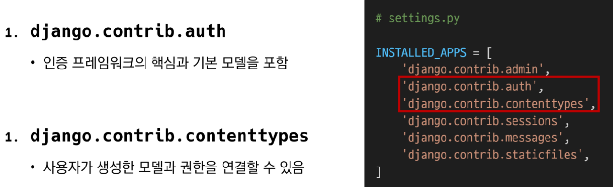
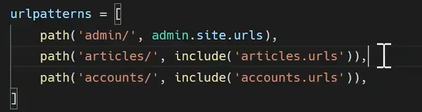
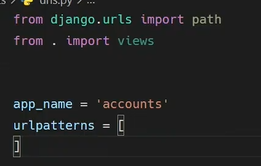
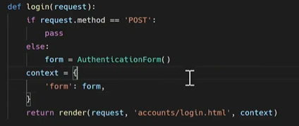
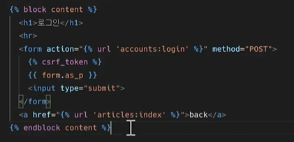
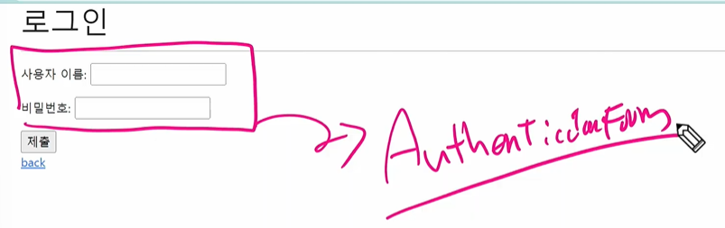
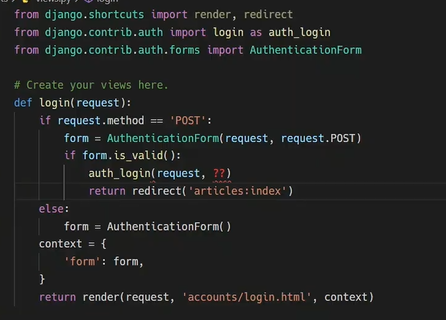

## Authentication System 1



Django 인증 시스템은 `인증(Authentication)`과 `권한(Authorization)`부여를 함께 제공(처리)하며, 이러한 기능이 어느 정도 결합되어 일반적으로 인증 시스템이라고 함

- Authentication(인증) : 신원 확인, 사용자가 자신이 누구인지 확인하는 것, 출입 가능한지 결정(a.k.a 입구컷)
- Authorization(권한,허가) : 권한 부여, 인증된 사용자가 수행할 수 있는 작업을 결정(a.k.a staff only)


> 두 번째 앱(accounts) 생성하기

```python
$ python manage.py startapp accounts
```

- app 이름이 반드시 accounts일 필요는 없음
- 단, auth와 관련해 Django 내부적으로 account라는 이름으로 사용되고 있기 때문에 되도록 `accounts로 지정하는 것을 권장`

- 이후 INSTALLED_APPS에 `출생신고` 해줘야 한다!



- 마찬가지로 project 내부 urls.py에 url 경로를 등록해줘야 한다.
- accounts 내부에 `urls.py` 파일을 따로 생성해준다.




> 쿠키와 세션

##### ✅ HTTP 

: Hyper Text Transfer Protocol

- 비연결지향(connectionless) : 서버는 요청에 대한 응답을 보낸 후 연결을 끊음

- 무상태(stateless) : 연결을 끊는 순간 클라이언트와 서버 간의 통신이 끝나며 상태 정보가 유지되지 않음 / 클라이언트와 서버가 주고 받는 메시지들은 서로 완전히 독립적임

- ##### 클라이언트와 서버의 지속적인 관계를 유지하기 위해 쿠키와 세션이 존재


##### ✅ 쿠키(Cookie) 개념

- 서버가 사용자의 웹 브라우저에 전송하는 작은 데이터 조각
- 사용자가 웹사이트를 방문할 경우 해당 웹사이트의 서버를 통해 사용자의 컴퓨터에 설치(placed-on)되는 작은 기록 정보 파일
  - 브라우저(클라이언트)는 쿠키를 로컬에 KEY-VALUE의 데이터 형식으로 저장
  - 이렇게 쿠키를 저장해 놓았다가, `동일한 서버에 재 요청 시` 저장된 쿠키를 함께 전송
- 소프트웨어가 아니기 때문에 프로그램처럼 실행될 수 없으며 악성코드로 설치할 수 없지만, 사용자의 행동을 추적하거나 쿠키를 훔쳐서 해당 사용자의 계정 접근 권한을 획득할 수 있음
- HTTP 쿠키는 상태가 있는 세션을 만들어 줌
- 쿠키는 두 요청이 동일한 브라우저에서 들어왔는지 아닌지를 판단할 때 주로 사용
  - 이를 이용해 사용자의 로그인 상태를 유지할 수 있음
  - 상태가 없는(stateless) HTTP 프로토콜에서 상태 정보를 기억시켜주기 때문

##### 👉웹 페이지에 접속하면 요청한 웹 페이지를 받으며 쿠키를 저장하고, 클라이언트가 같은 서버에 재 요청 시 요청과 함께 쿠키도 함께 전송


##### ✅ 쿠키의 사용 목적

👉 세션 관리(Session management) : 로그인, 아이디 자동 완성, 공지 하루 안보기, 팝업 체크, 장바구니 등의 정보 관리

👉 개인화(Personalization) : 사용자 선호, 테마 등의 설정

👉 트래킹(Tracking) : 사용자 행동을 기록 및 분석


> 세션(Session)

- 사이트와 특정 브라우저 사이의 "상태(state)"를 유지시키는 것

- 클라이언트가 서버에 접속하면 서버가 특정 `session id`를 발급하고, 클라이언트는 발급 받은 session id를 쿠키에 저장

  - 클라이언트가 다시 서버에 접속하면 요청과 함께 쿠키(session id가 저장된)를 서버에 전달
  - 쿠키는 요청 때마다 서버에 함께 전송되므로 서버에서 session id를 확인해 알맞은 로직을 처리

- ID는 세션을 구별하기 위해 필요하며, 쿠키에는 ID만 저장함

- ##### "로그아웃 과정은 세션을 삭제하는 과정이다!!!!"


> 쿠키 lifetime(수명)

1) Session cookies

- 현재 세션이 종료되면 삭제됨

- 브라우저가 "현재 세션(current session)"이 종료되는 시기를 정의

2. Persistent cookies

- Expires 속성에 지정된 날짜 혹은 Max-Age 속성에 지정된 기간이 지나면 삭제


> Session in Django

- Django의 세션은 미들웨어를 통해 구현됨
- Django는 `database-backed sessions 저장 방식(DB기반)` 을 기본 값으로 사용
- Django는 특정 session id를 포함하는 쿠키를 사용해서 각각의 브라우저와 사이트가 연결된 세션을 알아냄
  - 세션 정보는 Django DB의 django_session 테이블에 저장됨
- 모든 것을 세션으로 사용하려고 하면 사용자가 많을 때 서버에 부하가 걸릴 수 있음

##### 👉 장고는 세션을 이용하여 로그인을 한다!


> 로그인

- 로그인은 session을 Create하는 로직과 같음
- Django는 우리가 session의 메커니즘에 생각하지 않게끔 도움을 줌
- 이를 위해 인증에 관한 built-in forms를 제공. 갖다쓰면 개꿀


✅ AuthenticationForm

- 사용자 로그인을 위한 form
- request를 첫번째 인자로 취함


✔️ login(request, user, backend=None)

- 현재 세션에 연결하려는 인증된 사용자가 있는 경우 login() 함수가 필요
- 사용자를 로그인하며 view 함수에서 사용됨
- HttpRequest 객체와 User 객체가 필요
- Django의 session framework를 사용하여 세션에 user의 ID를 저장(== 로그인)







(views.py와 login.html 문서 작성 모양)


✔️ login 함수와 create 함수의 차이점


create 함수는 Model로 작성한 ModelForm을 상속받는 반면, login 함수는 Form의 상속을 받는 Form이다. 첫 번째가 request고 두 번째 인자가 데이터인 것이다. Form이냐 ModelForm이냐 그거를 구분하면 된다.

```python
def login(request):
    if request.method == 'POST':
        form = AuthenticationForm(request, request.POST)
        if form.is_valid():
            # 실제 로그인은 여기서 진행이 된다.
            auth_login(request, form.get_user())
            # 인증된 유저 객체가 return 된다.
            return redirect(articles:index)
    else:
        form = AuthenticationForm()
    context = {
        'form' : form,
    }
    return render(request, 'accounts/longin.html', context)
```




> 로그아웃

= `session`을 `Delete` 하는 로직과 같음

- logout(request)
  - HttpRequest 객체를 인자로 받고 반환 값이 없음
  - 사용자가 로그인하지 않은 경우 오류를 발생시키지 않음
  - 현재 요청에 대한 session data를 DB에서 완전히 삭제하고, 클라이언트의 쿠키에서도 sessionid가 삭제됨
  - 이는 다른 사람이 동일한 웹 브라우저를 사용하여 로그인하고, `이전 사용자의 세션 데이터에 엑세스하는 것을 방지하기 위함`