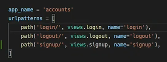
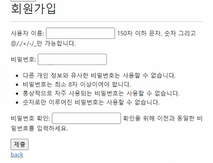
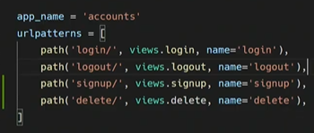
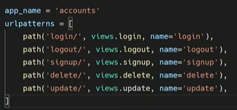
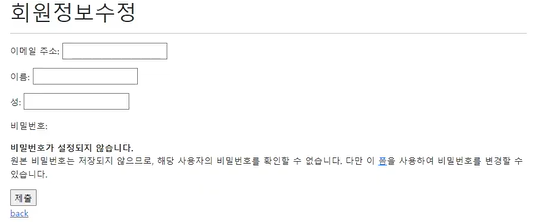
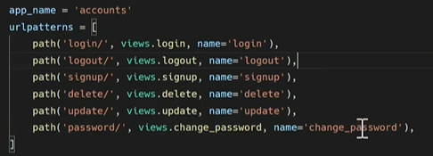

## Authentication System 2


### ❤️ 회원가입

> UserCreationForm

- 주어진 username과 password로 권한이 없는 새 user를 생성하는 ModelForm
- 3개의 필드를 가짐
  - username(from the user model)
  - password1
  - password2




👉 urls.py에 path 경로를 만들어준다.

```python
# accounts 앱 폴더 내 views.py

@require_http_methods(['GET', 'POST'])
def signup(request):
    if request.method == 'POST':
        form = UserCreationForm(request.POST)
        if form.is_valid():
            user = form.save()
            # 회원가입 후 자동으로 로그인 진행하기
            auth_login(request, user)
            return redirect('accounts:index')
    else:
        form = UserCreationForm()
    context = {
        'form' : form,
    }
    return render(request,'accounts/signup.html', context)
```



👉 대략적인 구조는 create 함수와 정말 비슷하다! 사용하는 form이 다르다는거 외에는 차이점이 거의 없다. 그리고 위와 같이 코드 작성 시 회원가입 창이 사진과 같이 뜬다.


----


### 💛 회원탈퇴

- 회원탈퇴는 DB에서 사용자를 삭제하는 것과 같음



👉accounts 내부 urls.py에 경로를 작성한다.

```python
# accounts 앱 폴더 내 views.py

@request_POST
def delete(request):
    if request.user.is_authenticated:
        # 주의사항! 로그아웃 먼저 하면 회원탈퇴가 안된다.
        # 먼저 유저를 지운 다음(회원탈퇴 후) 로그아웃 시켜줘야 한다.
	    request.user.delete()
        auth_logout(request)
    return redirect('accounts:index')
```


----


### 💚 회원정보 수정

> UserChangeForm

- 사용자의 정보 및 권한을 변경하기 위해 admin 인터페이스에서 사용되는 ModelForm



👉accounts 내부 urls.py에 경로를 작성한다.

```python
# accounts 앱 폴더 내 views.py

@login_required
@require_http_methods(['GET', 'POST'])
def update(request):
    if request.method == 'POST':
        form = CustomUserChangeForm(request.POST, instance=request.user)
        if form.is_valid():
            user = form.save()
            return redirect('accounts:index')
    else:
        form = CustomUserChangeForm(instance=request.user)
    context = {
        'form' : form,
    }
    return render(request, 'accounts/update.html', context)
```

👉 여기까지 작성하면 수정에 관한 온갖 정보가 HTML 문서 내에 다 뜬다! (일반 사용자가 접근해서는 안될 정보들(fields)까지 모두 수정이 가능해진다는 뜻). 그래서 Form을 작성해서 보여줄 부분만 보여줄 것이다. 

👉 forms.py 만들어주기

```python
# accounts 앱 폴더 내 forms.py

from django.contrib.auth.forms import UserChangeForm
from django.contrib.auth import get_user_model

class CustomUserChageForm(UserChangeForm):
    # 회원정보 수정 페이지에서 불편하게 디자인된 비밀번호 변경란 없애고 싶다면 작성하기
    # 하지만 패스워드 변경창을 새로 띄워야한다는 단점이 있다. 선택사항임.
    password = None
    class Meta:
        model = get_user_model()
        # 보여줄 부분만 작성해주기
        fields = ('email','first_name','last_name',)
```



> get_user_model()

- 현재 프로젝트에서 활성화된 사용자 모델(active user model)을 반환
- Django는 User 클래스를 직접 참조하는 대신 django.contrib.auth.get_user_model()을 사용하여 참조해야 한다고 강조


----


### 💙 비밀번호 변경

> PasswordChangeForm

- 사용자가 비밀번호를 변경할 수 있도록 하는 Form

- 이전 비밀번호를 입력하여 비밀번호를 변경할 수 있도록 함

- 이전 비밀번호를 이벽하지 않고 비밀번호를 설정할 수 있는 SetPasswordForm을 상속받는 서브 클래스



👉 accounts 내부 urls.py에 경로를 작성한다.


```python
# accounts 앱 폴더 내 views.py

def change_password(request):
    if request.method == 'POST':
        form = PasswordChangeForm(request.user, request.POST)
        if form.is_valid():
            form.save()
            return redirect('articles:index')
    else:
        form = PasswordChangeForm(request.user)
    context = {
        'form' : form,
    }
    return render(request, 'accounts:change_password.html', context)
```

👉여기까지 작성하면 비밀번호 변경하며 로그아웃이 되어버린다. 이를 방지하기 위해 세션도 같이 업데이트해주어야 한다.


> 암호 변경 시 세션 무효화 방지

- update_session_auth_hash
  - 현재 요청과 새 session hash가 파생될 업데이트된 사용자 객체를 가져오고, session hash를 적절하게 업데이트
  - 비밀번호가 변경되면 기존 세션과의 회원 인증 정보가 일치하지 않게 되어 로그인 상태를 유지할 수 없기 때문
  - 암호가 변경되어도 로그아웃되지 않도록 새로운 password hash로 session을 업데이트함

```python
# accounts 앱 폴더 내 views.py

@login_required
@require_http_methods(['GET', 'POST'])
def change_password(request):
    if request.method == 'POST':
        form = PasswordChangeForm(request.user, request.POST)
        if form.is_valid():
            user = form.save()
            update_session_auth_hash(request, user)
            return redirect('articles:index')
    else:
        form = PasswordChangeForm(request.user)
    context = {
        'form' : form,
    }
    return render(request, 'accounts:change_password.html', context)
```


