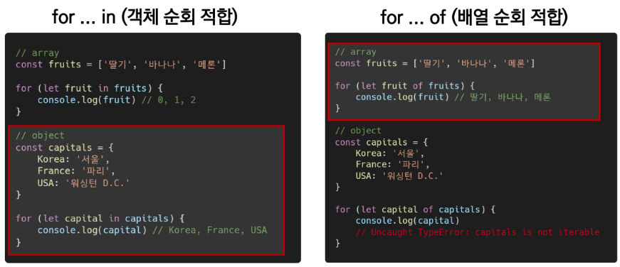

## JavaScript


> JavaScript의 필요성

- 브라우저 화면을 `동적`으로 만들기 위함
- 브라우저를 조작할 수 있는 유일한 언어


-----


### Browser 브라우저

#### DOM

- HTML, XML과 같은 문서를 다루기 위한 프로그래밍 인터페이스
- 문서를 구조화하고, 구조화된 구성 요소를 하나의 객체로 취급하여 다루는 논리적 트리 모델
- 문서가 객체(object)로 구조화되어 있으며 key로 접근 가능
- 단순한 속성 접근, 메서드 활용뿐만 아니라 프로그래밍 언어적 특성을 활용한 조작 가능
- 주요 객체
  - window : DOM을 표현하는 창(브라우저 탭). 최상위 객체
  - document : 페이지 컨텐츠의 Entry Point 역할을 하며, <head> , <body> 등과 같은 수많은 다른 요소들을 포함
  - navigator, location, history, screen


#### BOM

- Browser Object Model
- 자바스크립트가 브라우저와 소통하기 위한 모델
- 브라우저의 창이나 프레임을 추상화해서 프로그래밍적으로 제어할 수 있도록 제공하는 수단
  - 버튼, URL 입력창, 타이틀 바 등 브라우저 윈도우 및 웹 페이지 일부분을 제어 가능
- window 객체는 모든 브라우저로부터 지원받으며 브라우저의 창(window)를 지칭


----


### 변수와 식별자

> 식별자 정의와 특징

- 식별자(identifier)는 변수를 구분할 수 있는 변수명을 말함
- 식별자는 반드시 문자, 달러($) 또는 밑줄(_)로 시작
- 대소문자를 구분하며, 클래스명 외에는 모두 소문자로 시작
- 예약어 사용 불가능 (for, if ,function 등)


> 식별자 작성 스타일

- 카멜 케이스(camelCase, lower-camel-case)
  - 변수, 객체, 함수에 사용
- 파스칼 케이스(PascalCase, upper-camel-case)
  - 클래스, 생성자에 사용
- 대문자 스네이크 케이스(SNAKE_CASE)
  - 상수(constants)에 사용

```js
const userInfo // 카멜케이스
const UserInfo // 파스칼케이스
const API_KEY  // 대문자 스네이크 케이스
```


> 변수 선언 키워드(let, const 그리고 var)

🔴 `let` 

- `재할당할 예정`인 변수 선언 시 사용
- 변수 재선언 불가능
- 블록 스코프


🔵 `const`

- `재할당할 예정이 없는` 변수 선언 시 사용
- 변수 재선언 불가능
- 블록 스코프


🟢`var`

- var로 선언한 변수는 재선언 및 재할당 모두 가능
- ES6 이전에 변수를 선언할 때 사용되던 키워드
- 호이스팅되는 특성으로 인해 예기치 못한 문제 발생 가능
  - 따라서 ES6이후부터는 var 대신 const와 let을 사용하는 것을 권장
- 함수 스코프


✔️ 선언(Declaration) : `변수를 생성`하는 행위 또는 시점

✔️ 할당(Assjgnment) : `선언된 변수에 값을 저장`하는 행위 또는 시점

✔️ 초기화(Initialization) : 선언된 변수에 `처음으로` 값을 저장하는 행위 또는 시점

✔️ 호이스팅(hoisting) : 변수를 선언 이전에 참조할 수 있는 현상 / 변수 선언 이전의 위치에서 접근 시 undefined를 반환


✅ 블록 스코프(block scope) 

- if, for, 함수 등의 `중괄호 내부`를 가리킴
- 블록 스코프를 가지는 변수는 블록 바깥에서 접근 불가능

✅ 함수 스코프(function scopte)

- `함수의 중괄호 내부`를 가리킴
- 함수 스코프를 가지는 변수는 함수 바깥에서 접근 불가능


----


### 데이터 타입

> 원시 타입과 참조 타입 비교

❤️ `원시 타입(Primitive type)`

- 객체(object)가 아닌 기본 타입
- 변수에 해당 타입의 값이 담김
- 다른 변수에 복사할 때 실제 값이 복사됨


💙 `참조 타입(Reference type)`

- 객체(object) 타입의 자료형
- 변수에 해당 객체의 참조 값이 담김
- 다른 변수에 복할 때 참조 값이 복사됨


> 원시 타입

- 숫자(Number) 타입
  - 정수, 실수 구분 없는 하나의 숫자 타입
  - 부동소수점 형식을 따름

```js
const a = 13
const b = -5
const c = 3.14
const d = 2.998e8
const e = Infinity
const f = -Infinity
const g = NaN
```


- 문자열(String) 타입
  - 텍스트 데이터를 나타내는 타입
  - 16비트 유니코드 문자의 집합
  - 작은따옴표 또는 큰따옴표 모두 가능
  - 템플릿 리터럴(Template Literal)
    - 따옴표 대신 backtick(`)으로 표현
    - ${expression} 형태로 표현식 삽입 가능

```js
const firstName = 'Sojung'
const lastName = 'Park'
const fullName = `${firstName} ${lastName}`

console.log(fullName)   // ParkSojung
```


- undefined
  - 변수의 값이 없음을 나타내는 데이터 타입
  - 변수 선언 이후 직접 값을 할당하지 않으면, 자동으로 undefined가 할당됨

```js
let firstName
console.log(firstName)   // undefined
```


- null
  - 변수의 값이 없음을 의도적으로 표현할 때 사용하는 데이터 타입

```js
let firstName = null
console.log(firstName)    // null
typeof null // object
```


> undefined와 null 타입 비교

❤️ `undefined` 

- 빈 값을 표현하기 위한 데이터 타입
- 변수 선언 시 아무 값도 할당하지 않으면, 자바스크립트가 자동으로 할당
- typeof 연산자의 결과는 undefined


💙`null`

- 빈 값을 표현하기 위한 데이터 타입
- 개발자가 의도적으로 필요한 경우 할당
- typeof 연산자의 결과는 object


- Boolean 타입
  - 논리적 참 또는 거짓을 나타내는 타입
  - true 또는 false로 표현
  - 조건문 또는 반복문에서 유용하게 사용

```js
let isAdmin = true
console.log(isAdmin)   // true

isAdmin = false
console.log(isAdmin)   // false
```


-----


### 연산자

> 할당 연산자

- 오른쪽에 있는 피연산자의 평가 결과를 왼쪽 피연산자에 할당하는 연산자
- 다양한 연산에 대한 단축 연산자 지원

```js
let x = 0

// console.log(x) 생략 결과
x += 10   // 10
x -= 3    // 7
x *= 10   // 70
x /= 10   // 7
x ++      // 8
x --      // 7
```


> 비교 연산자

- 피연산자들(숫자,문자,Boolean 등)을 비교하고 결과값을 boolean으로 반환하는 연산자
- 문자열은 유니코드 값을 사용하며 표준 사전 순서를 기반으로 비교

```js
const numOne = 1
const numTwo = 100
console.log(numOne < numTwo)   // true

const charOne = 'a'
const charTwo = 'z'
console.log(charOne > charTwo) // false
```


> 동등 비교 연산자 (==)

- 두 피연산자가 같은 값으로 평가되는지 비교 후 boolean 값을 반환
- 비교할 때 `암묵적 타입 변환`을 통해 타입을 일치시킨 후 같은 값인지 비교
- 두 피연산자가 모두 객체일 경우 메모리의 같은 객체를 바라보는지 판별
- 예상치 못한 결과가 발생할 수 있으므로 특별한 경우를 제외하고 사용하지 않음

```js
const a == 1004
const b == '1004'
console.log(a == b)   // true
```


> 일치 비교 연산자(===)

- 두 피연산자가 같은 값으로 평가되는지 비교 후 boolean 값을 반환
- `엄격한 비교`(두 비교 대상의 타입과 값 모두 같은지 비교)가 이뤄지며 암묵적 타입 변환이 발생하지 않음
- 두 피연산자가 모두 객체일 경우 메모리의 같은 객체를 바라보는지 판별

```js
const a = 1004
const b = '1004'
console.log(a === b)  // false
```


> 논리 연산자

- 세 가지 논리 연산자로 구성

  - and 연산은 `&&` 연산자 이용
  - or 연산은 `||` 연산자 이용
  - not 연산은 `!` 연산자 이용

  

> 삼항 연산자(Ternary Operator)

- 세 개의 피연산자를 사용하여 조건에 따라 값을 반환하는 연산자
- 가장 왼쪽의 조건식이 참이면 콜론(:) 앞의 값을 사용하고 그렇지 않으면 콜론(:) 뒤의 값을 사용
- 삼항 연산자의 결과 값이기 때문에 변수에 할당 가능

```js
console.log(true? 1:2)    // 1
console.log(false? 1:2)   // 2

const result = Math.PI > 4 ? 'yes' : 'no'
console.log(result )      // no
```


----


### 조건문

> 조건문의 종류와 특징

- `if` statement : 조건 표현식의 결과값을 Boolean 타입으로 변환 후 참/거짓을 판단
- `switch` statement : 조건 표현식의 결과값이 어느 값(case)에 해당하는지 판별


> if statement

- if, else if, else
  - 조건은 소괄호 안에 작성
  - 실행할 코드는 중괄호{} 안에 작성
  - 블록 스코프 생성

```js
if (condition) {
    // do something
} else if (condition) {
    // do something
} else {
    // do sometthing
}
```


> switch statement

- 표현식의 결과값을 이용한 조건문
- 표현식의 결과값과 case문의 오른쪽 값을 비교
- break 및 default 문은 [선택적]으로 사용 가능
- break문이 없는 경우 break문을 만나거나 default문을 실행할 때까지 다음 조건문 실행
- 블록 스코프 생성

```js
switch(expression) {
    case 'first value' : {
        // do something
        [break]
    }
    case 'second value' : {
        // do something
        [break]
    }
    [default: {
     	// do something
     }]
}
```


----


### 반복문

> 반복문의 종류와 특징

- while
- for
- for ... in 
  - 주로 객체의 속성들을 순회할 때 사용
  - 배열도 순회 가능하지만 인덱스 순으로 순회한다는 보장이 없으므로 권장하지 않음
- for ... of
  - 반복 가능한 객체를 순회하며 값을 꺼낼 때 사용
    - 반복 가능한 객체의 종류 : Array, Map, Set, String 등


> while

- 조건문이 참(true)인 동안 반복 시행
- 조건은 소괄호 안에 작성
- 실행할 코드는 중괄호 안에 작성
- 블록 스코프 생성

```js
while (condition) {
    // do something
}
```


> for

- 세미콜론(;)으로 구분되는 세 부분으로 구성
- initialization : 최초 반복문 진입 시 1회만 실행되는 부분
- condition : 매 반복 시행 전 평가되는 부분
- expression : 매 반복 시행 이후 평가되는 부분
- 블록 스코프 생성

```js
for (initialization; condition; expression;) {
    // do something
}
```


> for ... in

- 객체의 속성(key)들을 순회할 때 사용
- 배열도 순회 가능하지만 권장하지 않음
- 실행할 코드는 중괄호 안에 작성
- 블록 스코프 생성

```js
for (variable in object) {
    // do something
}
```


> for ... of

- 반복 가능한 객체를 순회하며 값을 꺼낼 때 사용
- 실행할 코드는 중괄호 안에 작성
- 블록 스코프 생성

```js
for (variable of iterables) {
    // do something
}
```




