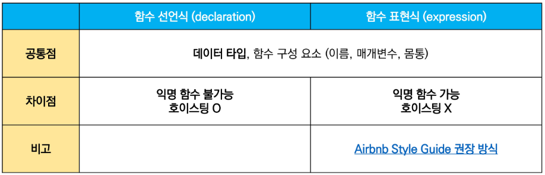
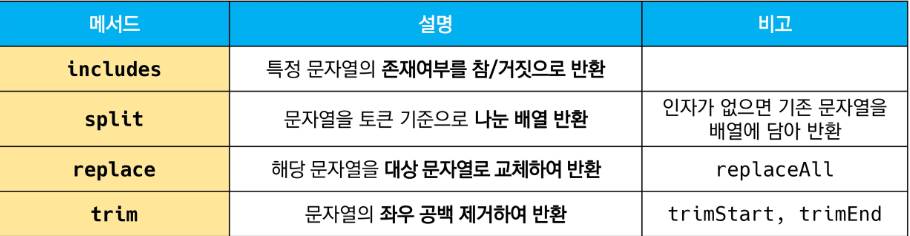

### JavaScript Function

> 함수 in JavaScript

- 참조 타입 중 하나로써 function 타입에 속함
- JavaScript에서 함수를 정의하는 방법은 주로 2가지로 구분
  - 함수 선언식(function declaration)
  - 함수 표현식(function expression)
- JavaScript의 함수는 일급 객체(First-class citizen)에 해당
  - ✅`일급 객체` : 다음의 조건들을 만족하는 객체를 의미함
    - 변수에 할당 가능
    - 함수의 매개변수로 전달 가능
    - 함수의 반환 값으로 사용 가능


> 함수 선언식(function statement, declaration)

```js
function add(num1,num2) {
    return num1 + num2
}
add(1,2)
```

- 함수의 이름과 함께 정의하는 방식
- 3가지 부분으로 구성
  - 함수의 이름(name)
  - 매개변수(args)
  - 몸통(중괄호 내부)


> 함수 표현식(function expression)

```js
const add = function(num1,num2) {
    return num1 + num2
}
add(1,2)
```

- 함수를 표현식 내에서 정의하는 방식
  - 표현식 : 어떤 하나의 값으로 결정되는 코드의 단위
- 함수의 이름을 생략하고 익명 함수로 정의 가능
  - 익명 함수(anonymous function) : 이름이 없는 함수
  - 익명 함수는 함수 표현식에서만 가능
- 3가지 부분으로 구성
  - 함수의 이름(생략 가능)
  - 매개변수(args)
  - 몸통(중괄호 내부)


> 기본 인자(default arguments)

```js
const greeting = function(name = 'Anonymous') {
    return `Hi ${name}`
}
greeting()
```


> 매개변수와 인자의 개수 불일치 허용

```js
const noArgs = function() {
    return 0
}
noArgs(1,2,3) // 0

const twoArgs = function(arg1, arg2) {
    return [arg1, arg2]
}
twoArgs(1,2,3)  // [1,2]
```


> 매개변수와 인자의 개수 불일치 허용

```js
const threeArgs = function(arg1, arg2, arg3) {
    return [arg1, arg2, arg3]
}
threeArgs()    // [undefined, undefined, undefined]
threeArgs(1)   // [1, undefined, undefined]
threeArgs(1,2) // [1,2,undefined]
```


> Rest Parameter

- rest parameter(...)를 사용하면 함수가 정해지지 않은 수의 매개변수를 배열로 받음
- 만약 rest parameter로 처리한 매개변수에 인자가 넘어오지 않을 경우에는, 빈 배열로 처리

```js
const restOpr = function(arg1,arg2, ... restArgs) {
    return [arg1, arg2, restArgs]
}
restArgs(1,2,3,4,5)  // [1,2,[3,4,5]]
restArgs(1,2)		 // [1,2,[]]
```


> Spread operator

```js
const spreadOpr = function(arg1, arg2, arg3) {
    return arg1 + arg2 + arg3
}
const numbers = [1,2,3]
spreadOpr(...numbers)   // 6
```


----


### 선언식 VS 표현식




> 함수의 타입

```js
// 함수 표현식
const add = function (args) {}

// 함수 선언식
function sub(args) {}

console.log(typeof add) // function
console.log(typeof sub) // function
```


> 호이스팅(hoisting) - 함수 선언식

- 함수 선언식으로 선언한 함수는 var로 정의한 변수처럼 hoisting 발생
- 함수 호출 이후에 선언해도 동작

```js
add(2,7)   // 9
function add(num1, num2) {
    return num1 + num2
}
```


> 호이스팅(hoisting) - 함수 표현식

- 반면 함수 표현식으로 선언한 함수는 함수 정의 전에 호출 시 에러 발생
- 함수 표현식으로 정의된 함수는 변수로 평가되어 변수의 scope 규칙을 따름

```js
sub(7,2)   // Uncaught ReferenceError: Cannot access 'sub' before initialization
const sub = function(num1, num2) {
    return num1 - num2
}
```

👉 함수 표현식을 var 키워드로 작성한 경우, 변수가 선언 전 undefined로 초기화되어 다른 에러가 발생

```js
console.log(sub)  // undefined
sub(7,2)   // Uncaught TypeError: sub is not a function

var sub = function(num1, num2) {
    return num1 - num2
}
```


----


### Arrow Function

> 화살표 함수(Arrow Function)

- 함수를 비교적 간결하게 정의할 수 있는 문법
- function 키워드 생략 가능
- 함수의 매개변수가 단 하나 뿐이라면, '()'도 생략 가능
- 함수 몸통이 표현식 하나라면 '{}'과 return도 생략 가능
- 기존 function 키워드 사용 방식과의 차이점은 `this` 차이점

```js
const arrow1 = function(name) {
    return `hello, ${name}`
}

// 1. function 키워드 삭제
const arrow2 = (name) => {return `hello, ${name}`}

// 2. 매개변수가 1개일 때만 () 생략 가능
const arrow3 = name => {return `hello, ${name}`}

// 3. 함수 바디가 return을 포함한 표현식 1개일 경우에 {} & return 삭제 가능
const arrow4 = name => `hello, ${name}`
```


----


### 문자열

