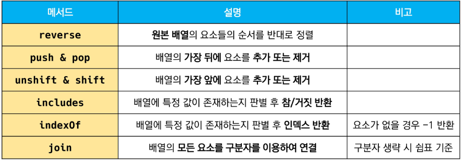
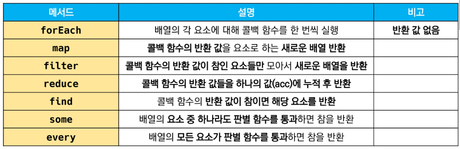
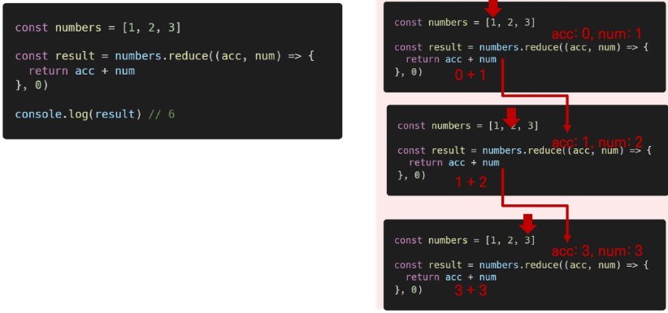

### JavaScript Function

> 함수 in JavaScript

- 참조 타입 중 하나로써 function 타입에 속함
- JavaScript에서 함수를 정의하는 방법은 주로 2가지로 구분
  - 함수 선언식(function declaration)
  - 함수 표현식(function expression)
- JavaScript의 함수는 일급 객체(First-class citizen)에 해당
  - ✅`일급 객체` : 다음의 조건들을 만족하는 객체를 의미함
    - 변수에 할당 가능
    - 함수의 매개변수로 전달 가능
    - 함수의 반환 값으로 사용 가능


> 함수 선언식(function statement, declaration)

```js
function add(num1,num2) {
    return num1 + num2
}
add(1,2)
```

- 함수의 이름과 함께 정의하는 방식
- 3가지 부분으로 구성
  - 함수의 이름(name)
  - 매개변수(args)
  - 몸통(중괄호 내부)


> 함수 표현식(function expression)

```js
const add = function(num1,num2) {
    return num1 + num2
}
add(1,2)
```

- 함수를 표현식 내에서 정의하는 방식
  - 표현식 : 어떤 하나의 값으로 결정되는 코드의 단위
- 함수의 이름을 생략하고 익명 함수로 정의 가능
  - 익명 함수(anonymous function) : 이름이 없는 함수
  - 익명 함수는 함수 표현식에서만 가능
- 3가지 부분으로 구성
  - 함수의 이름(생략 가능)
  - 매개변수(args)
  - 몸통(중괄호 내부)


> 기본 인자(default arguments)

```js
const greeting = function(name = 'Anonymous') {
    return `Hi ${name}`
}
greeting()
```


> 매개변수와 인자의 개수 불일치 허용

```js
const noArgs = function() {
    return 0
}
noArgs(1,2,3) // 0

const twoArgs = function(arg1, arg2) {
    return [arg1, arg2]
}
twoArgs(1,2,3)  // [1,2]
```


> 매개변수와 인자의 개수 불일치 허용

```js
const threeArgs = function(arg1, arg2, arg3) {
    return [arg1, arg2, arg3]
}
threeArgs()    // [undefined, undefined, undefined]
threeArgs(1)   // [1, undefined, undefined]
threeArgs(1,2) // [1,2,undefined]
```


> Rest Parameter

- rest parameter(...)를 사용하면 함수가 정해지지 않은 수의 매개변수를 배열로 받음
- 만약 rest parameter로 처리한 매개변수에 인자가 넘어오지 않을 경우에는, 빈 배열로 처리

```js
const restOpr = function(arg1,arg2, ... restArgs) {
    return [arg1, arg2, restArgs]
}
restArgs(1,2,3,4,5)  // [1,2,[3,4,5]]
restArgs(1,2)		 // [1,2,[]]
```


> Spread operator

```js
const spreadOpr = function(arg1, arg2, arg3) {
    return arg1 + arg2 + arg3
}
const numbers = [1,2,3]
spreadOpr(...numbers)   // 6
```


----


### 선언식 VS 표현식


> 함수의 타입

```js
// 함수 표현식
const add = function (args) {}

// 함수 선언식
function sub(args) {}

console.log(typeof add) // function
console.log(typeof sub) // function
```


> 호이스팅(hoisting) - 함수 선언식

- 함수 선언식으로 선언한 함수는 var로 정의한 변수처럼 hoisting 발생
- 함수 호출 이후에 선언해도 동작

```js
add(2,7)   // 9
function add(num1, num2) {
    return num1 + num2
}
```


> 호이스팅(hoisting) - 함수 표현식

- 반면 함수 표현식으로 선언한 함수는 함수 정의 전에 호출 시 에러 발생
- 함수 표현식으로 정의된 함수는 변수로 평가되어 변수의 scope 규칙을 따름

```js
sub(7,2)   // Uncaught ReferenceError: Cannot access 'sub' before initialization
const sub = function(num1, num2) {
    return num1 - num2
}
```

👉 함수 표현식을 var 키워드로 작성한 경우, 변수가 선언 전 undefined로 초기화되어 다른 에러가 발생

```js
console.log(sub)  // undefined
sub(7,2)   // Uncaught TypeError: sub is not a function

var sub = function(num1, num2) {
    return num1 - num2
}
```


----


### Arrow Function

> 화살표 함수(Arrow Function)

- 함수를 비교적 간결하게 정의할 수 있는 문법
- function 키워드 생략 가능
- 함수의 매개변수가 단 하나 뿐이라면, '()'도 생략 가능
- 함수 몸통이 표현식 하나라면 '{}'과 return도 생략 가능
- 기존 function 키워드 사용 방식과의 차이점은 `this` 차이점

```js
const arrow1 = function(name) {
    return `hello, ${name}`
}

// 1. function 키워드 삭제
const arrow2 = (name) => {return `hello, ${name}`}

// 2. 매개변수가 1개일 때만 () 생략 가능
const arrow3 = name => {return `hello, ${name}`}

// 3. 함수 바디가 return을 포함한 표현식 1개일 경우에 {} & return 삭제 가능
const arrow4 = name => `hello, ${name}`
```


----


### 문자열


```js
const str = 'a santa at nasa'

str.includes('santa')   // true
str.includes('asan')    // false
```

```js
const str = 'a cup'

str.split() 		// ['a cup']
str.split('')		// ['a','','c','u','p']
str.split(' ')		// ['a','cup']
```

```js
const str = 'a b c d'

str.replace(' ','-')		// 'a-b c d'
str.replaceAll(' ','-')		// 'a-b-c-d'
```

```js
const str = '	hello	'

str.trim()				// 'hello'
str.trimStart()			// 'hello	'
str.trimEnd()			// '	hello'
```


----


### 배열(Arrays)

- 키와 속성들을 담고 있는 참조 타입의 객체(object)
- 순서를 보장하는 특징이 있음
- 주로 대괄호를 이용하여 생성하고, 0을 포함한 양의 정수 인덱스로 특정 값에 접근 가능
- 배열의 길이는 array.length 형태로 접근 가능

```js
const numbers = [1,2,3,4,5]

console.log(numbers.length)  // 5
```



```js
const numbers = [1,2,3,4,5]

numbers.reverse()
console.log(numbers)  // [5,4,3,2,1]
```

```js
const numbers = [1,2,3,4,5]

numbers.push(100)
console.log(numbers)   // [1,2,3,4,5,100]

numbers.pop()
console.log(numbers)   // [1,2,3,4,5]
```

```js
const numbers = [1,2,3,4,5]

numbers.unshift(100)
console.log(numbers)   // [100,1,2,3,4,5]

numbers.shift()
console.log(numbers)   // [1,2,3,4,5]
```

```js
const numbers = [1,2,3,4,5]

console.log(numbers.includes(1))   // true
console.log(numbers.includes(100)) // false
```

```js
const numbers = [1,2,3,4,5]
let result

result = numbers.indexof(3)   // 2
console.log(result)

result = numbers.indexof(100) // -1
console.log(result)
```

```js
const numbers = [1,2,3,4,5]
let result

result = numbers.join()			// 1,2,3,4,5
console.log(result)

result = numbers.join('')		// 12345
console.log(result)

result = numbers.join(' ')		// 1 2 3 4 5
console.log(result)

result = numbers/join('-')		// 1-2-3-4-5
console.log(result)
```


> spread operator

```js
const array = [1,2,3]
const newArray = [0, ...array, 4]

console.log(newArray)		// [0,1,2,3,4]
```


> 심화편

- 배열을 순회하며 특정 로직을 수행하는 메서드
- 메서드 호출 시 인자로 `callback` 함수를 받는 것이 특징
  - ✅`callback` 함수 : 어떤 함수의 내부에서 실행될 목적으로 인자로 넘겨받는 함수



```js
const fruits = ['딸기','수박','포도']

fruits.forEach((fruit, index) => {
    console.log(fruit, index)
    // 딸기 0
    // 수박 1
    // 포도 2
})  
```

- `forEach` : 배열의 각 요소에 대해 콜백 함수를 한 번씩 실행
  - 콜백 함수는 3가지 매개변수로 구성
    - element : 배열의 요소
    - index : 배열 요소의 인덱스
    - array : 배열 자체
  - 반환 값(return)이 없는 메서드


```js
const numbers = [1,2,3,4,5]

const doubleNums = numbers.map((num) => {
    return num * 2
})
console.log(doubleNums)  // [2,4,6,8,10]
```

- `map` : 배열의 각 요소에 대해 콜백 함수를 한 번씩 실행
  - 콜백 함수의 반환 값을 요소로 하는 새로운 배열 반환
  - 기존 배열 전체를 다른 형태로 바꿀 때 유용


```js
const numbers = [1,2,3,4,5]

const oddNums = numbers.filter((num,index) => {
    return num % 2
})
console.log(oddNums)   // 1,3,5
```

- `filter` : 배열의 각 효소에 대해 콜백 함수를 한 번씩 실행
  - 콜백 함수의 반환 값이 참인 요소들만 모아서 새로운 배열을 반환
  - 기존 배열의 요소들을 필터링할 때 유용


```js
const numbers = [1,2,3]

const result = numbers.reduce((acc,num) => {
    return acc + num
}, 0(initialValue))
console.log(result)   // 6
```

- `reduce` : 콜백 함수의 반환 값들을 `하나의 값(acc)에 누적 후 반환`
  - initialValue(optional) : 최초 callback 함수 호출 시 acc에 할당되는 값, default 값은 배열의 첫 번째 값
  - 빈 배열의 경우 initialValue를 제공하지 않으면 에러 발생




```js
const avengers = [
    { name : 'Tony Stark', age : 45},
    { name : 'Steve Rogers', age : 32},
    { name : 'Thor', age : 40},
]
const result = avengers.find((avenger) => {
    return avenger.name === 'Tony Stark'
})

console.log(result)   // { name : "Tony Stark", age: 45}
```

- `find` : 배열의 각 요소에 대해 콜백 함수를 한 번씩 실행
  - 콜백 함수의 반환 값이 참이면, 조건을 만족하는 첫 번째 요소를 반환
  - 찾는 값이 배열에 없으면 undefined 반환


```js
const numbers = [1,3,5,7,9]

const hasEvenNumber = numbers.some((num) => {
    return num % 2 === 0
})
console.log(hasEvenNumber)  // false

const hasOddNumber = numbers.some((num) => {
    return num % 2
})
console.log(hasOddNumber)   // true
```

- `some` : 배열의 `요소 중 하나라도` 주어진 판별 함수를 통과하면 참을 반환
  - 모든 요소가 통과하지 못하면 거짓 반환
  - 빈 배열은 항상 거짓 반환


```js
const numbers = [2,4,6,8,10]

const isEveryNumberEven = numbers.every((num) => {
    return num % 2 === 0
})
console.log(isEveryNumberEven) // true

const isEveryNumberOdd = numbers.every((num) => {
    return num % 2
})
console.log(isEveryNumberOdd)  // false
```

- `every` : 배열의 `모든 요소가` 주어진 판별 함수를 통과하면 참을 반환
  - 하나의 요소라도 통과하지 못하면 거짓 반환
  - 빈 배열은 항상 참 반환


----


### 객체(Object)

- 객체는 속성(property)의 집합이며, 중괄호 내부에 key와 value의 쌍으로 표현
- key는 문자열 타입만 가능
- value는 모든 타입(함수 포함) 가능
- 객체 요소 접근은 점 또는 대괄호로 가능

```js
const me = {
    firstName : 'Sojung',
    lastName : 'Park',
    
    fullName : this.firstName + this.lastName,
    
    getFullName : function() {
        return this.firstName + this.lastName
    }
}
```

