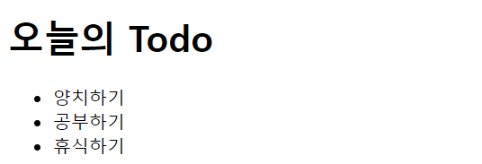
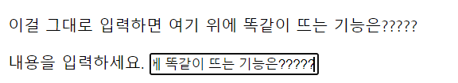
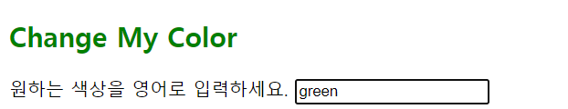

### JavaScript 예제

-----

> ul, li 태그로 Todo 만들기



```js
// div#app 요소 선택
const app = document.querySelector('#app')

// h1 태그를 createElement 로 생성
const newh1 = document.createElement('h1')

// 생성한 h1태그의 내용을 '오늘의 Todo' 로 설정
newh1.innerText = '오늘의 Todo'

// ul, li 태그들을 생성 및 내용 추가
const ul = document.createElement('ul')

const li1 = document.createElement('li')
const li2 = document.createElement('li')
const li3 = document.createElement('li')

li1.innerText = '양치하기'
li2.innerText = '공부하기'
li3.innerText = '휴식하기'

ul.append(li1,li2,li3)

// 각 태그들을 적절하기 div#app 요소에 자식요소로 추가. (#app > ul > li)

app.append(newh1,ul)
```


----


> 구글 창 새로 띄우기

```js
<a id="anchor" href="">GOOGLE</a>

const a = document.querySelector("#anchor")
a.classList.add('text-decoration-none')
a.href="https://google.com/"
a.target = '_blank'
```


----


> 입력하면 똑같이 띄우기



```js
<form action="#">
    <label for="my-text-input">내용을 입력하세요.</label>
	<input id="my-text-input" type="text">
</form>


const myTextInput = document.querySelector('#my-text-input')
const myP = document.querySelector('#my-paragraph')

myTextInput.addEventListener('input', function (event) {
    // console.log(event.target.value)
    myP.innerText = event.target.value
})

// Arrow Function Refactoring 한다면?
// myTextInput.addEventListener('input', event => myP.innerText = event.target.value)
```


----


> 글자 입력하면 색깔 같이 띄우기



```js
<h2>Change My Color</h2>
<label for="change-color-input">원하는 색상을 영어로 입력하세요.</label>
<input id="change-color-input"></input>
<hr>
      
    
const h2Tag = document.querySelector('h2')

const onColorInput = function (event) {
    const userInput = event.target.value
    h2Tag.style.color = userInput
}

const colorInput = document.querySelector('#change-color-input')
colorInput.addEventListener('input', onColorInput)
```

