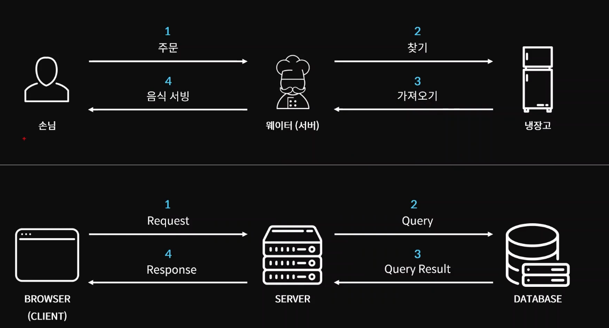

### 2-10 API & fetch

> API(Application Programming Interface)

- 응용 프로그램 프로그래밍 인터페이스

- 응용 프로그램에서 사용할 수 있도록, 운영 체제나 프로그래밍 언어가 제공하는 기능을 제어할 수 있게 만든 인터페이스
- 주로 파일 제어, 창 제어, 화상 처리, 문자 제어 등을 위한 인터페이스를 제공




```js
let response = fetch("https://jsonplaceholder.typicode.com/todos").then(
  (res) => {
    console.log(res);
  }
);
console.log(response);

// json 형식의 포장 봉투에 담긴 모든 정보들이 날라온다.
```

`fetch` : API를 사용할 수 있도록 도와주는 내장 함수

- 여기까지 했으면 json 형식의 모든 정보들이 날라온다.
- 이제 필요한 정보만 취하기 위해 아래와 같이 코드를 작성해준다.

```js
async function getData() {
  let rawResponse = await fetch("https://jsonplaceholder.typicode.com/todos");
  let jsonResponse = await rawResponse.json();
  console.log(jsonResponse);
}
getData();
```

