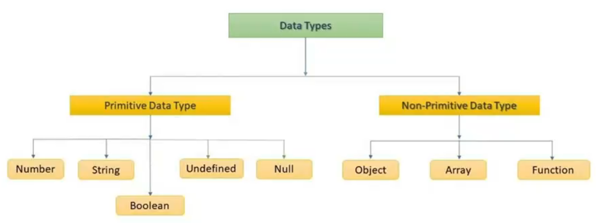
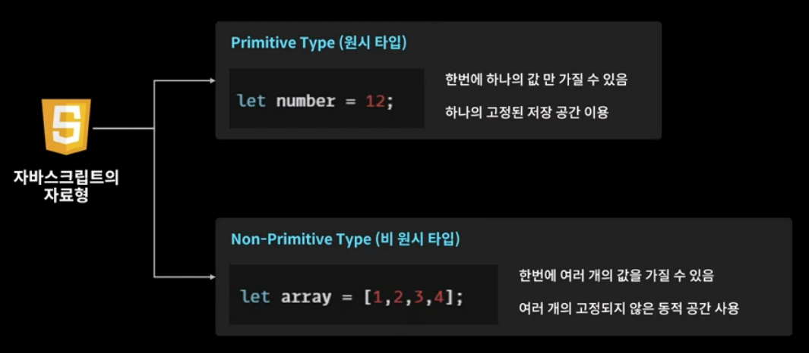

### 1-1 변수와 상수

```js
// 1. 기호는 $와 _만 사용 가능하다.

let ag_$e = 25;

// 2. 변수명은 숫자로 시작할 수 없다.
let 25age = 25;
let age25 = 25;

// 3. 예약어를 피해주어야 한다.
let if = 25;
let iff= 25;
```

```js
var age = 25;
let age = 25;

// var와 let은 기능이 거의 비슷해보인다.
// 그러나 var는 프로그래머들을 함정에 빠뜨린다!!
// var는 변수를 중복 선언해도 되지만 let은 중복 선언이 안된다.
// 코드가 짧은 경우 변수 설정값을 바로 찾을 수 있지만 코드가 길어지면 설정값 찾기 힘들어져서
// var를 사용하기보다 let을 많이 사용하는 편이다.
```

```js
const age = 25;

// 변수는 age를 30으로 바꿔도 문제가 안되지만,
// 상수는 read-only이기 때문에 선언 이후에 값을 절대로 바꿀수가 없다!!
// const로 프로퍼티를 만든 경우 안의 요소를 바꾸는건 되지만 주소값 전체를 바꾸면 안된다!!1
```


-----


### 1-2 자료형과 형변환





```js
// 숫자형

let age = 25;
let tall = 180;
let inf = Infinity;			// 무한대
let minusInf = -Infinity;   // - 무한대
let nan = NaN;  			// 수학적인 연산의 실패값. 숫자가 아닌 값
```

```js
// 문자형

let name = 'sojungPark';
let name2 = '박소정';
let name3 = `sojungPark의 한글이름 ${name2}`;
// 백틱(``)을 사용하는 이유 : 문자열 안에 변수를 집어넣게 해준다.
// '템플릿 리터럴'
```

```js
// Boolean 자료형 = 참이냐 거짓이냐

let isSwitchOff = false;
let isSwitchon = true;
```

```js
// null, undefined

let a;    			// undefined
// 자바스크립트에서 undefined까지는 오류 페이지를 띄워주지 않는다.

let b = null		// null
```


```js
let numberA = 12;
let numberB = '2';
console.log(numberA * numberB)     			 // 24
// 다른 자료형과의 연산을 수행할 때 알아서 형변환을 해준다!!!!
// ex. 문자열 '2'를 숫자형 2로 봐주는 것 => 묵시적 형변환

console.log(numberA + numberB)				// 122
// 곱셈은 문자열 '2'를 숫자로 봐서 연산해주지만,
// 덧셈은 문자열 '2'를 문자 그대로 봐서 출력해준다.

console.log(numberA + parseInt(numberB))    // 14
// parseInt는 문자열을 숫자형으로 바꿔준다.
```


----


### 1-3  연산자

```js
// 1. 대입연산자
let a = 1;		
let b = 2;

// 2. 산술연산자
console.log(a + b)
console.log(a - b)
console.log(a * b)
console.log(a / b)
console.log(a % b)

// 3. 연결연산자
let a = '1'
let b = '2'
let c = 2
console.log(a + b)			// 12
console.log(a + c)			// 12

// 4. 복합연산자
let a = 5;
a += 10;					// a = a + 10
console.log(a)				// 15

// 5. 증감연산자
let a = 10;
a ++;
console.log(a)				// 11
a --;
console.log(a)				// 10
console.log(++a);			// 11   > 전위연산
console.log(a++);			// 11
console.log(a);				// 12	> 후위연산
// 증감연산자는 console 안에서는 앞에 붙여주어야 연산이 돌아간다!
// console 안에서 뒤에 증감연산을 붙이면 이후의 console에서 적용된다.
// 이를 후위연산자라고 부른다.

// 6. 논리연산자
console.log(!true)			// false
console.log(!false)			// true

console.log(true && true) 	// true AND true > true
console.log(true && false)	// false
// AND : 둘 다 참이어야만 참을 반환

console.log(true || false)  // true OR false > true
// OR : 둘 중 하나만 참이어도 참을 반환

// 7. 비교연산자
let compareA = 1 =='1';
console.log(compareA)		// true

let compareB = 1 === '1';
console.log(compareB)		// false
// == : 값만 비교
// === : 값과 타입까지 비교

// 8. typeof 연산자
let a = 1;
a = '1';
console.log(typeof a)		// string
// typeof 연산자는 변수의 타입을 알려주는 연산자다.

// 9. null병합 연산자
let a;
a = a ?? 10
console.log(a)				// 10
// ?? : null 병합 연산자. a가 null이나 undefined이면 오른쪽 값을 대입시킨다.
```


-----


### 1-4 조건문

```js
let a = 3;
if (a >= 7) {
    console.log('7 이상입니다')
} else if (a >= 5){
    console.log('5 이상입니다')
} else {
    console.log('5 미만입니다')
}							// 5 미만입니다.

// else if를 계속 작성해주어야 할 경우 switch문을 통해 더 간편하게 작성이 가능하다.
let country = 'korea'
switch(country) {
    case 'korea':
        console.log('한국입니다')
        break
    case 'japan':
        console.log('일본입니다')
        break
    case 'america':
        console.log('미국입니다')
        break
    case 'china':
        console.log('중국입니다')
        break
    default:
        console.log('미 분류 국가입니다')
        break
}							// 한국입니다
// break로 끊어주지 않으면 계속해서 출력이 된다.
```

