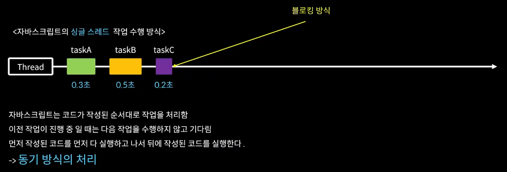
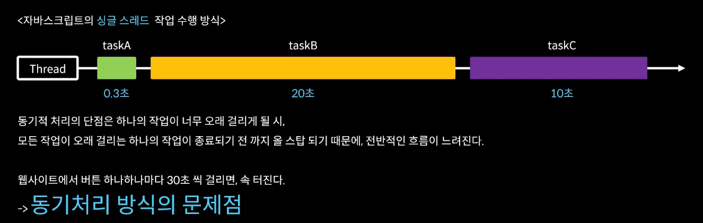
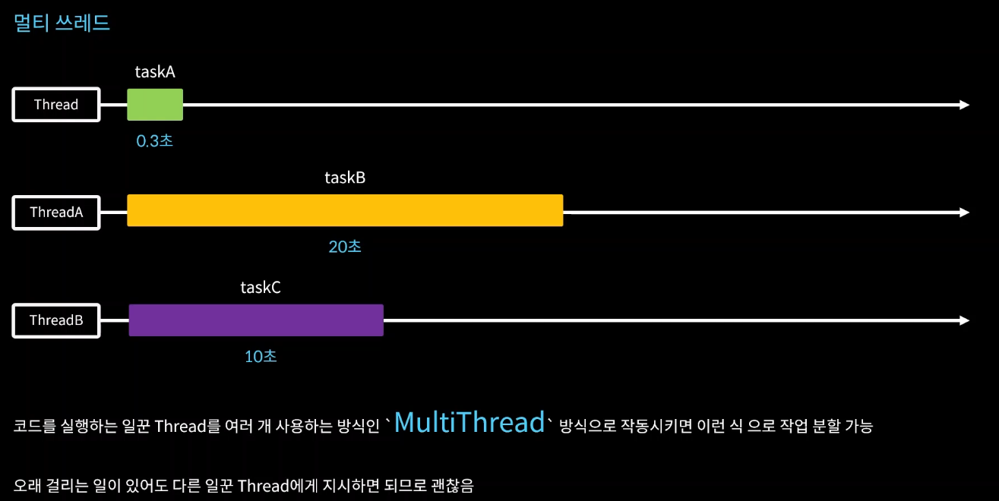
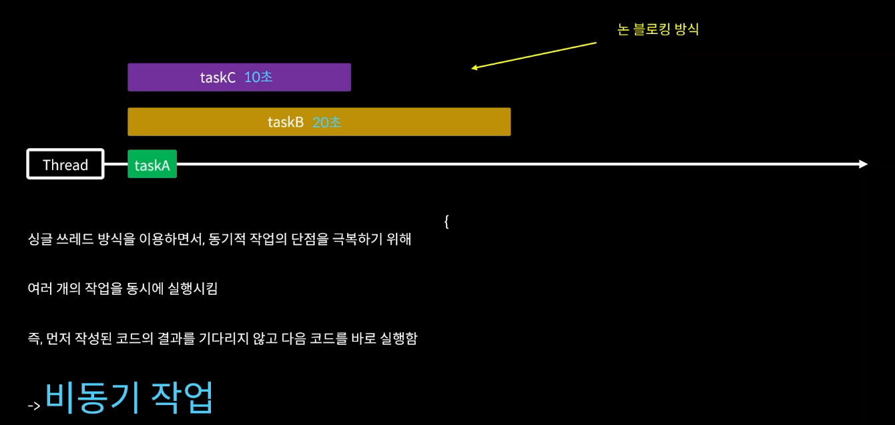
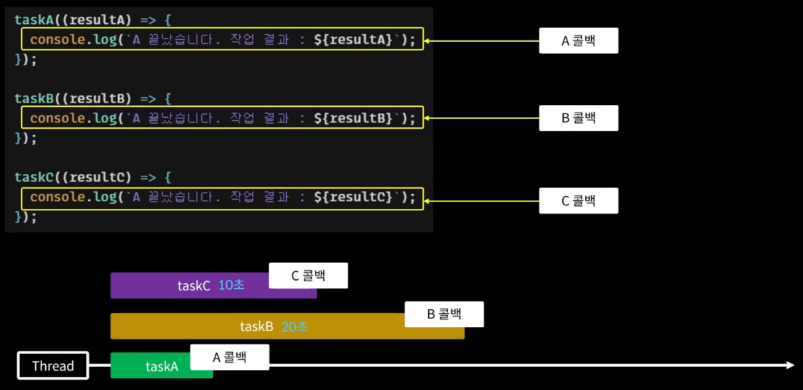
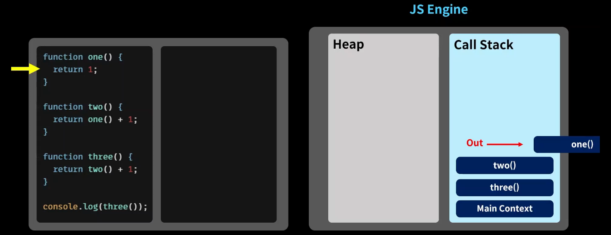

### 2-7 동기 & 비동기





한 마디로, 동기는 코드를 한 줄 한 줄 처리해준다고 보면 된다.








```js
function taskA(a, b, cb) {
  setTimeout(() => {
    const res = a + b;
    cb(res);
  }, 2000);
}

taskA(3, 3, (res) => {
  console.log("결과", res);
});

console.log("코드 끝");					// 6 코드 끝 결과 6
```

```js
function taskA(a, b, cb) {
  setTimeout(() => {
    const res = a + b;
    cb(res);
  }, 2000);
}

function taskB(a, cb) {
  setTimeout(() => {
    const res = a * 2;
    cb(res);
  }, 1000);
}

function taskC(a, cb) {
  setTimeout(() => {
    const res = a * -1;
    cb(res);
  }, 500);
}

taskA(3, 3, (res) => {
  console.log("a 결과", res);
});

taskB(3, (res) => {
  console.log("b 결과", res);
});

taskC(3, (res) => {
  console.log("c 결과", res);
});

console.log("코드 끝");

// 코드 끝
// c 결과 -3
// b 결과 6
// a 결과 6
```




```js
// 비동기 함수의 결과로 또 다른 비동기 함수를 넣을 수도 있다!!!

function taskA(a, b, cb) {
  setTimeout(() => {
    const res = a + b;
    cb(res);
  }, 2000);
}

function taskB(a, cb) {
  setTimeout(() => {
    const res = a * 2;
    cb(res);
  }, 1000);
}

function taskC(a, cb) {
  setTimeout(() => {
    const res = a * -1;
    cb(res);
  }, 500);
}

taskA(4, 5, (a_res) => {
  console.log("a result : ", a_res);
  taskB(a_res, (b_res) => {
    console.log("b result:", b_res);
    taskC(b_res, (c_res) => {
      console.log("c result", c_res);
    });
  });
});

// a result : 9
// b result : 18
// c result : -18

// 하지만 이렇게 콜백 함수를 계속 사용하면 코드가 너무 복잡해진다!!!!!
// 그래서 Promise라는 객체를 사용해서 콜백 지옥을 탈출한다
```


-----


### 2-8 Promise - 콜백 지옥에서 탈출하기

```js
// 비동기 함수로 작성하였을 경우

function isPositive(number, resolve, reject) {
  setTimeout(() => {
    if (typeof number === "number") {
      // 성공 -> resolve
      resolve(number >= 0 ? "양수" : "음수");
    } else {
      // 실패 -> reject
      reject("주어진 값이 숫자형 값이 아닙니다");
    }
  }, 2000);
}

isPositive(
  10,
  (res) => {
    console.log("성공적으로 수행됨 :", res);
  },
  (err) => {
    console.log("실패!!", err);
  }
);
```

- 이제는 Promise 객체를 활용하여 작성해보도록 하자

```js
function isPositive(numb) {
  const executor = (resolve, reject) => {
    setTimeout(() => {
      if (typeof numb === "number") {
        // 성공 -> resolve
        resolve(numb >= 0 ? "양수" : "음수");
      } else {
        // 실패 -> reject
        reject("주어진 값이 숫자형 값이 아닙니다");
      }
    }, 1000);
  };
  const asyncTask = new Promise(executor);
  return asyncTask;
}

const res = isPositive("");

res
  .then((res) => {
    console.log("작업성공!", res);
  })
  .catch((err) => {
    console.log("작업 실패 : ", err);
  });
```


- 이전 시간에 작성했던 이 어마무시한 콜백 지옥을 Promise 객체를 통해 한 번 다시 작성해보자.

- ```js
  function isPositive(numb) {
    const executor = (resolve, reject) => {
      setTimeout(() => {
        if (typeof numb === "number") {
          // 성공 -> resolve
          resolve(numb >= 0 ? "양수" : "음수");
        } else {
          // 실패 -> reject
          reject("주어진 값이 숫자형 값이 아닙니다");
        }
      }, 1000);
    };
    const asyncTask = new Promise(executor);
    return asyncTask;
  }
  
  const res = isPositive("");
  
  res
    .then((res) => {
      console.log("작업성공!", res);
    })
    .catch((err) => {
      console.log("작업 실패 : ", err);
    });
  ```

```js
function taskA(a, b) {
  return new Promise((resolve, reject) => {
    setTimeout(() => {
      const res = a + b;
      resolve(res);
    }, 3000);
  });
}

function taskB(a) {
  return new Promise((resolve, reject) => {
    setTimeout(() => {
      const res = a * 2;
      resolve(res);
    }, 1000);
  });
}

function taskC(a) {
  return new Promise((resolve, reject) => {
    setTimeout(() => {
      const res = a * -1;
      resolve(res);
    }, 2000);
  });
}

taskA(5, 1).then((a_res) => {
  console.log("a result : ", a_res);
  taskB(a_res).then((b_res) => {
    console.log("b_result : ", b_res);
    taskC(b_res).then((c_res) => {
      console.log("c_result : ", c_res);
    });
  });
});
```

- 근데 뭔가 이상하다.
- 콜백 함수 지옥에서 벗어나기 위해 Promise 객체를 사용한 것인데 위의 콘솔 창을 보더라도 다시 삼각형 지옥이 보이기 시작한다. 이는 우리가 콜백 쓰듯이 작성해서 그렇다. 다시 작성을 해보도록 하자!!!

```js
function taskA(a, b) {
  return new Promise((resolve, reject) => {
    setTimeout(() => {
      const res = a + b;
      resolve(res);
    }, 3000);
  });
}

function taskB(a) {
  return new Promise((resolve, reject) => {
    setTimeout(() => {
      const res = a * 2;
      resolve(res);
    }, 1000);
  });
}

function taskC(a) {
  return new Promise((resolve, reject) => {
    setTimeout(() => {
      const res = a * -1;
      resolve(res);
    }, 2000);
  });
}

// taskA(5, 1).then((a_res) => {
//   console.log("a result : ", a_res);
//   taskB(a_res).then((b_res) => {
//     console.log("b_result : ", b_res);
//     taskC(b_res).then((c_res) => {
//       console.log("c_result : ", c_res);
//     });
//   });
// });

taskA(5, 1)
  .then((a_res) => {
    console.log("a result", a_res);
    return taskB(a_res);
  })
  .then((b_res) => {
    console.log("b result", b_res);
    return taskC(b_res);
  })
  .then((c_res) => {
    console.log("c result", c_res);
  });

```

